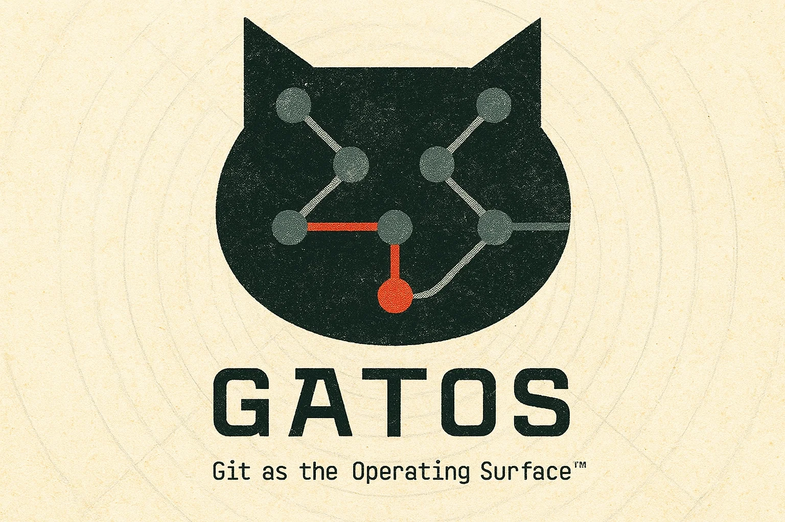

# 🐈‍⬛ **GATOS**

[](./LICENSE) [](#)

## TL;DR

**GATOS** generalizes Git’s content-addressed DAG into a complete computational substrate: a programmable operating surface unifying history, policy, and computation within a deterministic, verifiable feedback loop.

It turns Git from a version-control system into a self-governing compute fabric. Commits aren't just records of change, but executable events in a cryptographically auditable state machine. Policies, data, and computation all live in the same history, producing provable behavior and automatic governance without centralized infrastructure.

**The Result**: A platform that’s offline-first, federated, and mathematically deterministic — a new foundation for verifiable infrastructure, trustworthy automation, distributed AI, and time-travel computing. ***GATOS is a truth machine.***

### Read More

Read the book, check the spec; learn the tech.  
If there's more you want to know, follow the links below:

[The Book](./docs/guide/README.md) • [SPEC](./docs/SPEC.md) • [TECH-SPEC](./docs/TECH-SPEC.md)

*Now you Git it.*

---



> [!WARNING]
> **GATOS** is the evolution of my earlier work ([`git-mind`](https://github.com/neuroglyph/git-mind), [Echo](https://github.com/flyingrobots/echo), [Ledger Kernel](https://github.com/flyingrobots/ledger-kernel), etc.) into a single, unified system. I've just started working on this project. If you're interested, star the repo, watch, and follow along.
> *- flyingrobots*
>
> *a little category theory joke... Eh, maybe you had to be there...*

<details>
  <summary>ASCII art</summary>

```bash

8""""8 8""""8 ""8"" 8"""88 8""""8
8    " 8    8   8   8    8 8      
8e     8eeee8   8e  8    8 8eeeee
88  ee 88   8   88  8    8     88
88   8 88   8   88  8    8 e   88
88eee8 88   8   88  8eeee8 8eee88

  Git As The Operating Surface™  
```

</details>

## Git As The Operating Surface

> **Turn your repository into a deterministic, self-governing computer.**

GATOS transforms a Git repository from a passive storage locker into an active, cryptographically verifiable state machine. It unifies **event sourcing**, **policy governance**, and **compute orchestration** onto a single, immutable DAG.

> If it’s not in the commit history, it didn’t happen. If it violates the policy, it *cannot* happen.

---

## The Problem

We currently glue our infrastructure together with hope and YAML.

**State is scattered.** Your code is in Git, your data is in S3, your deployment status is in Jenkins, and your audit logs are in Splunk.  
**Reality is messy.** "It works on my machine" is the standard because environments drift and inputs aren't captured.  
**Governance is weak.** Policies are PDF documents that humans ignore, not code that machines enforce.  

## The Solution

GATOS collapses the stack into the graph.

✍️ **Events:** Every action is a signed commit.  
🪭 **State:** Your "database" is a deterministic fold of those events.  
🏛️ **Policy:** Governance rules are code, versioned alongside the data they protect.  
🔗 **Compute:** Jobs run off-chain, but their *Proofs-of-Execution (PoE)* are recorded **in the repository’s history**  
   (*Not a blockchain; just Git + signatures*).

---

## 🔥 Killer Features

### 1. Time-Travel Debugging for *State*

Since ***state is a deterministic function of history***, you can bisect your entire reality. Find the exact commit where a database row, a ML model weight, or a deployment status went wrong.

```bash
# Find the exact commit that broke the production state
git gatos bisect start --state=prod
git gatos bisect run 'jq -e ".inventory.widgets < 0"'
# Output: Culprit commit found. [Proof-of-Fold verified](./docs/SPEC.md#5.4).
```

### 2. Policy as Code (Really)

Architecture Decision Records (ADRs) aren't just documentation; they are ***executable laws***. If you merge a policy restricting API changes, the repo physically rejects non-compliant commits.

```bash
# Try to push a change that violates an active policy ADR
git push
# ❌ Remote: Error: Policy Violation (ADR-0042)
# ❌ Remote: "API breaking changes require 2-of-3 quorum"
# ❌ Remote: See refs/gatos/audit/policy/deny/<id> (DENY is logged under audit)
```

### 3. Privacy with Proofs (Opaque Pointers)

Store sensitive data (PII, large datasets) in private stores, but commit their **cryptographic commitments** to the public graph — public commitments; private bytes behind a policy-gated resolver. ***Verify the integrity of the computation without revealing the raw bytes***.

### 4. Local Guardrails (Watcher + Hooks)

Artists and infra engineers get Perforce-style safety without leaving Git. The `gatos watch` daemon keeps locked files read-only until a governance Grant exists, `gatos lock acquire/release` walks you through the approval flow, and managed Git hooks (`gatos install-hooks`) block bad pushes before they ever hit the remote—while logging any bypass under `refs/gatos/audit/locks/*`.

### 5. GraphQL Truth Service

Need a typed API for dashboards or custom UIs? The GraphQL endpoint (`POST /api/v1/graphql`) lets you query any state snapshot by commit (`stateRef`) or ref (`refPath`), with Relay pagination, rate limiting, and automatic policy filtering. Opaque pointers surface private blobs without leaking bytes, so you can build richly typed clients on top of verified state.

-----

## How it Works: The 5 Planes

GATOS organizes the repository into five distinct planes using standard Git references (`refs/gatos/*`).

| Plane | Ref Namespace | Function |
| :--- | :--- | :--- |
| **1. Ledger**       | `refs/gatos/journal/*`   | Append-only event logs. The source of truth. |
| **2. Policy/Trust** | `refs/gatos/policies/*`  | Executable policy (Lua/WASM), capabilities, quorum; **deny-audit** on violations. |
|                     | `refs/gatos/trust/*`     | Keys, groups, grants, revocations. |
| **3. State**        | `refs/gatos/state/*`     | Deterministic checkpoints derived from the ledger (**Proof-of-Fold**). |
| **4. Message**      | `refs/gatos/messages/*`  | Commit-backed message plane (topics served via `messages.read`). |
| **5. Job**          | `refs/gatos/jobs/*`      | Jobs and **Proofs-of-Execution (PoE)**; exclusive claim via CAS. |

-----

## Quick Start

### Installation

```bash
# Install the CLI/daemon (provides the `git-gatos` shim so you can run `git gatos ...`)
cargo install gatos
# If your shell doesn't pick up the shim, you can alias:
# alias "git gatos"="git-gatos"
```

### Hello, GATOS (Hello, World the GATOS way)

1.  **Initialize a repo:**

  ```bash
  git init my-world
  cd my-world
  git gatos init --profile=local
  ```

2.  **Define a State Model (The Fold):**

  *Create a simple reducer that sums numbers.*

  ```lua
  -- gatos/fold.lua
  return function(state, event)
    if event.type == "add" then
      state.count = (state.count or 0) + event.payload.n
    end
    return state
  end
  ```

3.  **Emit an Event:**

  ```bash
  git gatos emit --type "add" --payload '{"n": 10}'
  ```

4.  **Observe the State Change:**

  ```bash
  git gatos state show
  # { "count": 10, "_provenance": "..." }
  ```

-----

## Use Cases

### 🔬 For Science! (The Reproducibility OS)

**Eliminate the "Replication Crisis."**

* **Pre-registration:** Commit your analysis plan as a **Policy**. The system prevents p-hacking by rejecting analysis jobs that deviate from the plan.
* **Proof-of-Experiment (PoX):** Publish a PoX bundle that ties **inputs → program → outputs** with signatures.
* ***Exact* Replay:** Re-run an experiment from 5 years ago:

  ```bash
  gatos verify <pox-id>
  gatos reproduce <pox-id>
  # ✅ bit-for-bit identical outputs (or a precise reason for drift)
  ```

Research Profile defaults: PoF required on state pushes; `refs/gatos/policies/**`, `refs/gatos/state/**`, and `refs/gatos/audit/**` are fast-forward only; message bus rotates shards at ~100k msgs or ~192 MB with 30-day TTL; audit proofs + latest state are GC anchors; opaque pointers publish commitments while private bytes live behind a policy-gated resolver. See [docs/research-profile.md](./docs/research-profile.md).

### 🛡️ For DevOps (The Ultimate Audit)

**Replace "trust me" with "verify me."**

* **N-of-M Quorum:** Require 2 signatures from the "Security" team to deploy to "Prod."
* **Immutable Logs:** Every deployment, rollback, and config change is signed and hashed. No more deployment mysteries. All logs are stored in Git.

---

## Philosophy

* **Offline First:** If you can't verify it on an airplane, it's broken.
* **Math > Magic:** Merkle DAGs and pushouts, not black-box SaaS logic.
* **Proof-first Design:** Every claim is verifiable from first principles — **PoF** (state), **PoE** (jobs), signed governance.
* **At-Least-Once + Idempotency:** We respect physics. Delivery is at-least-once; consumers dedupe by idempotency keys.

See also: Deterministic Lua profile for policies/folds: [docs/deterministic-lua.md](./docs/deterministic-lua.md).

---

## Contributing

🚧 GATOS is currently under construction, but you can check out the [ROADMAP](./ROADMAP.md). 🗺️

**Currently Working On:** Conceptualization & Planning Phase

- `█░░░░░░░░░` ⏳ **Whitepaper:** *Enforcing Reproducibility Through Cryptographic Governance*
- `████████░░` ⏳[SPEC.md](./docs/SPEC.md)
- `███░░░░░░░` ⏳[TECH-SPEC.md](./docs/TECH-SPEC.md)
- `████░░░░░░` ⏳[GATOS book](./docs/guide/README.md)
- `█░░░░░░░░░`⏳Milestones & Roadmap

**Up Next:** Proof-of-Concept

- **Toy Demo A:** Deterministic folds (Integration with [echo-rmg](https://github.com/flyingrobots/echo))
- **Toy Demo B:** Deterministic Lua runtime
- **Toy Demo C:** Git-as-ledger (Rust implementation of [Ledger-Kernel](https://github.com/flyingrobots/ledger-kernel))

**On the Horizon:** MVP

- **Demo A:** Bisect State
- **Demo B:** ADR-as-policy
- **Demo C:** Time-travel reproduce

> [!important]
> We are looking for design partners in **scientific research**, **regulated fintech**, and **AI alignment**. If you're interested in GATOS, please get in touch. [james@flyingrobots.dev](mailto:james@flyingrobots.dev)

* [Read the Specification](./docs/SPEC.md)
* [View the Roadmap](./ROADMAP.md)
* [Join the Discussion](https://github.com/flyingrobots/gatos/discussions)

---

## License

[Apache 2.0](./LICENSE)

*© J. Kirby Ross <james@flyingrobots.dev> [flyingrobots](https://github.com/flyingrobots)*

---

## FAQ

- Is this a blockchain?
  - No. It’s just Git + signatures and deterministic folds over an append-only history.
