# GATOS — SPEC v0.3 (Draft)

> _The key to understanding GATOS is understanding that it's just Git._

## Git As The Operating Surface

> You use Git for source control.  
> _I use Git for reality control._  
> _We are not the same._  
> **GATOS: Git Different.** 

|  |  |
|--|--|
| **Status** | Draft (implementation underway) |
| **Scope** | Normative specification of data model, on-disk layout, protocols, and behavioral guarantees. |
| **Audience** | Implementers, auditors, integrators. |

---

## 0. Conventions

The keywords **MUST**, **MUST NOT**, **REQUIRED**, **SHALL**, **SHALL NOT**, **SHOULD**, **SHOULD NOT**, **RECOMMENDED**, **MAY**, and **OPTIONAL** in this document are to be interpreted as described in `RFC 2119`.

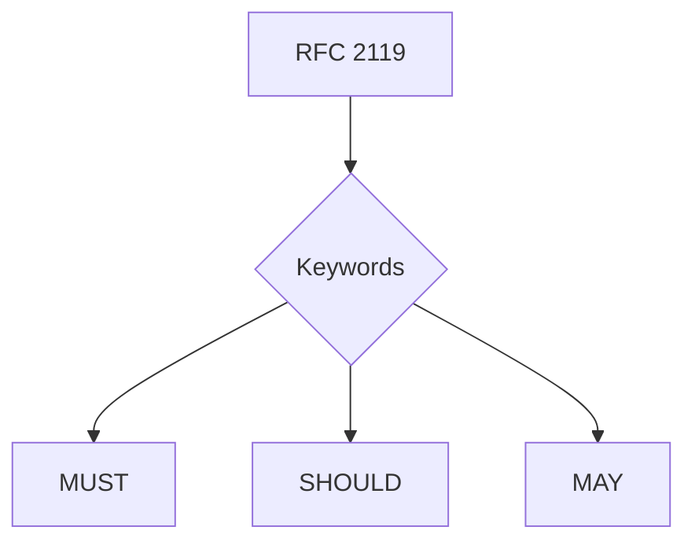

**Git** refers to any conformant implementation supporting refs, commits, trees, blobs, notes, and atomic ref updates.

**Hash** defaults to BLAKE3 for content hashes and SHA‑256 for policy bundle digests unless otherwise stated.

---

## 1. System Model

A **GATOS node** is a Git repository with a disciplined layout of refs, notes, and artifacts. A **GATOS app** is a set of **schemas**, **policies**, and **folds** that operate on **append-only journals** to produce **deterministic state**.

**GATOS** defines five planes:

1) **Ledger plane** — append‑only journals (**events**).  
2) **State plane** — deterministic folds (**state roots**).  
3) **Policy/Trust plane** — enforceable rules and grants.  
4) **Message plane** — a commit‑backed pub/sub bus.
5) **Job plane** — Distributed, verifiable job execution.


### Requirements

- Journals **MUST** be fast‑forward‑only.
- State refs **MUST** be derivable from journals and policies.
- Cache refs **MUST** be rebuildable and **MUST NOT** be authoritative.
- Epochs **MUST** form a cryptographically-linked chain.

---

## 2. On‑Disk Layout (Normative)

The following diagram illustrates the primary locations for GATOS artifacts within the Git repository (`.git`) and the working tree.

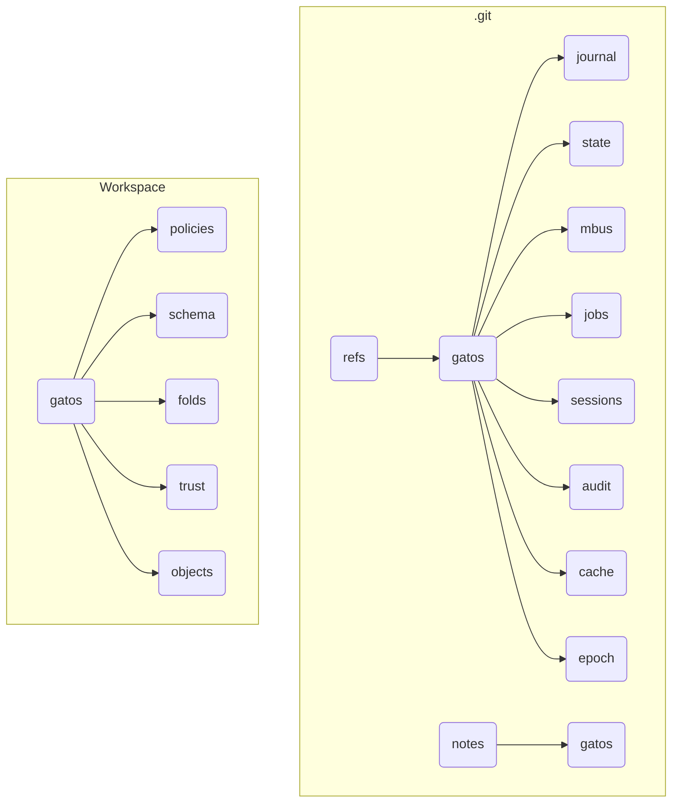

The normative layout is as follows:

```text
.git/
├── refs/
│   └── gatos/
│       ├── journal/
│       ├── state/
│       ├── mbus/
│       ├── mbus-ack/
│       ├── jobs/
│       │   └── <job-id>/
│       │       └── claims/<worker-id>
│       ├── proposals/
│       ├── approvals/
│       ├── grants/
│       └── revocations/
│       ├── sessions/
│       ├── audit/
│       ├── cache/
│       └── epoch/
└── gatos/
    ├── policies/
    ├── schema/
    ├── folds/
    ├── trust/
    ├── objects/
    └── config/
```

---

## 3. Identities, Actors, and Grants

### 3.1 Actors

Actors are strings of the form: `user:<name>`, `agent:<name>`, or `service:<name>`.

### 3.2 Capability Grants

Grants link an `issuer` Actor to a `subject` Actor, bestowing a set of capabilities (`caps`) that are valid until an expiration date (`exp`).

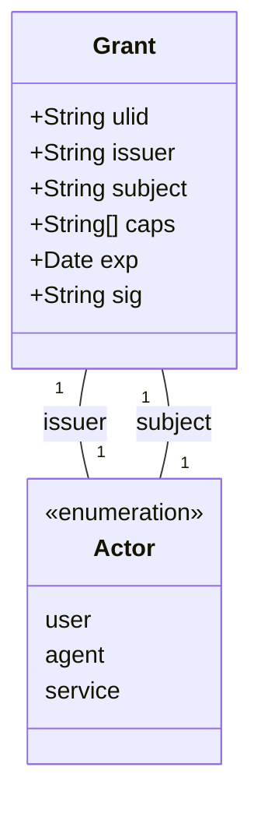

**Grants** **MUST** be committed under `gatos/trust/grants/`. Verifiers **MUST** validate the signature, issuer trust, audience, and expiry.

---

## 4. Events (Ledger Plane)

### 4.1 Event Envelope

All actions in GATOS are initiated via a signed Event.

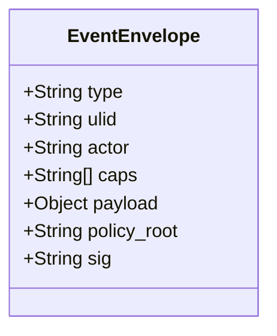

### 4.2 Journal Semantics

Appending an event **MUST** create a new commit on an append-only ref in `refs/gatos/journal/<ns>/<actor>`. Ref updates **MUST** use atomic compare-and-swap.

---

## 5. State (Deterministic Folds)

### 5.1 Fold Function

A **fold** is a pure function: $state_root = F(events_stream, policy_root)$.

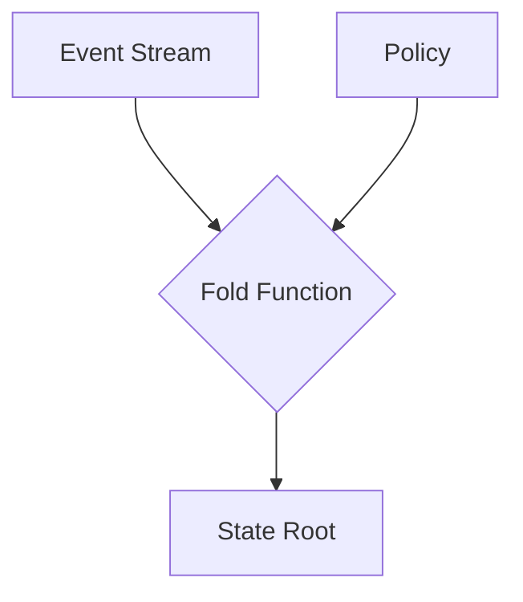

For identical inputs, the byte sequence of `state_root` **MUST** be identical.

### 5.2 Fold Spec & Checkpoints

A Fold is defined by a `.yaml` spec. Its output, a **State Checkpoint**, is a commit on `refs/gatos/state/<ns>` whose tree contains the materialized state artifacts.

---

## 6. Policy & Decision Audit

### 6.1 Gate Contract

All events are evaluated by a Policy Gate before being accepted.
$Decision = Gate.evaluate(intent, context) -> {Allow | Deny(reason)}$

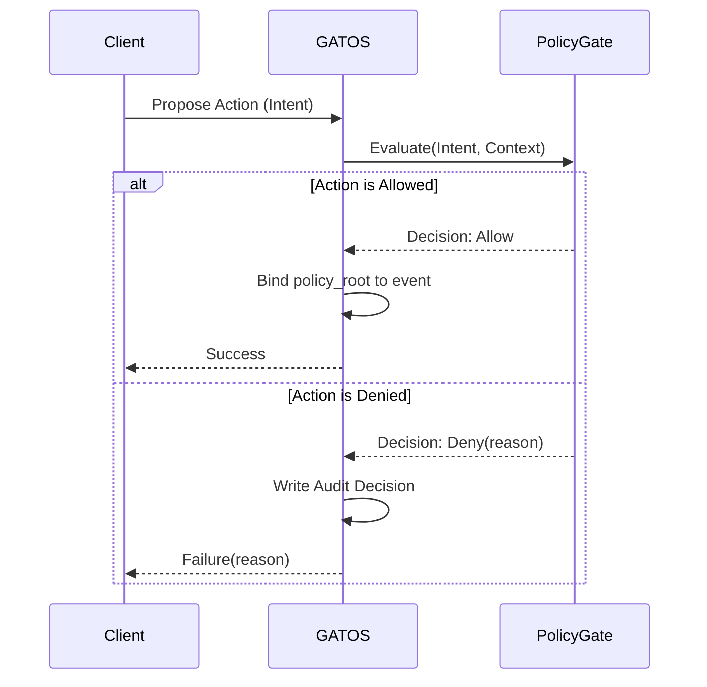

On **DENY**, the gate **MUST** append an audit decision to `refs/gatos/audit/policy`.

---

## 7. Blob Pointers & Opaque Storage

Large or sensitive data is stored out-of-band in a content-addressed store and referenced via pointers.

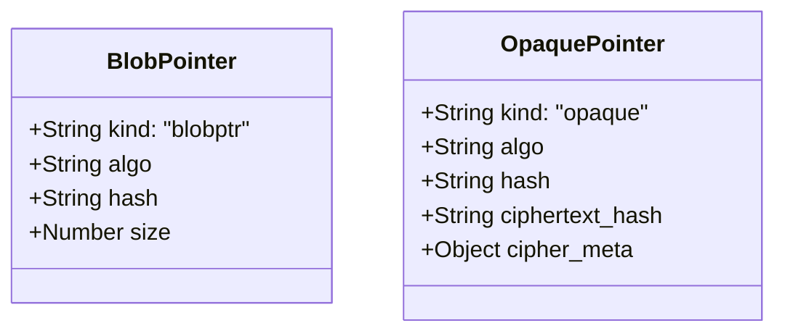

Pointers **MUST** refer to bytes in `gatos/objects/<algo>/<hash>`. For opaque objects, no plaintext **MAY** be stored in Git.

---

## 8. Message Bus (Commit‑Backed Pub/Sub)

The message bus provides a pub/sub system built on Git commits.

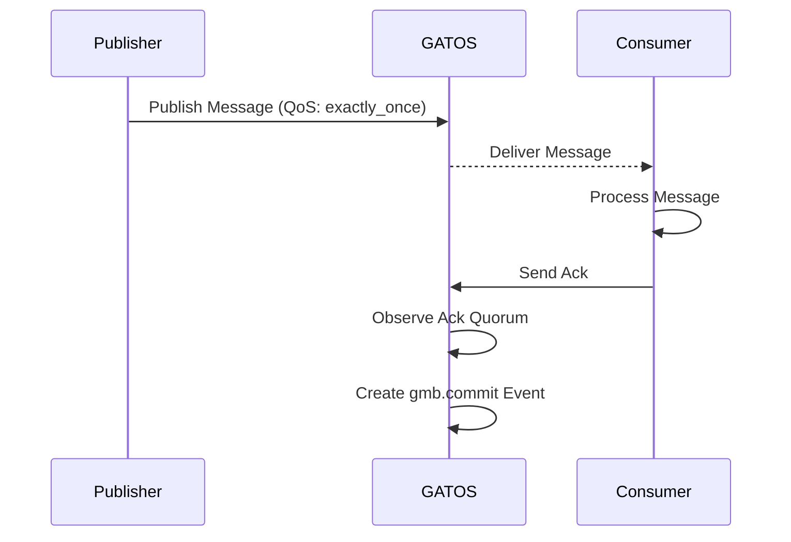

Messages are appended to `refs/gatos/mbus/<topic>/<shard>`. `exactly_once` delivery semantics require consumers to write an `ack` to `refs/gatos/mbus-ack/`.

---

## 9. Sessions (Working Branches)

`gatos/sessions/<actor>/<ulid>` represents an ephemeral branch for interactive mutation.

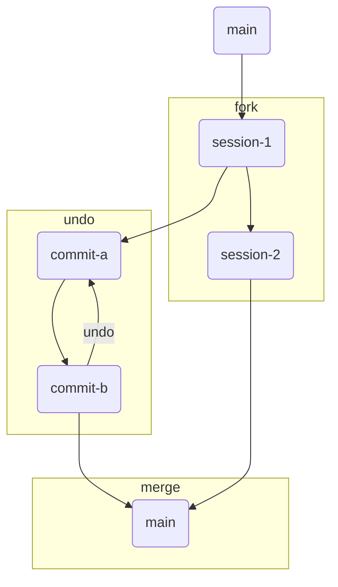

---

## 10. Proofs (Commitments / ZK)

A proof envelope attests to the deterministic execution of a fold or job.

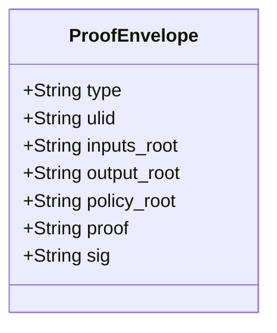

Proofs **MUST** be stored under `refs/gatos/audit/proofs/<ns>`.

---

## 11. Offline Authority Protocol (OAP)

OAP governs how divergent changes from offline peers are reconciled upon reconnecting.

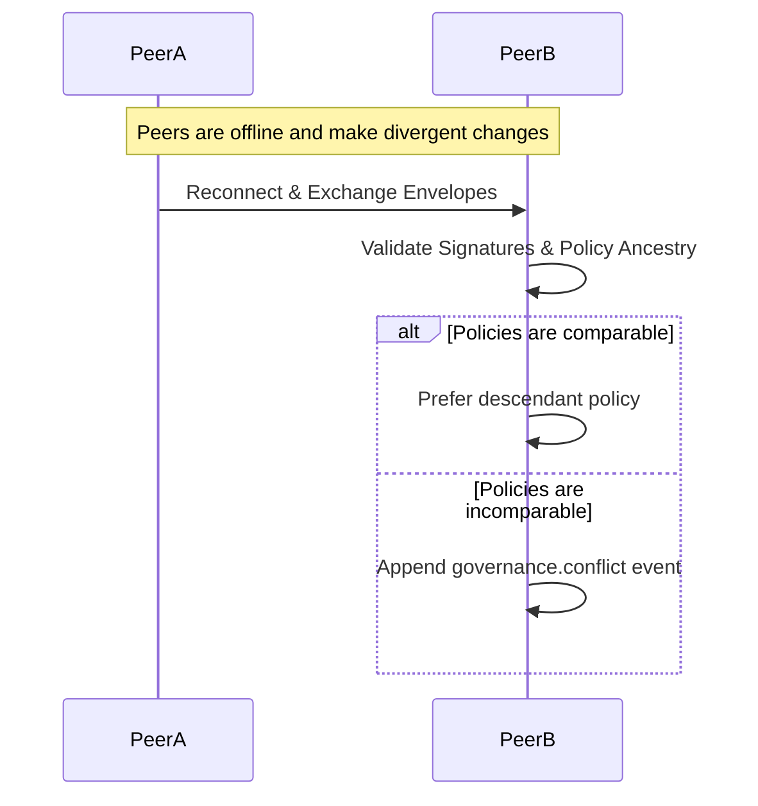

---

## 12.  Profiles

Profiles define the enforcement and operational mode of a GATOS node.

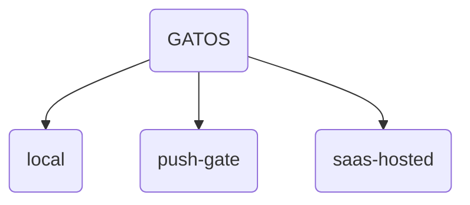

Nodes **MUST** discover the active profile via `gatos/config/profile.yaml`.

---

## 13.  Observability & Health

Implementations **SHOULD** expose metrics and provide a health-check CLI command.

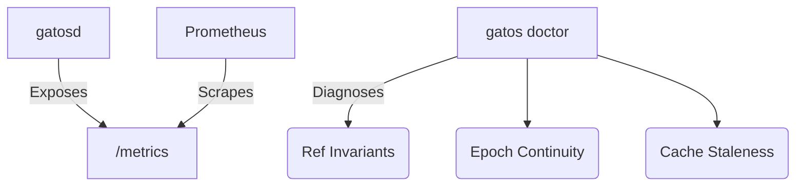

---

## 14.  Security Model

The security model is deny-by-default, governed by capability grants evaluated by the policy engine.

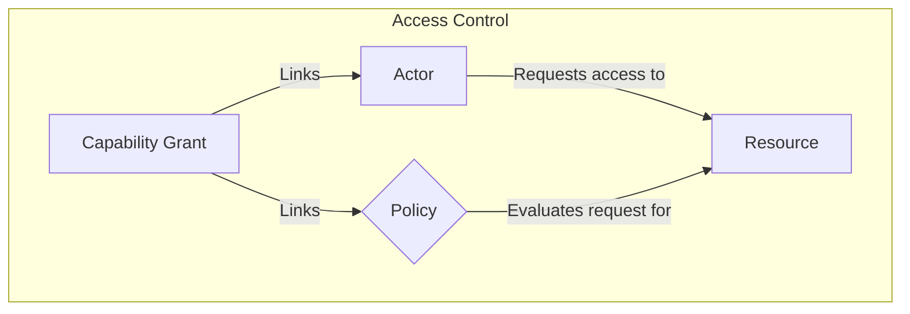

---

## 15.  Performance & GC

Epoch compaction is used to manage repository size over time.

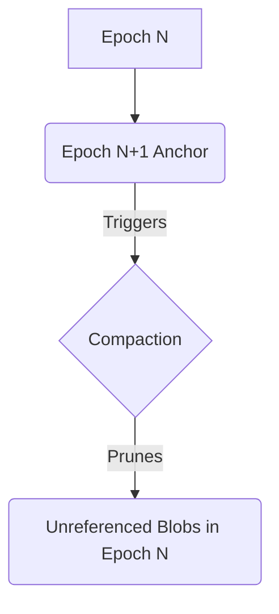

---

## 16.  Compliance & Tests (Normative)

Implementations **MUST** pass a five-point certification inspection.

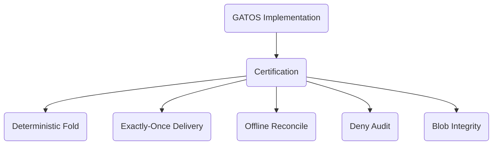

---

## 17. CLI (Reference)

The `git gatos` command provides the primary user interface.

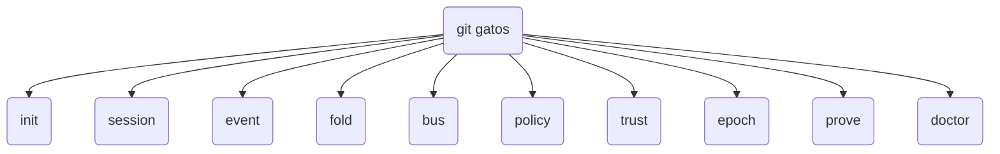

---

## 18. Example Use Case: A Git-Native Work Queue

This diagram shows the data flow for enqueuing and processing a job.

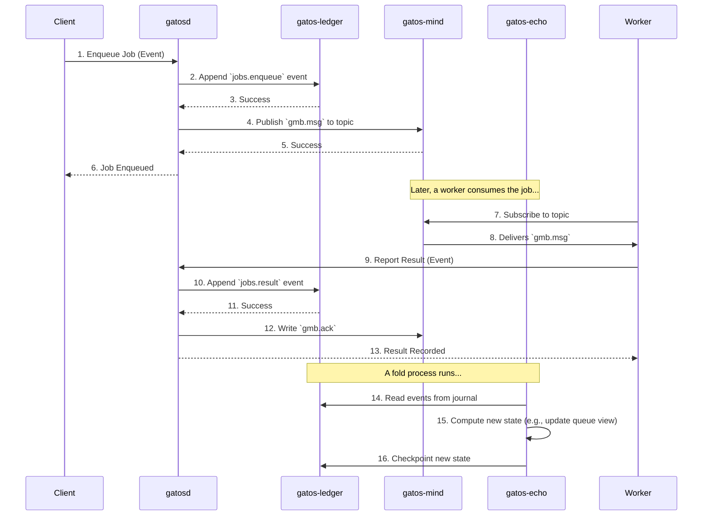

---

## 19. Job Plane (Compute)

The Job Plane provides a system for scheduling, executing, and recording the results of distributed, asynchronous jobs.

### 19.1 Job Lifecycle

This diagram illustrates how the state of a Job transitions based on events recorded in the GATOS ledger.

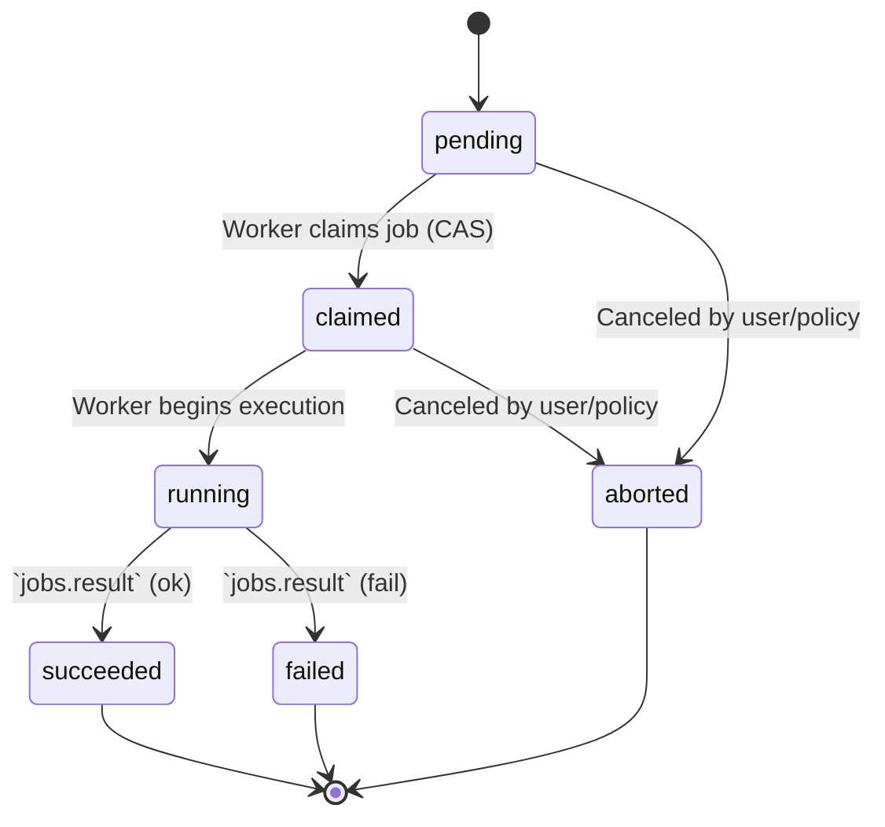

The lifecycle is represented entirely through Git objects:

-   **Job:** A commit whose tree contains a `job.yaml` manifest.
-   **Claim:** An atomic ref under `refs/gatos/jobs/<job-id>/claims/<worker-id>`, where `<job-id>` is the canonical BLAKE3 `content_id` of the job manifest (see ADR‑0002 Canonical Job Identifier).
-   **Result:** A commit referencing the job commit, containing a `Proof-Of-Execution`.

### 19.2 Job Discovery

When a **Job** commit is created, a message **MUST** be published to a topic on the Message Plane for discovery by workers.

### 19.3 Proof-Of-Execution

The **Proof‑Of‑Execution (PoE)** MUST sign the job’s canonical `content_id` (BLAKE3 of the canonical unsigned job core). Trailers MUST use canonical, prefixed encodings as follows:

- `Job-Id: blake3:<hex>` — canonical job identifier (content_id)
- `Proof-Of-Execution: blake3:<hex>` — digest of the PoE envelope
- `Worker-Id: ed25519:<pubkey>` — worker public key identifier
- `Attest-Program: blake3:<hex>` — hash of runner binary or WASM module (RECOMMENDED)
- `Attest-Sig: ed25519:<sig>` — signature over the attestation envelope (OPTIONAL)

Example (trailers):

```text
Job-Id: blake3:9f0a…
Worker-Id: ed25519:03ab…
Proof-Of-Execution: blake3:7c2e…
Attest-Program: blake3:11dd…
Attest-Sig: ed25519:8a77…
```

See ADR‑0002 for the normative PoE requirements and ADR‑0001 for the definition of `content_id` and canonical serialization.

---

## 20. Governance (Consensus Gate)

Governs gated actions via proposals, approvals, grants (see ADR‑0003). Governance artifacts are Git commits under dedicated refs (see on‑disk layout above). All trailers use canonical, prefixed encodings (e.g., `blake3:<hex>`, `ed25519:<pubkey>`).

### 20.1 Proofs

Governance Proof‑Of‑Consensus envelopes SHOULD be stored canonically under `refs/gatos/audit/proofs/governance/<proposal-id>`; the `Proof-Of-Consensus` trailer on the Grant MUST equal `blake3(envelope_bytes)`.

### 20.2 Bus Topics (recommended)

`gatos.policy.proposal.created`, `gatos.policy.approval.created`, `gatos.policy.grant.created`, `gatos.policy.grant.revoked`.
