# GATOS — SPEC v0.3 (Draft)

<!-- AUTOGENERATED TOC START -->
- [Git As The Operating Surface](#git-as-the-operating-surface)
- [0. Conventions](#0)
- [1. System Model](#1)
  - [Requirements](#requirements)
- [2. On‑Disk Layout (Normative)](#2)
- [3. Identities, Actors, and Grants](#3)
  - [3.1 Actors](#3.1)
  - [3.2 Capability Grants](#3.2)
- [4. Events (Ledger Plane)](#4)
  - [4.1 Event Envelope](#4.1)
  - [4.2 Journal Semantics](#4.2)
- [5. State (Deterministic Folds)](#5)
  - [5.1 Fold Function](#5.1)
  - [5.2 Fold Spec & Checkpoints](#5.2)
  - [5.3 State Checkpoint Trailers (Normative)](#5.3)
- [6. Policy & Decision Audit](#6)
  - [6.1 Gate Contract](#6.1)
- [7. Blob Pointers & Opaque Storage (Hybrid Privacy)](#7)
- [8. Message Bus (Commit‑Backed Pub/Sub)](#8)
- [9. Sessions (Working Branches)](#9)
- [10. Proofs (Commitments / ZK)](#10)
- [11. Offline Authority Protocol (OAP)](#11)
- [12.  Profiles](#12)
- [13.  Observability & Health](#13)
- [14.  Security Model](#14)
- [15.  Performance & GC](#15)
- [16.  Compliance & Tests (Normative)](#16)
  - [16.1 Consensus Integrity (Normative)](#16.1)
- [17. CLI (Reference)](#17)
- [18. Example Use Case: A Git-Native Work Queue](#18)
- [19. Job Plane (Compute)](#19)
  - [19.1 Job Lifecycle](#19.1)
  - [19.2 Job Discovery](#19.2)
  - [19.3 Proof-Of-Execution](#19.3)
- [20. Consensus Governance (Normative)](#20)
  - [20.1 Workflow](#20.1)
  - [20.2 Commit Structures (Trailers)](#20.2)
  - [20.3 Proof‑Of‑Consensus (PoC)](#20.3)
  - [20.4 Lifecycle States](#20.4)
  - [20.5 Revocation](#20.5)
  - [20.6 Bus Topics (recommended)](#20.6)

<!-- AUTOGENERATED TOC END -->

<a id="gatos-spec-v0.3-draft"></a>

> *The key to understanding GATOS is understanding that it's just Git.*

## Git As The Operating Surface
<a id="git-as-the-operating-surface"></a>

> You use Git for source control.  
> *I use Git for reality control.*  
> *We are not the same.*  
> **GATOS: Git Different.**

|  |  |
|--|--|
| **Status** | Draft (implementation underway) |
| **Scope** | Normative specification of data model, on-disk layout, protocols, and behavioral guarantees. |
| **Audience** | Implementers, auditors, integrators. |

---

## 0. Conventions
<a id="0"></a><a id="0.-conventions"></a>

The keywords **MUST**, **MUST NOT**, **REQUIRED**, **SHALL**, **SHALL NOT**, **SHOULD**, **SHOULD NOT**, **RECOMMENDED**, **MAY**, and **OPTIONAL** in this document are to be interpreted as described in `RFC 2119`.

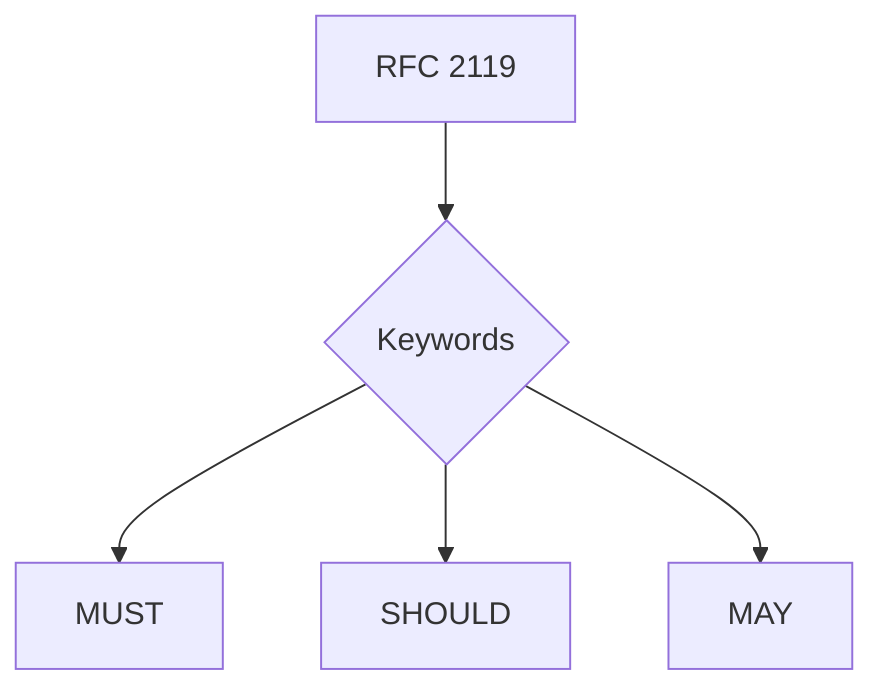

**Git** refers to any conformant implementation supporting refs, commits, trees, blobs, notes, and atomic ref updates.

**Hash** defaults to BLAKE3 for content hashes and SHA‑256 for policy bundle digests unless otherwise stated. Canonical event encoding is **DAG‑CBOR**; where content‑addressing is required, use `cidv1(dag-cbor, blake3(bytes))`. JSON structures that are publicly exchanged (e.g., public pointers) SHOULD use RFC 8785 JCS (sorted keys; UTF‑8 NFC; no `-0`).

**Fold IR** (Echo Lua IR, ELC) is serialized as DAG‑CBOR and identified by `fold_root = sha256(ELC_bytes)`. Stock Lua bytecode (luac) is NOT portable and MUST NOT be used.

**Numeric Model (EchoLua, v1)** is normative: Q32.32 fixed‑point using signed 64‑bit representation. All arithmetic (+, −, ×, ÷) executes in Q32.32; division MUST round toward zero. Transcendental functions (sin, cos, exp, log, …) are not permitted in v1 folds and SHOULD be performed in jobs (PoE) instead.

**Signatures** include an explicit `sig_alg` and use domain separation with context string `GATOS/v0`.

---

## 1. System Model
<a id="1"></a><a id="1.-system-model"></a>

A **GATOS node** is a Git repository with a disciplined layout of refs, notes, and artifacts. A **GATOS app** is a set of **schemas**, **policies**, and **folds** that operate on **append-only journals** to produce **deterministic state**.

**GATOS** defines five planes:

1) **Ledger plane** — append‑only journals (**events**).  
2) **Policy/Trust plane** — enforceable rules, grants, and multi‑party consensus governance.  
3) **State plane** — deterministic folds (**state roots**).  
4) **Message plane** — a commit‑backed pub/sub bus.  
5) **Job plane** — distributed, verifiable job execution.

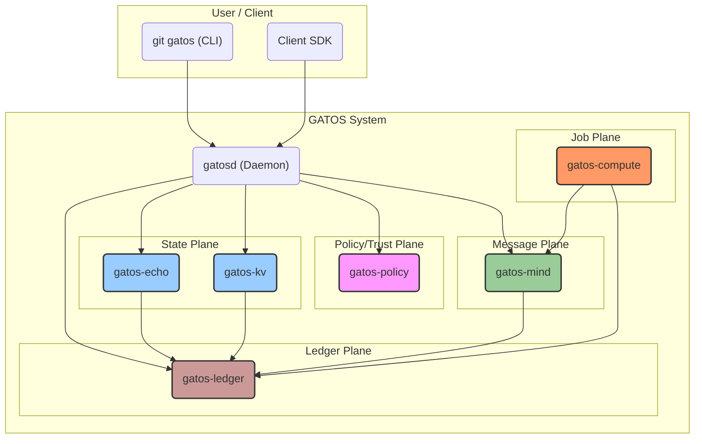

### Requirements
<a id="requirements"></a>

- Journals **MUST** be fast‑forward‑only.
- State refs **MUST** be derivable from journals and policies.
- Cache refs **MUST** be rebuildable and **MUST NOT** be authoritative.
- Epochs **MUST** form a cryptographically-linked chain.

---

## 2. On‑Disk Layout (Normative)
<a id="2"></a><a id="2.-ondisk-layout-normative"></a>

The following diagram illustrates the primary locations for GATOS artifacts within the Git repository (`.git`) and the working tree.

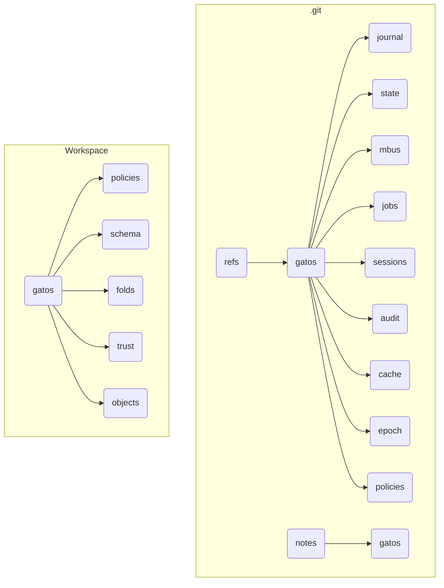

The normative layout is as follows:

```text
.git/
├── refs/
│   └── gatos/
│       ├── journal/
│       ├── state/
│       ├── mbus/
│       ├── mbus-ack/
│       ├── jobs/
│       │   └── <job-id>/
│       │       └── claim
│       ├── proposals/
│       ├── approvals/
│       ├── grants/
│       └── revocations/
│       ├── sessions/
│       ├── audit/
│       ├── cache/
│       └── epoch/
│       └── policies/
└── gatos/
    ├── policies/
    ├── schema/
    ├── folds/
    ├── trust/
    ├── objects/
    └── config/
```

Active policy bundles and their lineage SHOULD be recorded under `refs/gatos/policies/`. Implementations MAY track an `active` pointer (e.g., `refs/gatos/policies/active`) to select the effective policy root used for gate evaluation.

---

## 3. Identities, Actors, and Grants
<a id="3"></a><a id="3.-identities-actors-and-grants"></a>

### 3.1 Actors
<a id="3.1"></a><a id="31"></a><a id="3"></a><a id="3.1-actors"></a>

Actors are strings of the form: `user:<name>`, `agent:<name>`, or `service:<name>`.

### 3.2 Capability Grants
<a id="3.2"></a><a id="32"></a><a id="3"></a><a id="3.2-capability-grants"></a>

Grants link an `issuer` Actor to a `subject` Actor, bestowing a set of capabilities (`caps`) that are valid until an expiration date (`exp`).

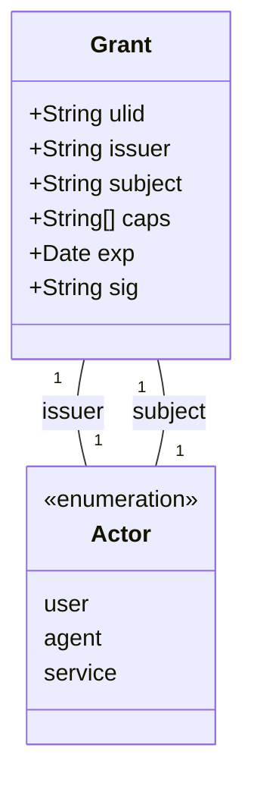

**Grants** **MUST** be committed under `gatos/trust/grants/`. Verifiers **MUST** validate the signature, issuer trust, audience, and expiry.

---

## 4. Events (Ledger Plane)
<a id="4"></a><a id="4.-events-ledger-plane"></a>

### 4.1 Event Envelope
<a id="4.1"></a><a id="41"></a><a id="4"></a><a id="4.1-event-envelope"></a>

All actions in GATOS are initiated via a signed Event.

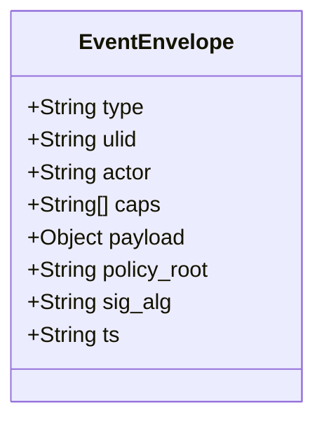

Canonicalization and signing:

- Encode the envelope (with `sig` omitted) as **DAG‑CBOR** to produce canonical bytes.
- Content addressing: `Event-CID = cidv1(dag-cbor, blake3(canonical_bytes))`.
- Sign `canonical_bytes` with `sig_alg` (e.g., `ed25519`); record signature in commit trailers.
- Recommended trailers: `Event-CID`, `Sig-Alg`, `Sig`.

### 4.2 Journal Semantics
<a id="4.2"></a><a id="42"></a><a id="4"></a><a id="4.2-journal-semantics"></a>

Appending an event **MUST** create a new commit on an append-only ref in `refs/gatos/journal/<ns>/<actor>`. Ref updates **MUST** use atomic compare-and-swap via `git update-ref <old> <new>`.

---

## 5. State (Deterministic Folds)
<a id="5"></a><a id="5.-state-deterministic-folds"></a>

### 5.1 Fold Function
<a id="5.1"></a><a id="51"></a><a id="5"></a><a id="5.1-fold-function"></a>

A **fold** is a pure function: $state_root = F(events_stream, policy_root)$.

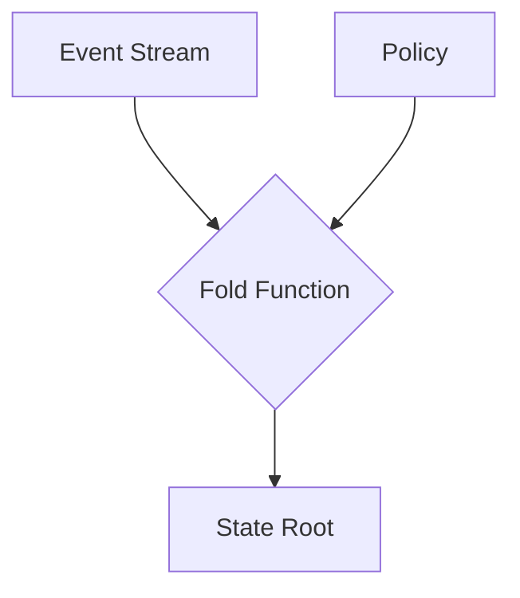

For identical inputs, and the same `policy_root`, the byte sequence of `state_root` **MUST** be identical.

### 5.2 Fold Spec & Checkpoints
<a id="5.2"></a><a id="52"></a><a id="5"></a><a id="5.2-fold-spec-checkpoints"></a>

A Fold is defined by a `.yaml` spec and a compiled EchoLua program (ELC). The EchoLua source is compiled to ELC (serialized DAG‑CBOR); `fold_root = sha256(ELC_bytes)`. Its output, a **State Checkpoint**, is a commit on `refs/gatos/state/<ns>` whose tree contains the materialized state artifacts.

> See also
>
> - Hello walkthrough (Ops): [HELLO-OPS](./guide/HELLO-OPS.md) shows append → fold → verify trailers.
> - Hello walkthrough (Privacy): [HELLO-PRIVACY](./guide/HELLO-PRIVACY.md) shows pointers and deterministic public folds.

### 5.3 State Checkpoint Trailers (Normative)
<a id="5.3"></a><a id="53"></a><a id="5"></a><a id="5.3-state-checkpoint-trailers-normative"></a>

Every state checkpoint commit under `refs/gatos/state/<ns>` **MUST** include the following trailers with canonical encodings:

```
State-Root: blake3:<hex>                 # lowercase hex digest of canonical state
Ledger-Head: <commit-oid>                # last ledger commit included in this fold
Policy-Root: <commit-oid>                # commit/digest that identifies the effective policy
Policy-Code-Root: sha256:<hex>           # canonical hash of policy code used (ELC/.rgc)
Fold-Engine: echo@<semver>+elc@<semver>+num=q32.32+rng=pcg32@<ver>
Fold-Root: sha256:<hex>                  # hash of EchoLua IR bytes (ELC)
Fold-Version: <schema-version>            # application/shape schema version
Fold-Math: fixed-q32.32                   # numeric model (normative in v1)
Fold-RNG: pcg32@<ver>                     # RNG algorithm id + version (if used)
```

These trailers enable portable verification and reproducible builds of state across nodes and platforms.

> Cross‑reference
>
> - TECH‑SPEC fold/verification references these trailers.
> - Walkthrough usage: [HELLO-OPS](./guide/HELLO-OPS.md#2-fold-to-state-and-inspect).

### 5.4 Proof‑of‑Fold (PoF)
<a id="5.4"></a><a id="54"></a><a id="5"></a><a id="5.4-proof-of-fold"></a>

A **Proof‑of‑Fold (PoF)** binds a state checkpoint to the exact ledger window and fold definition used to derive it.

At minimum, a PoF MUST commit to:

- `Ledger-Start` and `Ledger-End` commit OIDs (inclusive window),
- `Policy-Root` (or policy digest) used for gate decisions affecting the fold,
- `Fold-Id` (stable identifier or digest of the fold function/spec),
- `Fold-Root` (sha256 of ELC bytes),
- `State-Root` (content hash of the resulting checkpoint),
- `Policy-Code-Root` (sha256 of the canonicalized policy code/ELC),
- Signatures of the folding actor(s) when required by policy.

Implementations MAY embed PoF in commit trailers or attach a sidecar manifest. Verifiers MUST recompute the fold over the declared window and compare the resulting `State-Root`.

---

## 6. Policy & Decision Audit
<a id="6"></a><a id="6.-policy-decision-audit"></a>

### 6.1 Gate Contract
<a id="6.1"></a><a id="61"></a><a id="6"></a><a id="6.1-gate-contract"></a>

All events are evaluated by a Policy Gate before being accepted. Gates that execute policy code MUST adhere to the [Deterministic Lua (EchoLua)](./deterministic-lua.md) runtime profile. Policy is authored in `.rgs` and compiled to `.rgc`/ELC; policy bundles and proofs MUST record `Policy-Code-Root` so the exact governing code is recoverable.
$Decision = Gate.evaluate(intent, context) -> {Allow | Deny(reason)}$

Note: A deterministic execution profile for Lua will be documented (see [Deterministic Lua](./deterministic-lua.md)); policy engines **SHOULD** adhere to that profile to ensure portable verification.

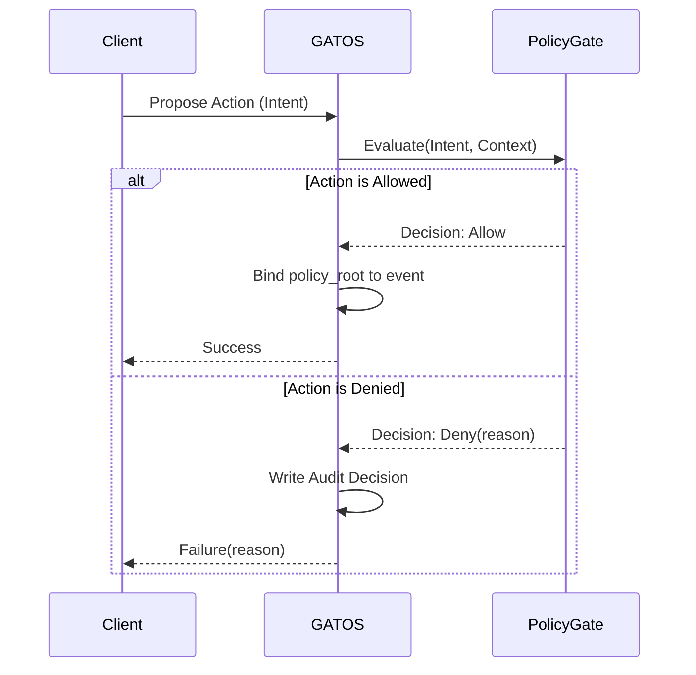

On **DENY**, the gate **MUST** append an audit decision to `refs/gatos/audit/policy`.

> [!IMPORTANT]
> DENY is always logged under audit. Each decision MUST include the policy rule identifier (`Policy-Rule`), a reproducible reason, and sufficient context (actor, target, refs) for independent verification.

---

## 7. Blob Pointers & Opaque Storage (Hybrid Privacy)
<a id="7"></a><a id="7.-blob-pointers-opaque-storage-hybrid-privacy"></a>

Large or sensitive data is stored out-of-band in a content-addressed store and referenced via pointers.

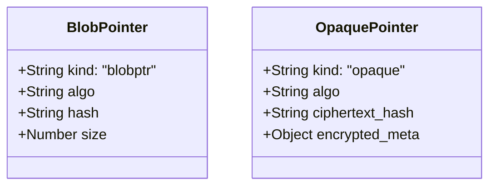

Pointers **MUST** refer to bytes in `gatos/objects/<algo>/<hash>`. For opaque objects, no plaintext **MAY** be stored in Git. Public pointers in low‑entropy classes **MUST NOT** reveal a plaintext digest; they **MUST** include a ciphertext digest. Pointer `size` **SHOULD** be bucketed (e.g., 1 KB/4 KB/16 KB/64 KB). If a plaintext commitment is required, use a hiding commitment and store it inside `encrypted_meta`.

---

## 8. Message Bus (Commit‑Backed Pub/Sub)
<a id="8"></a><a id="8.-message-bus-commitbacked-pubsub"></a>

The message bus provides a pub/sub system built on Git commits.

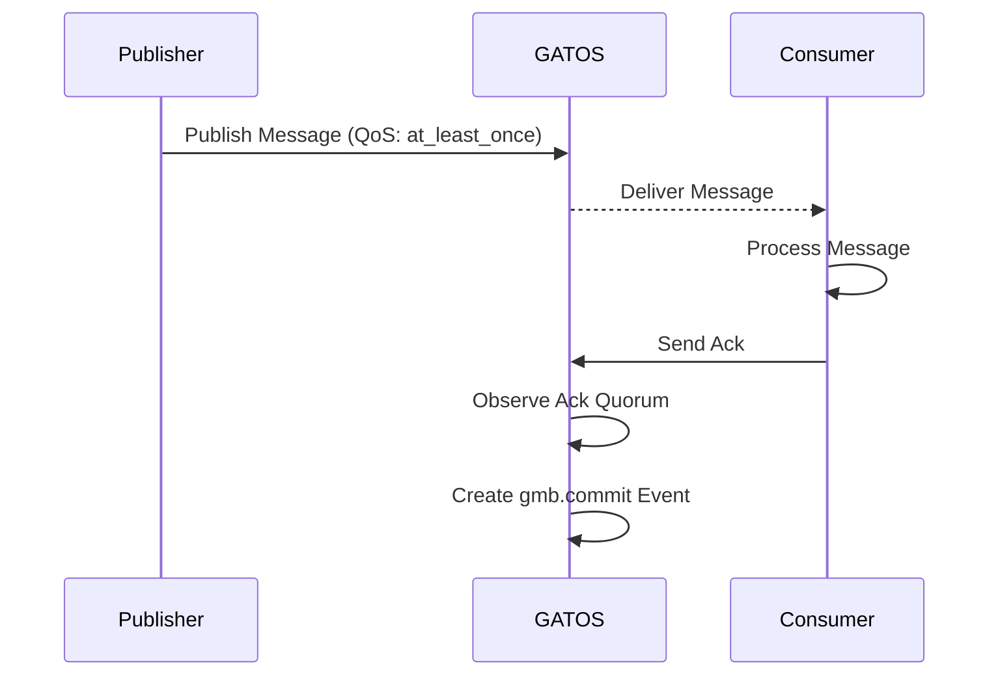

Messages are appended to `refs/gatos/mbus/<topic>/<shard>`. Delivery is **at‑least‑once**; consumers **MUST** dedupe on read using the message `ULID` (or content hash) as an idempotency key and **MAY** write `ack`s to `refs/gatos/mbus-ack/`. Producers **SHOULD** set idempotency keys.

Retention and compaction:

- Segment topics by date and ULID (e.g., `<topic>/<yyyy>/<mm>/<dd>/<segment-ulid>`) and rotate when either a message or size threshold is reached (defaults: 100k messages or ~192 MB).
- Apply TTL to old segments (default: 30 days) and write a summary commit per pruned window (counts + Merkle root of message bodies + last offsets) to preserve verifiable history.
- Deployments **SHOULD** enable `fetch.writeCommitGraph=true` and `repack.writeBitmaps=true` for busy topics.

---

## 9. Sessions (Working Branches)
<a id="9"></a><a id="9.-sessions-working-branches"></a>

`gatos/sessions/<actor>/<ulid>` represents an ephemeral branch for interactive mutation.

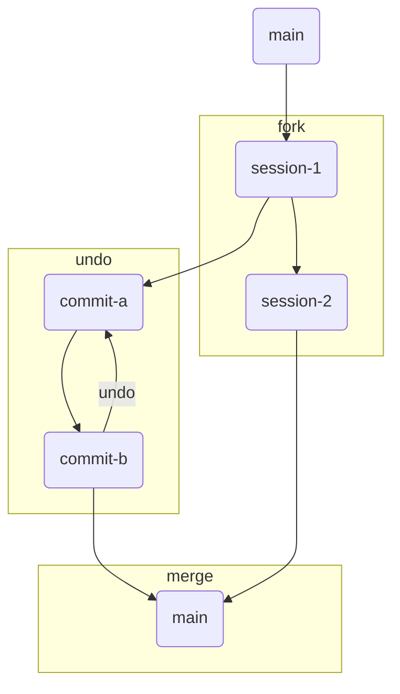

---

## 10. Proofs (Commitments / ZK)
<a id="10"></a><a id="10.-proofs-commitments-zk"></a>

A proof envelope attests to the deterministic execution of a fold or job. Where applicable, proofs MUST record `Policy-Code-Root` alongside `Policy-Root` so the governing policy code is unambiguously identified.

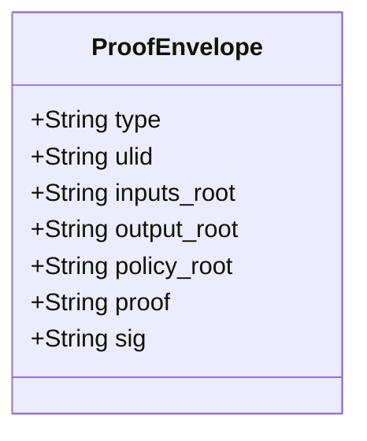

Proofs **MUST** be stored under `refs/gatos/audit/proofs/<ns>`.

### 10.x Proof‑of‑Experiment (PoX)
<a id="10.x"></a>

A **PoX** envelope ties together a scientific artifact’s inputs, program, policy, and outputs:

- `inputs_root` — commitment to input datasets/pointers
- `program_id` — canonical hash of the analysis program/container
- `policy_root` — policy in effect
- `outputs_root` — commitment to results
- Links to associated PoE (jobs) and PoF (state) where applicable

PoX envelopes **MUST** be stored under `refs/gatos/audit/proofs/experiments/<ulid>`.

---

## 11. Offline Authority Protocol (OAP)
<a id="11"></a><a id="11.-offline-authority-protocol-oap"></a>

OAP governs how divergent changes from offline peers are reconciled upon reconnecting.

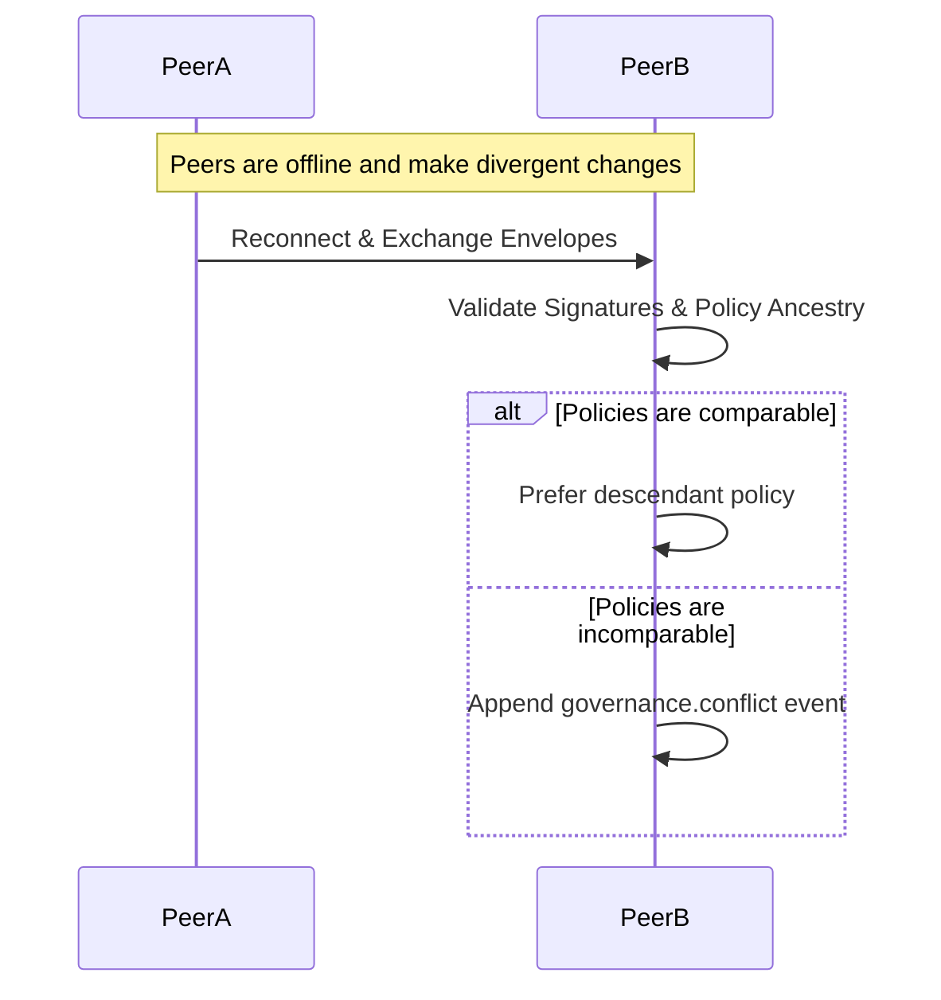

---

## 12.  Profiles
<a id="12"></a><a id="12.-profiles"></a>

Profiles define the enforcement and operational mode of a GATOS node.

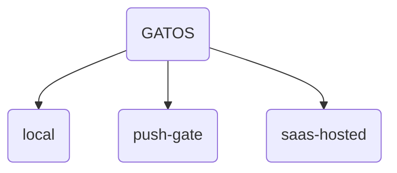

Nodes **MUST** discover the active profile via `gatos/config/profile.yaml`.

### 12.1 Research Profile (Strict)
<a id="12.1"></a>

Profile id: `research`.

Defaults (normative for this profile):

- Proof‑of‑Fold required on state pushes: pre‑receive MUST verify PoF for updates to `refs/gatos/state/**`.
- Fast‑forward‑only refs: `refs/gatos/policies/**`, `refs/gatos/state/**`, and `refs/gatos/audit/**`.
- GC anchors: `refs/gatos/audit/**` and the latest `refs/gatos/state/**` checkpoints.
- Message bus segmentation and TTL: rotate segments at 100k messages or ~192 MB; TTL 30 days; write summary commits for pruned windows.
- Public pointer hardening: low‑entropy classes MUST NOT expose plaintext digests; public pointers MUST include a ciphertext digest; sizes SHOULD be bucketed (e.g., 1 KB, 4 KB, 16 KB, 64 KB).

Nodes advertising the `research` profile MUST expose diagnostics for the above and SHOULD surface violations in `gatos doctor`.

---

## 13.  Observability & Health
<a id="13"></a><a id="13.-observability-health"></a>

Implementations **SHOULD** expose metrics and provide a health-check CLI command.

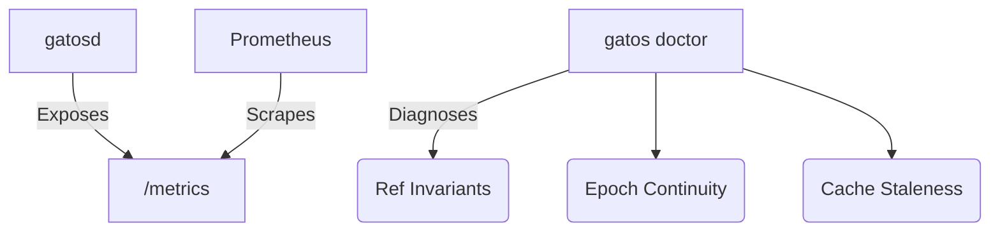

---

## 14.  Security Model
<a id="14"></a><a id="14.-security-model"></a>

The security model is deny-by-default, governed by capability grants evaluated by the policy engine.

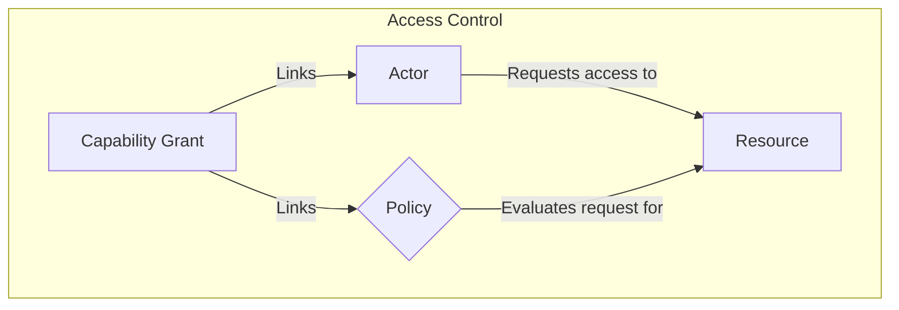

---

## 15.  Performance & GC
<a id="15"></a><a id="15.-performance-gc"></a>

Epoch compaction is used to manage repository size over time.

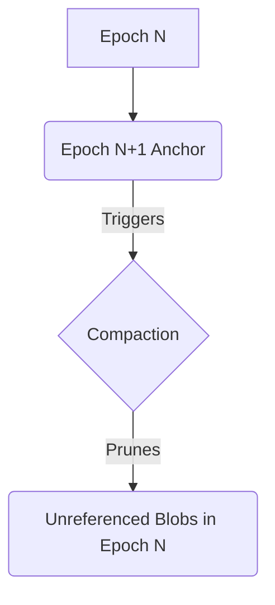

### 15.1 Exports and Explorer‑Root (Normative)

Exporters that materialize views **MUST** emit an `Explorer-Root` checksum.

- For derived state exports (materialized from folds), include the fold identity:

```
Explorer-Root = blake3(ledger_head || policy_root || fold_root || extractor_version)
```

- For raw ledger exports (no folds applied), omit `fold_root`:

```
Explorer-Root = blake3(ledger_head || policy_root || extractor_version)
```

The `gatos export verify` command **MUST** recompute `Explorer-Root` against the repository and report mismatches.

---

## 16.  Compliance & Tests (Normative)
<a id="16"></a><a id="16.-compliance-tests-normative"></a>

Implementations **MUST** pass a six-point certification inspection.

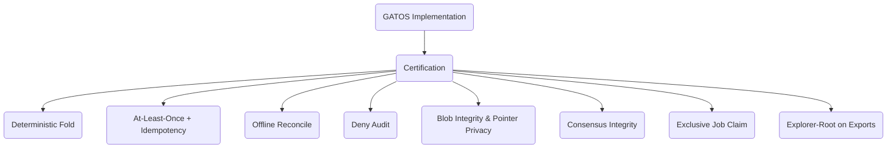

### 16.1 Consensus Integrity (Normative)
<a id="16.1"></a><a id="161"></a><a id="16"></a><a id="16.1-consensus-integrity-normative"></a>

- An action gated by a `2-of-3` quorum policy MUST be denied with 1 approval and MUST be allowed with 2 approvals.
- A revoked grant MUST NOT be usable.

### 16.2 Additional Checks (Normative)

- PoF required: state pushes to `refs/gatos/state/**` MUST include a verifiable Proof‑of‑Fold.
- Policies FF‑only: `refs/gatos/policies/**` MUST be fast‑forward only.
- Exclusive job claim: exactly one worker MUST succeed in creating `refs/gatos/jobs/<job-id>/claim` via compare‑and‑swap.
- Pointer privacy: public pointers for low‑entropy classes MUST NOT expose plaintext digests; ciphertext digest present; sizes bucketed.
- Exports: exporters MUST emit `Explorer-Root = blake3(ledger_head || policy_root || extractor_version)` and `gatos export verify` MUST validate it.

---

## 17. CLI (Reference)
<a id="17"></a><a id="17.-cli-reference"></a>

The `git gatos` command provides the primary user interface.

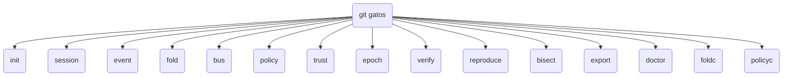

Key verbs (non‑exhaustive):

- `verify` — verify PoX/PoF/PoE signatures & ancestry.
- `reproduce <pox-id>` — fetch pointers, run jobs (PoE), check PoF; report identical/diff.
- `bisect --state=<ref> --good <ts|commit> --bad <ts|commit> --predicate <script|jq>` — binary search over checkpoints.
- `export parquet|sqlite` — emit Explorer‑Root; `export verify <path>` compares it.
- `foldc <src.lua> -o <out.elc>` — compile EchoLua to ELC (records engine id).
- `policyc <src.rgs> -o <out.rgc>` — compile .rgs policy DSL to deterministic IR/ELC.

---

## 18. Example Use Case: A Git-Native Work Queue
<a id="18"></a><a id="18.-example-use-case-a-git-native-work-queue"></a>

This diagram shows the data flow for enqueuing and processing a job.

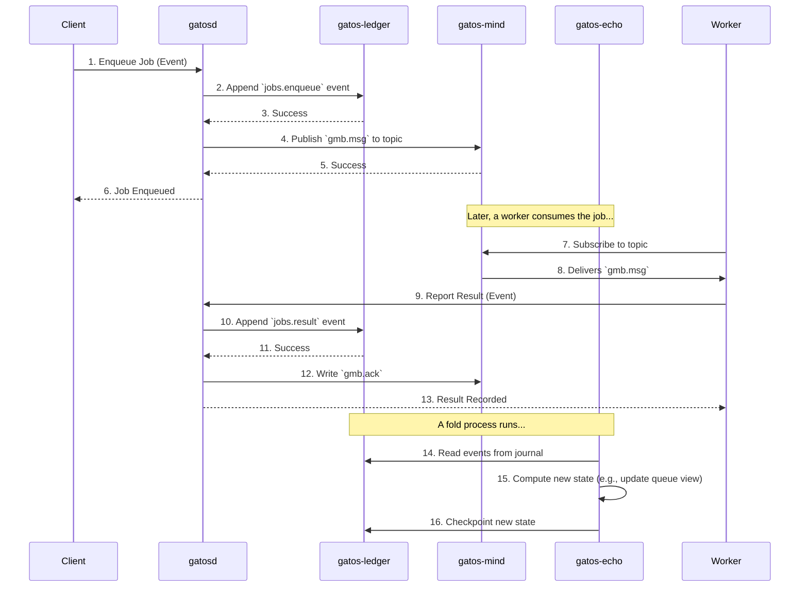

---

## 19. Job Plane (Compute)
<a id="19"></a><a id="19.-job-plane-compute"></a>

See also: [ADR‑0002](./decisions/ADR-0002/DECISION.md).

The Job Plane provides a system for scheduling, executing, and recording the results of distributed, asynchronous jobs.

### 19.1 Job Lifecycle
<a id="19.1"></a><a id="191"></a><a id="19"></a><a id="19.1-job-lifecycle"></a>

This diagram illustrates how the state of a Job transitions based on events recorded in the GATOS ledger.

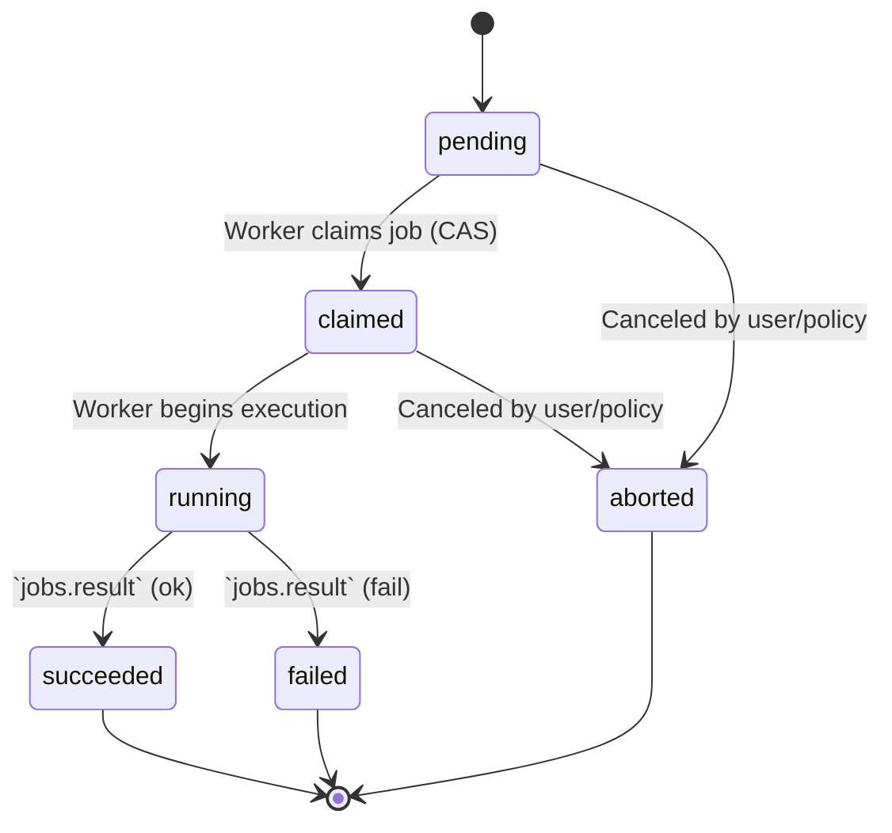

The lifecycle is represented entirely through Git objects:

- **Job:** A commit whose tree contains a `job.yaml` manifest.
- **Claim:** A single lock ref `refs/gatos/jobs/<job-id>/claim`. Workers perform an atomic `git update-ref 0000… <claim-oid>` (compare‑and‑swap). The winner writes its `worker_id` inside the claim object.
- **Result:** A commit referencing the job commit, containing a `Proof-Of-Execution`.

### 19.2 Job Discovery
<a id="19.2"></a><a id="192"></a><a id="19"></a><a id="19.2-job-discovery"></a>

When a **Job** commit is created, a message **MUST** be published to a topic on the Message Plane for discovery by workers. Delivery is at‑least‑once; workers MUST be idempotent.

### 19.3 Proof-Of-Execution
<a id="19.3"></a><a id="193"></a><a id="19"></a><a id="19.3-proof-of-execution"></a>

The **Proof‑Of‑Execution (PoE)** MUST sign the job’s canonical `content_id` (BLAKE3 of the canonical unsigned job core). Trailers MUST use canonical, prefixed encodings as follows:

- `Job-Id: blake3:<hex>` — canonical job identifier (content_id)
- `Proof-Of-Execution: blake3:<hex>` — digest of the PoE envelope
- `Worker-Id: ed25519:<pubkey>` — worker public key identifier
- `Attest-Program: blake3:<hex>` — hash of runner binary or WASM module (RECOMMENDED)
- `Attest-Sig: ed25519:<sig>` — signature over the attestation envelope (OPTIONAL)

Example (trailers):

```text
Job-Id: blake3:<hex>
Worker-Id: ed25519:<pubkey>
Proof-Of-Execution: blake3:<hex>
Attest-Program: blake3:<hex>
Attest-Sig: ed25519:<sig>
```

See ADR‑0002 for the normative PoE requirements and ADR‑0001 for the definition of `content_id` and canonical serialization.

---

## 20. Consensus Governance (Normative)
<a id="20"></a><a id="20.-consensus-governance-normative"></a>

See also: [ADR‑0003](./decisions/ADR-0003/DECISION.md).

Governs gated actions via proposals, approvals, and grants. Governance artifacts are Git commits under dedicated refs (see on‑disk layout). All trailers MUST use canonical, prefixed encodings (`blake3:<hex>`, `ed25519:<pubkey>`).

### 20.1 Workflow
<a id="20.1"></a><a id="201"></a><a id="20"></a><a id="20.1-workflow"></a>

Proposal → Approvals (N‑of‑M) → Grant. Quorum groups (e.g., `@leads`) MUST be defined in the trust graph (`gatos/trust/graph.json`).

### 20.2 Commit Structures (Trailers)
<a id="20.2"></a><a id="202"></a><a id="20"></a><a id="20.2-commit-structures-trailers"></a>

- Proposal (at `refs/gatos/proposals/…`):

  ```text
  Action: <string>
  Target: <uri>
  Proposal-Id: blake3:<hex>
  Required-Quorum: <expr>
  Expire-At: <ISO8601>
  Policy-Rule: <policy id>
  Created-By: <actor>
  ```

  (Note: `gatos://` is the canonical URI scheme for addressing resources managed within the GATOS operating surface.)
- Approval (at `refs/gatos/approvals/…`):

  ```text
  Proposal-Id: blake3:<hex>
  Approval-Id: blake3:<hex>
  Signer: ed25519:<pubkey>
  Expires-At: <ISO8601>   # OPTIONAL
  ```

- Grant (at `refs/gatos/grants/…`):

  ```text
  Proposal-Id: blake3:<hex>
  Grant-Id: blake3:<hex>
  Proof-Of-Consensus: blake3:<hex>
  ```

### 20.3 Proof‑Of‑Consensus (PoC)
<a id="20.3"></a><a id="203"></a><a id="20"></a><a id="20.3-proofofconsensus-poc"></a>

`Proof-Of-Consensus` is the BLAKE3 of a canonical JSON envelope containing:

- The canonical proposal envelope (by value or `Proposal-Id`).
- A sorted list (by `Signer`) of all valid approvals used to reach quorum (by value or `Approval-Id`).
- The governance rule id (`Policy-Rule`) and effective quorum parameters.

PoC envelope SHOULD be stored canonically under `refs/gatos/audit/proofs/governance/<proposal-id>`; the Grant’s `Proof-Of-Consensus` trailer MUST equal `blake3(envelope_bytes)`.

### 20.4 Lifecycle States
<a id="20.4"></a><a id="204"></a><a id="20"></a><a id="20.4-lifecycle-states"></a>

| State    | Meaning                         |
|:---------|:--------------------------------|
| proposal | Awaiting votes                  |
| partial  | Some approvals collected        |
| granted  | Quorum reached; action allowed  |
| expired  | Proposal timed out              |
| revoked  | Grant withdrawn or superseded   |

```mermaid
stateDiagram-v2
    [*] --> proposal
    proposal --> partial: approval received
    partial --> partial: additional approvals
    proposal --> expired: ttl elapsed
    partial --> expired: ttl elapsed
    partial --> granted: quorum satisfied
    granted --> revoked: revocation committed
    expired --> [*]
    revoked --> [*]
```

### 20.5 Revocation
<a id="20.5"></a><a id="205"></a><a id="20"></a><a id="20.5-revocation"></a>

A grant MAY be revoked by creating a `revocation` commit under `refs/gatos/revocations/` with trailers:

```text
Grant-Id: blake3:<hex>
Revocation-Id: blake3:<hex>
Reason: <free-text>
Revoked-By: <actor>
```

### 20.6 Bus Topics (recommended)
<a id="20.6"></a><a id="206"></a><a id="20"></a><a id="20.6-bus-topics-recommended"></a>

`gatos.governance.proposal.created`, `gatos.governance.approval.created`, `gatos.governance.grant.created`, `gatos.governance.grant.revoked`.

---

## Glossary
<a id="glossary"></a>

- PoF — Proof‑of‑Fold. Evidence that a state root was derived deterministically from a specific ledger window under a specific fold/policy root.
- PoE — Proof‑of‑Execution. Signed attestation that a worker executed a job (who/what/where/inputs/outputs).
- PoC — Proof‑of‑Consensus. Evidence that a governance action met its quorum/approval rules.
- PoX — Proof‑of‑Experiment. Bundle tying inputs → program → outputs for scientific reproducibility.
- ULID — Lexicographically sortable identifier used as an idempotency key for messages.
