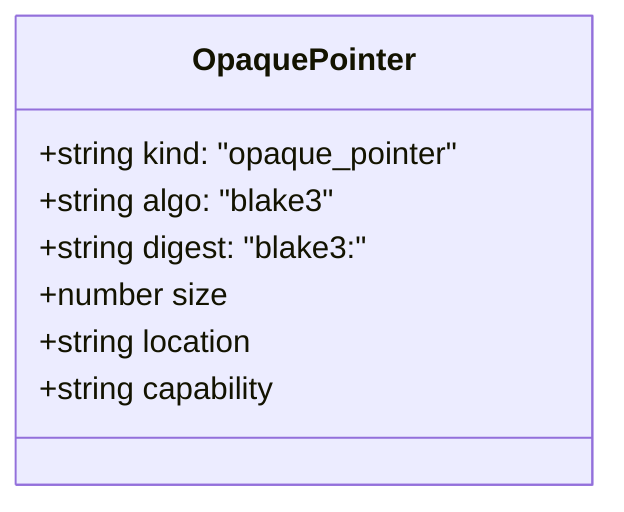
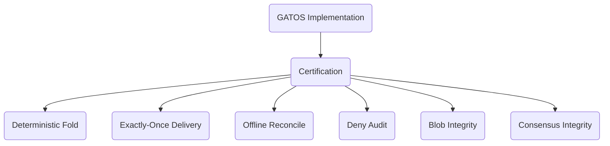

# GATOS — SPEC v0.3 (Draft)

> *The key to understanding GATOS is understanding that it's just Git.*

## Git As The Operating Surface

> You use Git for source control.  
> *I use Git for reality control.*  
> *We are not the same.*  
> **GATOS: Git Different.**

|  |  |
|--|--|
| **Status** | Draft (implementation underway) |
| **Scope** | Normative specification of data model, on-disk layout, protocols, and behavioral guarantees. |
| **Audience** | Implementers, auditors, integrators. |

---

## 0. Conventions

The keywords **MUST**, **MUST NOT**, **REQUIRED**, **SHALL**, **SHALL NOT**, **SHOULD**, **SHOULD NOT**, **RECOMMENDED**, **MAY**, and **OPTIONAL** in this document are to be interpreted as described in `RFC 2119`.


**Git** refers to any conformant implementation supporting refs, commits, trees, blobs, notes, and atomic ref updates.

**Hash** defaults to BLAKE3 for content hashes and SHA‑256 for policy bundle digests unless otherwise stated.

---

## 1. System Model

A **GATOS node** is a Git repository with a disciplined layout of refs, notes, and artifacts. A **GATOS app** is a set of **schemas**, **policies**, and **folds** that operate on **append-only journals** to produce **deterministic state**.

**GATOS** defines five planes:

1) **Ledger plane** — append‑only journals (**events**).  
2) **State plane** — deterministic folds (**state roots**).  
3) **Policy/Trust plane** — enforceable rules, grants, and multi‑party consensus governance.  
4) **Message plane** — a commit‑backed pub/sub bus.
5) **Job plane** — Distributed, verifiable job execution.


### Requirements

- Journals **MUST** be fast‑forward‑only.
- State refs **MUST** be derivable from journals and policies.
- Cache refs **MUST** be rebuildable and **MUST NOT** be authoritative.
- Epochs **MUST** form a cryptographically-linked chain.

---

## 2. On‑Disk Layout (Normative)

The following diagram illustrates the primary locations for GATOS artifacts within the Git repository (`.git`) and the working tree.


The normative layout is as follows:

```text
.git/
├── refs/
│   └── gatos/
│       ├── journal/
│       ├── state/
│       ├── private/
│       │   └── <actor-id>/
│       ├── mbus/
│       ├── mbus-ack/
│       ├── jobs/
│       │   └── <job-id>/
│       │       └── claims/<worker-id>
│       ├── proposals/
│       ├── approvals/
│       ├── grants/
│       └── revocations/
│       ├── sessions/
│       ├── audit/
│       ├── cache/
│       └── epoch/
└── gatos/
    ├── policies/
    ├── schema/
    ├── folds/
    ├── trust/
    ├── objects/
    └── config/
```

---

## 3. Identities, Actors, and Grants

### 3.1 Actors

Actors are strings of the form: `user:<name>`, `agent:<name>`, or `service:<name>`.

### 3.2 Capability Grants

Grants link an `issuer` Actor to a `subject` Actor, bestowing a set of capabilities (`caps`) that are valid until an expiration date (`exp`).


**Grants** **MUST** be committed under `gatos/trust/grants/`. Verifiers **MUST** validate the signature, issuer trust, audience, and expiry.

---

## 4. Events (Ledger Plane)

### 4.1 Event Envelope

All actions in GATOS are initiated via a signed Event.


### 4.2 Journal Semantics

Appending an event **MUST** create a new commit on an append-only ref in `refs/gatos/journal/<ns>/<actor>`. Ref updates **MUST** use atomic compare-and-swap.

---

## 5. State (Deterministic Folds)

### 5.1 Fold Function

A **fold** is a pure function: $state_root = F(events_stream, policy_root)$.


For identical inputs, the byte sequence of `state_root` **MUST** be identical.

### 5.2 Fold Spec & Checkpoints

A Fold is defined by a `.yaml` spec. Its output, a **State Checkpoint**, is a commit on `refs/gatos/state/<ns>` whose tree contains the materialized state artifacts.

---

## 6. Policy & Decision Audit

### 6.1 Gate Contract

All events are evaluated by a Policy Gate before being accepted.
$Decision = Gate.evaluate(intent, context) -> {Allow | Deny(reason)}$


On **DENY**, the gate **MUST** append an audit decision to `refs/gatos/audit/policy`.

---

## 7. Privacy and Opaque Pointers

See also: [ADR‑0004](./decisions/ADR-0004/DECISION.md).

GATOS supports a hybrid privacy model where state can be separated into a verifiable public projection and a confidential private overlay. This is achieved by applying a deterministic **Projection Functor** during the state fold process, which replaces sensitive or large data with **Opaque Pointers**.

### 7.1 Projection Model

The State Engine (`gatos-echo`) can be configured with privacy rules. When folding history, it first computes a `UnifiedState` containing all data. It then applies the privacy rules to produce a `PublicState` and a set of `PrivateBlobs`.

-   **`PublicState`**: Contains only public data and Opaque Pointers. This is committed to the public `refs/gatos/state/public/...` namespace and is globally verifiable.
-   **`PrivateBlobs`**: The raw data that was redacted or pointerized. This data is stored in a separate, private store (e.g., a local directory, a private object store) and is addressed by its content hash.

Any commit that is the result of a privacy projection **MUST** include trailers indicating the number of redactions and pointers created.

```text
Privacy-Redactions: 5
Privacy-Pointers: 2
```

### 7.2 Opaque Pointers

An Opaque Pointer is a canonical JSON object that acts as a verifiable, addressable link to a private blob. It replaces the sensitive data in the `PublicState`.



-   `digest`: The **REQUIRED** `blake3` hash of the raw private data. This ensures the integrity of the private blob.
-   `location`: A **REQUIRED** URI indicating where the blob can be fetched (e.g., `gatos-node://ed25519:<pubkey>`, `s3://...`).
-   `capability`: A **REQUIRED** URI defining the auth/authz and decryption mechanism needed to access the blob (e.g., `gatos-key://...`, `kms://...`).

The pointer itself is canonicalized and its `content_id` can be computed for verification purposes.

### 7.3 Pointer Resolution

A client resolving an Opaque Pointer **MUST** perform the following steps:
1.  Fetch the private blob from the `location` URI, authenticating if required by the endpoint protocol.
2.  Acquire the necessary authorization and/or decryption keys by interacting with the `capability` URI's system.
3.  If the blob is encrypted, decrypt it.
4.  Verify that the `blake3` hash of the resulting plaintext exactly matches the `digest` in the pointer. The resolution **MUST** fail if the hashes do not match.

This process guarantees that even though the data is stored privately, its integrity is verifiable against the public ledger.

---

## 8. Message Bus (Commit‑Backed Pub/Sub)

The message bus provides a pub/sub system built on Git commits.


Messages are appended to `refs/gatos/mbus/<topic>/<shard>`. `exactly_once` delivery semantics require consumers to write an `ack` to `refs/gatos/mbus-ack/`.

---

## 9. Sessions (Working Branches)

`gatos/sessions/<actor>/<ulid>` represents an ephemeral branch for interactive mutation.


---

## 10. Proofs (Commitments / ZK)

A proof envelope attests to the deterministic execution of a fold or job.


Proofs **MUST** be stored under `refs/gatos/audit/proofs/<ns>`.

---

## 11. Offline Authority Protocol (OAP)

OAP governs how divergent changes from offline peers are reconciled upon reconnecting.


---

## 12.  Profiles

Profiles define the enforcement and operational mode of a GATOS node.


Nodes **MUST** discover the active profile via `gatos/config/profile.yaml`.

---

## 13.  Observability & Health

Implementations **SHOULD** expose metrics and provide a health-check CLI command.


---

## 14.  Security Model

The security model is deny-by-default, governed by capability grants evaluated by the policy engine.


---

## 15.  Performance & GC

Epoch compaction is used to manage repository size over time.


---

## 16.  Compliance & Tests (Normative)

Implementations **MUST** pass a six-point certification inspection.



### 16.1 Consensus Integrity (Normative)

- An action gated by a `2-of-3` quorum policy MUST be denied with 1 approval and MUST be allowed with 2 approvals.
- A revoked grant MUST NOT be usable.

---

## 17. CLI (Reference)

The `git gatos` command provides the primary user interface.


---

## 18. Example Use Case: A Git-Native Work Queue

This diagram shows the data flow for enqueuing and processing a job.


---

## 19. Job Plane (Compute)

See also: [ADR‑0002](./decisions/ADR-0002/DECISION.md).

The Job Plane provides a system for scheduling, executing, and recording the results of distributed, asynchronous jobs.

### 19.1 Job Lifecycle

This diagram illustrates how the state of a Job transitions based on events recorded in the GATOS ledger.


The lifecycle is represented entirely through Git objects:

- **Job:** A commit whose tree contains a `job.yaml` manifest.
- **Claim:** An atomic ref under `refs/gatos/jobs/<job-id>/claims/<worker-id>`, where `<job-id>` is the canonical BLAKE3 `content_id` of the job manifest (see ADR‑0002 Canonical Job Identifier).
- **Result:** A commit referencing the job commit, containing a `Proof-Of-Execution`.

### 19.2 Job Discovery

When a **Job** commit is created, a message **MUST** be published to a topic on the Message Plane for discovery by workers.

### 19.3 Proof-Of-Execution

The **Proof‑Of‑Execution (PoE)** MUST sign the job’s canonical `content_id` (BLAKE3 of the canonical unsigned job core). Trailers MUST use canonical, prefixed encodings as follows:

- `Job-Id: blake3:<hex>` — canonical job identifier (content_id)
- `Proof-Of-Execution: blake3:<hex>` — digest of the PoE envelope
- `Worker-Id: ed25519:<pubkey>` — worker public key identifier
- `Attest-Program: blake3:<hex>` — hash of runner binary or WASM module (RECOMMENDED)
- `Attest-Sig: ed25519:<sig>` — signature over the attestation envelope (OPTIONAL)

Example (trailers):

```text
Job-Id: blake3:<hex>
Worker-Id: ed25519:<pubkey>
Proof-Of-Execution: blake3:<hex>
Attest-Program: blake3:<hex>
Attest-Sig: ed25519:<sig>
```

See ADR‑0002 for the normative PoE requirements and ADR‑0001 for the definition of `content_id` and canonical serialization.

---

## 20. Consensus Governance (Normative)

See also: [ADR‑0003](./decisions/ADR-0003/DECISION.md).

Governs gated actions via proposals, approvals, and grants. Governance artifacts are Git commits under dedicated refs (see on‑disk layout). All trailers MUST use canonical, prefixed encodings (`blake3:<hex>`, `ed25519:<pubkey>`).

### 20.1 Workflow

Proposal → Approvals (N‑of‑M) → Grant. Quorum groups (e.g., `@leads`) MUST be defined in the trust graph (`gatos/trust/graph.json`).

### 20.2 Commit Structures (Trailers)

- Proposal (at `refs/gatos/proposals/…`):

  ```text
  Action: <string>
  Target: <uri>
  Proposal-Id: blake3:<hex>
  Required-Quorum: <expr>
  Expire-At: <ISO8601>
  Policy-Rule: <policy id>
  Created-By: <actor>
  ```

  (Note: `gatos://` is the canonical URI scheme for addressing resources managed within the GATOS operating surface.)
- Approval (at `refs/gatos/approvals/…`):

  ```text
  Proposal-Id: blake3:<hex>
  Approval-Id: blake3:<hex>
  Signer: ed25519:<pubkey>
  Expires-At: <ISO8601>   # OPTIONAL
  ```

- Grant (at `refs/gatos/grants/…`):

  ```text
  Proposal-Id: blake3:<hex>
  Grant-Id: blake3:<hex>
  Proof-Of-Consensus: blake3:<hex>
  ```

### 20.3 Proof‑Of‑Consensus (PoC)

`Proof-Of-Consensus` is the BLAKE3 of a canonical JSON envelope containing:

- The canonical proposal envelope (by value or `Proposal-Id`).
- A sorted list (by `Signer`) of all valid approvals used to reach quorum (by value or `Approval-Id`).
- The governance rule id (`Policy-Rule`) and effective quorum parameters.

PoC envelope SHOULD be stored canonically under `refs/gatos/audit/proofs/governance/<proposal-id>`; the Grant’s `Proof-Of-Consensus` trailer MUST equal `blake3(envelope_bytes)`.

### 20.4 Lifecycle States

| State    | Meaning                         |
|:---------|:--------------------------------|
| proposal | Awaiting votes                  |
| partial  | Some approvals collected        |
| granted  | Quorum reached; action allowed  |
| expired  | Proposal timed out              |
| revoked  | Grant withdrawn or superseded   |

```mermaid
stateDiagram-v2
    [*] --> proposal
    proposal --> partial: approval received
    partial --> partial: additional approvals
    proposal --> expired: ttl elapsed
    partial --> expired: ttl elapsed
    partial --> granted: quorum satisfied
    granted --> revoked: revocation committed
    expired --> [*]
    revoked --> [*]
```

### 20.5 Revocation

A grant MAY be revoked by creating a `revocation` commit under `refs/gatos/revocations/` with trailers:

```text
Grant-Id: blake3:<hex>
Revocation-Id: blake3:<hex>
Reason: <free-text>
Revoked-By: <actor>
```

### 20.6 Bus Topics (recommended)

`gatos.governance.proposal.created`, `gatos.governance.approval.created`, `gatos.governance.grant.created`, `gatos.governance.grant.revoked`.
