# GATOS — TECH-SPEC v0.3

<a id="gatos--tech-spec-v03"></a>

<a id="gatos--tech-spec-v03"></a>

<a id="gatos-tech-spec-v0.3"></a>

<a id="gatos--tech-spec-v03"></a>

<a id="gatos--tech-spec-v03"></a><a id="gatos-tech-spec-v0.3"></a>

<!-- AUTOGENERATED TOC START -->

- [Implementation Plan, Data Structures, and Algorithms](#implementation-plan-data-structures-and-algorithms)
- [1. Codebase Layout (Rust Workspace)](#1-codebase-layout-rust-workspace)
  - [Reuse & refactor recommendations](#reuse--refactor-recommendations)
- [2. Crate Architecture](#2-crate-architecture)
  - [Crate Summary](#crate-summary)
- [3. Fold Engine (Echo integration)](#3-fold-engine-echo-integration)
  - [EchoLua Compiler & VM](#echolua-compiler--vm)
    - [Engine IDs](#engine-ids)
- [4. Index & Cache](#4-index--cache)
- [5. Epochs & Compaction](#5-epochs--compaction)
- [6. Opaque Pointers](#6-opaque-pointers)
- [7. JSONL Protocol](#7-jsonl-protocol)
- [8. Local Enforcement (Watcher + Hooks)](#tech-watcher)
- [9. Observability](#8-observability)
- [10. CI & Cross-Platform Determinism](#9-ci--cross-platform-determinism)
- [10. Security](#10-security)
- [11.  Performance Guidance](#11--performance-guidance)
- [12. Client SDKs](#12-client-sdks)
- [13. Migration Strategies](#13-migration-strategies)
- [14. Wire-Format Invariants](#14-wire-format-invariants)
- [15. Compute Engine (Job Runner)](#15-compute-engine-job-runner)
  - [Implementation Plan](#implementation-plan)
  - [CLI Surface (selected)](#cli-surface-selected)
- [16. Governance Engine](#16-governance-engine)
  - [Engine Responsibilities](#engine-responsibilities)
  - [CLI Skeleton (This defines the normative CLI user interface; stub behavior acceptable initially)](#cli-skeleton-this-defines-the-normative-cli-user-interface-stub-behavior-acceptable-initially)
  - [Group Resolution](#group-resolution)
  - [Revocation Propagation](#revocation-propagation)
  - [End-to-End Flow](#end-to-end-flow)
- [17. Local Enforcement (Watcher + Hooks)](#tech-watcher)

<!-- AUTOGENERATED TOC END -->

## Implementation Plan, Data Structures, and Algorithms

<a id="implementation-plan-data-structures-and-algorithms"></a>

<a id="implementation-plan-data-structures-and-algorithms"></a>

<a id="implementation-plan-data-structures-and-algorithms"></a>

> *This is how we GATOS.*

---

## 1. Codebase Layout (Rust Workspace)

<a id="1-codebase-layout-rust-workspace"></a>

<a id="1-codebase-layout-rust-workspace"></a>

<a id="1.-codebase-layout-rust-workspace"></a>

<a id="1-codebase-layout-rust-workspace"></a>

<a id="1"></a><a id="1-codebase-layout-rust-workspace"></a>

<a id="1-codebase-layout-rust-workspace"></a><a id="1.-codebase-layout-rust-workspace"></a>
The GATOS workspace is organized into `crates` for core components and `bindings` for FFI.

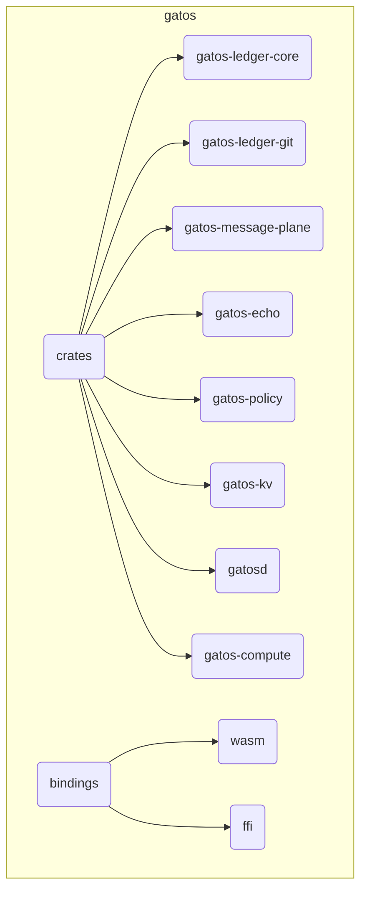

### Reuse & refactor recommendations

<a id="reuse--refactor-recommendations"></a>

<a id="reuse--refactor-recommendations"></a>

<a id="reuse-refactor-recommendations"></a>

<a id="reuse--refactor-recommendations"></a>

<a id="reuse--refactor-recommendations"></a><a id="reuse-refactor-recommendations"></a>

- Reuse **Echo** crates for fold determinism (`rmg-core` as the fold engine).
- Adopt **`git-kv`** “Stargate” concepts for optional `push-gate` profile.
- Integrate **Wesley** as a compiler target to emit schemas and fold specs.

---

## 2. Crate Architecture

<a id="2-crate-architecture"></a>

<a id="2-crate-architecture"></a>

<a id="2.-crate-architecture"></a>

<a id="2-crate-architecture"></a>

<a id="2"></a><a id="2-crate-architecture"></a>

<a id="2-crate-architecture"></a><a id="2.-crate-architecture"></a>
GATOS follows a "Ports and Adapters" architecture. The core logic is pure and portable (`no_std`), while I/O is handled by specific "adapters."

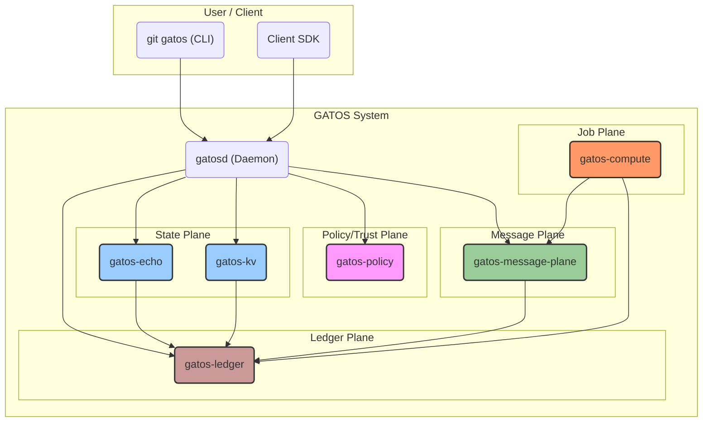

Note: “Policy/Trust Plane” includes the policy engine and trust artifacts (keys, groups, grants, revocations) governed alongside policies.

### Crate Summary

<a id="crate-summary"></a>

<a id="crate-summary"></a>

<a id="crate-summary"></a>

| Crate                 | Purpose                                                                                                   |
| :-------------------- | :-------------------------------------------------------------------------------------------------------- |
| `gatos-ledger-core`   | `no_std` core logic, data structures, and traits for the ledger.                                          |
| `gatos-ledger-git`    | `std`-dependent storage backend using `libgit2`.                                                          |
| `gatos-ledger`        | Composes ledger components via feature flags.                                                             |
| `gatos-message-plane`          | Asynchronous, commit-backed message bus (pub/sub).                                                        |
| `gatos-echo`          | Deterministic state engine for processing events ("folds").                                               |
| `gatos-policy`        | Deterministic policy engine for executing compiled rules and managing the Consensus Governance lifecycle. |
| `gatos-kv`            | Git-backed key-value state cache.                                                                         |
| `gatosd`              | Main binary for the CLI and the JSONL RPC daemon.                                                         |
| `gatos-compute`       | Worker that discovers and executes jobs from the Job Plane.                                               |
| `gatos-wasm-bindings` | WASM bindings for browser and Node.js environments.                                                       |
| `gatos-ffi-bindings`  | C-compatible FFI for integration with other languages.                                                    |

---

## 3. Fold Engine (Echo integration)

<a id="3-fold-engine-echo-integration"></a>

<a id="3-fold-engine-echo-integration"></a>

<a id="3.-fold-engine-echo-integration"></a>

<a id="3-fold-engine-echo-integration"></a>

<a id="3"></a><a id="3-fold-engine-echo-integration"></a>

<a id="3-fold-engine-echo-integration"></a><a id="3.-fold-engine-echo-integration"></a>
Note on policy rule naming

- Governance actions are referenced as `governance.<action>`; `action` tokens use dot-notation (e.g., `publish.artifact`). Policy evaluation resolves these against the governance policy map defined in `schemas/v1/policy/governance_policy.schema.json`.

The Fold Engine consumes canonicalized events to produce a canonical state tree.

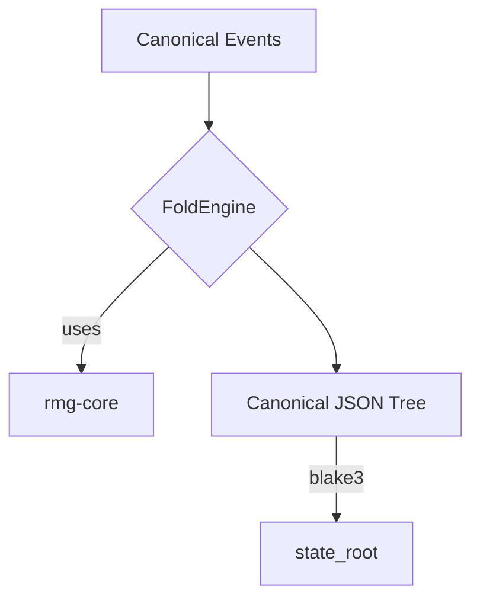

See also:

- Checkpoint trailers (normative) in SPEC: [State Checkpoint Trailers](/SPEC#53-state-checkpoint-trailers-normative)
- Walkthrough: [HELLO-OPS](./guide/HELLO-OPS.md#2-fold-to-state-and-inspect)

### EchoLua Compiler & VM

<a id="echolua-compiler--vm"></a>

<a id="echolua-compiler--vm"></a>

<a id="echolua-compiler-vm"></a>

<a id="echolua-compiler--vm"></a>

<a id="echolua-compiler--vm"></a><a id="echolua-compiler-vm"></a><a id="echolua"></a>
EchoLua provides deterministic folds and policy evaluation:

- Compiler: Lua source → normalized AST → Echo Lua IR (ELC); ELC serialized as DAG-CBOR; `fold_root = sha256(ELC_bytes)`.
- Runtime: Q32.32 fixed-point math; division rounds toward zero; canonical JSON emission; no OS/RNG/time; no coroutines/FFI; no transcendentals in v1 folds.
- Stdlib: `dpairs`, `dkeys`, `dsort`, `encode_canonical`, `decode_strict`.
- RNG: `rng(seed_bytes)` only; no ambient global state. Normative algorithm: `pcg32@1`. Canonical seed helper: `seed64 = trunc64(blake3(inputs_root || policy_root || fold_root))`.
- Linter: fail on `pairs`, `coroutine`, `__gc`, `__pairs`, `math.random`, `os.*`, `io.*`, `debug.*`, `package.*`.
- Fuel/step limits to guarantee termination.

Artifacts:

- Record `Fold-Root: sha256:<hex>` in state trailers ([SPEC §5.3](/SPEC#5.3)) and PoF ([SPEC §5.4](/SPEC#5.4)).
- Record `Fold-Engine: echo@<semver>+elc@<semver>+num=q32.32+rng=pcg32@<ver>`.

#### Engine IDs

<a id="engine-ids"></a>

<a id="engine-ids"></a>

<a id="engine-ids"></a>

Fold engine identity is a structured string used in trailers and proofs:

```
echo@<semver>+elc@<semver>+num=q32.32+rng=pcg32@<ver>
```

This binds runtime, IR version, numeric model, and RNG configuration for reproducible verification.

Testing:

- Golden vectors across linux/macos/windows/wasm; integer and fixed-point cases; poison tests for NaNs/signed zero/table iteration.

---

## 4. Index & Cache

<a id="4-index--cache"></a>

<a id="4-index--cache"></a>

<a id="4.-index-cache"></a>

<a id="4-index--cache"></a>

<a id="4"></a><a id="4-index--cache"></a>

<a id="4-index--cache"></a><a id="4.-index-cache"></a>
Rebuildable indexes are created by folding journal events into Roaring Bitmaps.

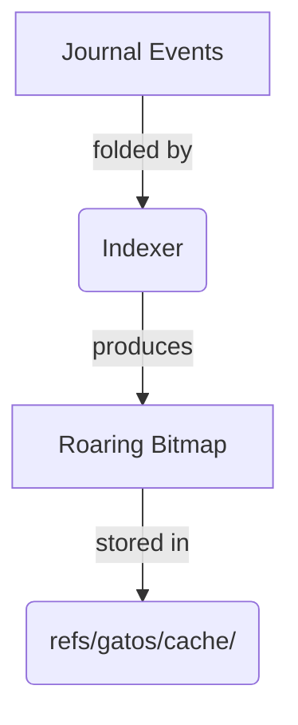

---

## 5. Epochs & Compaction

<a id="5-epochs--compaction"></a>

<a id="5-epochs--compaction"></a>

<a id="5.-epochs-compaction"></a>

<a id="5-epochs--compaction"></a>

<a id="5"></a><a id="5-epochs--compaction"></a>

<a id="5-epochs--compaction"></a><a id="5.-epochs-compaction"></a>
Epochs manage history size by creating periodic anchors and enabling garbage collection.

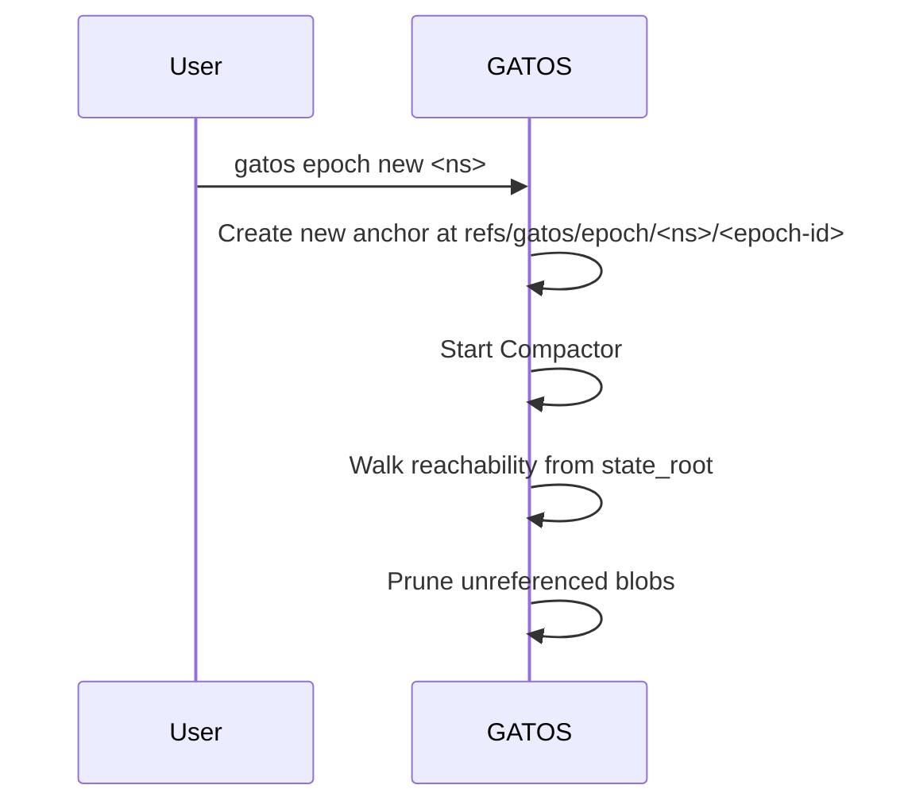

---

## 6. Opaque Pointers

<a id="6-opaque-pointers"></a>

<a id="6-opaque-pointers"></a>

<a id="6.-opaque-pointers"></a>

<a id="6-opaque-pointers"></a>

<a id="6"></a><a id="6-opaque-pointers"></a>

<a id="6-opaque-pointers"></a><a id="6.-opaque-pointers"></a>
The `rekey` command allows updating the encryption key for an opaque blob.

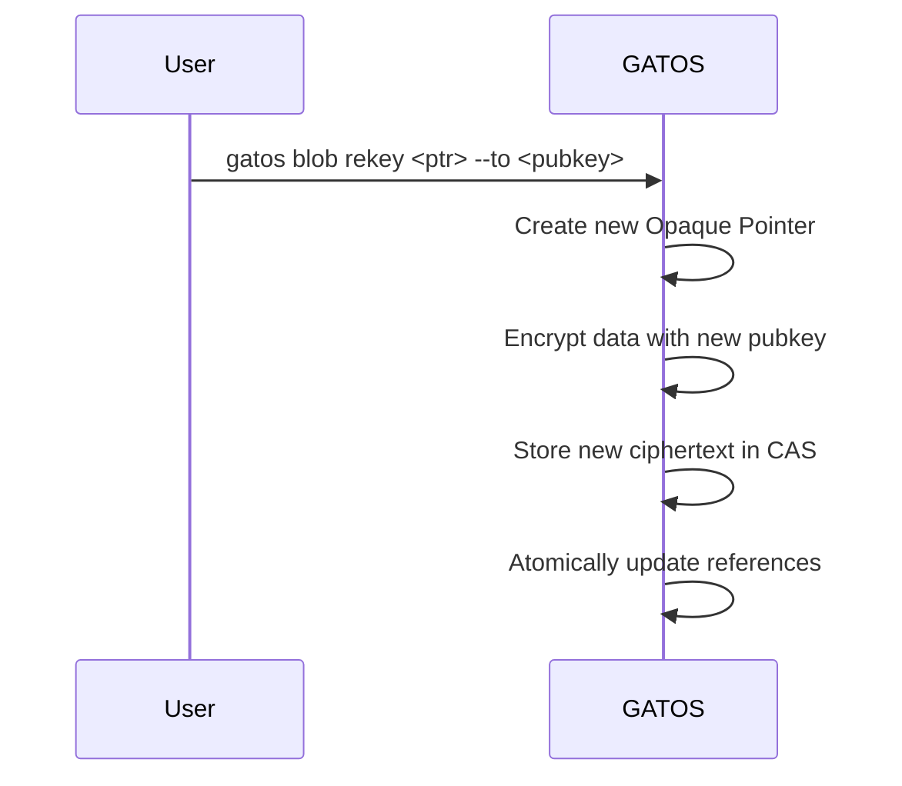

Resolver authentication (normative default): Bearer JWT. Required claims: `sub`, `aud`, `exp`; optional `scope`. Decisions and fetches SHOULD be logged under `refs/gatos/audit/`.

---

## 7. JSONL Protocol

<a id="7-jsonl-protocol"></a>

<a id="7-jsonl-protocol"></a>

<a id="7.-jsonl-protocol"></a>

<a id="7-jsonl-protocol"></a>

<a id="7"></a><a id="7-jsonl-protocol"></a>

<a id="7-jsonl-protocol"></a><a id="7.-jsonl-protocol"></a>
Communication with `gatosd` occurs over a JSONL RPC protocol. Long-running operations MUST quickly return an `{ "ack": true }` and stream progress lines keyed by id.

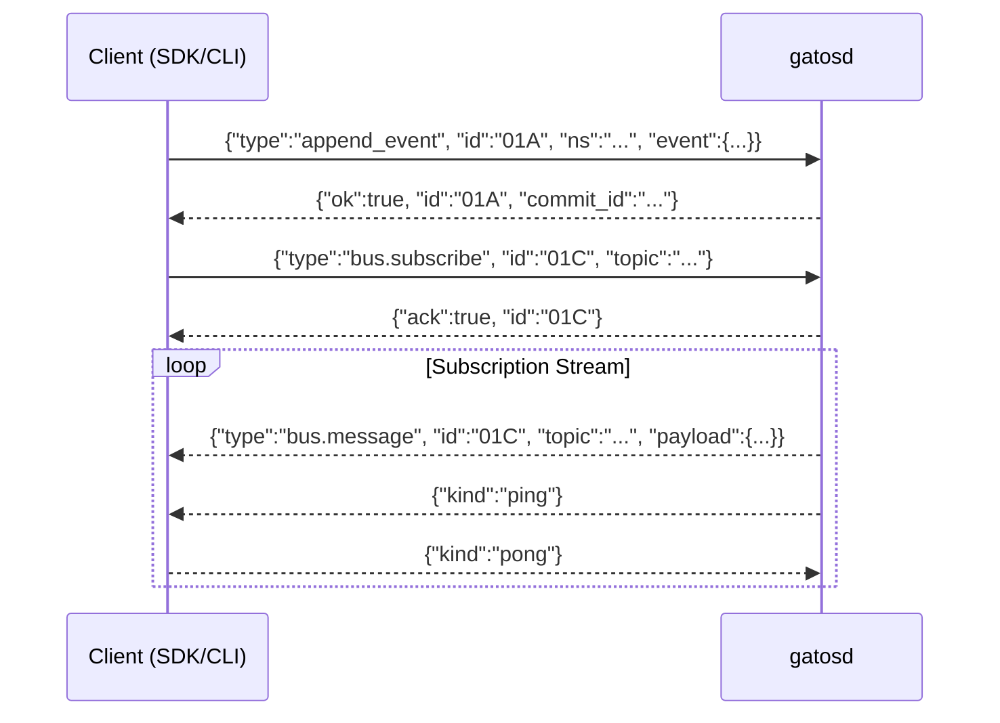

Error frames are normalized:

```json
{ "ok": false, "id": "01C", "code": "ERR_INVALID_NS", "reason": "namespace not found" }
```

Walkthroughs

- Append → Fold → Job result (PoE): [HELLO-OPS](./guide/HELLO-OPS.md)
- Opaque pointers and rekey: [HELLO-PRIVACY](./guide/HELLO-PRIVACY.md)

---

## 8. Observability

<a id="8-observability"></a>

<a id="8-observability"></a>

<a id="8.-observability"></a>

<a id="8-observability"></a>

<a id="8"></a><a id="8-observability"></a>

<a id="8-observability"></a><a id="8.-observability"></a>
`gatosd` exposes key performance metrics for monitoring.

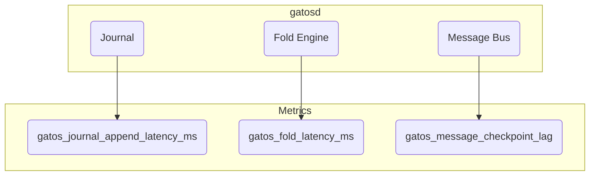

---

## 9. CI & Cross-Platform Determinism

<a id="9-ci--cross-platform-determinism"></a>

<a id="9-ci--cross-platform-determinism"></a>

<a id="9.-ci-cross-platform-determinism"></a>

<a id="9-ci--cross-platform-determinism"></a>

<a id="9"></a><a id="9-ci--cross-platform-determinism"></a>

<a id="9-ci--cross-platform-determinism"></a><a id="9.-ci-cross-platform-determinism"></a><a id="9.-ci-crossplatform-determinism"></a>
A CI matrix ensures determinism across platforms and runs specialized test suites.

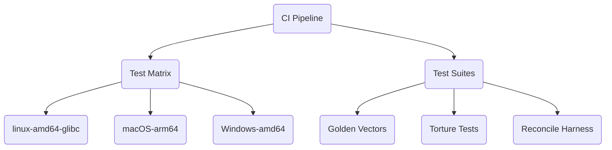

---

## 10. Security

<a id="10-security"></a>

<a id="10-security"></a>

<a id="10.-security"></a>

<a id="10-security"></a>

<a id="10"></a><a id="10-security"></a>

<a id="10-security"></a><a id="10.-security"></a>
Signature verification is a critical step in event processing.

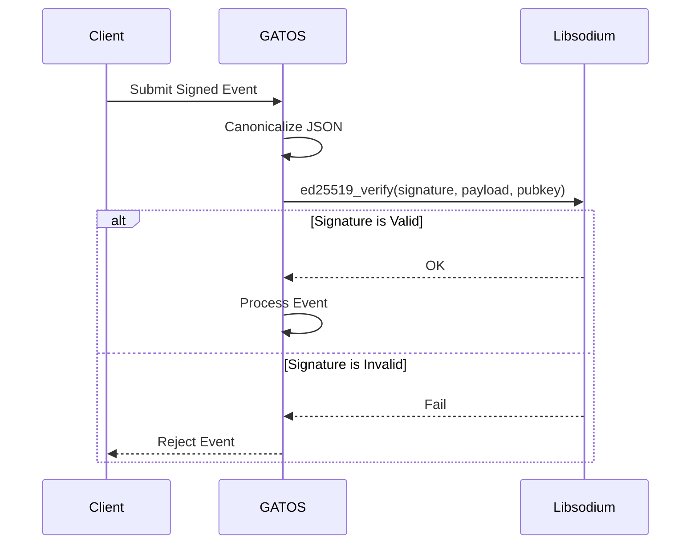

Examples

```json
{"type":"append_event","id":"01A","ns":"finance","event":{}}
{"type":"bus.subscribe","id":"01C","topic":"gatos.jobs.pending"}
{"type":"fold_state","id":"01D","ns":"finance","channel":"table","spec":"folds/invoices.yaml"}
{"type":"governance.proposal.new","id":"02A","action":"publish.artifact","target":"gatos://assets/model.bin","quorum":"2-of-3@leads"}
{"type":"governance.approval.add","id":"02B","proposal":"<proposal-id-hash>"}
{"type":"governance.grant.verify","id":"02C","grant":"<grant-id-hash>"}
```

---

## 11.  Performance Guidance

<a id="11--performance-guidance"></a>

<a id="11--performance-guidance"></a>

<a id="11.-performance-guidance"></a>

<a id="11--performance-guidance"></a>

<a id="11"></a><a id="11--performance-guidance"></a>

<a id="11--performance-guidance"></a><a id="11.-performance-guidance"></a>
Tuning batch size is a trade-off between latency and commit churn.

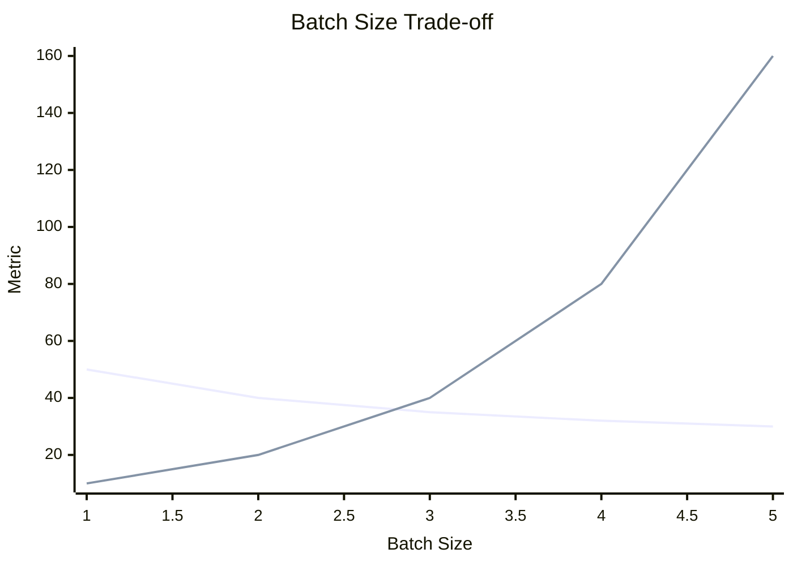

---

## 12. Client SDKs

<a id="12-client-sdks"></a>

<a id="12-client-sdks"></a>

<a id="12.-client-sdks"></a>

<a id="12-client-sdks"></a>

<a id="12"></a><a id="12-client-sdks"></a>

<a id="12-client-sdks"></a><a id="12.-client-sdks"></a>
SDKs provide language-native access to the `gatosd` JSONL RPC endpoint.

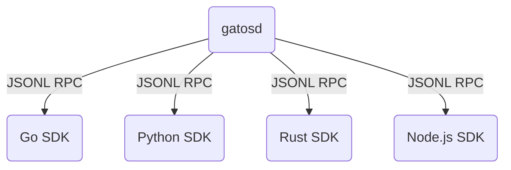

---

## 13. Migration Strategies

<a id="13-migration-strategies"></a>

<a id="13-migration-strategies"></a>

<a id="13.-migration-strategies"></a>

<a id="13-migration-strategies"></a>

<a id="13"></a><a id="13-migration-strategies"></a>

<a id="13-migration-strategies"></a><a id="13.-migration-strategies"></a>
A phased migration ensures a safe transition to GATOS.

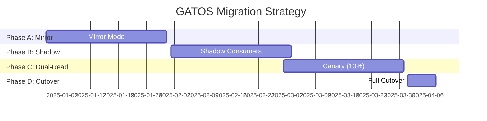

---

## 14. Wire-Format Invariants

<a id="14-wire-format-invariants"></a>

<a id="14-wire-format-invariants"></a>

<a id="14.-wire-format-invariants"></a>

<a id="14-wire-format-invariants"></a>

<a id="14"></a><a id="14-wire-format-invariants"></a>

<a id="14-wire-format-invariants"></a><a id="14.-wire-format-invariants"></a>
To ensure hash stability, GATOS uses canonical encodings:

- Events/proofs: DAG-CBOR (CIDv1 with BLAKE3 bytes).
- JSON artifacts (pointers, manifests): RFC 8785 JCS (UTF-8 NFC; sorted keys; fixed numeric formatting).
- Fold engine identity: `Fold-Engine: echo@<semver>+elc@<semver>+num=q32.32+rng=pcg32@<ver>`.
- Explorer-Root (derived exports): `Explorer-Root = blake3(serialized_bytes)` where `serialized_bytes` is the canonical BE32-prefixed concatenation of `ledger_head`, `policy_root`, `fold_root`, and `extractor_version` as defined in [SPEC §15.1](/SPEC#151-exports-and-explorer-root-normative). For raw ledger exports, omit `fold_root` (both the field and its length prefix) entirely from this concatenation.

---

## 15. Compute Engine (Job Runner)

<a id="15-compute-engine-job-runner"></a>

<a id="15-compute-engine-job-runner"></a>

<a id="15.-compute-engine-job-runner"></a>

<a id="15-compute-engine-job-runner"></a>

<a id="15"></a><a id="15-compute-engine-job-runner"></a>

<a id="15-compute-engine-job-runner"></a><a id="15.-compute-engine-job-runner"></a>
See also: [ADR-0002](./decisions/ADR-0002/DECISION.md).

The `gatos-compute` crate provides the GATOS worker process.

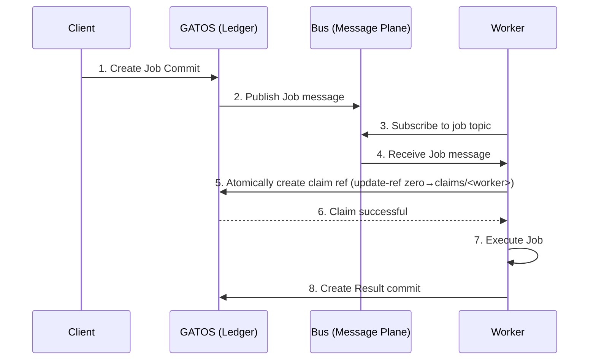

### Implementation Plan

<a id="implementation-plan"></a>

<a id="implementation-plan"></a>

<a id="implementation-plan"></a>

1. **Subscription:** The worker will use `gatos-message-plane` to subscribe to job topics.
2. **Claiming:** The worker will use `gatos-ledger` to atomically claim a job via compare-and-swap on `refs/gatos/jobs/<job-id>/claims/<worker-id>`. Policy rejects duplicate claims or unauthorized workers.
3. **Execution:** The worker will execute the job's `command` in a sandboxed environment.
4. **Result & Proof:** The worker will create a `Result` commit containing output artifacts and a `Proof-Of-Execution`.
5. **Lifecycle Management:** The worker will handle timeouts, retries, and failures.

### CLI Surface (selected)

<a id="cli-surface-selected"></a>

<a id="cli-surface-selected"></a>

<a id="cli-surface-selected"></a>

- `git gatos foldc <src.lua> -o <out.elc>` — compile EchoLua → ELC; prints fold\_root; records engine id.
- `git gatos policyc <src.rgs> -o <out.rgc>` — compile .rgs → rgc/ELC; prints policy\_code\_root.
- `git gatos export parquet|sqlite --state <ref> --out <dir>`; `git gatos export verify <dir>` — Explorer-Root verify.
- `git gatos pox create|verify` and `git gatos reproduce <id>` — Proof-of-Experiment workflow.
- `git gatos lint <paths>` — lints EchoLua sources for deterministic profile.

---

## 16. Governance Engine

<a id="16-governance-engine"></a>

<a id="16-governance-engine"></a>

<a id="16.-governance-engine"></a>

<a id="16-governance-engine"></a>

<a id="16"></a><a id="16-governance-engine"></a>

<a id="16-governance-engine"></a><a id="16.-governance-engine"></a>
See also: [ADR-0003](./decisions/ADR-0003/DECISION.md).

### Engine Responsibilities

<a id="engine-responsibilities"></a>

<a id="engine-responsibilities"></a>

<a id="engine-responsibilities"></a>

- Watchers: a service in `gatos-policy` watches `refs/gatos/proposals/**` and `refs/gatos/approvals/**`.
- Verification: for each new Approval, verify signature and eligibility using the trust graph.
- Quorum check: evaluate the policy rule (`governance.<action>`) to determine if quorum is satisfied.
- Grant creation: when quorum is met, create a Grant commit with a canonical Proof-Of-Consensus envelope and update `refs/gatos/grants/...`.
- Gate enforcement: the Policy Gate checks for a valid Grant before allowing any governed action.

### CLI Skeleton (This defines the normative CLI user interface; stub behavior acceptable initially)

<a id="cli-skeleton-this-defines-the-normative-cli-user-interface-stub-behavior-acceptable-initially"></a>

<a id="cli-skeleton-this-defines-the-normative-cli-user-interface-stub-behavior-acceptable-initially"></a>

<a id="cli-skeleton-this-defines-the-normative-cli-user-interface-stub-behavior-acceptable-initially"></a>

- `gatos proposal new --action <id> --target <uri> --quorum <expr> [--ttl <dur>]`
- `gatos approve --proposal <blake3:…> [--expires-at <ts>]`
- `gatos grant verify --grant <blake3:…>`

### Group Resolution

<a id="group-resolution"></a>

<a id="group-resolution"></a>

<a id="group-resolution"></a>

Governance evaluator MUST resolve groups declared in policy (e.g., `group: leads`) against `gatos/trust/graph.json`.

### Revocation Propagation

<a id="revocation-propagation"></a>

<a id="revocation-propagation"></a>

<a id="revocation-propagation"></a>

Revocations MUST be surfaced to dependent systems (e.g., Job Plane). Implementations SHOULD emit `gatos.policy.grant.revoked` and deny actions gated by revoked grants.

### End-to-End Flow

<a id="end-to-end-flow"></a>

<a id="end-to-end-flow"></a>

<a id="end-to-end-flow"></a>

<a id="end-to-end-flow"></a><a id="endtoend-flow"></a>

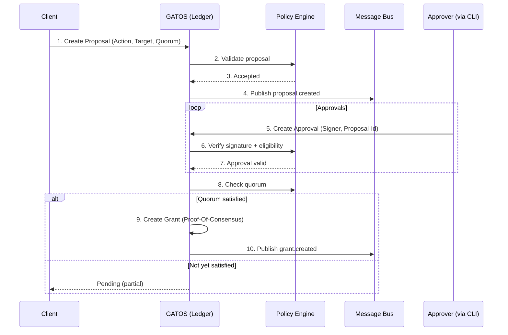

## 17. Local Enforcement (Watcher + Hooks)

<a id="tech-watcher"></a>

### 8.1 Watcher Daemon (`gatos watch`)

- Process model: long-running daemon started via `gatos watch` or Auto-Start. Watches the workspace root and `.git/refs/gatos/**`.
- Platform integrations:
  - macOS: FSEvents + `chflags uchg` for hardened locks.
  - Linux: inotify + `chattr +i` optional; default `chmod -w`.
  - Windows: ReadDirectoryChangesW + Win32 file attributes.
- State machine:
  1. Load `.gatos/policy.yaml` (`locks[]`, `watcher.tasks[]`).
  2. Compute lock table keyed by canonical path glob + rule id.
  3. For each locked path, determine Grant status by reading `refs/gatos/grants/**` (compare `Proposal-Id` + `rule`).
  4. Apply/clear read-only bit accordingly and persist snapshot to `~/.config/gatos/watch/state.json`.
  5. Emit JSONL events (schema: `schemas/v1/watch/events.schema.json`). Events are appended to `~/.config/gatos/watch/events.log` and optionally forwarded to notification centers.
- Automation hooks (`watcher.tasks[]`): when a save/fold event hits a matching glob, the watcher either runs a local command (`run`) or enqueues a Job Plane manifest (`run_job`). Concurrency cap defaults to 2 with per-task `timeout_s` config.

### 8.2 Managed Hooks & CLI

- `gatos install-hooks`
  - Detects OS/shell, writes shim scripts into `.git/hooks/`, and records metadata under `.git/gatos/hooks.json`.
  - Hooks call back into `gatos hook run <name>` so logic lives in Rust.
- Hook behavior:
  - `pre-commit`: ask watcher cache for lock status; reject staged diffs touching locked files without Grants.
  - `pre-push`: recompute outbound refs, ensure Grants exist, verify PoF/PoE trailers per profile. Records success/failure under `refs/gatos/audit/policy/locks/<ulid>`.
  - `post-merge`/`post-checkout`: reapply masks and trigger watcher rescan.
- CLI additions:
  - `gatos lock acquire <paths...> [--wait/--no-wait] [--reason <text>]` — builds proposals (via governance API), polls Grants, prints table of results.
  - `gatos lock release <paths...>` — revokes or supersedes grants.
  - `gatos watch events --tail` — streams watcher JSONL output for debugging.
- Env overrides: `GATOS_NO_HOOKS=1` and `GATOS_NO_WATCH=1` are honored but print warnings and emit audit entries.

### 8.3 Data Structures

- `schemas/v1/policy/locks.schema.json`
  - `locks[]`: `{ match: string, rule: string, read_only?: bool }`
  - `watcher`: `{ poll_fallback_ms?: integer, tasks?: [] }`
  - `watcher.tasks[]`: `{ when: "on_save"|"on_fold", match: string, run?: string[], run_job?: string, timeout_s?: integer }`
- `schemas/v1/watch/events.schema.json`
  - Base fields: `ts`, `actor`, `path`, `rule`, `action`, `grant_id?`, `proposal_id?`, `remediation?`.
  - `action` enum includes `deny.write`, `lock.applied`, `lock.released`, `task.started`, `task.succeeded`, `task.failed`.
- Hooks log structure: `refs/gatos/audit/locks/<ulid>` commit tree contains `event.json` (canonical JSON) plus log attachments (stdout/ stderr) when tasks fire.

### 8.4 Open Work

- Privilege boundaries: future ADR will define optional elevated helper for immutable flags on corporate-managed machines.
- Sandboxed automation: evaluate WASM job runners to avoid arbitrary shell execution for `watcher.tasks[].run`.
- UX: integrate with `gatos ui` for desktop notifications and lock browser.
#### Message Plane RPC: `messages.read`

The daemon exposes `messages.read` over the JSONL RPC channel so workers and bridges can page through commit-backed topics without parsing Git directly.

- **Input envelope**
  - `method`: `messages.read`
  - `params`:
    - `topic` (string, required) — logical topic name (e.g., `governance`).
    - `since_ulid` (string, optional) — resume cursor; server starts from oldest when omitted or unknown.
    - `limit` (integer, default 128) — max messages to return (1–512 enforced).
- **Output envelope**
  - `messages`: ordered list (oldest→newest). Each entry contains `ulid`, `commit`, `content_id`, `envelope_path` (always `message/envelope.json` unless overridden), and `canonical_json` (base64 of the canonical envelope bytes).
  - `next_since`: ULID to use for the next page (empty array when fewer than `limit` rows remain).
  - `checkpoint_hint` (optional): `{ "group": <string>, "topic": <string> }` so automated consumers can persist progress without issuing a second RPC.
  - Implemented CLI: `gatosd messages-read --topic <t> [--since <ulid>] [--limit N] [--checkpoint-group <g>] --repo <path>`.
- **Errors**
  - `topic_not_found` (404) — topic ref missing.
  - `invalid_ulid` (400) — malformed resume cursor.
  - `limit_out_of_range` (409) — `limit < 1`.

`gatos-message-plane` is responsible for translating RPC calls to actual Git ref walks and enforcing ULID monotonicity per ADR-0005.

**Pruning & TTL (implemented scaffold)**

- Default retention: 30 days (profile-dependent). Segments older than `now - retention` MAY be pruned **only if** every consumer checkpoint for the topic is ahead of the segment's newest ULID.
- CLI helper: `gatosd messages-prune --topic <t> --repo <path> [--retention-days 30]` deletes eligible `refs/gatos/messages/<topic>/<segment>` refs; skips segments when checkpoints lag.
- Pruning MUST log deleted segment prefixes and SHOULD emit audit summaries when configured (see ADR-0005 observability addendum).

**Ledger-core alignment (design sketch)**

- The `GitMessagePublisher` logic decomposes cleanly into the `gatos-ledger-core` traits: use `ObjectStore::put_object` for blobs, construct `CommitCore { parent, tree, message, timestamp }`, and rely on the backend to append via CAS (`compare-and-swap` on topic head ref). This lets a future `LedgerMessagePublisher<T: LedgerBackend>` reuse rotation/meta logic without direct `git2` calls, with the git backend supplying append/read primitives that expose CAS semantics and tree building.

---

## 18. Sessions & PoX Tooling

### Sessions (ADR-0015)

- **RPC surface**
  - `session.start { base_ref?, actor? }` → daemon validates actor key, resolves base ref (default `refs/heads/main`), generates ULID, creates `refs/gatos/sessions/<actor>/<ulid>` pointing to base, and writes metadata JSON.
  - `session.checkpoint { session_id }` → daemon shells out to Git to create a commit with required trailers.
  - `session.undo/fork/publish` map 1:1 to CLI subcommands; publish calls the Policy API using the aggregated diff.
- **Storage**
  - Metadata file `.gatos/session/<ulid>.json` structure:
    ```json
    {
      "session_id": "01H...",
      "actor": "ed25519:...",
      "base_ref": "refs/heads/main",
      "policy_root": "<commit>",
      "fold_root": "sha256:<hex>",
      "created_at": "2025-11-18T18:00:00Z"
    }
    ```
  - Session-local folds live in `refs/gatos/sessions/<actor>/<ulid>/state/<ns>/<channel>` so Echo can diff shapes.
- **GC job**
  - `gatos gc sessions` scans metadata, deletes sessions idle >30 days after logging to `refs/gatos/audit/sessions/<ulid>/expired`.

### Proof-of-Experiment (ADR-0016)

- **Schema**: `schemas/v1/proofs/pox_envelope.schema.json` (RFC 8785). CLI ensures `program_id` accepts `wasm:`, `oci:`, or `exec:` prefixes.
- **Workflow**
  1. `pox create` collects pointer manifests (`inputs_root`), Explorer outputs, PoE/PoF links.
  2. `pox sign` signs BLAKE3 digest with ed25519; supports hardware keys via `gatos key use`.
  3. `pox publish` writes commit to `refs/gatos/audit/proofs/experiments/<ulid>`.
  4. `pox verify` checks signatures + linked proofs; if missing, returns structured errors.
  5. `reproduce` drives workers + folds; writes audit logs under `refs/gatos/audit/pox/<ulid>/repro/<run-ulid>`.
- **GitHub App**: exposes `gatos/pox` status check by calling `pox.status` RPC, ensuring experiments touching governed namespaces reference an existing PoX ULID.
