# GATOS — TECH-SPEC v0.3

## Implementation Plan, Data Structures, and Algorithms

> *This is how we GATOS.*

---

## 1. Codebase Layout (Rust Workspace)

The GATOS workspace is organized into `crates` for core components and `bindings` for FFI.

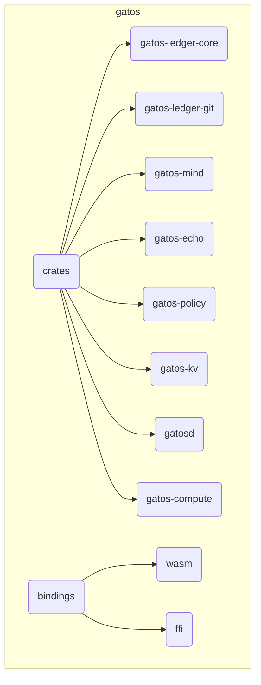

### Reuse & refactor recommendations

- Reuse **Echo** crates for fold determinism (`rmg-core` as the fold engine).
- Adopt **`git-kv`** “Stargate” concepts for optional `push-gate` profile.
- Integrate **Wesley** as a compiler target to emit schemas and fold specs.

---

## 2. Crate Architecture

GATOS follows a "Ports and Adapters" architecture. The core logic is pure and portable (`no_std`), while I/O is handled by specific "adapters."

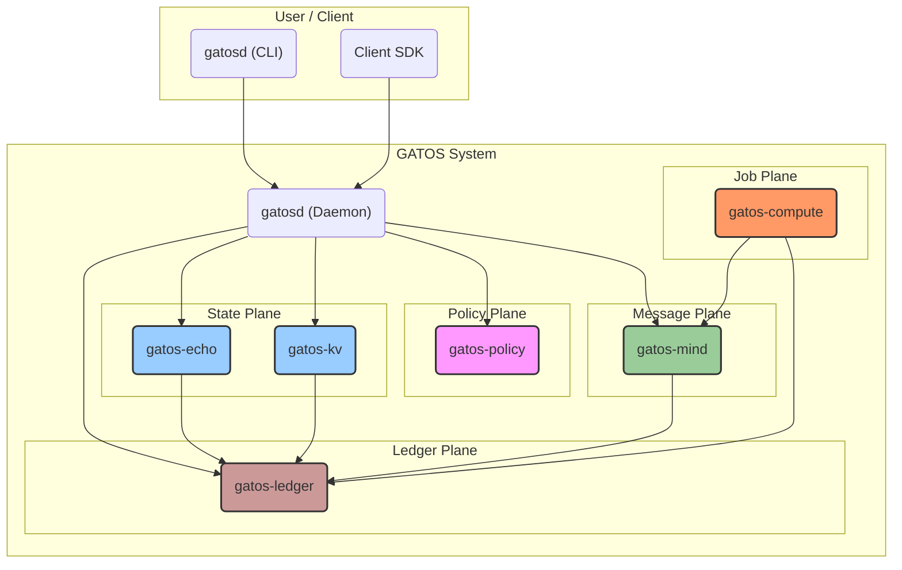

### Crate Summary

| Crate | Purpose |
|:---|:---|
| `gatos-ledger-core` | `no_std` core logic, data structures, and traits for the ledger. |
| `gatos-ledger-git` | `std`-dependent storage backend using `libgit2`. |
| `gatos-ledger` | Composes ledger components via feature flags. |
| `gatos-mind` | Asynchronous, commit-backed message bus (pub/sub). |
| `gatos-echo` | Deterministic state engine for processing events ("folds"). Privacy projection logic. |
| `gatos-policy` | Deterministic policy engine for executing compiled rules, managing Consensus Governance, and privacy rule evaluation. |
| `gatos-kv` | Git-backed key-value state cache. |
| `gatosd` | Main binary for the CLI, JSONL RPC daemon, and Opaque Pointer resolution endpoint. |
| `gatos-compute` | Worker that discovers and executes jobs from the Job Plane. |
| `gatos-wasm-bindings`| WASM bindings for browser and Node.js environments. |
| `gatos-ffi-bindings` | C-compatible FFI for integration with other languages. |

---

## 3. Fold Engine (Echo integration)

Note on policy rule naming

- Governance actions are referenced as `governance.<action>`; `action` tokens use dot‑notation (e.g., `publish.artifact`). Policy evaluation resolves these against the governance policy map defined in `schemas/v1/policy/governance_policy.schema.json`.

The Fold Engine consumes canonicalized events to produce a canonical state tree.

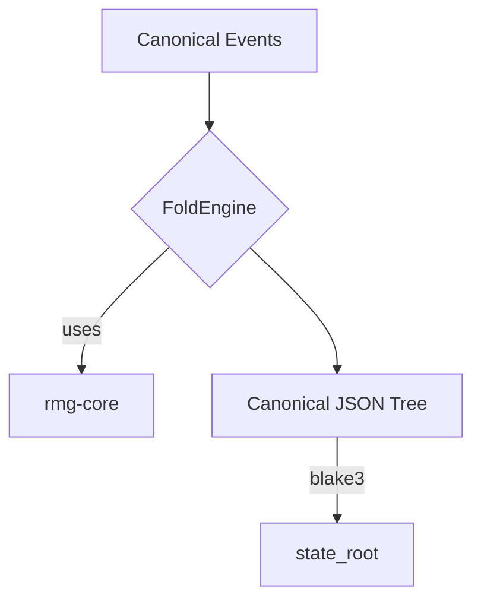

---

## 4. Index & Cache

Rebuildable indexes are created by folding journal events into Roaring Bitmaps.

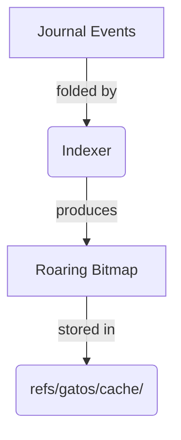

---

## 5. Epochs & Compaction

Epochs manage history size by creating periodic anchors and enabling garbage collection.

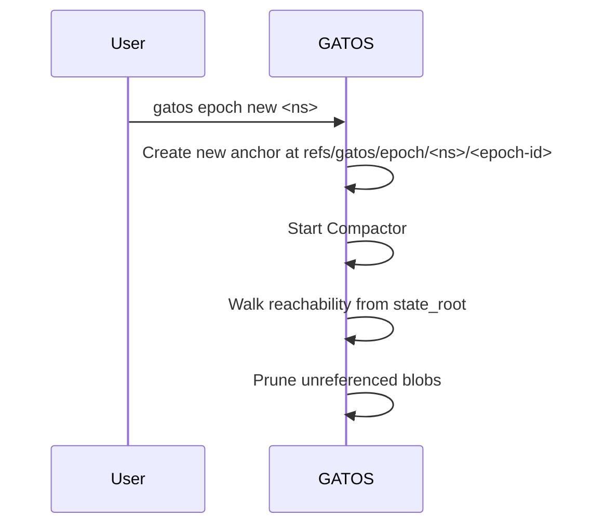

---

## 6. Privacy Projection and Resolution

See also: [ADR‑0004](./decisions/ADR-0004/DECISION.md).

The implementation of the hybrid privacy model involves a coordinated effort between the state, policy, and daemon components.

### 6.1 Projection Implementation

The projection from a `UnifiedState` to a `PublicState` is handled by `gatos-echo` with rules supplied by `gatos-policy`.

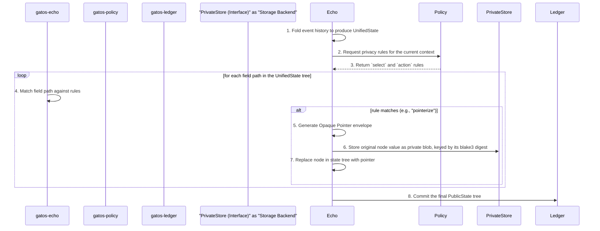

The `PrivateStore` is a pluggable trait, allowing for backends like a local filesystem, S3, or another GATOS node.

### 6.2 Resolution Implementation

The `gatosd` daemon exposes a secure endpoint for resolving Opaque Pointers.

-   **Endpoint**: `gatosd` will listen for authenticated requests, for example at `/gatos/private/blobs/{digest}`.
-   **Authentication**: The client SDK **MUST** send a `Authorization` header containing a JSON Web Signature (JWS) with a detached payload. The JWS payload **MUST** be the BLAKE3 hash of the request body. `gatosd` verifies the signature against the actor's public key.
-   **Authorization**: Upon receiving a valid request, `gatosd` queries `gatos-policy` to determine if the requesting actor has the capability to access the blob identified by `{digest}`.
-   **Response**: If authorized, `gatosd` fetches the (likely encrypted) blob from its configured `PrivateStore` and returns it to the client. The client is then responsible for decryption via the `capability` URI.

---

## 7. JSONL Protocol

Communication with `gatosd` occurs over a JSONL RPC protocol. Long‑running operations MUST quickly return an `{ "ack": true }` and stream progress lines keyed by id.

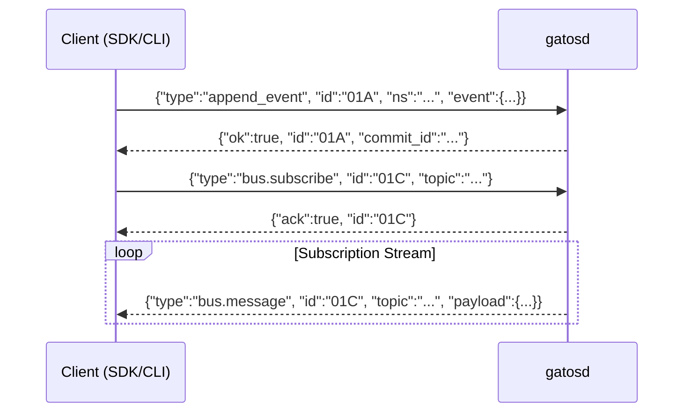

---

## 8. Observability

`gatosd` exposes key performance metrics for monitoring.

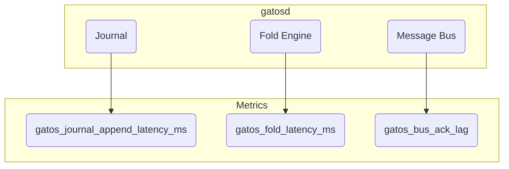

---

## 9. CI & Cross‑Platform Determinism

A CI matrix ensures determinism across platforms and runs specialized test suites.

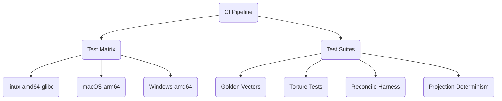

- **Projection Determinism**: Verifies that applying the same privacy policy to the same `UnifiedState` on different platforms (Linux, macOS, Windows) produces a byte-for-byte identical `PublicState` and the same set of private blobs.

---

## 10. Security

Signature verification is a critical step in event processing.

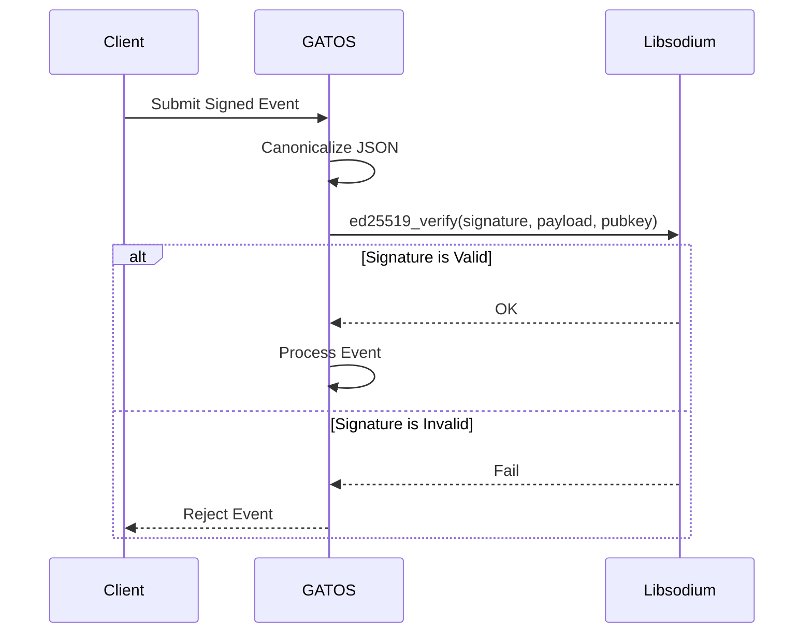

Examples

```json
{"type":"append_event","id":"01A","ns":"finance","event":{}}
{"type":"bus.subscribe","id":"01C","topic":"gatos.jobs.pending"}
{"type":"fold_state","id":"01D","ns":"finance","channel":"table","spec":"folds/invoices.yaml"}
{"type":"governance.proposal.new","id":"02A","action":"publish.artifact","target":"gatos://assets/model.bin","quorum":"2-of-3@leads"}
{"type":"governance.approval.add","id":"02B","proposal":"<proposal-id-hash>"}
{"type":"governance.grant.verify","id":"02C","grant":"<grant-id-hash>"}
```

---

## 11.  Performance Guidance

Tuning batch size is a trade-off between latency and commit churn.

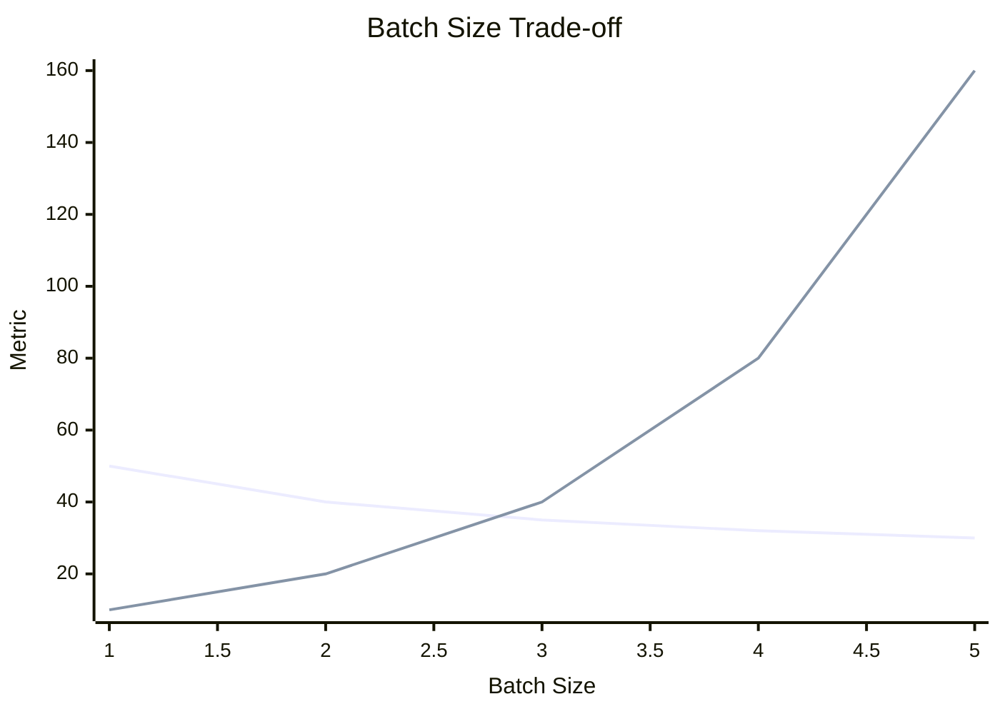

---

## 12. Client SDKs

SDKs provide language-native access to the `gatosd` JSONL RPC endpoint.

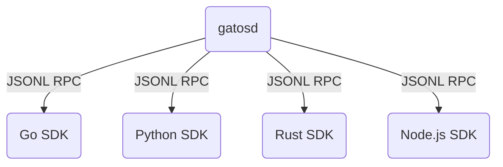

---

## 13. Migration Strategies

A phased migration ensures a safe transition to GATOS.

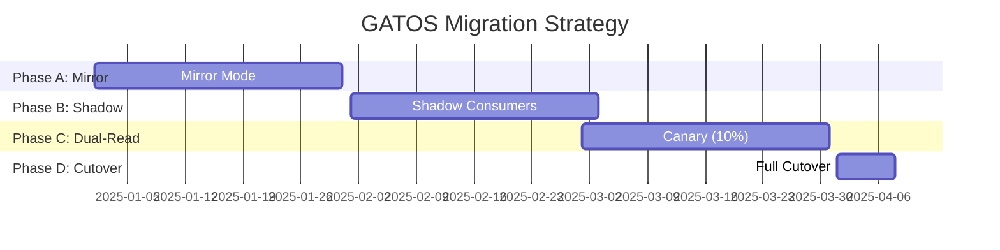

---

## 14. Wire-Format Invariants

To ensure hash stability, GATOS uses a standard canonical encoding format.

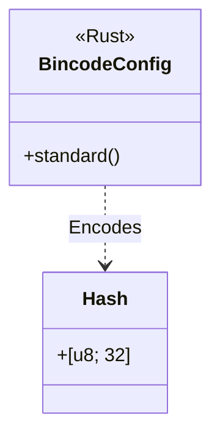

---

## 15. Compute Engine (Job Runner)

See also: [ADR‑0002](./decisions/ADR-0002/DECISION.md).

The `gatos-compute` crate provides the GATOS worker process.

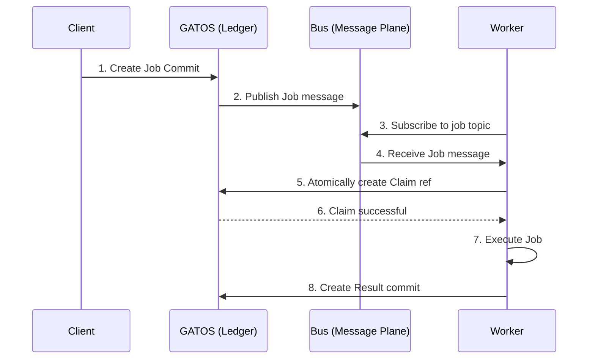

### Implementation Plan

1. **Subscription:** The worker will use `gatos-mind` to subscribe to job topics.
2. **Claiming:** The worker will use `gatos-ledger` to atomically claim a job via compare-and-swap on a Git ref.
3. **Execution:** The worker will execute the job's `command` in a sandboxed environment.
4. **Result & Proof:** The worker will create a `Result` commit containing output artifacts and a `Proof-Of-Execution`.
5. **Lifecycle Management:** The worker will handle timeouts, retries, and failures.

---

## 16. Governance Engine

See also: [ADR‑0003](./decisions/ADR-0003/DECISION.md).

### Engine Responsibilities

- Watchers: a service in `gatos-policy` watches `refs/gatos/proposals/**` and `refs/gatos/approvals/**`.
- Verification: for each new Approval, verify signature and eligibility using the trust graph.
- Quorum check: evaluate the policy rule (`governance.<action>`) to determine if quorum is satisfied.
- Grant creation: when quorum is met, create a Grant commit with a canonical Proof‑Of‑Consensus envelope and update `refs/gatos/grants/...`.
- Gate enforcement: the Policy Gate checks for a valid Grant before allowing any governed action.

### CLI Skeleton (This defines the normative CLI user interface; stub behavior acceptable initially)

- `gatos proposal new --action <id> --target <uri> --quorum <expr> [--ttl <dur>]`
- `gatos approve --proposal <blake3:…> [--expires-at <ts>]`
- `gatos grant verify --grant <blake3:…>`

### Group Resolution

Governance evaluator MUST resolve groups declared in policy (e.g., `group: leads`) against `gatos/trust/graph.json`.

### Revocation Propagation

Revocations MUST be surfaced to dependent systems (e.g., Job Plane). Implementations SHOULD emit `gatos.policy.grant.revoked` and deny actions gated by revoked grants.

### End‑to‑End Flow

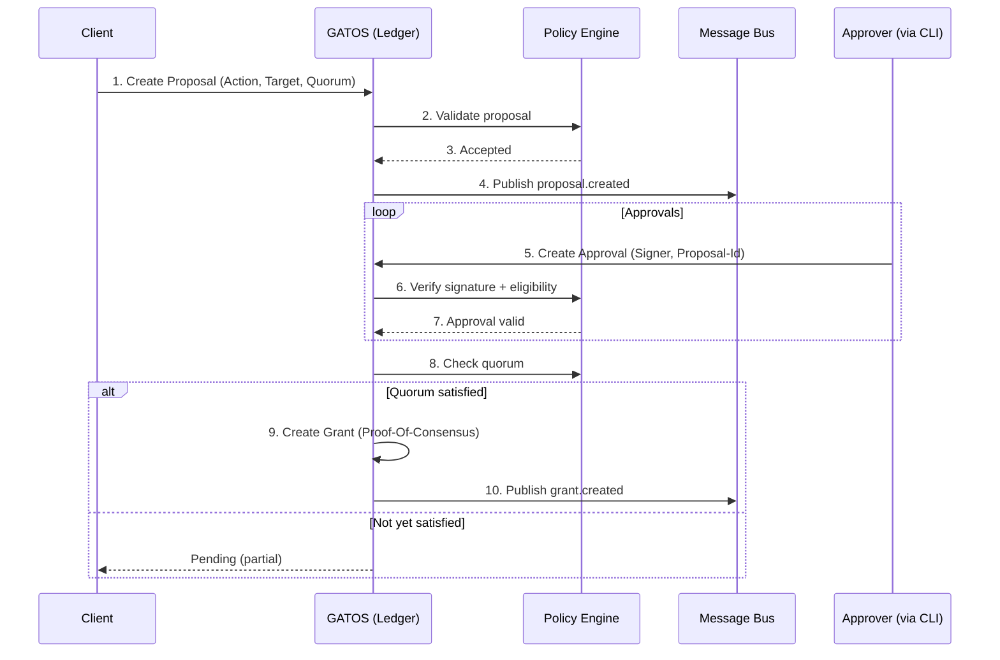
