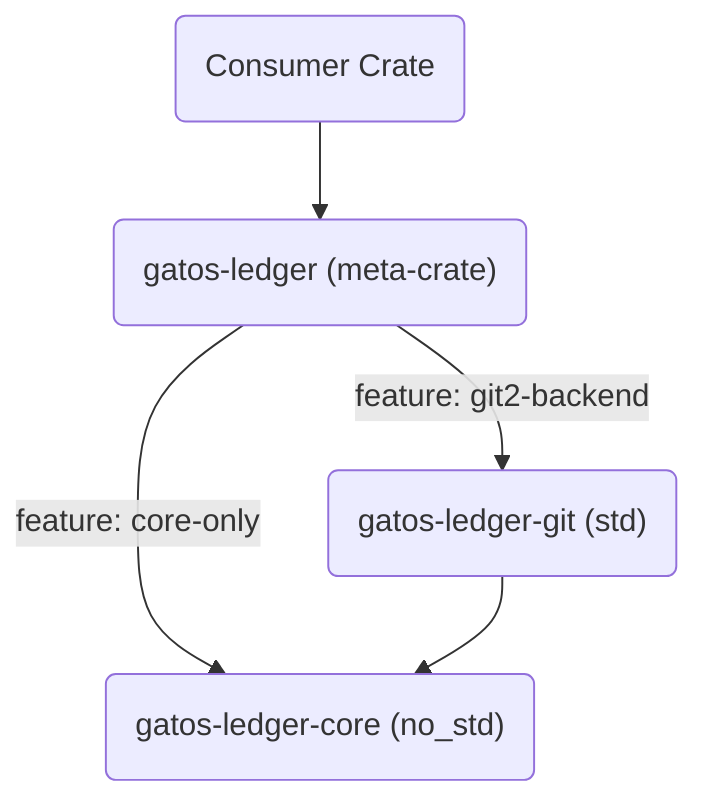
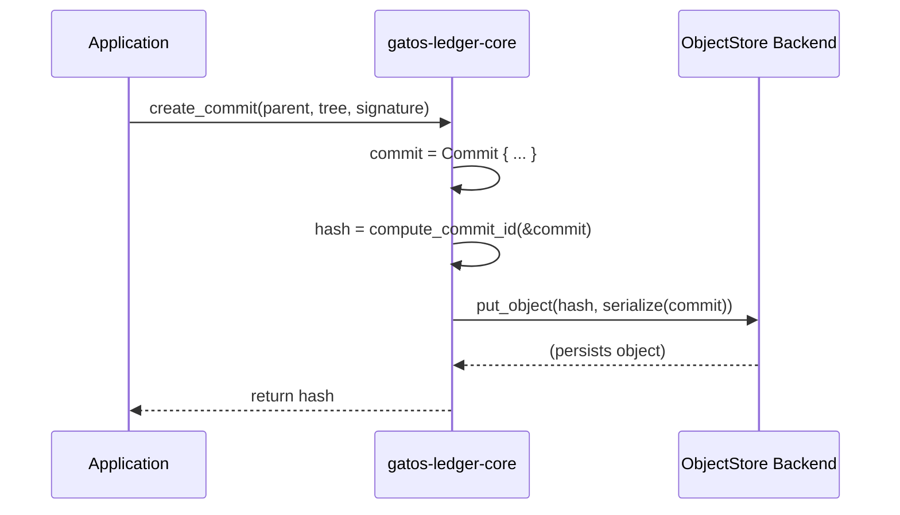
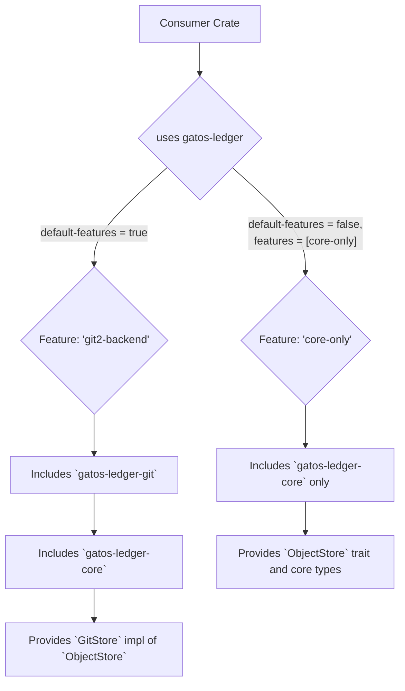

# ADR-0001: Split gatos-ledger into `no_std` Core and `std` Backends

<!-- AUTOGENERATED TOC START -->

- [Decision](#decision)
- [Motivation](#motivation)
- [Rationale](#rationale)
- [Consequences](#consequences)
  - [Usage Example](#usage-example)
- [Opinions](#opinions)

<!-- AUTOGENERATED TOC END -->

<a id="adr-0001-split-gatos-ledger-into-nostd-core-and-std-backends"></a>

## Decision

<a id="decision"></a>

The `gatos-ledger` crate will be split into a `no_std`-compatible `gatos-ledger-core` and one or more `std`-dependent storage backends (e.g., `gatos-ledger-git`).

A meta-crate, `gatos-ledger`, will use feature flags to provide the appropriate implementation.

Additionally, the canonical commit identifier (content id) SHALL be derived from the
canonical serialization of the unsigned `CommitCore` and SHALL remain stable regardless
of any signatures added later. Signatures are stored separately (or alongside as
metadata) and reference this content id; they do not affect it.

## Motivation

<a id="motivation"></a>

The project requires `no_std` compatibility where practical, to allow the core logic to run in constrained environments like microcontrollers or WASM sandboxes.

The original `gatos-ledger` crate's dependency on `git2` (which requires `std`) was in direct conflict with this goal.

## Rationale

<a id="rationale"></a>

This "`no_std` at the core, `std` at the edges" architecture resolves the conflict by decoupling the pure, portable ledger semantics (commit graph, hashing, proofs) from the I/O-heavy storage layer. This structure is illustrated below:



The `gatos-ledger-core` crate contains only the portable logic, while backends like `gatos-ledger-git` implement a common `ObjectStore` trait for specific environments.

```rust
pub trait ObjectStore {
    fn put_object(&mut self, id: &Hash, data: &[u8]) -> Result<(), StoreError>;
    fn get_object(&self, id: &Hash) -> Result<Option<Vec<u8>>, StoreError>;
}
```

This separation of concerns is demonstrated in the data flow for creating and persisting a commit:



This approach provides maximum portability and a lower attack surface for the core logic, without sacrificing the ability to use standard Git tooling on host systems.

## Consequences

<a id="consequences"></a>

- Core logic must remain `no_std` and avoid heap allocation unless gated by `alloc`.
- The `gatos-ledger` meta-crate becomes the public-facing entry point, simplifying dependency management. Consumers select their desired backend via feature flags.
- CI matrix must test both `core-only` and `git2-backend` builds.

### Usage Example

<a id="usage-example"></a>

A `std`-aware crate would depend on `gatos-ledger` like this:

```toml
[dependencies]
gatos-ledger = { version = "0.1", features = ["git2-backend"] }
```

A `no_std` crate would disable default features to use only the core logic:

```toml
[dependencies]
gatos-ledger = { version = "0.1", default-features = false, features = ["core-only"] }
```

The way Cargo uses these feature flags to include the correct components at compile time is shown below:



## Opinions

<a id="opinions"></a>

- [flyingrobots](./flyingrobots.md)
