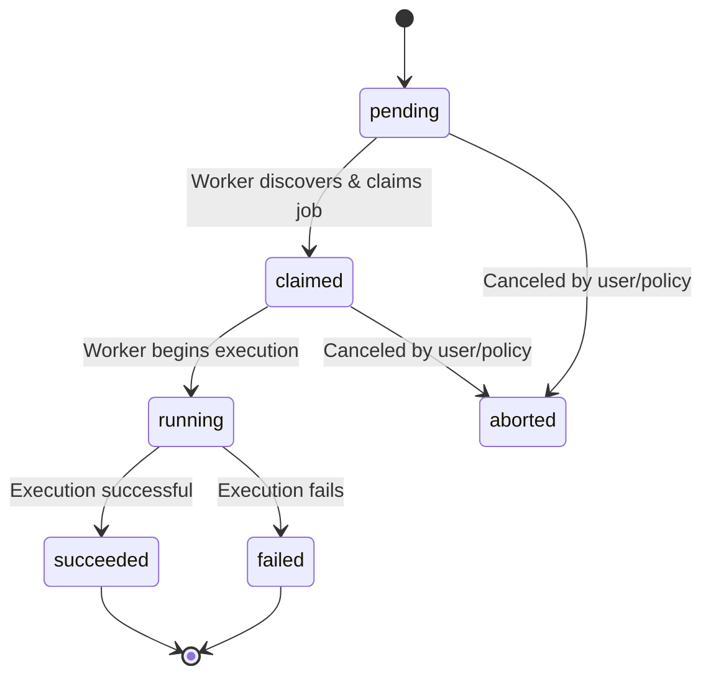
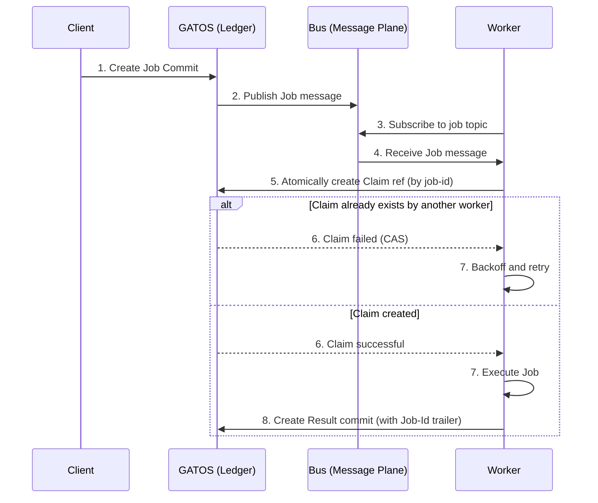

# ADR-0002: Distributed Compute via a Job Plane
<a id="adr-0002-distributed-compute-via-a-job-plane"></a>

<!-- AUTOGENERATED TOC START -->
- [Scope](#scope)
- [Rationale](#rationale)
- [Decision](#decision)
  - [Canonical Job Identifier](#canonical-job-identifier)
  - [Job Manifest Schema (Authoritative and Canonicalization)](#job-manifest-schema-authoritative-and-canonicalization)
  - [Atomic Claim Protocol (CAS)](#atomic-claim-protocol-cas)
  - [Trailer Encoding (Result Commit)](#trailer-encoding-result-commit)
- [Diagrams](#diagrams)
  - [Job Lifecycle](#job-lifecycle)
  - [Job Discovery and Execution Flow](#job-discovery-and-execution-flow)
- [Consequences](#consequences)
  - [Pros](#pros)
  - [Cons](#cons)
- [Alternatives Considered](#alternatives-considered)
- [Terminology and References](#terminology-and-references)

<!-- AUTOGENERATED TOC END -->

<a id="adr-0002-distributed-compute-via-a-job-plane"></a>

- **Status:** Accepted
- **Date:** 2025-11-08

## Scope
<a id="scope"></a>

<a id="scope"></a>

This ADR defines a system within GATOS for scheduling, executing, and recording the results of distributed, asynchronous jobs. This decision introduces the **Job Plane** and its associated Git namespaces and protocols.

## Rationale
<a id="rationale"></a>

<a id="rationale"></a>

**Problem:** GATOS can track and govern state, but cannot currently orchestrate or react to state changes with computation.

**Context:** To fulfill the vision of “Git as an Operating Surface”, computation must be a native citizen. Commits as “speech-acts” (the original metaphor) become literal when a commit can trigger a verifiable job.

## Decision
<a id="decision"></a>

<a id="decision"></a>

1. A new **Job Plane** **MUST** be introduced to the GATOS architecture.
2. The `refs/gatos/jobs/` namespace is reserved for this plane.
3. When a **Job** commit is created, the **Ledger Service** (e.g., `gatosd`) **MUST** publish a corresponding message to a topic on the Message Plane (e.g., `gatos/jobs/pending`) for discovery by workers. Publication is an automatic system behavior on commit acceptance.
4. The job lifecycle **MUST** be represented entirely through Git objects:
   - **Job:** A commit whose tree contains a `job.yaml` manifest. The manifest **MUST** include `command`, `args`, and `timeout` fields, and **SHOULD** include `policy_root` and an `inputs` array for deterministic attestation. See schema: [`schemas/v1/job/job_manifest.schema.json`](../../../schemas/v1/job/job_manifest.schema.json).
   - **Claim:** A ref under `refs/gatos/jobs/<job-id>/claims/<worker-id>`. This ref **MUST** be created atomically (compare-and-swap) to prevent race conditions.
   - **Result:** A commit referencing the original job commit, containing output artifacts (as pointers) and a `Proof-Of-Execution`.
5. The **Proof-Of-Execution** **MUST** sign the job’s `content_id` and **MAY** include an attestation envelope with hashes of the runner binary and environment. See envelope schema: [`schemas/v1/job/proof_of_execution_envelope.schema.json`](../../../schemas/v1/job/proof_of_execution_envelope.schema.json).
6. Each `Result` commit **MUST** include trailers for discoverability:
   - `Job-Id: blake3:<hex>`
   - `Proof-Of-Execution: blake3:<hex>`
   - `Worker-Id: ed25519:<base64|hex>`
   - `Attest-Program: <hash-of-runner-binary>` (optional)
   - `Attest-Sig: <signature>` (optional)

### Canonical Job Identifier
<a id="canonical-job-identifier"></a>

<a id="canonical-job-identifier"></a>

The canonical job identifier is the job’s `content_id` (the BLAKE3 hash of the canonical serialization of the unsigned job core). All protocol elements that refer to a job MUST use this `job-id`.

- Claim refs MUST be named `refs/gatos/jobs/<job-id>/claims/<worker-id>`.
- Result trailers MUST use `Job-Id: blake3:<hex>` corresponding to the same `job-id`.

ULIDs MAY be used as human-friendly aliases in messages (for deduplication, sorting, and UX). When present, the ULID MUST also be recorded in the job manifest. Workers MUST resolve ULIDs to the canonical `job-id` by reading the job commit and computing its `content_id`. ULIDs MUST NOT be used as ref keys for claims or results.

### Job Manifest Schema (Authoritative and Canonicalization)
<a id="job-manifest-schema-authoritative-and-canonicalization"></a>

<a id="job-manifest-schema-authoritative-and-canonicalization"></a>

The job manifest is stored as `job.yaml` but the authoritative form for hashing and `content_id` computation is Canonical JSON.

- Serialization for hashing: Canonical JSON (UTF-8, sorted keys, no insignificant whitespace, lowercase hex where applicable).
- Conversion: YAML authorship is allowed; before hashing, `job.yaml` MUST be converted to JSON with field order ignored and then canonicalized.
- Required fields and types:
  - `command: array<string>` — executable and arguments (e.g., `["/usr/bin/env", "bash", "-lc"]`).
  - `args: array<string>` — additional arguments appended to `command` (may be empty). If omitted, treated as `[]`.
  - `timeout: integer` — seconds (non-negative). Implementations MAY also accept ISO-8601 duration strings at authoring time but MUST normalize to integer seconds in Canonical JSON.
- Optional fields:
  - `env: object` — map<string,string>; keys unique; values UTF-8 strings.
  - `cwd: string` — working directory.
  - `inputs: array<object>` — opaque pointers or references to inputs (e.g., `{ "kind":"blobptr", "algo":"blake3", "hash":"<hex>", "size":123 }`).
  - `policy_root: string` — `sha256:<hex>` of policy bundle used.
  - `ulid: string` — human-friendly identifier; not used for hashing.

Canonicalization rules for `content_id`:

1. Build a JSON object with the fields above, omitting absent optional fields.
2. Sort keys lexicographically; arrays preserve order.
3. Encode as UTF-8 without insignificant whitespace; booleans and numbers use standard JSON encoding; all hex encodings are lowercase.
4. Compute `content_id = blake3(canonical_bytes)`.

Examples

Authoring YAML:

```yaml
command: ["/usr/bin/env", "bash", "-lc"]
args: ["echo", "hello"]
timeout: 30
env: { GREETING: "hello" }
```

Canonical JSON used for hashing:

```json
{"args":["echo","hello"],"command":["/usr/bin/env","bash","-lc"],"env":{"GREETING":"hello"},"timeout":30}
```

### Atomic Claim Protocol (CAS)
<a id="atomic-claim-protocol-cas"></a>

<a id="atomic-claim-protocol-cas"></a>

Claim creation MUST use Git’s reference update protocol with an expected old object id:

- To create `refs/gatos/jobs/<job-id>/claims/<worker-id>`, the client MUST request an atomic update with expected old = `0000000000000000000000000000000000000000` (zero OID).
- If the reference already exists or the expected old does not match, the server MUST reject the update with a deterministic conflict error. The worker MUST treat this as a lost race and enter the retry/backoff loop.
- Deployments MUST designate a single authoritative push endpoint (leader) for claim creation to guarantee atomicity across replicas. Retrying against non-authoritative replicas MUST converge via eventual consistency.
- Workers SHOULD use exponential backoff with jitter on CAS failures.

### Trailer Encoding (Result Commit)
<a id="trailer-encoding-result-commit"></a>

<a id="trailer-encoding-result-commit"></a>

All trailers MUST use canonical, prefixed encodings:

- `Job-Id: blake3:<hex>` — lowercase hex digest of the job `content_id`.
- `Proof-Of-Execution: blake3:<hex>` — lowercase hex digest of the PoE envelope.
- `Worker-Id: ed25519:<base64|hex>` — worker public key identifier (algorithm prefix required).
- `Attest-Program: blake3:<hex>` — hash of runner binary or WASM module (RECOMMENDED).
- `Attest-Sig: ed25519:<base64|hex>` — signature over attestation envelope (OPTIONAL).

Encodings MUST be lowercase hex for BLAKE3 digests; key/signature encodings MUST declare algorithm via prefix and use a standard encoding (hex or base64) documented by the implementation.

## Diagrams
<a id="diagrams"></a>

<a id="diagrams"></a>

### Job Lifecycle
<a id="job-lifecycle"></a>

<a id="job-lifecycle"></a>

This diagram shows the standard lifecycle states for a job as it moves through the system.



### Job Discovery and Execution Flow
<a id="job-discovery-and-execution-flow"></a>

<a id="job-discovery-and-execution-flow"></a>

This sequence shows how the different GATOS planes interact to schedule and execute a job.



## Consequences
<a id="consequences"></a>

<a id="consequences"></a>

### Pros
<a id="pros"></a>

<a id="pros"></a>

- Makes GATOS an active system capable of executing work deterministically.
- Enables fully auditable automation workflows (“on state change, run test job”).
- Preserves Git’s distributed, offline semantics for job distribution and result collection.

### Cons
<a id="cons"></a>

<a id="cons"></a>

- Increases complexity; requires new runner/worker components to be built.
- Adds storage overhead for job logs and artifacts.

## Alternatives Considered
<a id="alternatives-considered"></a>

<a id="alternatives-considered"></a>

1. **External CI/CD Systems** — Rejected: breaks the self-contained, Git-native model.
2. **Webhooks** — Rejected: less reliable and less auditable than Git-tracked claims/results.

## Terminology and References
<a id="terminology-and-references"></a>

<a id="terminology-and-references"></a>

- `content_id`: The BLAKE3 hash of the canonical serialization of the unsigned job core. This mirrors the definition used for commits in ADR-0001 and applies here to the job manifest’s canonical form. See ADR-0001 for canonical serialization rules and the `CommitCore` pattern.
- `unsigned job core`: The canonical, serialized job content used for hashing and signatures; derived from the job manifest (e.g., `job.yaml`) and fixed fields, excluding any signatures, claims, or result artifacts. This parallels ADR-0001’s "unsigned commit core" concept.
