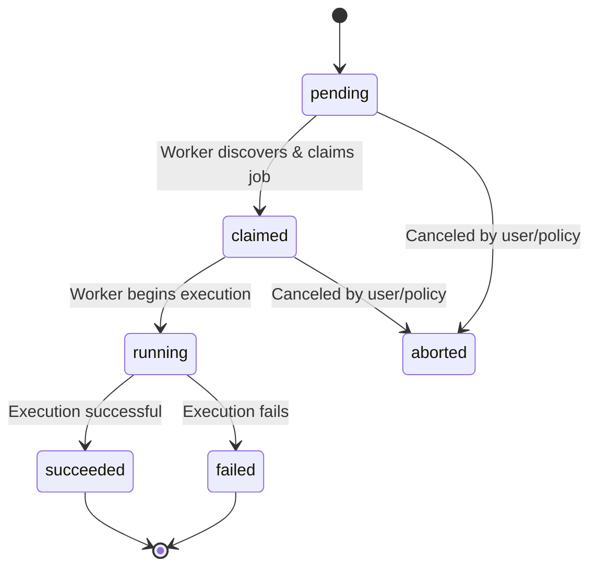
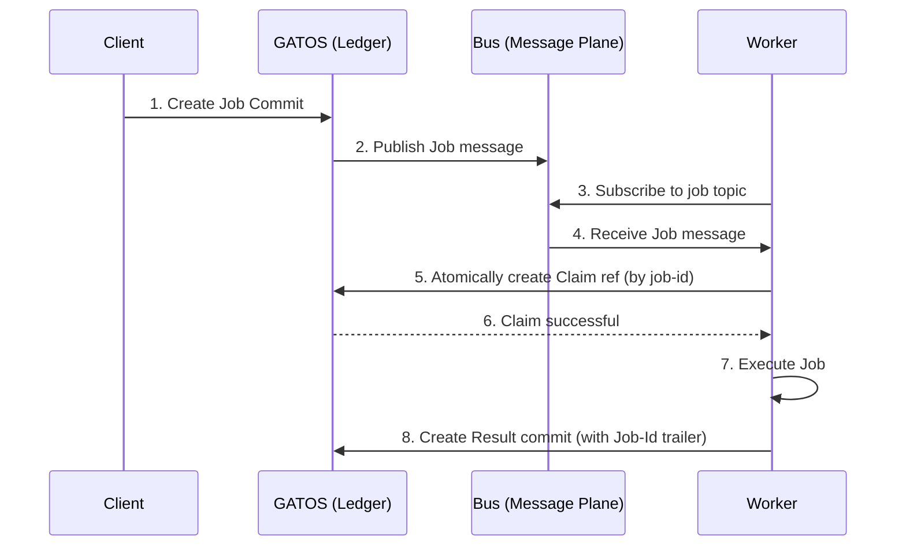

## ADR-0002: Distributed Compute via a Job Plane

- **Status:** Accepted
- **Date:** 2025-11-08

### Scope

This ADR defines a system within GATOS for scheduling, executing, and recording the results of distributed, asynchronous jobs. This decision introduces the **Job Plane** and its associated Git namespaces and protocols.

### Rationale

**Problem:** GATOS can track and govern state, but cannot currently orchestrate or react to state changes with computation.

**Context:** To fulfill the vision of “Git as an Operating Surface”, computation must be a native citizen. Commits as “speech-acts” (the original metaphor) become literal when a commit can trigger a verifiable job.

### Decision

1. A new **Job Plane** **MUST** be introduced to the GATOS architecture.
2. The `refs/gatos/jobs/` namespace is reserved for this plane.
3. When a **Job** commit is created, a corresponding message **MUST** be published to a topic on the Message Plane (e.g., `gatos/jobs/pending`) for discovery by workers.
4. The job lifecycle **MUST** be represented entirely through Git objects:
   - **Job:** A commit whose tree contains a `job.yaml` manifest. The manifest **MUST** include `command`, `args`, and `timeout` fields, and **SHOULD** include `policy_root` and an `inputs` array for deterministic attestation.
   - **Claim:** A ref under `refs/gatos/jobs/<job-id>/claims/<worker-id>`. This ref **MUST** be created atomically (compare-and-swap) to prevent race conditions.
   - **Result:** A commit referencing the original job commit, containing output artifacts (as pointers) and a `Proof-Of-Execution`.
5. The **Proof-Of-Execution** **MUST** sign the job’s `content_id` and **MAY** include an attestation envelope with hashes of the runner binary and environment.
6. Each `Result` commit **MUST** include trailers for discoverability:
   - `Job-Id: <blake3:…>`
   - `Proof-Of-Execution: <blake3:…>`
   - `Worker-Id: <pubkey>`
   - `Attest-Program: <hash-of-runner-binary>` (optional)
   - `Attest-Sig: <signature>` (optional)

#### Canonical Job Identifier

The canonical job identifier is the job’s `content_id` (the BLAKE3 hash of the canonical serialization of the unsigned job core). All protocol elements that refer to a job MUST use this `job-id`.

- Claim refs MUST be named `refs/gatos/jobs/<job-id>/claims/<worker-id>`.
- Result trailers MUST use `Job-Id: <blake3:…>` corresponding to the same `job-id`.

ULIDs MAY be used as human-friendly aliases in messages (for deduplication, sorting, and UX). When present, the ULID MUST also be recorded in the job manifest. Workers MUST resolve ULIDs to the canonical `job-id` by reading the job commit and computing its `content_id`. ULIDs MUST NOT be used as ref keys for claims or results.

### Diagrams

#### Job Lifecycle

This diagram shows the standard lifecycle states for a job as it moves through the system.

#### Job Discovery and Execution Flow

This sequence shows how the different GATOS planes interact to schedule and execute a job.

### Consequences

### Pros

- Makes GATOS an active system capable of executing work deterministically.
- Enables fully auditable automation workflows (“on state change, run test job”).
- Preserves Git’s distributed, offline semantics for job distribution and result collection.

### Cons

- Increases complexity; requires new runner/worker components to be built.
- Adds storage overhead for job logs and artifacts.

### Alternatives Considered

1. **External CI/CD Systems** — Rejected: breaks the self-contained, Git-native model.
2. **Webhooks** — Rejected: less reliable and less auditable than Git-tracked claims/results.

