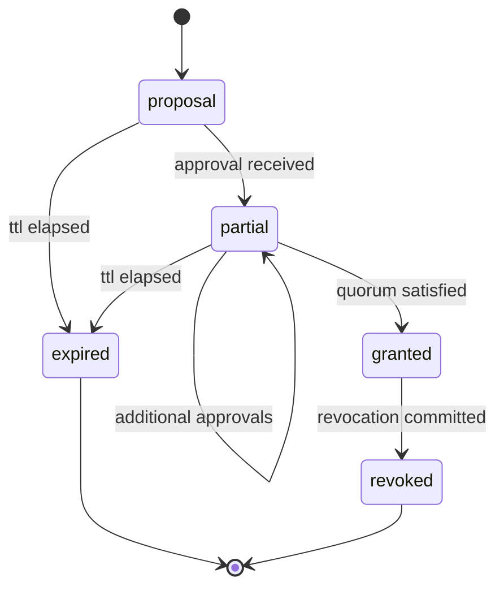
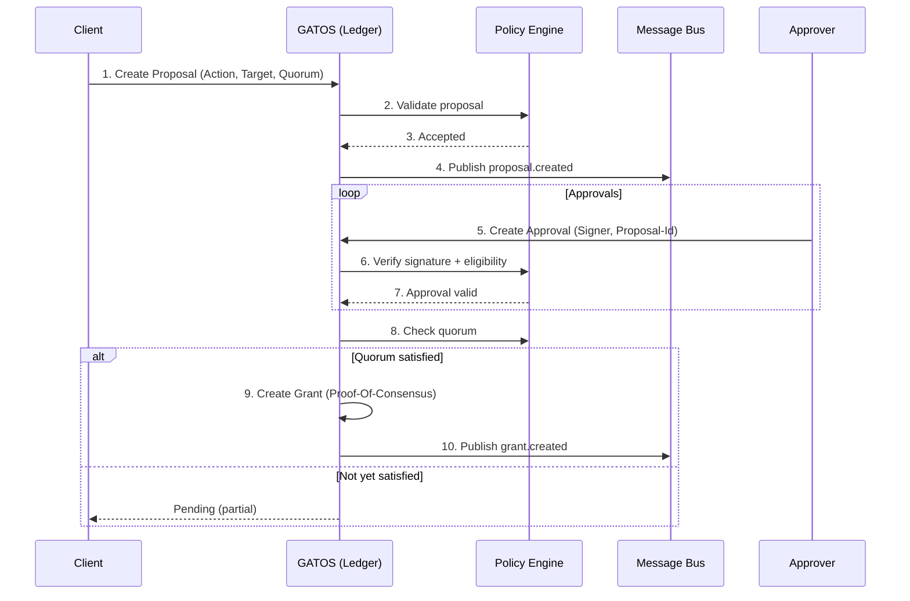

# ADR-0003: Consensus Governance for Gated Actions

<a id="adr-0003-consensus-governance-for-gated-actions"></a>
<!-- AUTOGENERATED TOC START -->

- [Scope](#scope)
- [Rationale](#rationale)
- [Decision](#decision)
- [Security Considerations](#security-considerations)
- [Diagrams](#diagrams)
  - [Proposal Lifecycle (State)](#proposal-lifecycle-state)
  - [Standard Workflow (Sequence)](#standard-workflow-sequence)
- [Consequences](#consequences)
  - [Pros](#pros)
  - [Cons](#cons)
- [Alternatives Considered](#alternatives-considered)
- [Future Work](#future-work)
- [Why This ADR Matters](#why-this-adr-matters)
- [Terminology and References](#terminology-and-references)

<!-- AUTOGENERATED TOC END -->

<a id="adr-0003-consensus-governance-for-gated-actions"></a>

---

Status: Accepted
Date: 2025-11-08
ADR: ADR-0003
Authors: \[flyingrobots]
Requires: \[ADR-0001]
Related: \[ADR-0002]
Tags: \[Governance, Consensus, Policy]
Schemas:

- schemas/v1/governance/proposal.schema.json
- schemas/v1/governance/approval.schema.json
- schemas/v1/governance/grant.schema.json
- schemas/v1/governance/revocation.schema.json
- schemas/v1/governance/proof\_of\_consensus\_envelope.schema.json
- schemas/v1/policy/governance\_policy.schema.json

Supersedes: \[]
Superseded-By: \[]

---

## Scope

<a id="scope"></a>
Define a system for gating specific GATOS actions (e.g., locking a file, publishing an artifact, merging a policy) behind a programmable, multi-party approval process ("Consensus Governance").

## Rationale

<a id="rationale"></a>
**Problem:** As GATOS manages critical state, some actions must be authorized by multiple trusted parties.

**Context:** This generalizes the original "Perforce-style locks" concept into a flexible governance framework capable of rules like "two leads must approve this asset change." It complements ADR-0002 (Job Plane) so actions can be executed after reaching consensus.

## Decision

<a id="decision"></a>

1. A **Consensus Governance** layer is integrated into the Policy Plane (`gatos-policy`).

2. Introduce Git ref namespaces:
   - `refs/gatos/proposals/` — requested actions.
   - `refs/gatos/approvals/` — individual approvals.
   - `refs/gatos/grants/` — finalized grants.
   - `refs/gatos/revocations/` — grant revocations (see Revocation below).

3. Standard workflow:

   Proposal → Approvals (N-of-M) → Grant

4. Proposal (normative)
   - A commit describing the requested action, scope/target, and required quorum. Schema: [`schemas/v1/governance/proposal.schema.json`](../../../schemas/v1/governance/proposal.schema.json)

   - Trailers MUST be present and canonically encoded:

     ```text
     Action: publish.artifact
     Target: gatos://assets/model.bin
     Proposal-Id: blake3:<hex>
     Required-Quorum: 2-of-3@leads
     Expire-At: 2025-12-01T00:00:00Z
     Policy-Rule: governance.publish.artifact
     Created-By: user:alice
     ```

   - `Proposal-Id` is the `content_id` (BLAKE3 of canonical proposal envelope).

5. Approval (normative)
   - A signed commit referencing `Proposal-Id` by digest. Schema: [`schemas/v1/governance/approval.schema.json`](../../../schemas/v1/governance/approval.schema.json)
   - Approver identity MUST resolve in the trust graph (`gatos/trust/…`).
   - One approval per signer per proposal is valid; duplicates MUST be ignored.
   - Trailers MUST include:

     ```text
     Proposal-Id: blake3:<hex>
     Approval-Id: blake3:<hex>
     Signer: ed25519:<pubkey>
     Expires-At: 2025-12-01T00:00:00Z  # OPTIONAL
     ```

6. Grant (normative)
   - Created when quorum is satisfied per policy rule. Creation MAY be automatic (daemon) or manual (operator tool). Schema: [`schemas/v1/governance/grant.schema.json`](../../../schemas/v1/governance/grant.schema.json)
   - Serves as the authoritative artifact enabling the gated action.
   - Trailers MUST include:

     ```text
     Proposal-Id: blake3:<hex>
     Grant-Id: blake3:<hex>
     Proof-Of-Consensus: blake3:<digest>
     ```

7. Proof-Of-Consensus (normative)
   - The `Proof-Of-Consensus` digest MUST be the BLAKE3 of a canonical envelope that includes (see schema: [`schemas/v1/governance/proof_of_consensus_envelope.schema.json`](../../../schemas/v1/governance/proof_of_consensus_envelope.schema.json)):
     - The canonical proposal envelope (by value or by `Proposal-Id`).
     - A sorted list (by `Signer`) of all valid approvals used to reach quorum (each by value or `Approval-Id`).
     - The governance rule id (`Policy-Rule`) and effective quorum parameters.
   - Implementations MUST use canonical JSON (UTF-8, sorted keys, no insignificant whitespace) to build this envelope before hashing. All hex encodings MUST be lowercase. Ordering by signer is an application-level MUST; JSON Schema cannot enforce sort order.
   - Storage: The canonical PoC envelope JSON SHOULD be persisted as a blob referenced under `refs/gatos/audit/proofs/governance/<proposal-id>`; the `Proof-Of-Consensus` trailer MUST equal `blake3(envelope_bytes)`.

8. Governance schema (policy integration)
   - Extend `.gatos/policy.yaml` to declare governance rules (JSON Schema: [`schemas/v1/policy/governance_policy.schema.json`](../../../schemas/v1/policy/governance_policy.schema.json)):

     ```yaml
     governance:
       publish.artifact:
         quorum:
           at_least: 2
           group: leads
         ttl: 72h
       modify.critical_config:
         quorum:
           all_of: security_team
     ```

   - Evaluation of approvals and grants MUST reuse the trust graph and signature verification defined by the Policy/Trust plane (ADR-0001).

9. Lifecycle states (normative)

   | State    | Meaning                        |
   | :------- | :----------------------------- |
   | proposal | Awaiting votes                 |
   | partial  | Some approvals collected       |
   | granted  | Quorum reached; action allowed |
   | expired  | Proposal timed out             |
   | revoked  | Grant withdrawn or superseded  |

10. Revocation (normative)
    - A grant MAY be revoked by creating a `revocation` commit under `refs/gatos/revocations/` with trailers (structured schema: [`schemas/v1/governance/revocation.schema.json`](../../../schemas/v1/governance/revocation.schema.json)):

      ```text
      Grant-Id: blake3:<hex>
      Revocation-Id: blake3:<hex>
      Reason: <free-text>
      Revoked-By: user:bob
      ```

    - A new grant MAY also supersede an older one by including `Supersedes: blake3:<grant-id>`.

    - Policy MUST deny governed actions when a matching grant is revoked or superseded.

11. Publication responsibility
    - The **Ledger Service** (e.g., `gatosd`) MUST watch governance refs and MAY publish bus messages on transitions (e.g., proposal created, quorum reached, revoked) to enable automation.
    - Recommended topics:
      - `gatos.policy.proposal.created`
      - `gatos.policy.approval.created`
      - `gatos.policy.grant.created`
      - `gatos.policy.grant.revoked`

## Security Considerations

<a id="security-considerations"></a>

- Grants are immutable once committed; changes require revocation or supersedure.
- Signer private keys SHOULD be protected (offline or delegated to a signing service).
- Expired proposals MUST NOT be revived post-TTL; new proposals are required.

## Diagrams

<a id="diagrams"></a>

### Proposal Lifecycle (State)

<a id="proposal-lifecycle-state"></a>


### Standard Workflow (Sequence)

<a id="standard-workflow-sequence"></a>


## Consequences

<a id="consequences"></a>

### Pros

<a id="pros"></a>

- Enables auditable, multi-party governance for any action.
- Suitable for regulated or collaborative environments.
- Every step (proposal, approval, grant) is a signed Git object—immutable and traceable.

### Cons

<a id="cons"></a>

- Adds workflow complexity for gated actions.
- Requires signature verification and key-management tooling.

## Alternatives Considered

<a id="alternatives-considered"></a>

1. External Platform Approvals (e.g., GitHub PR reviews) — Rejected; ties governance to specific vendors.
2. Single-Admin Model — Rejected; lacks flexibility for N-of-M or group-based approvals.

## Future Work

<a id="future-work"></a>

- `gatos grant verify` CLI for checking consensus proofs.
- TTL enforcement and automatic cleanup of expired proposals.
- Integrate with the Job Plane (ADR-0002) to allow "run job after grant" automation.

## Why This ADR Matters

<a id="why-this-adr-matters"></a>

- Completes the Policy Plane: turns static rules into living agreements.
- Pairs with the Job Plane: e.g., "run this job once 3 of 5 reviewers approve."
- Scales from teams → orgs → federations via the trust graph.

Together, ADR-0002 (Job Plane) and ADR-0003 (Consensus Governance) transform GATOS from a deterministic datastore into a self-governing distributed runtime.

## Terminology and References

<a id="terminology-and-references"></a>

- `content_id`: BLAKE3 hash of canonical serialization of an unsigned core (see ADR-0001).
- Canonical encodings: lowercase hex for BLAKE3 digests; `ed25519:<base64|hex>` for keys/signatures.
