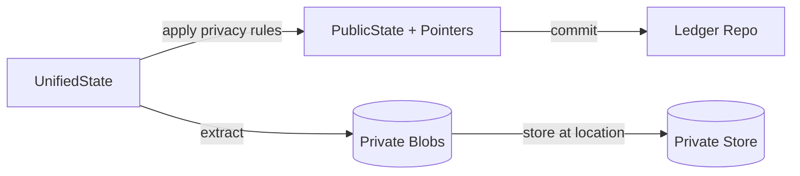
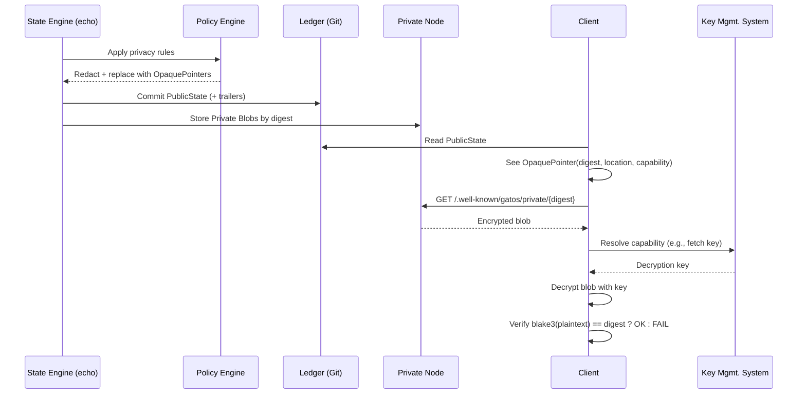

# ADR‑0004: Hybrid Privacy Model (Public Projection + Private Overlay)

## Scope

Define a **hybrid privacy** model in which the State Plane produces:
1) a **PublicState** that is pushable and shareable, and
2) a **Private Overlay** that is stored locally (or on a private node) and referenced from the public state via **opaque pointers**.

## Rationale

The original model envisioned using a local, out‑of‑repo directory for private data and committing only redacted or pointerized state to Git. This ADR makes that pattern **normative** and **deterministic**:
- Public state remains globally verifiable.
- Sensitive details live in a private overlay but are **addressable** and **auditable** via content hashes.

## Alternatives Considered

Several alternative approaches to managing privacy and sensitive data were considered:

*   **1. Pure Public State (No Privacy Model):**
    *   **Description:** All data, regardless of sensitivity, is committed directly to the Git repository and is part of the `PublicState`.
    *   **Reason for Rejection:** This approach fundamentally contradicts the requirement to handle sensitive data (e.g., PII, large datasets) and maintain confidentiality. It would render GATOS unsuitable for many real-world applications that necessitate data privacy.

*   **2. Pure Private State (No Public Projection):**
    *   **Description:** All state is kept entirely private, with only cryptographic proofs or attestations made public.
    *   **Reason for Rejection:** While offering maximum privacy, this model would significantly diminish the verifiability and auditability of the system. It would impede collaboration and sharing of non-sensitive data and likely increase the complexity of proving computational correctness without revealing any underlying data. GATOS aims for a balanced approach between privacy and verifiability.

*   **3. Ad-hoc Private Data Storage (Original Model):**
    *   **Description:** Private data is stored in local, out-of-repo directories, and redacted/pointerized state is committed to Git, but without a normative, deterministic framework.
    *   **Reason for Rejection:** This represents the "original model" described in the Rationale. Its primary drawbacks are a lack of determinism, auditability, and a standardized mechanism for addressing and resolving private data. Reliance on ad-hoc solutions can lead to inconsistencies, operational errors, and makes system evolution difficult. This ADR specifically aims to formalize and standardize this pattern.

*   **4. Encrypted Blobs Directly in Git:**
    *   **Description:** Instead of opaque pointers, encrypted blobs containing sensitive data are committed directly to the Git repository.
    *   **Reason for Rejection:** This approach, while technically feasible, introduces several significant issues:
        *   **Repository Bloat:** Committing large encrypted blobs would drastically increase repository size, leading to slow cloning, fetching, and other Git operations.
        *   **Key Management Complexity:** Changing encryption keys would necessitate rewriting Git history or re-encrypting and re-committing substantial portions of the repository, which is impractical.
        *   **Limited Access Control:** Git's native access control operates at the repository level. It would be challenging to implement granular access control for specific encrypted blobs without granting access to the entire repository.
        *   **Public Metadata Leakage:** Even if encrypted, the mere presence, size, and commit history of these blobs could inadvertently leak sensitive metadata. Opaque pointers offer finer-grained control over what metadata is exposed publicly.

## Decision

### 1. Actor‑Anchored Private Namespace (normative)

Private overlays are rooted in an **actor identity**, not an ad‑hoc “session”.

- **Actor ID:** `ed25519:<pubkey>` that resolves in the trust graph.
- **On‑disk refs (private):**
  ```
  refs/gatos/private/<actor-id>/<ns>/<channel>
  refs/gatos/private/<actor-id>/sessions/<ulid>/<ns>/<channel>   # OPTIONAL ephemeral overlays
  ```
- **On‑disk refs (public):**
  ```
  refs/gatos/state/public/<ns>/<channel>
  ```

> The prior “`<session-id>` at namespace root” concept is deprecated. If you need per‑process isolation, use `sessions/<ulid>` under the owning `<actor-id>`.

### 2. Opaque Pointers (normative)

Where private data is elided from PublicState, emit a canonical JSON **opaque pointer** envelope:

```json
{
  "kind": "opaque_pointer",
  "algo": "blake3",
  "digest": "blake3:<64hex>",          // blake3 hash of the raw, unencrypted private blob
  "size": 12345,                       // OPTIONAL byte size
  "location": "gatos-node://ed25519:<pubkey>",   // where to ask
  "capability": "gatos-key://v1/aes-256-gcm/<key-id>"  // how to authorize/decrypt
}
```

- `location` MUST be a URI. Reserved schemes include:
  - `gatos-node://ed25519:<pubkey>` — resolve endpoint(s) via trust graph.
  - `file:///...` — local file path (dev/test only).
  - `https://...` — HTTPS object store.
  - `s3://bucket/key` — S3‑style store.
  - `ipfs://<cid>` — IPFS address.
- `capability` MUST be a URI. Reserved schemes include:
  - `gatos-key://v1/aes-256-gcm/<key-id>`
  - `kms://aws/<region>/keys/<uuid>`
  - `age://<recipient>` / `sops://<profile>`
- Canonical JSON (UTF‑8, sorted keys, no insignificant whitespace). The digest of the pointer envelope itself (its **content_id**) is `blake3(canonical_bytes)`.

**Schema:** `schemas/v1/privacy/opaque_pointer.schema.json` (see repo changes below).

### 3. Projection Function (normative)

The Privacy Policy declares **redact/pointerize rules**. The projection:
- takes a **UnifiedState** (contains both public + private),
- transforms it into **PublicState** + a set of **Private Blobs**, and
- commits PublicState; persists blobs at `location` with digest = `blake3(bytes)`.



### 4. Pointer Resolution (normative, minimal)

A resolver MUST:
1. Parse `location`.
2. If `gatos-node://ed25519:<pubkey>`:
   - Read trust graph entry for `<pubkey>` and obtain `endpoints: [uri]`.
   - Attempt `GET {endpoint}/.well-known/gatos/private/{digest}` (exact path shape MAY be extended in a future ADR).
3. If `https|s3|ipfs|file`, use the obvious client.
4. If a `capability` is present:
   - Use scheme to select decryption/authorization mechanism.
   - Fetch and decrypt the content. Verify that the `blake3` hash of the resulting plaintext bytes matches the `digest` from the pointer. If it does not match, the resolution **MUST FAIL**.

> This ADR standardizes **envelopes and verification**. The `.well-known` fetch API shape is reserved for a future ADR; implementations may use compatible private APIs short‑term.

### 5. Policy Hooks (normative)

Extend `.gatos/policy.yaml`:

```yaml
privacy:
  rules:
    - select: "paths.config.secrets.*"
      action: "pointerize"
      capability: "gatos-key://v1/aes-256-gcm/key-ops-01"
      location:  "gatos-node://ed25519:<pubkey-of-owner>"
    - select: "attachments.*"
      action: "redact"   # removes node entirely from PublicState
```

### 6. Auditability (normative)

- Public commits MUST include trailers summarizing redactions/pointers:
  ```
  Privacy-Redactions: N
  Privacy-Pointers: M
  ```
- Private stores SHOULD keep an index `<digest> -> metadata` for operator inspection.
- Verifiers MUST check that any dereferenced pointer’s content hash equals `digest`.

### 7. Security Considerations

- Never embed plaintext secrets in PublicState. Pointer envelopes do **not** leak bytes.
- If `location` is remote and `capability` is non‑null, deny fetch if capability can’t be resolved or verified.
- The trust graph entry for a node SHOULD declare endpoint URIs and allowed capability schemes.
- The `capability` mechanism implies a dependency on a robust and secure key management system. This ADR does not specify the architecture of such a system, but implementations MUST ensure that key access is strictly controlled and auditable.

### 8. Compatibility

- Existing per‑process “session” overlays can migrate to `refs/gatos/private/<actor-id>/sessions/<ulid>/...` with no behavioral change to the projection.

### Diagrams

#### Sequence: Project & Resolve

