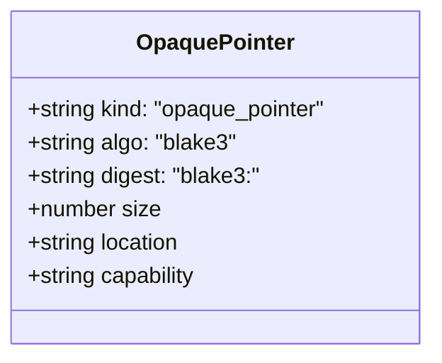
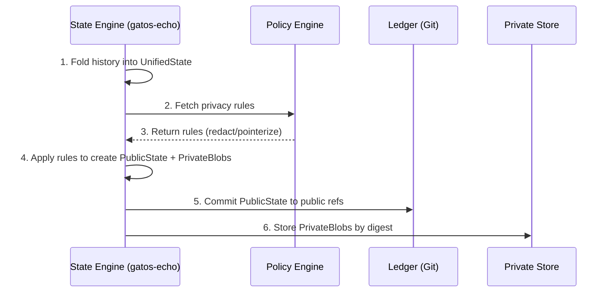
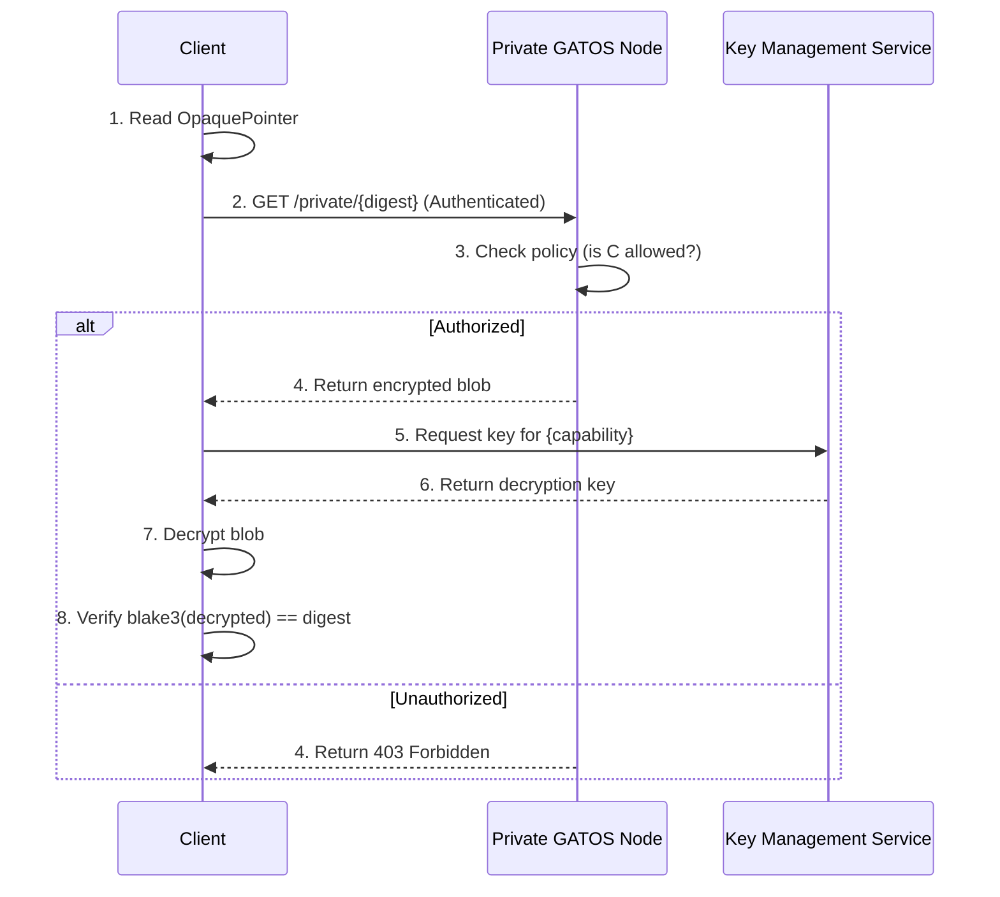

# ADR‑0004: Hybrid Privacy Model (Public Projection + Private Overlay)

## Scope

This ADR defines a **hybrid privacy model** for the GATOS operating surface. It formalizes the separation of state into a public, verifiable component and a private, actor-anchored overlay. This is achieved by introducing a **Projection Functor** that transforms a unified state into a public projection, leaving sensitive data in a private store referenced by **Opaque Pointers**.

## Rationale

GATOS's core value proposition is its verifiable, deterministic public ledger. However, many real-world applications require storing sensitive or large data (PII, secrets, large binaries) without committing it to the public history. The previous ad-hoc approach of using local, out-of-repo storage lacks the formal guarantees required by the GATOS Morphology Calculus.

This ADR makes the hybrid model **normative, deterministic, and provable**. It ensures that public state remains globally verifiable while private data is securely addressable, auditable, and tied to the GATOS identity and policy model.

## Mathematical Foundation (Morphology Calculus)

This model is a direct application of the GATOS Morphology Calculus.

1.  **Shape Categories**: We define three categories of shapes:
    *   `Sh_Unified`: The category of shapes containing both public and private data.
    *   `Sh_Public`: The category of shapes containing only public data and opaque pointers.
    *   `Sh_Private`: The category of shapes containing only the private data blobs.

2.  **Projection as a Functor**: The privacy model is implemented as a functor, `Proj`, which maps shapes and morphisms from the unified category to the public category.
    `Proj: Sh_Unified -> Sh_Public`

    This functor applies the privacy policy rules (`redact`, `pointerize`) to transform a unified shape into its public projection. The private data is extracted into `Sh_Private` during this process.

    ```mermaid
    graph TD
        subgraph Sh_Unified
            U1("Unified Shape 1")
            U2("Unified Shape 2")
            U1 -- "Commit c" --> U2
        end

        subgraph Sh_Public
            P1("Public Shape 1")
            P2("Public Shape 2")
            P1 -- "Proj(c)" --> P2
        end

        subgraph Sh_Private
            B1("Private Blobs 1")
            B2("Private Blobs 2")
        end

        U1 -- "Proj" --> P1
        U2 -- "Proj" --> P2

        U1 -- "Extract" --> B1
        U2 -- "Extract" --> B2

        style P1 fill:#cde,stroke:#333
        style P2 fill:#cde,stroke:#333
    ```

This ensures that the transformation is structure-preserving and that the public history remains a valid, deterministic projection of the complete history.

## Decision

### 1. Actor-Anchored Private Namespace (Normative)

Private data overlays are fundamentally tied to an actor's identity, not an ephemeral session. This anchors private data within the GATOS trust graph.

-   **Actor ID:** The canonical identifier for an actor, e.g., `ed25519:<pubkey>`.
-   **Private Refs:** Private data is stored under refs namespaced by the actor ID.
    ```
    refs/gatos/private/<actor-id>/<ns>/<channel>
    ```
-   **Public Refs:** The corresponding public projection lives in the main state namespace.
    ```
    refs/gatos/state/public/<ns>/<channel>
    ```

### 2. Opaque Pointers (Normative)

When private data is elided from the `PublicState`, a canonical JSON **Opaque Pointer** envelope is inserted in its place.



-   **`digest`**: The content-address of the private blob (`blake3(private_bytes)`). This is the immutable link between the public and private worlds.
-   **`location`**: A URI indicating where to resolve the blob. Supported schemes include:
    -   `gatos-node://ed25519:<pubkey>`: Resolve via the GATOS trust graph.
    -   `https://...`, `s3://...`, `ipfs://...`: Standard distributed storage.
    -   `file:///...`: For local development and testing.
-   **`capability`**: A URI defining the authorization and decryption mechanism required to access the blob.
    -   `gatos-key://v1/aes-256-gcm/<key-id>`: A symmetric key managed by a GATOS-aware key service.
    -   `kms://...`, `age://...`, `sops://...`: Integration with standard secret management tools.

The canonical `content_id` of the pointer itself is `blake3(canonical_json_bytes)`.

**Schema:** `schemas/v1/privacy/opaque_pointer.schema.json`

### 3. The Projection Function (Normative)

The State Engine (`gatos-echo`) is responsible for executing the projection.

1.  It computes a **UnifiedState** by folding the complete event history.
2.  It consults the **Privacy Policy** (`.gatos/policy.yaml`).
3.  It traverses the `UnifiedState` tree, applying `redact` or `pointerize` rules.
    -   `redact`: The field is removed from the public state.
    -   `pointerize`: The field's value is stored as a private blob, and an Opaque Pointer is substituted in the public state.
4.  The resulting `PublicState` is committed to the public refs, and the `Private Blobs` are persisted to their specified `location`.



### 4. Pointer Resolution Protocol (Normative)

A client resolving an Opaque Pointer **MUST** follow this protocol:

1.  **Parse Pointer**: Extract `digest`, `location`, and `capability`.
2.  **Fetch Blob**:
    -   If `gatos-node://<actor-id>`, resolve the actor's endpoint from the trust graph.
    -   The client **MUST** send an authenticated request to the node (e.g., with a JWT or a signed challenge).
    -   The node's endpoint (e.g., `GET /.well-known/gatos/private/{digest}`) **MUST** verify the client's authorization against its policy before returning the blob.
3.  **Acquire Capability**:
    -   Parse the `capability` URI.
    -   Interact with the specified system (KMS, key server) to get the decryption key. This step will have its own auth/authz protocol.
4.  **Decrypt and Verify**:
    -   Decrypt the fetched blob using the key.
    -   Compute `blake3(decrypted_bytes)`.
    -   The operation **MUST FAIL** if the computed hash does not exactly match the `digest` in the pointer.



### 5. Policy Hooks (Normative)

The privacy policy is defined in `.gatos/policy.yaml` and extends the policy engine's domain.

```yaml
privacy:
  rules:
    - select: "path.to.sensitive.data"
      action: "pointerize"
      capability: "gatos-key://v1/aes-256-gcm/ops-key-01"
      location: "gatos-node://ed25519:<owner-pubkey>"
    - select: "path.to.transient.data"
      action: "redact"
```

The `select` syntax will use a simple path-matching language (e.g., glob patterns) defined by the policy engine.

### 6. Auditability and Trailers (Normative)

To make privacy operations transparent and auditable, any commit that creates a `PublicState` from a projection **MUST** include the following trailers:

```
Privacy-Redactions: 3
Privacy-Pointers: 12
```

This provides a simple, top-level indicator that a projection has occurred, prompting auditors to look deeper if necessary.

## Consequences

### Pros

-   **Provable Privacy**: The model is grounded in the Morphology Calculus, making it verifiable.
-   **Decoupled Storage**: Private data can live in any storage system (S3, IPFS, local disk) without affecting the public ledger's logic.
-   **Integrated Auth/Authz**: By tying pointers to actor identities and capabilities, access to private data is governed by the existing GATOS trust and policy model.
-   **Preserves Verifiability**: The `PublicState` remains globally verifiable, as pointers are just content-addressed links.

### Cons

-   **Increased Complexity**: Resolution requires network requests and interaction with key management systems, adding latency and potential points of failure.
-   **Operational Overhead**: Operators must manage the private blob stores and ensure their availability and security.

## Feature Payoff

-   **Secure PII/Secret Storage**: Store sensitive data off-chain while retaining an auditable link to it.
-   **Large Artifact Management**: Handle large binaries (ML models, videos) without bloating the Git repository.
-   **Compliant Data Sharing**: Share a public, redacted dataset with third parties while retaining private access to the full, unified view.
-   **Federated Learning**: Different actors can hold private models locally, referenced by pointers in a public "training plan" shape.
