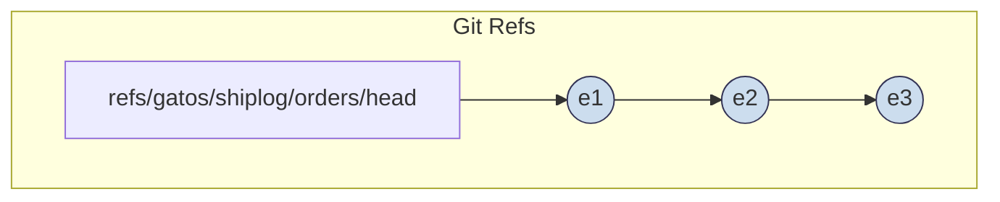

# ADR‑0005: Shiplog — A Parallel, Queryable Event Stream

## Summary / Scope

Introduce a first‑class, append‑only event stream ("Shiplog") that runs in parallel with deterministic state folds. The Shiplog provides per‑topic ordering, canonical event envelopes, consumer checkpoints, and query APIs. It is privacy‑aware (ADR‑0004) and deterministic (Morphology Calculus).

## Context / Problem

Many integrations require an append‑only stream rather than only snapshot state: analytics, external system replay, audit feeds, and incremental ETL. SPEC v0.3 defines append‑only journals conceptually but lacks a normative, queryable stream with consumer checkpoints and a canonical envelope format. This ADR makes the Shiplog normative.

## Decision (Normative)

### 1) Canonicalization and Identifiers

- Envelope canonicalization: RFC 8785 JSON Canonicalization Scheme (JCS). The event Content‑Id is `blake3(JCS(envelope))`.
- ULID: 26‑char Crockford base32, uppercase, excluding I/L/O/U (`^[0-9A-HJKMNP-TV-Z]{26}$`).
- Hashes: content digests are `blake3:<64‑hex>` per `schemas/v1/common/ids.schema.json`.


### 2) Namespaces and Ordering

- Per‑topic head ref (append‑only, linear): `refs/gatos/shiplog/<topic>/head`
- Topic naming: `^[a-z][a-z0-9._-]{0,63}$` (ASCII, lowercase start).
- Ordering per topic is the Git parent chain. Appends MUST be fast‑forward (CAS on ref update). On a single node, ULIDs MUST increase strictly per topic.



### 3) Event Envelope (Schema)

- Canonical JSON envelope at `schemas/v1/shiplog/event_envelope.schema.json` (draft‑2020‑12).
- Required fields: `ulid`, `ns`, `type`, `payload`.
- Optional `refs` (map<string, blake3Digest>) to link related state or IDs.
- Privacy (ADR‑0004): Payload MUST NOT embed private overlay data. Redacted values MUST be replaced by `OpaquePointer` envelopes per `schemas/v1/privacy/opaque_pointer.schema.json`.

Numeric discipline: JSON numbers can be cross‑language foot‑guns. Precision‑sensitive values (e.g., monetary/time) MUST be encoded as integers or strings.

### 4) Commit Message and Trailer

Each Shiplog commit MUST include headers in the commit message (any order), followed by a single line containing three dashes `---` and then a JSON trailer object:

```
Event-Id: ulid:<ULID>
Content-Id: blake3:<64-hex>
Topic: <topic>
Schema: https://gatos.dev/schemas/v1/shiplog/event_envelope.schema.json
---
{ "version": 1,
  "env": "prod",
  "who": { "name": "Jane Dev", "email": "jane@example.com" },
  "what": { "service": "web", "artifact": "ghcr.io/acme/web:1.2.3" },
  "where": { "region": "us-east-1", "cluster": "eks-a", "namespace": "prod" },
  "why": { "reason": "canary", "ticket": "OPS-123" },
  "how": { "pipeline": "gha", "run_url": "https://github.com/..." },
  "status": "success",
  "when": { "start_ts": "2025-11-10T10:00:00Z", "end_ts": "2025-11-10T10:01:10Z", "dur_s": 70 },
  "seq": 42,
  "journal_parent": "<oid>",
  "trust_oid": "<oid>",
  "previous_anchor": "<oid>",
  "repo_head": "<oid>"
}
```

Trailer schema: `schemas/v1/shiplog/deployment_trailer.schema.json`.

MUST: validate the trailer against this schema, and write the exact JCS bytes hashed for the envelope to `/gatos/shiplog/<topic>/<ULID>.json` (parse → JCS → hash → write → commit).

### 5) Append Semantics

Append(`topic`, `envelope`): validate schema; compute `content_id = blake3(JCS(envelope))`; enforce monotone ULID per topic on this node; create commit with headers + trailer; CAS update `refs/gatos/shiplog/<topic>/head`; return `(commit_oid, ulid, content_id)`.

Errors (normative):
- 400 `InvalidEnvelope`; 409 `UlidOutOfOrder`; 409 `NotFastForward`; 422 `DigestMismatch`.

### 6) Query Semantics

- `shiplog.read(topic, since_ulid, limit) -> [ (ulid, content_id, commit_oid, envelope) ]` (increasing ULID order).
- `shiplog.tail(topics[], limit_per_topic)` MAY multiplex without cross‑topic causality guarantees.

### 7) Consumer Checkpoints

- `refs/gatos/consumers/<group>/<topic>` points to the last processed Shiplog commit OID. Portable JSON (optional): `schemas/v1/shiplog/consumer_checkpoint.schema.json`.

### 8) Privacy Interactions (ADR‑0004)

Nonces: Nonces MUST be unique per key. Prefer deterministic nonces derived from the pointer digest via HKDF (domain-separated) or a monotonic per-key counter in KMS. Random nonces are permitted only with a documented collision budget and monitoring.

AAD: When using AEAD, bind the pointer digest (not a separate content_id), the actor id, and the policy version in the AAD so verifiers can validate context.

- Payloads MUST NOT embed private overlay data. Use Opaque Pointers per privacy schema. For low‑entropy classes, include `ciphertext_digest` and omit plaintext digest in public pointers.

### 9) Governance and Ledger Interactions

- Governance (ADR‑0003): Should emit Shiplog events under `topic="governance"`.
- Ledger mirroring: MAY mirror ledger events; must preserve envelope determinism.

### 10) Security Considerations

- No secrets in commit messages or payloads. Use capability URIs; notes/logs may be private or pointerized.
- Idempotent appends; checkpoints are advisory.

### 11) CLI Examples

```bash
$ gatosd shiplog append --topic governance --file event.json
ok  commit=8b1c1e4 content_id=blake3:2a6c... ulid=01HF4Y9Q1SM8Q7K9DK2R3V4AWB

$ gatosd shiplog read --topic governance --since 01HF4Y9Q1SM8Q7K9DK2R3V4AWB --limit 2
01HF4Y9Q1SM8Q7K9DK2R4V5CXD  blake3:2a6c...  8b1c1e4  {"ulid":"01HF4Y9...","ns":"governance",...}
01HF4Y9Q1SM8Q7K9DK2R4V5CXE  blake3:c1d2...  9f0aa21  {"ulid":"01HF4Y9...","ns":"governance",...}

$ gatosd shiplog checkpoint set --group analytics --topic governance --commit 8b1c1e4
ok  refs/gatos/consumers/analytics/governance -> 8b1c1e4
```

## Consequences

## Error Taxonomy

| Code | HTTP | Meaning |
|:-----|:----:|:--------|
| AppendRejected | 409 | Not fast-forward (CAS failed) |
| TemporalOrder | 409 | ULID/timestamp monotonicity failure |
| PolicyFail | 403 | Policy decision denied |
| SigInvalid | 422 | Signature/attestation failed |
| DigestMismatch | 422 | Hash mismatch on body/envelope |
| CapabilityUnavailable | 503 | Dependent capability/KMS/storage unavailable |

Clients SHOULD return a problem+json response with a stable `code` plus HTTP status.


Pros: clean integration surface; deterministic envelopes; replay + analytics; explicit privacy.
Cons: additional refs to manage; potential duplication if mirroring ledger events.

## Migration / Rollout

1. Add schemas + CI wiring.
2. Implement gatos‑mind adapter and gatosd CLI/RPC.
3. Emit governance events.

## Test Plan (Property + Integration)

- Determinism; ordering; idempotence; query pagination; checkpoints; privacy envelopes.

## Documentation Updates

- SPEC and TECH‑SPEC sections updated; FEATURES include F6 — Shiplog Event Stream.

## References

- ADR‑0001, ADR‑0003, ADR‑0004. RFC 8785 JCS.

---

## Compatibility Profile: `shiplog-compat`

To interoperate with existing bash‑based producers (e.g., `git shiplog`), implementations MUST support a compatibility profile:

- `ref_root = refs/_shiplog`; Journals: `journal/<topic>`; Anchors: `anchors/<topic>`; Notes: `notes/logs`; Consumers (optional mirror): `consumers/<group>/<topic>`.

Commit body conventions are identical: header lines, a single `---` separator, then a JSON trailer object. Envelopes MAY be present in the commit tree for auditability.

Canonicalization (ingestion): Content‑Id remains `blake3(JCS(envelope))`. If an existing producer created compact, key‑sorted JSON via `jq -cS .`, readers MUST parse and re‑canonicalize to JCS before hashing. Producers SHOULD emit JCS bytes.

Anchors and Notes: Anchor commits MAY be written periodically to capture rollup points. Attachments/logs SHOULD be stored as Git notes; redact or pointerize as needed.

Error taxonomy (aligned with Ledger‑Kernel): `AppendRejected`, `TemporalOrder`, `PolicyFail`, `SigInvalid`, `DigestMismatch`.

Importer (recommended): mirror from `refs/_shiplog/*` to `refs/gatos/shiplog/*`, re‑canonicalizing to JCS and preserving commit authorship/timestamps.
