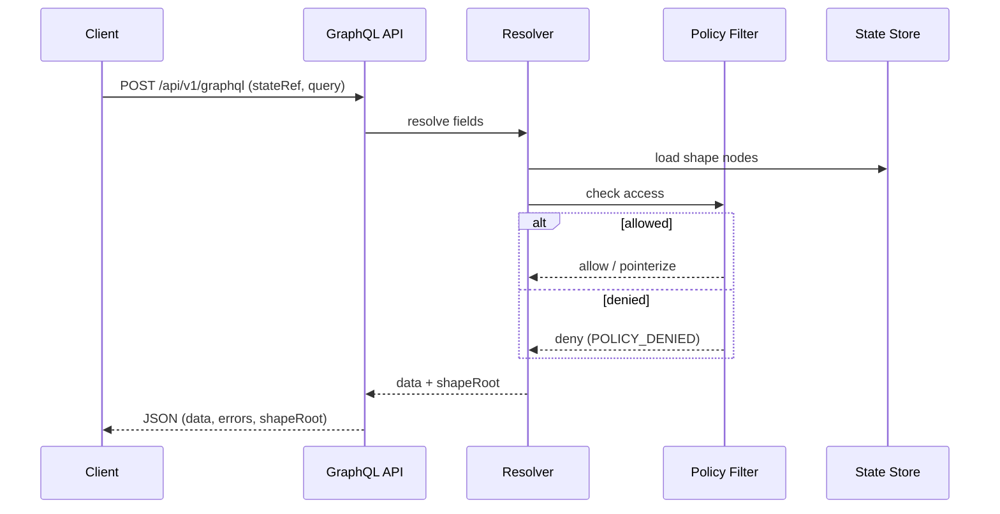

# ADR-0007: GraphQL State API (Read-Only)

## Scope
Expose a **read-only GraphQL API** for querying GATOS state snapshots (“shape”) with precise, single-roundtrip selection.

## Rationale
State is hierarchical and interlinked; GraphQL matches the access pattern and avoids REST under/over-fetching.

## Decision
1. **Endpoint**: `POST /api/v1/graphql`.
2. **Versioning & Schema**: HTTP header `x-gatos-api: v1`. The server publishes the canonical SDL at `GET /api/v1/graphql/schema` (checked into the repo under `api/graphql/schema.graphql`). Introspection stays enabled in non-production environments; in prod it is disabled and the SDL endpoint is authoritative.
3. **State Targeting**: Every query **MUST** include one of:
   - `stateRef: "<commit-sha>"` (recommended), or
   - `refPath: "refs/gatos/state/public/<ns>/<channel>"` (server resolves to head).
4. **Object Identity**: `id` fields are stable content IDs: `<ns>:<path>:<digest>`.
5. **Pagination**: Relay connections for lists; cursors are opaque, HMAC-signed. `first`/`last` arguments are clamped to `[1, 500]` (default 100). Ordering is deterministic (lexicographic by path unless a field specifies a different order). Requests exceeding the limit return `USER_INPUT_ERROR` with message "PAGE_LIMIT_EXCEEDED".
6. **Pointer Handling**: Opaque pointers (ADR-0004) resolve to a dedicated `OpaquePointerNode { kind, algo, digest, location, capability }`. The API **MUST NOT** download private blobs automatically.
7. **AuthZ Behaviour**: Policy filters (ADR-0003/0004) apply per field. If the actor lacks read access:
   - When a pointerized projection exists, return the `OpaquePointerNode` and append a GraphQL error with `code: "POLICY_DENIED"`.
   - When no projection exists, return `null` and append the same error. Clients **MUST** inspect `errors[]` to detect truncation.
8. **Caching**: `ETag` = `Shape-Root` of the resolved state and the response body **MUST** include `shapeRoot` and `stateRefResolved` top-level fields. `Cache-Control: immutable` applies to historical `stateRef`; `refPath` responses are `Cache-Control: no-cache` so clients revalidate.
9. **Errors**: Deterministic JSON error extensions:
   - `POLICY_DENIED` (403)
   - `STATE_NOT_FOUND` (404)
   - `PAGE_LIMIT_EXCEEDED` (422)
   - `INVALID_STATE_REF` (400)
   - `INTERNAL_ERROR` (500, last resort)
   Each error entry includes `extensions.code` and `extensions.ref` (support ULID).
10. **Rate Limits**: Default 600 requests / 60s window per actor, enforced via shared limiter. Policy rules may override per namespace/project; responses include `X-RateLimit-Remaining` headers.

## Consequences
- Clients can build efficient UIs without bespoke endpoints.
- Server complexity moves into resolvers and policy filters.

## Open Questions
- Field deprecation cadence.
