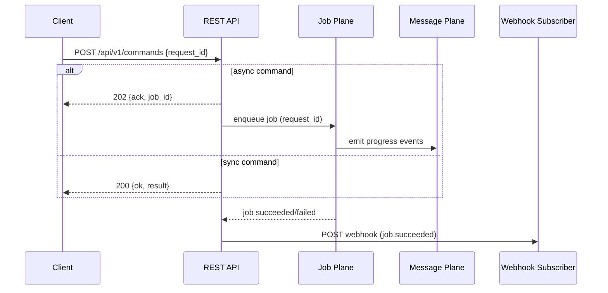

# ADR-0008: REST Commands & Webhooks

## Scope
Define a minimal **REST mutation surface** for commands and a **webhook** mechanism for outbound events.

## Rationale
Commands are side-effecting; REST is adequate and tool-friendly. Integrations need push-based notifications.

## Decision
1. **Command Endpoint**: `POST /api/v1/commands`
   - Body conforms to `schemas/v1/api/command_envelope.schema.json`.
   - Semantics:
     - Default async: return 202 + `{ "ack": true, "job_id": "<ulid>", "state_ref": "<sha>" }` within 200 ms.
     - Optional synchronous mode: when `sync=true` and the command’s budget <= 3s, return 200 + `{ "ok": true, "result": {...}, "state_ref": "<sha>" }`.
   - `expect_state` enforces optimistic concurrency; if the current state head differs, respond 409 `EXPECT_STATE_MISMATCH` and include `current_state` in the body.
   - **Idempotency**: `request_id` **MUST** dedupe within a rolling 24h window. The server stores the last response keyed by `request_id`/actor; duplicates return the cached payload.
2. **Result Plumbing**: Long work **SHALL** create a Job (ADR-0002) and stream progress on the Message Plane (ADR-0005) with trailers linking back to `request_id`.
3. **Webhooks**:
   - CRUD endpoints: `POST /api/v1/webhooks` (create), `GET /api/v1/webhooks` (list), `DELETE /api/v1/webhooks/{id}` (revoke), `POST /api/v1/webhooks/{id}/rotate` (secret rotation).
   - Event payloads obey `schemas/v1/api/webhook_delivery.schema.json`.
   - Normative event names: `proposal.created`, `approval.created`, `grant.created`, `grant.revoked`, `job.created`, `job.claimed`, `job.succeeded`, `job.failed`, `state.folded`, `state.failed`.
   - Delivery: HTTP POST with headers `X-GATOS-Event`, `X-GATOS-Delivery`, `X-GATOS-Signature: sha256=<hex>` (HMAC). Consumer must respond within 10s. Retries: exponential backoff (1s, 5s, 30s, 5m) up to 5 attempts; afterwards the delivery is parked in a dead-letter queue visible via `GET /api/v1/webhooks/{id}/dlq`.
4. **AuthN/Z**: OAuth2/JWT bearer tokens, validated against ADR-0003 policy. Scopes map to command prefixes (e.g., `locks:*`, `jobs:*`). Webhook secrets are per subscription; rotation takes effect immediately and old secrets expire after 5 minutes.
5. **HTTP Codes**: `202` (async ack), `200` (sync success), `400` (schema validation error), `401/403` (auth failures), `409` (`EXPECT_STATE_MISMATCH`), `422` (`COMMAND_UNSUPPORTED`), `500` (unhandled).

## Auth Scopes & Webhook DLQ Operations
1. **OAuth2 Scope Matrix**

| Scope | Command Prefixes / Resources | Notes |
| :--- | :--- | :--- |
| `locks:*` | `locks.acquire`, `locks.release`, `locks.status` | Required for any mutation touching refs guarded by the watcher plane. |
| `jobs:*` | `jobs.claim`, `jobs.complete`, `jobs.retry` | Grants access to job lifecycle commands plus Message Plane job topics. |
| `policy:*` | `policy.evaluate`, `policy.override` | High-privilege scope gated by ADR-0003 trust rules; only issued to governance automation. |
| `state.export` | `state.export`, `state.fold.force` | Limited-use scope for export/fold operators; cannot touch locks/jobs. |
| `webhooks:*` | `GET/POST/DELETE /api/v1/webhooks*` | Needed to CRUD webhook subscriptions and manage DLQ entries. |

Servers MUST reject commands whose prefix is not covered by the caller’s scope set; errors return `401` with `WWW-Authenticate: scope="missing-scope"`.

2. **Dead-Letter Queue Management**
   - **Visibility**: `GET /api/v1/webhooks/{id}/dlq` lists parked deliveries newest-first, capped at 500 entries. Each entry includes `delivery_id`, `event`, `attempts`, `last_error`, and `expires_at`.
   - **Replay**: `POST /api/v1/webhooks/{id}/dlq/{delivery_id}/replay` moves the entry back to the active queue immediately and increments an `operator_replay` counter recorded under `refs/gatos/audit/webhooks/<id>/<ulid>`.
   - **Purge**: `DELETE /api/v1/webhooks/{id}/dlq/{delivery_id}` permanently removes the entry (audited with the same trail as replay). Full purge requires `webhooks:*` scope and emits a governance event when more than 50 entries are deleted at once.
   - **Retention**: Entries auto-expire after 30 days; the DLQ sweeper emits a `webhook.dlq.expired` event for observability.
   - **Alerting**: When a DLQ exceeds 100 entries or the oldest entry is >24h, the system emits `state.failed` + `webhook.dlq.threshold` events so operators can wire alerts without polling.

## Consequences
- Clean separation of **mutations** (REST) vs **reads** (GraphQL).
- Webhooks unlock automation without polling.

## Open Questions
- None at this stage.
