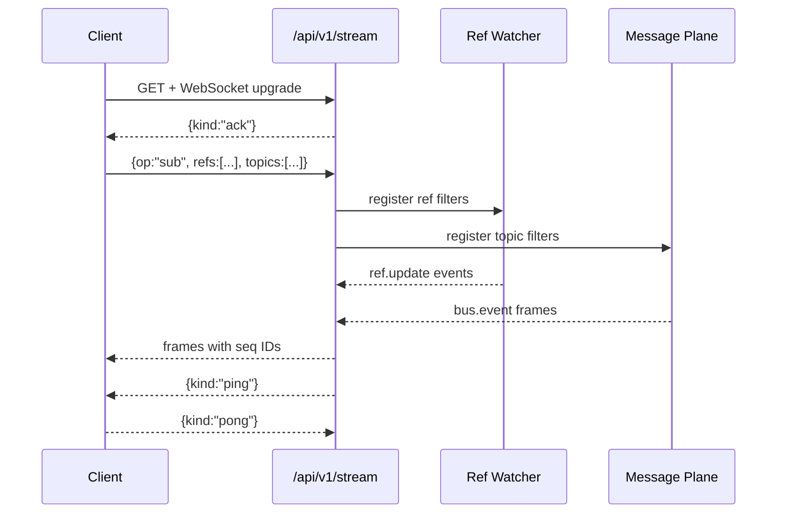

# ADR-0009: Real-Time Streams & Ref Subscriptions

## Scope
Provide **WebSocket** streams for ref updates and bus topics to enable reactive UIs and workers.

## Rationale
UIs and workers need near-real-time updates without wasteful polling.

## Decision
1. **Endpoint**: `GET /api/v1/stream` → WebSocket (JSON frames defined in `schemas/v1/api/stream_frame.schema.json`).
2. **Subscribe/Unsubscribe** frames:
   ```json
   {"op":"sub","refs":["refs/gatos/state/public/**"],"topics":["gatos.jobs.*"],"sinceSeq":1000}
   {"op":"unsub","refs":[...],"topics":[...]}
   ```
   - `sinceSeq` replays missed frames within the last 10 minutes (server clamps).
   - Subscriptions are additive and capped at 20 refs + 20 topics per connection.
3. **Server → client frames** (examples):
   ```json
   { "kind":"ref.update","ref":"refs/gatos/state/public/ui/main","old":"<sha>","new":"<sha>","seq":123,"ts":"<iso8601>" }
   { "kind":"bus.event","topic":"gatos.jobs.pending","payload":{...},"seq":124,"ts":"<iso8601>" }
   { "kind":"error","code":"POLICY_DENIED","message":"..." }
   ```
4. **Delivery**: At-least-once with monotonic `seq` per connection; clients MUST dedupe.
5. **Replay**: `sinceSeq` replays buffered frames up to `STREAM_REPLAY_LIMIT` (default 1,000 frames or 10 minutes, whichever comes first). Requests beyond the window respond with `error` frame `code="REPLAY_EXPIRED"` and start streaming live.
6. **AuthZ**: Same policy filters as GraphQL. Forbidden refs are silently dropped and an `error` frame with `code="POLICY_DENIED"` is emitted once per ref/topic to inform the client.
7. **Heartbeat & Backpressure**: Server sends `ping` every 30s; clients MUST reply within 10s or the connection is closed. Frames include a `credit` field when the server asks clients to apply backpressure (default window 1,000 outstanding frames).

8. **Errors & Close Codes**: Protocol errors result in immediate close with WebSocket code `1008`. The final frame MAY include `{kind:"error", code:"INVALID_SUB", message:"..."}`.

## Federated Streaming Semantics
1. **Seq & Credit Propagation**
   - Federation proxies treat their upstream node as a virtual client: they forward `sub` frames and maintain a local `seq_proxy` counter while the origin node keeps `seq_origin`. Frames forwarded downstream include both values (`seq_origin` inside payload, `seq_proxy` in the envelope) so clients can dedupe after failover.
   - Backpressure travels hop-by-hop. When a client sends `credit: N`, the proxy immediately decrements its local window and only propagates a refreshed credit upstream once it drains the buffered frames. This prevents head-of-line blocking across tenants.
   - If a proxy exhausts credit while waiting on the downstream client, it pauses reads from the upstream socket and emits `kind:"ping", credit:0` every 5s to signal stalling. Upstream nodes close idle links after 30s with `1001`.
2. **Replay Windows Across Hops**
   - On reconnect, clients include `sinceSeq=<last seq_proxy>`. The proxy first replays from its buffer; if the requested range predates its retention, it escalates to the origin via `sinceSeq=<mapped seq_origin>`. Should the origin also lack history, the proxy emits `{kind:"error", code:"REPLAY_EXPIRED", missingSeq:<id>}` to the client and instructs it to fall back to a full ref sync before resubscribing.
   - Proxies cache up to 10k frames or 15 minutes (whichever is smaller). When upstream expiry occurs mid-hop, the proxy logs `refs/gatos/audit/stream/replay_miss/<ulid>` and publishes a `stream.replay.miss` message so ops teams can tune buffers.
3. **Diagram Update**
   - Add an auxiliary Mermaid diagram titled "Federated Stream" introducing a `Proxy` participant between Client and Stream. Show credit propagation (`Client -> Proxy -> Stream`) and two `alt` blocks: `Replay hit` (Proxy responds locally) and `Replay expired` (Proxy requests upstream, receives miss, emits error). This supplements the base diagram without duplicating it.



## Consequences
- Reactive UX and workers with minimal glue.
- Requires sequence indexing on the server side.

## Open Questions
- Cross-node streaming for federation (see ADR-0012) — do we bridge or require local subscription?
