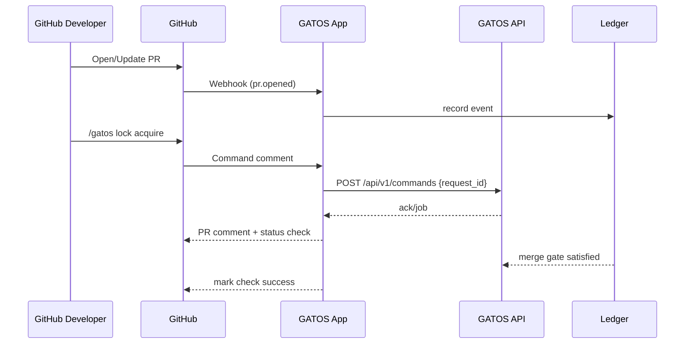

# ADR-0010: First-Class GitHub App Integration

## Scope
Define a **GitHub App** that enforces policy, brokers commands, and mirrors necessary context into the ledger.

## Rationale
Most teams live on GitHub; native enforcement and UX reduce friction.

## Decision
1. **Permissions & Webhooks**
   - GitHub App permissions:
     - Read: Pull requests, Commit statuses, Checks, Issues, Metadata.
     - Write: Commit statuses, Checks, Issue comments (for bot replies).
     - **MUST NOT** request Contents:write; repository content changes still flow through Git.
   - Webhooks subscribed: `pull_request`, `pull_request_review`, `status`, `check_suite`, `issue_comment`, `push`.
   - Each webhook POST → `POST /api/v1/commands` or `/api/v1/webhooks` internal mapping that logs an event under `refs/gatos/events/github/<ulid>`.

2. **Command Triggers & UX**
   - Slash commands: `/gatos <command> [args]` or fenced code blocks starting with `git mind`.
   - The App validates actor permissions via ADR-0003 policy before forwarding to `POST /api/v1/commands`.
   - Responses: short PR comment summarizing result + link to Message Plane topic `gatos.github/<pr#>/<request_id>` for full logs.
   - Failed commands MUST set a temporary GitHub Status `gatos/command` to `failure` with details.

3. **Checks & Merge Gates**
   - Required checks per PR: `gatos/policy`, `gatos/fold`, `gatos/jobs`, `gatos/locks`.
   - `gatos/policy`: passes when all governance rules referenced by the PR diff have quorum Grants.
   - `gatos/fold`: passes when Proof-of-Fold (ADR-0014) exists for target state.
   - `gatos/jobs`: ensures required Jobs (ADR-0002) have succeeded.
   - `gatos/locks`: verifies there are no outstanding `locks.acquire` commands pending on files touched by the PR.
   - Merge button is disabled until all required checks succeed; the App **MUST** set `required_status_checks.strict=true` via GitHub API.

4. **Ledger Mirroring**
   - Webhook payloads are normalized and committed to `refs/gatos/events/github/<ulid>` so the ledger contains a full audit trail of PR history.
   - Mapping examples:
     - `pull_request.opened` → `events/ns=github, kind=pr.opened` with PR metadata.
     - `pull_request_review.submitted` → `events/ns=github, kind=review.submitted`.
   - These events feed downstream automation (Message Plane topics `gatos.github.events`).

5. **Attestations & Artifacts**
   - When a Job completes with Proof-of-Execution, the App uploads an artifact to the PR (`gatos-poe-<request_id>.txt`) referencing the digest.
   - Fold proofs post an annotation linking to `refs/gatos/audit/proofs/folds/<state>`.

7. **Configuration (`.gatos/github.yaml`)**
   ```yaml
   repo:
     org: gatos
     name: demo
   checks:
     required: ["gatos/policy", "gatos/fold", "gatos/jobs", "gatos/locks"]
   commands:
     aliases:
       lock: "locks.acquire"
       release: "locks.release"
   permissions:
     allow_commenters: ["team/leads", "user:alice"]
   ```
   - This file is versioned and interpreted by the App to scope commands, aliases, and allowed actors per repo.

6. **Security & Operations**
   - App private key stored in HashiCorp Vault (or equivalent). Rotation every 90 days; automation triggers `POST /api/v1/github/rotate` to reload credentials.
   - Installation tokens cached for ≤1 hour; refresh proactively at 45 minutes.
   - All outbound calls to GitHub use conditional requests (`If-None-Match`) to stay within rate limits.
   - The App MUST verify GitHub webhook signatures (SHA256) before processing.

## Approvals Mapping & Multi-Repo Operations
1. **PR Approvals ↔ Governance Approvals**
   - Disabled by default. `.gatos/github.yaml` may enable bridging via:
     ```yaml
     approvals:
       map_pull_request_reviews: true
       reviewers:
         - github:team/leads -> trust:@leads
         - github:user:alice -> trust:actor:alice
       ttl: PT72H
     ```
   - When enabled, each `APPROVED` review counts as a `grant.approval` envelope for the mapped trust actor **only if** the reviewer’s GitHub identity resolves in the trust graph. Revoked/rotated keys invalidate outstanding approvals immediately.
   - Bridged approvals inherit quorum rules from ADR-0003; if the governance policy requires 2-of-3, the App must see two distinct mapped actors before marking `gatos/policy` passing. Non-mapped reviewers contribute comments only.
   - Removal of a mapped approval (e.g., reviewer changes mind) creates a compensating `grant.revocation` event and forces re-evaluation.

2. **Multi-Repo Queue Partitioning**
   - Each installation maintains a shard per repository consisting of: `watcher-queue`, `command-queue`, `check-queue`. Shards are weighted by outstanding PR count (≥1 queue per 50 open PRs).
   - Worker pods pull from shards using weighted fair scheduling: latency-sensitive queues (`command-queue`) get 50% of slots, `check-queue` 30%, `watcher-queue` 20% by default; operators can override via `.gatos/github.yaml queues { weights: ... }`.
   - Cross-repo storms are mitigated by backpressure: when a shard exceeds 5k pending items or 2 minutes of lag, the App emits `gatos.github.queue.backpressure` events and temporarily downgrades lower-priority shards until lag <30s.
   - Audit commits under `refs/gatos/audit/github/queues/<repo>/<ulid>` capture rebalancing operations so SREs can trace why work moved across shards.



## Consequences
- One consistent control point for GitHub-centric teams.
- Another moving part to maintain (secrets, webhooks, scale).

## Open Questions
- Optional mapping of GH approvals → governance approvals (off by default)?
- Federation: how do installations spanning many repos share a single watcher queue?
