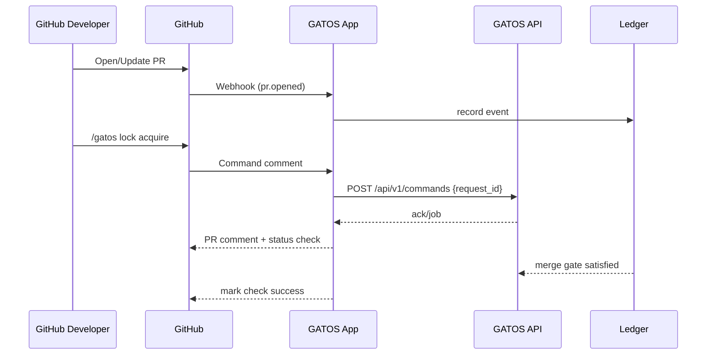

# ADR-0010: First-Class GitHub App Integration

## Scope
Define a **GitHub App** that enforces policy, brokers commands, and mirrors necessary context into the ledger.

## Rationale
Most teams live on GitHub; native enforcement and UX reduce friction.

## Decision
1. **Capabilities**:
   - Read PRs, reviews, comments; write status checks; limited content permissions.
   - Webhook ingestion → map to ledger events (`pr.opened`, `review.submitted`, etc.).
2. **Command Triggers**:
   - PR comment prefix `git mind ...` or `/gatos ...` → hits `POST /api/v1/commands`.
   - Responses posted as PR comments (summarised) + status checks.
3. **Policy Enforcement**:
   - `gatos-policy` exposes `merge_gate` check; the app **MUST** block merges until grants exist for gated actions (ADR-0003).
   - Status checks: `gatos/policy`, `gatos/fold`, `gatos/jobs`.
4. **Attestations**:
   - Job and fold proofs surfaced as artifacts/annotations with digest links.
5. **Security**:
   - Rotate app secrets, least-privilege scopes, per-repo installation.

## Consequences
- One consistent control point for GitHub-centric teams.
- Another moving part to maintain (secrets, webhooks, scale).

## Open Questions
- Optional mapping of GH approvals → governance approvals (off by default)?
