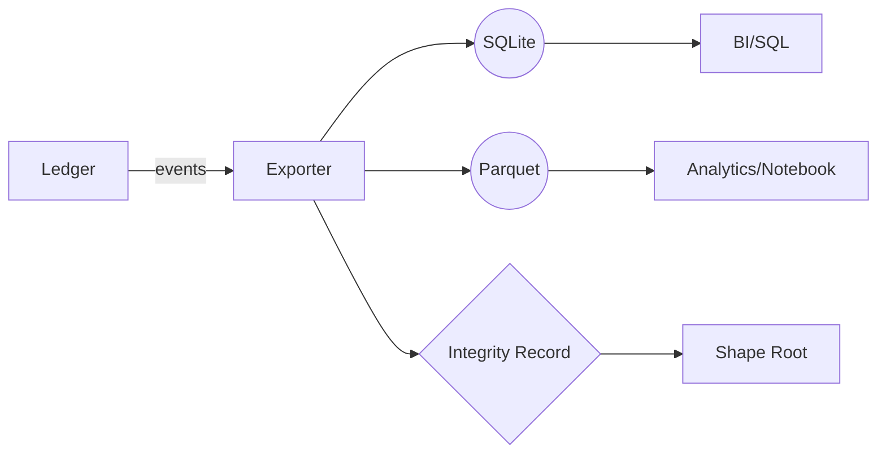

# ADR-0011: GATOS-to-SQL/Parquet Exporter

## Scope
Provide an **exporter** that materializes the ledger and state into **SQLite** and/or **Parquet** for analytics.

## Rationale
Teams want ad-hoc analytics without learning internals; SQL + columnar files cover 95% of needs.

## Decision
1. **CLI**: `gatos export --format sqlite|parquet --out <path> [--since <sha>]`
2. **Schema (SQLite)**:
   - `commits(id, parent_id, author, ts, msg, trailers JSON)`
   - `events(id, ns, kind, payload JSON, commit_id)`
   - `state_nodes(id, path, digest, shape JSON, state_ref)`
   - `pointers(digest, location, capability, state_ref)`      # ADR-0004
   - `jobs(id, status, started_at, finished_at, proof_digest)`# ADR-0002
   - `governance(proposals, approvals, grants, revocations)`  # ADR-0003
3. **Incremental**: `--since` resumes from last exported commit.
4. **Determinism**: Stable ordering; integrity table with exported root SHA.

## Consequences
- Easy dashboards, BI, notebooks.
- Must be careful not to leak private overlay data (only pointer metadata exported).

## Open Questions
- Do we support query pushdown (pre-filtered exports) in v1?
