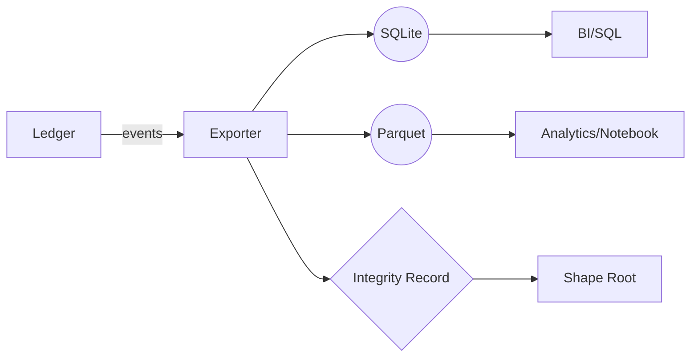

# ADR-0011: GATOS-to-SQL/Parquet Exporter

## Scope
Provide an **exporter** that materializes the ledger and state into **SQLite** and/or **Parquet** for analytics.

## Rationale
Teams want ad-hoc analytics without learning internals; SQL + columnar files cover 95% of needs.

## Decision
1. **CLI**: `gatos export --format sqlite|parquet --out <path> [--since <sha>] [--tables commits,events,...]`
   - Writes an export manifest alongside the export (`<out>.manifest.json`) conforming to `schemas/v1/export/export_manifest.schema.json`.
   - `--since` defaults to the last export’s `state_ref` recorded in the manifest when present.
2. **SQLite Schema** (columns are strictly typed, `NOT NULL` unless marked optional):
   - `commits(id TEXT PRIMARY KEY, parent_id TEXT, author TEXT, ts INTEGER, message TEXT, trailers JSON)`
   - `events(id TEXT PRIMARY KEY, ns TEXT, kind TEXT, payload JSON, commit_id TEXT REFERENCES commits(id))`
   - `state_nodes(id TEXT PRIMARY KEY, path TEXT, digest TEXT, shape JSON, state_ref TEXT)`
   - `pointers(digest TEXT PRIMARY KEY, location TEXT, capability TEXT, state_ref TEXT)`
   - `jobs(id TEXT PRIMARY KEY, status TEXT, started_at INTEGER, finished_at INTEGER, proof_digest TEXT)`
   - `governance_proposals(id TEXT PRIMARY KEY, payload JSON, commit_id TEXT)` (similar tables for approvals/grants/revocations)
   - All tables include `created_ts` and `updated_ts` for audit.
3. **Parquet Layout**:
   - Mirror table structure; partition by `state_ref` for `state_nodes` and by day for `events` to optimise Spark/Trino queries.
   - Compression: ZSTD level 3; dictionary encoding enabled.
4. **Incremental Semantics**:
   - `--since <sha>` includes events with `commit_id` strictly greater than `<sha>` (topo order).
   - If a job re-runs with the same `id`, the exporter updates/inserts rows idempotently.
5. **Determinism & Integrity**:
   - Rows sorted by primary key; SQLite `PRAGMA user_version` stores the exporter version.
   - Integrity table `export_info(state_ref TEXT, commit_start TEXT, commit_end TEXT, shape_root TEXT, exported_at TEXT)`.

## Security & Resource Envelope
1. **Data Boundaries**
   - Exporter walks only canonical ledger/state; private overlays stay pointerized. Any blob referenced by an opaque pointer is emitted as metadata (`digest`, `location`, `capability`) and never dereferenced; attempts to pull bytes result in a hard failure logged under `refs/gatos/audit/export/<ulid>`.
   - IAM: the CLI/daemon requires a dedicated `state.export` capability grant scoped to the target namespace. S3/GCS destinations must enforce bucket policies preventing public reads; parquet exports inherit those credentials via short-lived federated tokens (≤1h).

2. **Resource Planning**
   - Guidance: expect ~2.5× repo size for Parquet (due to columnar replication) and ~1.2× for SQLite. A repo with 1M events / 200k state nodes consumes ~15 GB Parquet, ~7 GB SQLite. The exporter caps memory use at 1 GB by chunking rows per table; operators can override via `--batch-size`.
   - Latency budget: 1 minute per 100k events on SSD-backed runners. Long-running exports emit `export.progress` events every 30s so CI can enforce SLAs.

3. **Example Artifacts**
   - Manifest snippet:
     ```json
     {
       "$schema": "https://gatos.io/schemas/v1/export/export_manifest.schema.json",
       "format": "sqlite",
       "state_ref": "0123456789abcdef0123456789abcdef01234567",
       "commit_range": { "start": "0000...0000", "end": "fedcba9876543210fedcba9876543210fedcba98" },
       "tables": { "commits": true, "events": true, "state_nodes": true, "pointers": true, "jobs": false, "governance": true },
       "created_at": "2025-11-17T12:00:00Z"
     }
     ```
   - Canonical table definition (SQLite):
     ```sql
     CREATE TABLE commits (
       id TEXT PRIMARY KEY,
       parent_id TEXT,
       author TEXT NOT NULL,
       ts INTEGER NOT NULL,
       message TEXT NOT NULL,
       trailers JSON NOT NULL,
       shape_root TEXT NOT NULL,
       created_ts INTEGER NOT NULL,
       updated_ts INTEGER NOT NULL
     );
     ```



## Consequences
- Easy dashboards, BI, notebooks.
- Must be careful not to leak private overlay data (only pointer metadata exported).

## Open Questions
- Do we support query pushdown (pre-filtered exports) in v1?
