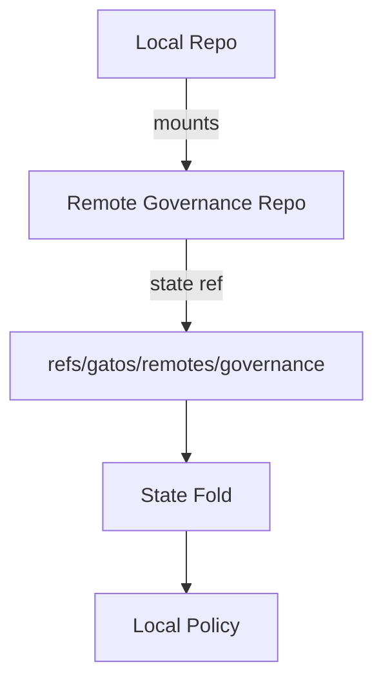

# ADR-0012: Federated Repositories & Mounts

## Scope
Allow a repository to **subscribe to** and **mount** public state from other repos/nodes.

## Rationale
Enables decentralized composition (e.g., central governance repo consumed by many project repos) without monorepos.

## Decision
1. **Config**: `.gatos/federation.yaml` declares mounts:
   ```yaml
   mounts:
     - name: governance
       source: "git+https://example.com/org/gov-repo.git#refs/gatos/state/public/policy/main"
       verify: "ed25519:<pubkey>"
       refresh: "PT5M"
   ```
2. **On-Disk Refs**:
   - `refs/gatos/remotes/<mount-name>/state/<ns>/<channel>` (read-only mirror).
3. **Resolution**:
   - Fetch at refresh cadence or on demand.
   - Verify signed commit against `verify` key in trust graph; reject otherwise.
4. **Usage**:
   - State folds can read mounted refs as input; mounts MUST NOT be mutated locally.
5. **UI/API**:
   - GraphQL exposes mounts under a separate namespace; streams emit updates when mount advances.



## Consequences
- Clean, verifiable cross-repo composition.
- Requires remote availability and verification logic.

## Open Questions
- Cycles between mounts (A mounts B, B mounts A) — forbid or handle with depth limits?
