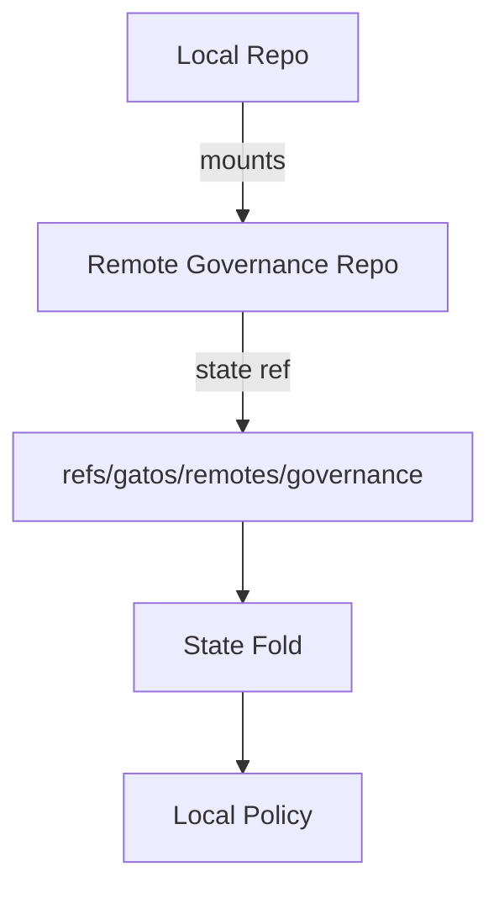

# ADR-0012: Federated Repositories & Mounts

## Scope
Allow a repository to **subscribe to** and **mount** public state from other repos/nodes.

## Rationale
Enables decentralized composition (e.g., central governance repo consumed by many project repos) without monorepos.

## Decision
1. **Configuration** (`.gatos/federation.yaml`)
   - Validates against `schemas/v1/federation/mounts.schema.json`.
   ```yaml
   mounts:
     - name: governance
       source: "git+https://example.com/org/gov.git#refs/gatos/state/public/policy/main"
       verify: "ed25519:ABC123..."
       refresh: "PT5M"
       auth:
         kind: token
         token_env: GATOS_FED_TOKEN
       policy:
         trusted_refs:
           - "refs/gatos/state/public/policy/main"
         max_depth: 2
   ```
   - Cycles are prevented by `max_depth` (default 3); mounts referencing each other deeper than the limit fail validation.

2. **On-Disk Layout**
   - Mirror remote refs under `refs/gatos/remotes/<mount-name>/state/<ns>/<channel>`.
   - Metadata stored at `refs/gatos/remotes/<mount-name>/meta` including last fetch time and verified commit.

3. **Fetch & Verification Pipeline**
   - Mount daemon (`gatos mountd`) fetches `source` on startup and every `refresh` interval; manual `gatos mount sync <name>` triggers eager fetch.
   - Each fetched commit MUST include a signed trailer (per ADR-0003 trust graph); `verify` key (ed25519) is looked up in the trust graph. If signature fails, the mount is marked `stale` and not exposed to folds.
   - Only refs listed in `policy.trusted_refs` are tracked; others are ignored to prevent repo sprawl.

4. **Usage in Folds & APIs**
   - State folds reference mount refs via `refs/gatos/remotes/...` but treat them as read-only. Any attempt to commit to a mount ref MUST be rejected client-side and server-side.
   - GraphQL exposes mounts under `federation { mounts { name, state(ns, channel) } }`. WebSocket streams include `ref.update` frames when a mount advances.

5. **Failure Modes**
   - If mount fetch fails (auth/network), mark mount `degraded` and emit an event to `refs/gatos/audit/federation/<name>/<ulid>`.
   - Policy MUST support forcing a mount to `offline` when `max_depth` is exceeded to avoid cycles.



## Consequences
- Clean, verifiable cross-repo composition.
- Requires remote availability and verification logic.

## Open Questions
- Federation gossip: do we allow automatic mount discovery, or keep `.gatos/federation.yaml` manual only?
