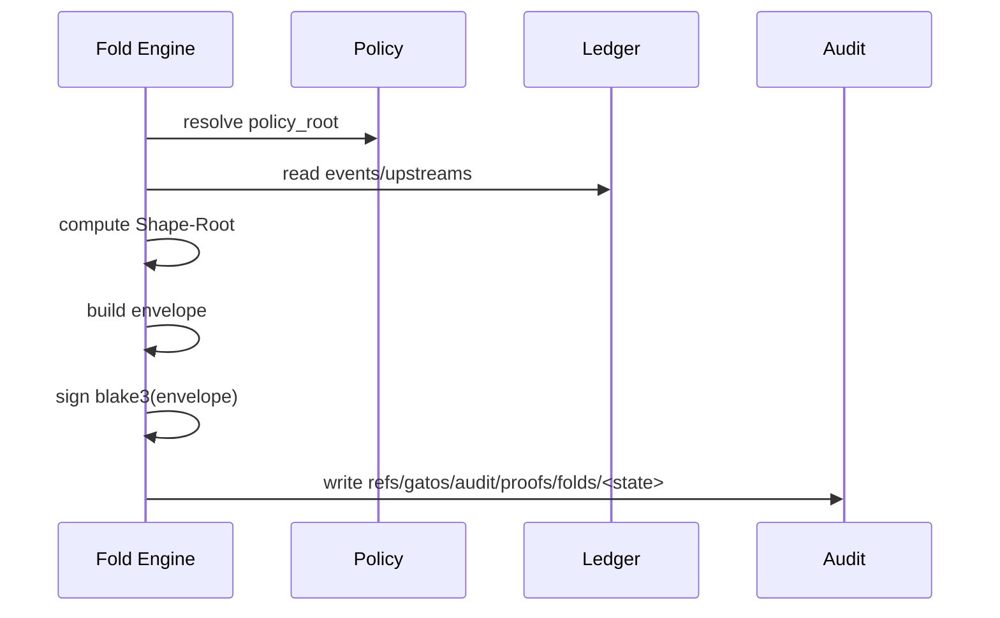

# ADR-0014: Proof-Of-Fold (Attestation of State)

## Scope
Define a **cryptographic attestation** for state folds that proves which code and inputs produced a given `Shape-Root`.

## Rationale
Jobs already attest execution (ADR-0002 PoE). Folds need equivalent integrity guarantees.

## Decision
1. **Envelope Contract** — canonical JSON defined in `schemas/v1/state/proof_of_fold_envelope.schema.json`:
   - `fold_id`: `blake3` hash of `(state_ref || policy_root || shape_root)`; matches `Shape-Root` when no downstream transforms exist.
   - `engine`: `{ program, version, platform }` describing the code + runtime that produced the fold. `program` **must** match the fold artifact ID the GitHub App advertises via ADR-0007/0008 APIs.
   - `policy_root`: commit that supplied policy + trust inputs.
   - `inputs.events[]`: ordered Git commits (`refs/gatos/journal/*`) included in this fold window.
   - `inputs.upstreams[]`: upstream state refs, including federation mounts (ADR-0012) and lazily folded units (ADR-0013). Values are Git refs so verifiers can fetch deterministically.
   - `output_shape_root`: deterministic digest of the resulting checkpoint.
   - `metrics`: lightweight execution stats (`units`, `duration_ms`).
   - `ts`: RFC3339 timestamp when the envelope is sealed.
   - `content_id`: canonical `blake3` of the encoded envelope bytes so later hops don’t recompute it.
2. **Engine Identity & Key Management**
   - Each fold executor advertises an `engine_id = ed25519:<pubkey>` that lives under `refs/gatos/trust/engines/<ulid>.json` alongside owner metadata, capabilities, and rotation history. Entries obey the same trust-graph validation as other actors (ADR-0003/0005).
   - `gatos trust issue-engine --name fold-runner-a` minting writes a grant that limits the engine to `fold.sign` and `fold.publish` capabilities.
   - Rotations (`gatos trust rotate-engine`) append `prev`→`next` links; revoked keys move to `refs/gatos/trust/revocations/<ulid>`. Proof verifiers MUST treat revoked keys as invalid even if older proofs exist.
   - Private keys stay inside an HSM or KMS-backed signer; the CLI receives detached signatures only.
3. **Signing & Publication Flow**
   - Engines sign `blake3(envelope_bytes)` using their active key. Git trailers on the state commit carry:
     - `Proof-Of-Fold: blake3:<digest>` (the `content_id`).
     - `Fold-Sig: ed25519:<sig>#engine:<engine_id>` to bind signature + issuer.
   - The full envelope and signature are committed under `refs/gatos/audit/proofs/folds/<state-ref>/proof.json`.
   - A summary message is published to the message plane (`refs/gatos/messages/proofs/fold/<ulid>`) so downstream systems (GitHub App webhooks, streaming API) can react without scanning refs.
4. **Verification Workflow** (`gatos fold verify <state-ref>`)
   1. Resolve `refs/gatos/audit/proofs/folds/<state-ref>` and load `proof.json`.
   2. Validate JSON against `schemas/v1/state/proof_of_fold_envelope.schema.json` (AJV inside the CLI / CI job).
   3. Recompute `content_id` and ensure it matches the trailer + stored digest.
   4. Resolve `engine_id` via the trust graph (`refs/gatos/trust/graph.json` + `refs/gatos/trust/engines/*`), confirm the key is active, and verify the ed25519 signature.
   5. Replay the fold deterministically (reusing ADR-0013 partial caches when available) and ensure the recomputed `Shape-Root` equals `output_shape_root`.
   6. Emit a verification report event to `refs/gatos/messages/proofs/fold/<ulid>` and expose the status through ADR-0007 GraphQL fields and ADR-0008 webhooks so the GitHub App integration can gate merges.
5. **Failure Modes & Observability**
   - Verification failures write structured commits under `refs/gatos/audit/proofs/folds/<state-ref>/failures/<ulid>` explaining whether the schema, signature, trust, or execution step failed.
   - CLI/daemon metrics mirror execution stats (`fold.verify.duration_ms`, `fold.verify.replays`).
   - Policy can require “verified” proofs before advancing `refs/gatos/state/*`; if this gate fires, `gatos watch` surfaces a `deny.write` event (per `schemas/v1/watch/events.schema.json`).

## Consequences
- Auditable state derivations; reproducibility at the protocol layer.
- Fold engine keys become first-class trust graph actors (issuance, rotation, revocation flows).
- Message plane consumers and the GitHub App can react to proof publication/verification without scraping refs.

## Open Questions
- Should we embed the WASM module hash + OCI digest inside `engine.program` for portable fold engines, or add a dedicated field?
- Do we need aggregate proofs that cover multiple state refs (e.g., nightly rollups), or is per-state sufficient for GA?
- How should we persist verification artifacts (logs, re-run traces) so remote verifiers can audit without replaying everything locally?
