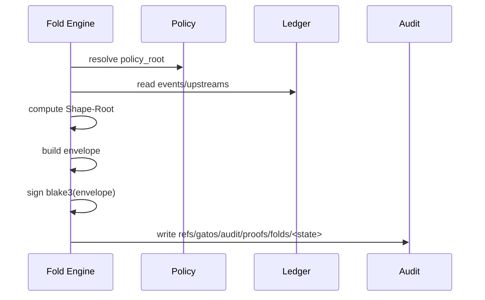

# ADR-0014: Proof-Of-Fold (Attestation of State)

## Scope
Define a **cryptographic attestation** for state folds that proves which code and inputs produced a given `Shape-Root`.

## Rationale
Jobs already attest execution (ADR-0002 PoE). Folds need equivalent integrity guarantees.

## Decision
1. **Envelope** (canonical JSON):
   - Serialized according to `schemas/v1/state/proof_of_fold_envelope.schema.json`.
   - Includes `content_id = blake3(envelope_bytes)` so downstream verification doesn’t re-hash.
2. **Signature**: Engine signs `blake3(envelope)` with its key; trailers:
   - `Proof-Of-Fold: blake3:<digest>`
   - `Fold-Sig: ed25519:<sig>`
3. **Storage**: Persist envelope under `refs/gatos/audit/proofs/folds/<state-ref>`.
4. **Verification**: `gatos fold verify <state-ref>` checks engine key in trust graph, envelope hash, and output match.

## Consequences
- Auditable state derivations; reproducibility at the protocol layer.
- Requires key management for fold engines.

## Open Questions
- Do we include WASM module hash for portable fold engines in v1?
- Should Proof-of-Fold signatures be batched (multi-unit proofs) or per-state only?
