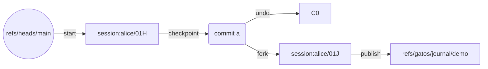
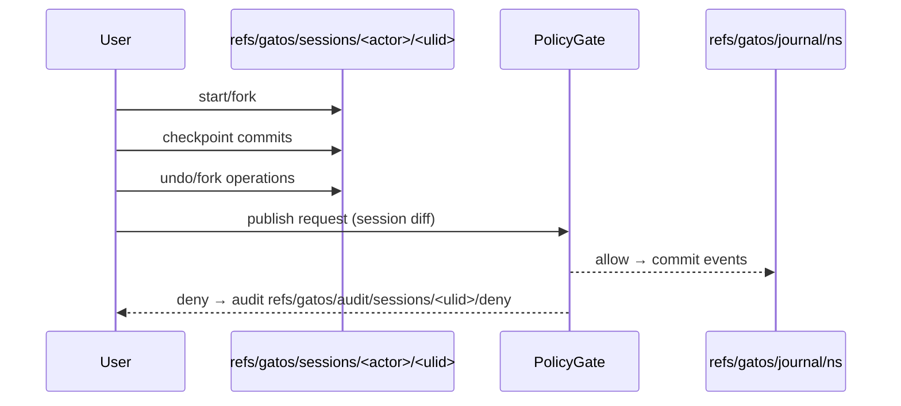

# ADR-0015: Sessions (Ephemeral Working Branches)

## Scope
Define the contract for **sessions** – ephemeral, actor-scoped working branches (`refs/gatos/sessions/<actor>/<ulid>`) that capture in-flight edits, enable deterministic undo/fork/merge flows, and integrate with governance and state folds without polluting canonical history.

## Rationale
Event sourcing alone is awkward for exploratory change. Engineers and researchers need scratch space to iterate, roll back, or branch experiments before elevating them into policy-gated events. Git already has branches, but mixing ungoverned branches with governed refs risks bypassing policy and determinism. Sessions create a narrow, deterministic lane for local mutation while keeping governance and state integrity intact.

## Decision
1. **Name & Layout**
   - Session refs live under `refs/gatos/sessions/<actor>/<ulid>`, where `<actor>` resolves via the trust graph (ADR-0003) and `<ulid>` is a monotonically increasing identifier per actor.
   - Each ref points to a linear commit stack authored locally; session commits MAY contain working files, staged state snapshots, or experiment artifacts.
2. **Lifecycle Commands**
   - `git gatos session start [--from <ref>]` creates a new session ref at `ref` (defaults to `refs/heads/main`). The command records metadata in `.gatos/session/<ulid>.json` with fields `{ base_ref, policy_root, fold_root }` pinned at creation time.
   - `git gatos session checkpoint` commits current worktree changes into the session ref with trailers `Session-Id`, `Policy-Root`, and `Fold-Root`. Watcher hooks (ADR-0006) ensure locked files remain read-only unless an active grant exists.
   - `git gatos session undo` performs a single-step revert inside the session ref, writing an `undo` trailer so tooling can distinguish deliberate rewinds from rebases.
   - `git gatos session fork` clones the current session into a new ULID, copying metadata and parent pointers. Fork metadata lists `parent_session` for traceability.
   - `git gatos session publish --to <namespace>` rebases the session commits onto the target governed namespace (e.g., `refs/gatos/journal/demo`). Publish uses the Policy Gate; denied publishes leave an audit event under `refs/gatos/audit/sessions/<ulid>/deny/<event-ulid>`.
3. **State & Policy Coupling**
   - Session metadata stores `policy_root` and `fold_root` captured at `start`. Tooling MUST warn when the live policy/fold root diverges; publishing requires revalidation or explicit `--accept-drift` that logs under `refs/gatos/audit/sessions/<ulid>/drift`.
   - Folding inside a session uses the local Echo runtime (ADR-0013) but records `Session-Shape-Root` commits under `refs/gatos/sessions/<actor>/<ulid>/state/<ns>/<channel>` so reproducibility checks can compare against canonical folds later.
4. **Merge Semantics**
   - Publishing a session creates a governance event referencing `Session-Id` so reviewers can trace its provenance.
   - Concurrent sessions touching overlapping footprints (ADR-0013) must merge via deterministic lattices or DPO joins. Conflicts the engine cannot auto-resolve yield `session.conflict` events referencing the conflicting paths; policy rules decide whether to abort or escalate.
5. **Garbage Collection & Retention**
   - Sessions auto-expire after 30 days of inactivity by default. Expiry writes a `session.expired` audit entry and deletes the ref after a configurable quarantine window (default 7 days). Operators can override per profile.

## Diagrams

## Consequences
- Provides deterministic scratch space with provenance, enabling local iteration without bypassing policy.
- Requires CLI + watcher support; publishing adds latency because policy revalidation runs on the combined session diff.
- Garbage collection policies must balance cleanliness with forensic needs; audit refs preserve history even after refs are deleted.

## Implementation Notes
- Session metadata lives under `.gatos/session/<ulid>.json`; deletion without publishing triggers a warning logged in `refs/gatos/audit/sessions/<ulid>/abandoned`.
- Hooks MUST prevent pushes of session refs to remotes other than the owner’s scratch remotes; canonical remotes reject `refs/gatos/sessions/**` to keep history clean.

## Open Questions
- Should session publishes support partial cherry-picks, or must entire session histories publish atomically?
- Do we enforce a hard limit on concurrent sessions per actor, or leave it to policy modules to decide?
