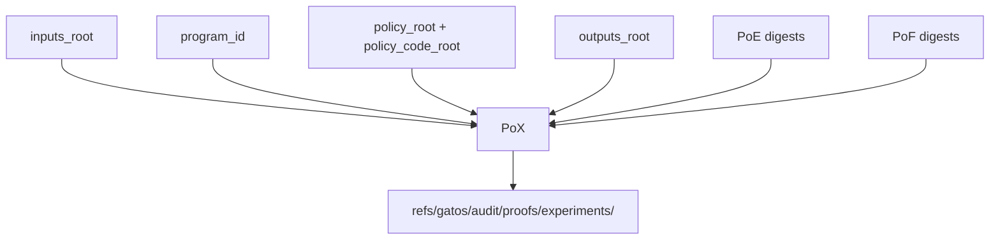
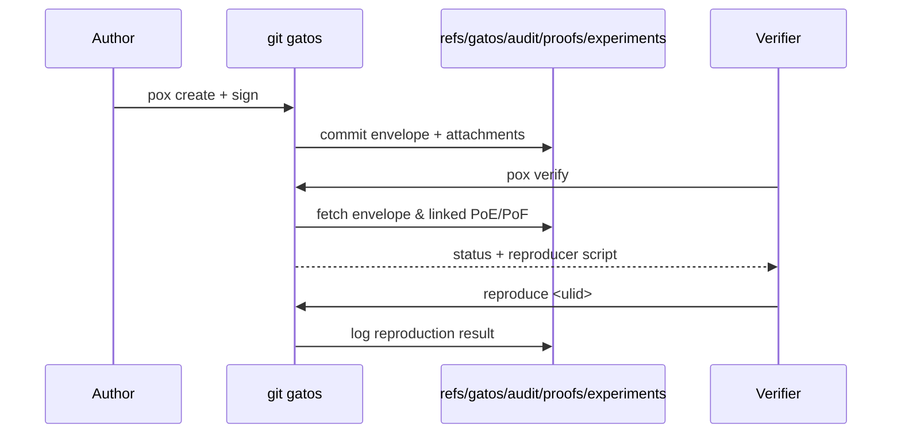

# ADR-0016: Proof-of-Experiment (PoX)

## Scope
Standardize the Proof-of-Experiment (PoX) envelope, CLI workflow, and storage conventions that tie inputs, policy, folds, jobs, and outputs into a reproducible scientific artifact.

## Rationale
Researchers need a verifiable, portable object that answers: *Which inputs and code produced these results under which policy, and can I replay it?* Without a canonical PoX, viewers cannot trust published figures, and automation cannot enforce reproducibility gates. PoE (jobs) and PoF (state) exist, but there is no top-level commitment linking them; PoX fills that gap.

## Decision
1. **Envelope Definition**
   - Canonical JSON schema `schemas/v1/proofs/pox_envelope.schema.json` with fields:
     - `type = "pox"`, `ulid`, `inputs_root`, `program_id`, `policy_root`, `policy_code_root`, `outputs_root`.
     - `links.poe[]` = array of Proof-of-Execution digests; `links.pof[]` = array of Proof-of-Fold digests.
     - Optional `metadata` map for lab notebook context (title, DOI, contact).
   - Canonicalization uses RFC 8785 JCS; the signed digest is `blake3(canonical_bytes)`.
2. **Storage & Refs**
   - PoX commits live under `refs/gatos/audit/proofs/experiments/<ulid>`. The commit tree contains `pox/envelope.json` plus optional attachments (`inputs.json`, `outputs.json`, etc.).
   - Commit trailers include `PoX-Id`, `Inputs-Root`, `Program-Id`, `Outputs-Root`, and `Policy-Root` for easy discovery.
3. **CLI Workflow**
   - `git gatos pox create --inputs <ref|path> --program <digest|container>` collects inputs (as pointer manifests), program fingerprints (OCI digest, WASM hash, etc.), outputs (state refs, opaque pointers), and referenced PoE/PoF ULIDs. Optionally attaches raw artifacts into `pox/<ulid>/`.
   - `git gatos pox sign --id <ulid> --key <actor>` signs the canonical envelope with the actor’s key (ed25519) and records the signature in the envelope `sig` field.
   - `git gatos pox verify --id <ulid>` checks signature validity, policy ancestry, and that all linked PoE/PoF digests exist and validate.
   - `git gatos reproduce <ulid>` orchestrates: fetch inputs (resolving opaque pointers via policy), replay jobs described by linked PoE entries, fold state checkpoints, and diff outputs.
4. **Integration Rules**
   - Policies may require PoX IDs on publish (e.g., research profile). Pre-receive hooks reject pushes missing corresponding PoX entries when `policy.require_pox` is true.
   - Explorer exports (ADR-0011) record the PoX ULID alongside derived tables to create an analytics lineage chain.
   - The GitHub App (ADR-0010) surfaces PoX verification status as a PR check when experiments touch governed namespaces.
5. **Reproduction Semantics**
   - Reproduction logs are written to `refs/gatos/audit/pox/<ulid>/repro/<run-ulid>` with metadata (timestamp, verifier, status, divergence summary).
   - Determinism expectations: successful reproduction must match `outputs_root`. Divergence stores the diff summary and references the offending PoE/PoF for debugging.

## Diagrams

## Consequences
- Establishes a reproducible artifact for publications and compliance.
- Requires deterministic hashing of inputs/programs; opaque pointers must supply plaintext digests or reproducibility fails.
- Additional storage under `refs/gatos/audit/proofs/experiments/**` increases repo size; pruning policies must preserve scientific records.

## Implementation Notes
- `program_id` accepts multiple encodings via tagged union: `wasm:`, `oci:`, `containerd:`. CLI normalizes to lowercase hex digests.
- Inputs/outputs can reference Explorer-Root manifests; when present, `inputs_root` is the explorer-root digest rather than raw blob hashes.

## Open Questions
- Should PoX enforce multi-signer signatures (e.g., PI + operator) by default or defer to policy requirements?
- Do we permit redacted attachments (e.g., private data) if the pointer manifests are public, or must all attachments be shareable?
