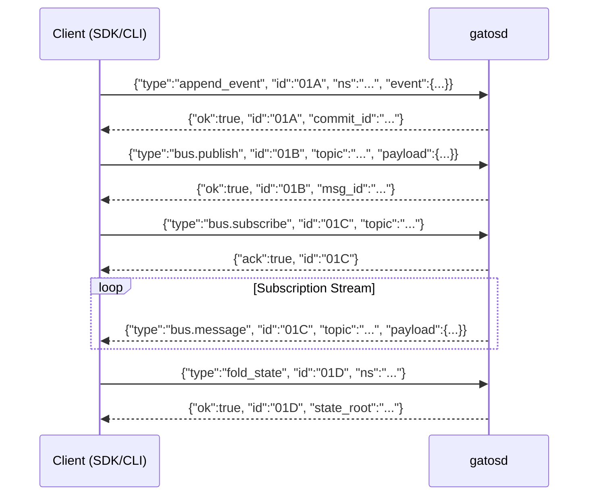
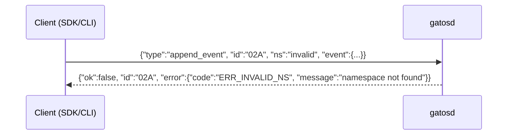

# GATOS API Interaction Model

<a id="gatos-api-interaction-model"></a>

<!-- AUTOGENERATED TOC START -->

- [Request/Response Flow](#request-response-flow)
- [Error Responses](#error-responses)

<!-- AUTOGENERATED TOC END -->

GATOS does not use a traditional RESTful API. Instead, it uses a JSONL (JSON Lines) RPC protocol for communication between clients (like SDKs or the CLI) and the `gatosd` daemon. Communication typically happens over `stdin`/`stdout` or a TCP socket.

This diagram illustrates the request/response flow for several key commands.

## Request/Response Flow

<a id="request-response-flow"></a>



## Error Responses

<a id="error-responses"></a>
All responses include an `ok` boolean. On failure, an `error` object is present:

```json
{"ok":false, "id":"02A", "error": {"code":"ERR_INVALID_NS", "message":"namespace not found"}}
```

Example flow with an error:


