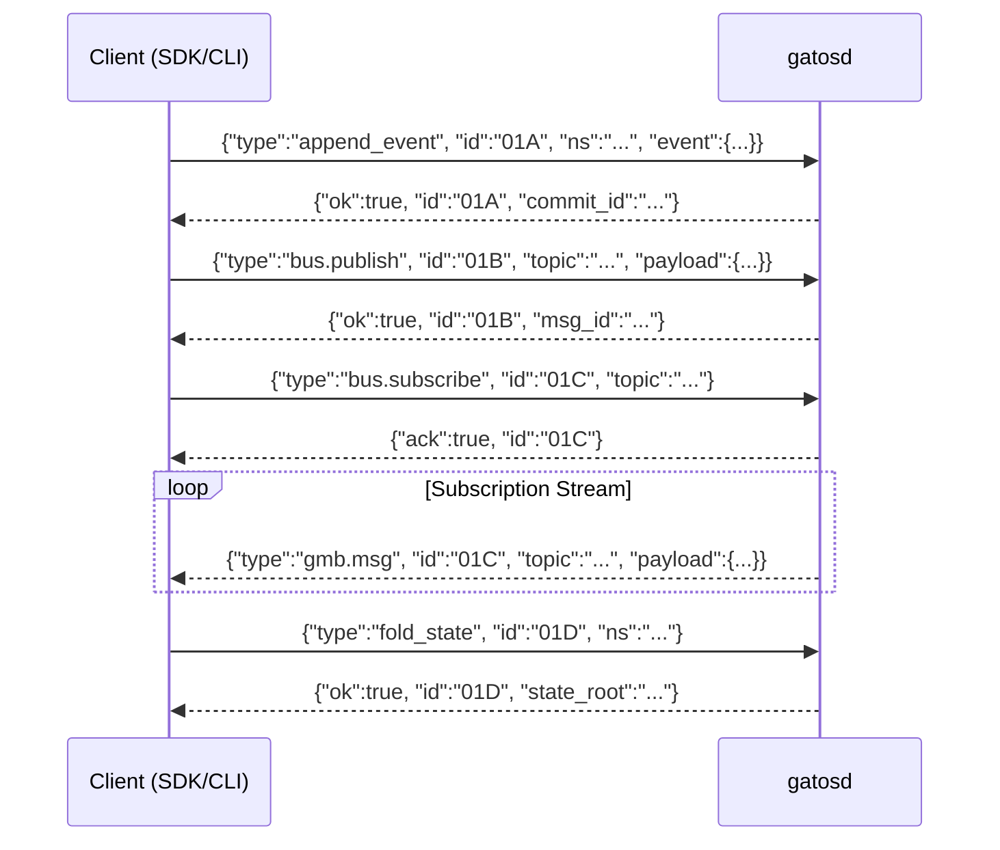

# GATOS API Interaction Model

GATOS does not use a traditional RESTful API. Instead, it uses a JSONL (JSON Lines) RPC protocol for communication between clients (like SDKs or the CLI) and the `gatosd` daemon. Communication typically happens over `stdin`/`stdout` or a TCP socket.

This diagram illustrates the request/response flow for several key commands.

