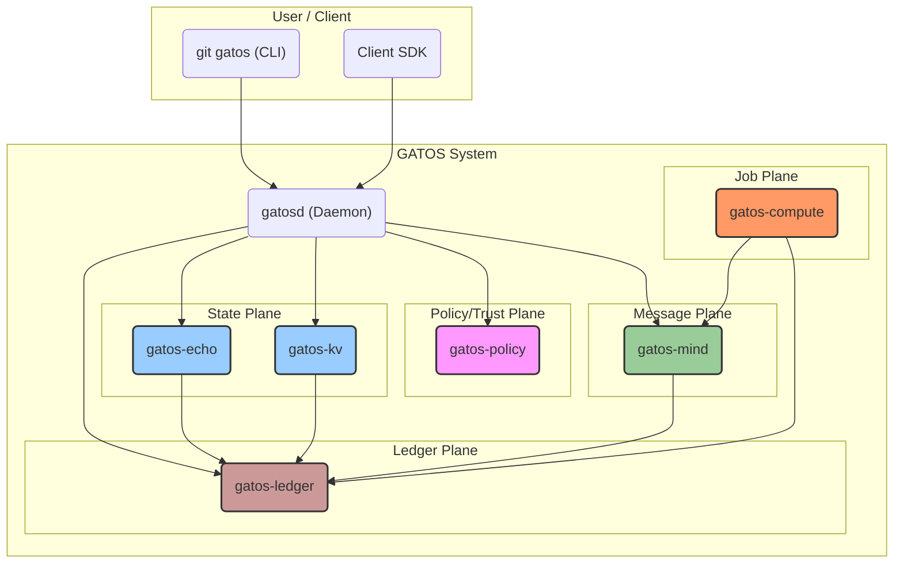

# GATOS System Architecture

This diagram illustrates the high-level architecture of the GATOS system, showing the core crates and how they map to the five conceptual planes.

```mermaid
graph TD
    subgraph "User / Client"
        CLI("git gatos (CLI)")
        SDK("Client SDK")
    end

    subgraph "GATOS System"
        Daemon("gatosd (Daemon)")

        subgraph "Ledger Plane"
            Ledger("gatos-ledger");
        end

        subgraph "Policy/Trust Plane"
            Policy("gatos-policy");
        end

        subgraph "State Plane"
            Echo("gatos-echo");
            KV("gatos-kv");
        end

        subgraph "Message Plane"
            Mind("gatos-mind");
        end

        subgraph "Job Plane"
            Compute("gatos-compute");
        end

        Daemon --> Policy;
        Daemon --> Echo;
        Daemon --> KV;
        Daemon --> Mind;
        Daemon --> Ledger;

        Echo --> Ledger;
        KV --> Ledger;
        Mind --> Ledger;
        Compute --> Mind;
        Compute --> Ledger;
    end

    CLI --> Daemon;
    SDK --> Daemon;

    style Policy fill:#f9f,stroke:#333,stroke-width:2px
    style Echo fill:#9cf,stroke:#333,stroke-width:2px
    style KV fill:#9cf,stroke:#333,stroke-width:2px
    style Mind fill:#9c9,stroke:#333,stroke-width:2px
    style Ledger fill:#c99,stroke:#333,stroke-width:2px
    style Compute fill:#f96,stroke:#333,stroke-width:2px
```
