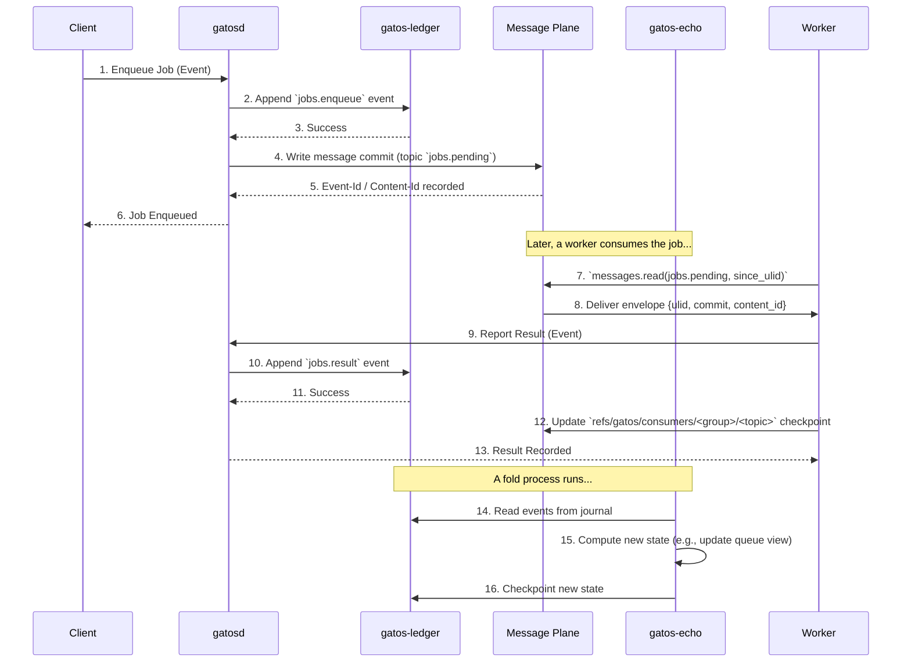

# GATOS Data Flow Example

This diagram shows an example data flow for a typical operation: enqueuing and processing a job.

```mermaid
sequenceDiagram
    participant Client
    participant Daemon as gatosd
    participant Ledger as gatos-ledger
    participant Bus as Message Plane
    participant State as gatos-echo

    Client->>Daemon: 1. Enqueue Job (Event)
    Daemon->>Ledger: 2. Append `jobs.enqueue` event
    Ledger-->>Daemon: 3. Success
    Daemon->>Bus: 4. Write message commit (topic `jobs.pending`)
    Bus-->>Daemon: 5. Event-Id / Content-Id recorded
    Daemon-->>Client: 6. Job Enqueued

    Note over Bus,State: Later, a worker consumes the job...

    participant Worker
    Worker->>Bus: 7. `messages.read(jobs.pending, since_ulid)`
    Bus->>Worker: 8. Deliver envelope {ulid, commit, content_id}
    Worker->>Daemon: 9. Report Result (Event)
    Daemon->>Ledger: 10. Append `jobs.result` event
    Ledger-->>Daemon: 11. Success
    Worker->>Bus: 12. Update `refs/gatos/consumers/<group>/<topic>` checkpoint
    Daemon-->>Worker: 13. Result Recorded

    Note over Ledger,State: A fold process runs...
    State->>Ledger: 14. Read events from journal
    State->>State: 15. Compute new state (e.g., update queue view)
    State->>Ledger: 16. Checkpoint new state
```
