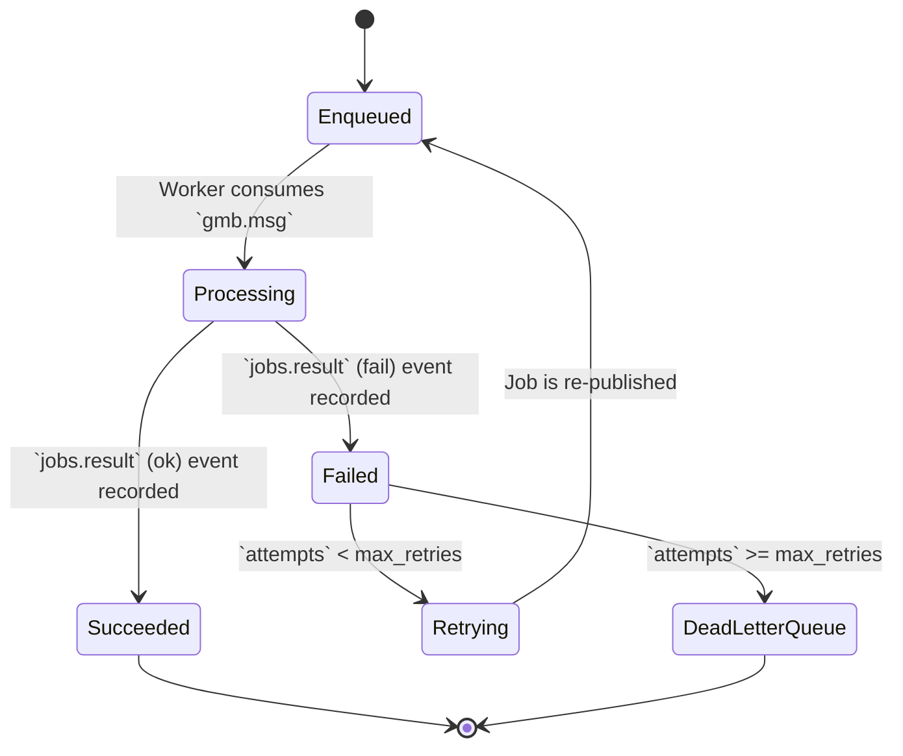

# GATOS State Management Example

This diagram illustrates how the state of an entity (in this case, a Job) transitions based on events recorded in the GATOS ledger. This is a conceptual model; the actual state is derived by a "fold" process running in `gatos-echo`.

