# GATOS State Management Example

<!-- AUTOGENERATED TOC START -->

- [Event Schema](#event-schema)
- [Retry Policy](#retry-policy)
- [State Computation](#state-computation)

<!-- AUTOGENERATED TOC END -->

This diagram illustrates how the state of an entity (in this case, a Job) transitions based on events recorded in the GATOS ledger. This is a conceptual model; the actual state is derived by a "fold" process running in `gatos-echo`.

```mermaid
stateDiagram-v2
    [*] --> Enqueued

    Enqueued --> Processing: Worker consumes `bus.message`
    Processing --> Succeeded: `jobs.result` (ok) event recorded
    Processing --> Failed: `jobs.result` (fail) event recorded

    Succeeded --> [*]
    Failed --> Retrying: `attempts` < max_retries
    Failed --> DeadLetterQueue: `attempts` >= max_retries

    Retrying --> Enqueued: Job is re-published
    DeadLetterQueue --> [*]
```

## Event Schema

- jobs.enqueued: `{ "job_id": "<ULID>", "payload": { ... } }`
- jobs.result: `{ "job_id": "<ULID>", "ok": true|false, "attempts": <u32> }`

## Retry Policy

- Default `max_retries`: 3 (configurable per deployment).
- Transition to `Retrying` when `attempts < max_retries`.
- Transition to `DeadLetterQueue` when `attempts >= max_retries`.

## State Computation

State is derived by folding ledger events in `gatos-echo` using a deterministic reducer that updates `attempts` and terminal state based on `jobs.result.ok` and `attempts` compared to `max_retries`.
