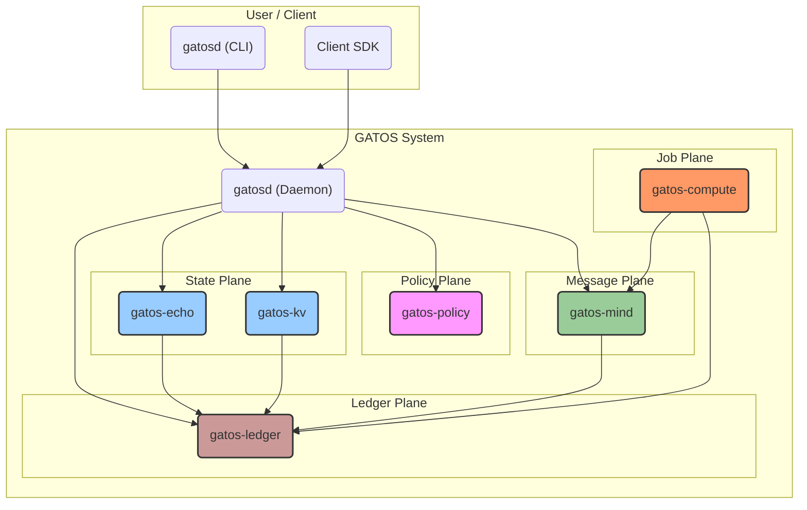

# Chapter 1: The GATOS System Model

**GATOS**, or **Git As The Operating Surface**, is an architectural system that transforms a Git repository into a complete, distributed backend. It provides a programmable environment where data, business logic, and operational history all converge into a single, unified fabric.

Think of this fabric as the **operating surface**. It's a malleable, version-controlled reality where every change is a deliberate **fold**, creating a new, verifiable **shape**. At its core, GATOS is defined by a disciplined layout of Git refs and a set of rules for interacting with them. The system is orchestrated by a central daemon, **`gatosd`**, which exposes a simple JSONL RPC protocol. This allows various clients, from human-operated CLIs to automated AI agents, to "converse" with the repository in a structured and auditable manner.

The architecture is best understood as **five planes**—distinct but interconnected layers of this operating surface, each with a specific responsibility.

## The Five Planes

1.  **The Ledger Plane (`gatos-ledger`)**
    This is the foundation of GATOS. It is an append-only, immutable journal of all **events** that occur in the system. Every action, from a user command to a job result, is recorded as a cryptographically signed commit. This provides a complete and verifiable audit trail, forming the single source of truth from which all other states are derived.

2.  **The State Plane (`gatos-echo`, `gatos-kv`)**
    This plane is responsible for computing the current "state" of the system. It performs a **fold**—a pure, deterministic function that processes the event stream from the Ledger Plane to produce a canonical state snapshot. Like folding a piece of paper in origami, each fold transforms the surface, creating a new, verifiable **shape** (represented by a `state root` hash). Because the fold is deterministic, any node can independently replay the ledger and arrive at the exact same shape, ensuring consistency without a central coordinator.

3.  **The Policy Plane (`gatos-policy`)**
    This is the governance and security layer. Before any event is written to the ledger, it must pass through the Policy Plane. This plane evaluates a set of rules, also stored in the Git repository, to determine if an action is allowed. It can enforce complex rules, such as requiring N-of-M signatures from a group of maintainers before a critical operation (like a production deployment) is permitted.

4.  **The Message Plane (`gatos-mind`)**
    This plane provides a commit-backed, asynchronous publish/subscribe message bus. It allows different parts of the GATOS system, as well as external agents, to communicate reliably. For example, when a new job is scheduled in the Job Plane, a message is published to a topic on the message bus, allowing available workers to discover and claim the job.

5.  **The Job Plane (`gatos-compute`)**
    This plane manages the lifecycle of distributed, asynchronous tasks. A job is defined as a manifest in the repository and scheduled by writing an event to the ledger. A **`gatos-compute`** worker process discovers the job via the Message Plane, executes it, and records the result (including any proofs of execution) back into the ledger. This allows GATOS to orchestrate and audit work performed by a fleet of distributed workers.

## The GATOS Philosophy

By structuring the system into these five planes and building them on top of Git, GATOS achieves several powerful properties:

*   **Auditability:** Every action is a signed commit.
*   **Determinism:** State is a pure function of history.
*   **Decentralization:** The entire system is contained within a Git repository and can be synchronized via standard `git push/pull`.
*   **Programmability:** The system's behavior is defined by schemas, policies, and fold specifications that are themselves version-controlled code.

The following chapters will explore each of these planes in greater detail, showing how each contributes to shaping the GATOS operating surface.