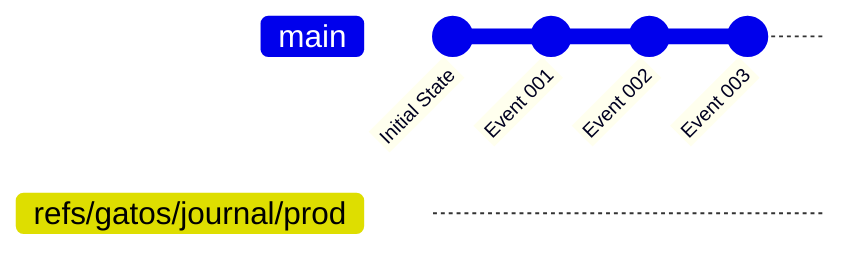
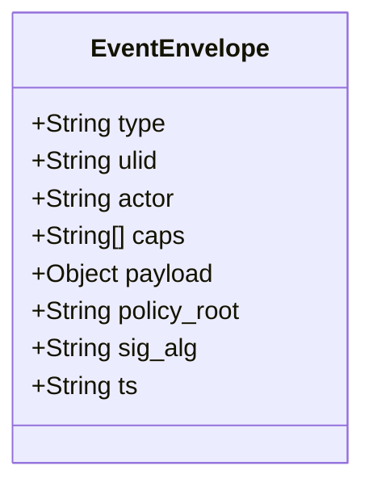

# Chapter 2–The Ledger Plane: An Immutable History

<!-- AUTOGENERATED TOC START -->

- [Git as an Append-Only Log](#git-as-an-append-only-log)
- [The Event Envelope](#the-event-envelope)
  - [Canonicalization and Signing (DAG-CBOR)](#canonicalization-and-signing-dag-cbor)
- [The gatos-ledger Crate](#the-gatos-ledger-crate)
- [The Workflow: Appending an Event](#the-workflow-appending-an-event)
- [Summary](#summary)

<!-- AUTOGENERATED TOC END -->

The **Ledger Plane** is the bedrock of the GATOS system. It is the immutable, append-only journal where all significant actions are recorded as cryptographically signed **events**. This plane provides the verifiable source of truth from which all other state is derived. The primary component responsible for this plane is the **`gatos-ledger`** crate.

## Git as an Append-Only Log

The core function of the Ledger Plane is to record a sequence of events in a way that is both permanent and tamper-evident. Instead of using a traditional database or a complex blockchain, GATOS leverages the fundamental properties of Git itself to achieve this.

1. **Events as Commits:** Every event written to the ledger is a Git commit. The commit message contains a structured **`EventEnvelope`** with the event's type, payload, actor, and other metadata.
2. **Cryptographic Chain:** Each new commit has the previous event's commit as its parent. This creates a linked list of commits, where the hash of each commit depends on the entire history that came before it. Any attempt to alter a past event would change its hash, which would in turn change the hash of every subsequent commit, breaking the chain and making the tampering immediately obvious.
3. **Custom Refspace:** To keep the ledger separate from source code, all journal entries are stored under a dedicated Git ref namespace: `refs/gatos/journal/`. This allows for granular organization, for example, by namespace and actor (`refs/gatos/journal/<namespace>/<actor>`).
4. **Fast-Forward Only:** The GATOS system enforces a **fast-forward only** policy on all journal refs. This means that history can only be added to; it can never be rewritten or reordered. This is the key to ensuring the immutability of the ledger.

The following diagram illustrates how events are appended to a journal ref, forming a simple, linear, and unbreakable chain of history.

> Note:
> Diagrams on this site are pre-rendered as static SVGs. The `gitGraph` source
> requires Mermaid 10+ at build time, but no client-side Mermaid renderer is
> needed to view the diagram.

## The Event Envelope

Every action in GATOS is initiated by an **`Event`**. This event is wrapped in a standardized **`EventEnvelope`** before being committed to the ledger. This envelope contains all the necessary metadata for processing and auditing.

- **`type`**: A string identifying the kind of event (e.g., `jobs.enqueue`, `policy.approve`).
- **`ulid`**: A universally unique, lexicographically sortable identifier for the event.
- **`actor`**: The identity of the user, agent, or service that initiated the event.
- **`caps`**: A list of capability tokens held by the actor, used by the Policy Plane to authorize the action.
- **`payload`**: The domain-specific data for the event.
- **`policy_root`**: The hash/commit of the policy state that was used to approve this event.
- **`sig_alg`**: The signature algorithm used (e.g., `ed25519`).
- **`ts`**: Timestamp of authorship (monotonic per ref).

### Canonicalization and Signing (DAG-CBOR)

- Canonical form: Events are encoded as **DAG-CBOR**. The canonical bytes are used for hashing and signing.
- Content addressing: `Event-CID = cidv1(dag-cbor, blake3(canonical_bytes))`.
- Signing: The signature is computed over the canonical DAG-CBOR bytes with the `sig` field omitted and recorded in commit trailers.
- Recommended commit trailers:
  - `Event-CID: cidv1:...`
  - `Sig-Alg: ed25519`
  - `Sig: ed25519:<hex|base64>`

## The `gatos-ledger` Crate

The **`gatos-ledger`** crate provides the core logic for interacting with the Ledger Plane. It is composed of two main parts:

- **`gatos-ledger-core`:** A `no_std` compatible crate that defines the pure, platform-agnostic data structures (like the `EventEnvelope`) and traits.
- **`gatos-ledger-git`:** An adapter that implements the ledger storage backend using `libgit2`. It handles the creation of commits, atomic updates of refs, and signature verification.

This separation of concerns, a hallmark of the GATOS architecture, ensures that the core logic is portable and testable, while the specific storage implementation can be swapped out if needed.

## The Workflow: Appending an Event

When a client sends a command to `gatosd`, the following happens in the Ledger Plane:

1. **Event Creation:** The daemon constructs a full `EventEnvelope`, including the actor, payload, and capabilities.
2. **Policy Check:** The event is passed to the Policy Plane. If the action is denied, the process stops, and an audit entry is created. If allowed, the Policy Plane returns a `policy_root` hash.
3. **Signing:** The canonicalized event (with the `policy_root`) is signed by the actor's key.
4. **Commit:** `gatos-ledger` creates a new Git commit with the signed event as its message.
5. **Atomic Ref Update:** `gatos-ledger` performs an atomic compare-and-swap operation (`git update-ref <old> <new>`) to update the appropriate journal ref to point to the new commit, ensuring the fast-forward-only guarantee.

## Summary

The Ledger Plane is the immutable foundation of GATOS. By using Git's own robust, distributed, and cryptographically secure data structures, `gatos-ledger` provides a powerful and elegant solution for creating a complete and verifiable history of every action in the system. This auditable log is the essential input for all other planes, enabling the deterministic state folds and governance checks that make GATOS a truly trustworthy operating surface.
