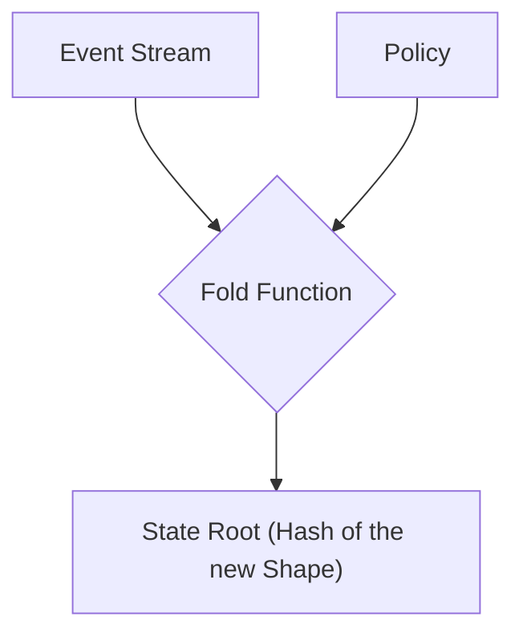
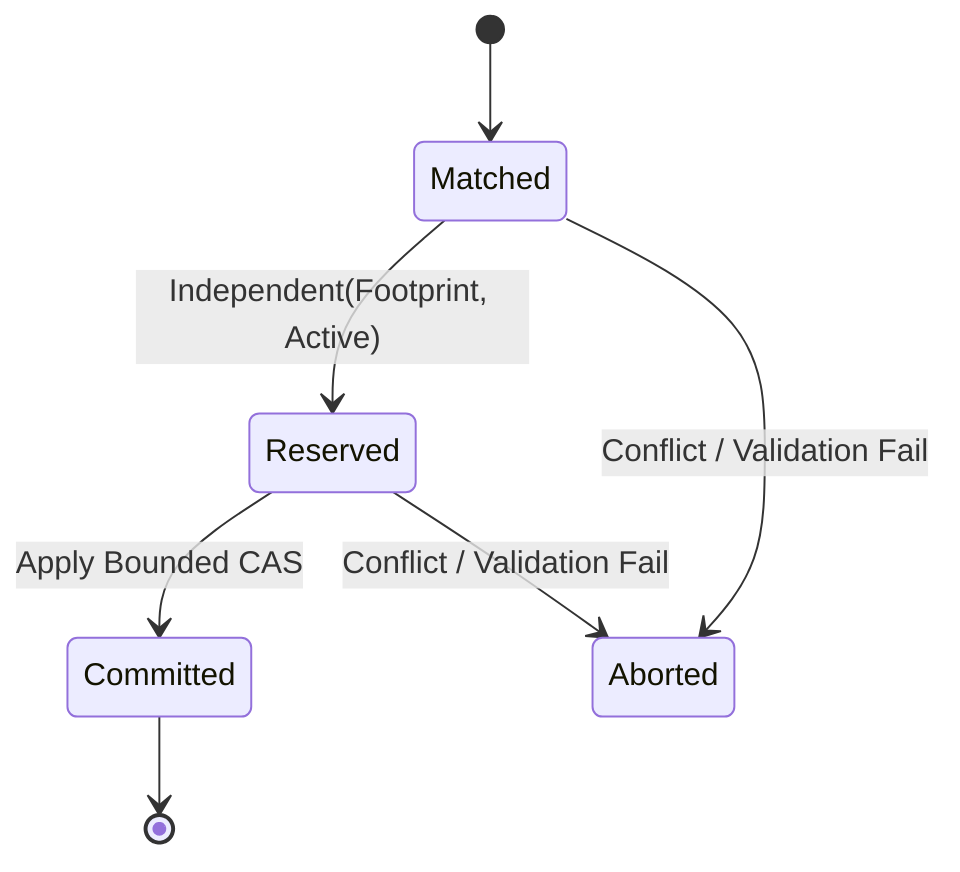

# Chapter 3: The State Plane: Deterministic Folds
<a id="chapter-3-the-state-plane-deterministic-folds"></a>

<!-- AUTOGENERATED TOC START -->
- [The Fold: From History to State](#the-fold-from-history-to-state)
- [The Echo Engine: `gatos-echo`](#the-echo-engine-gatos-echo)
  - [Concurrency and State Transitions](#concurrency-and-state-transitions)
- [The Key-Value Store: `gatos-kv`](#the-key-value-store-gatos-kv)
- [State Checkpoints](#state-checkpoints)
  - [Checkpoint Trailers (Recommended)](#checkpoint-trailers-recommended)
  - [Tiny DPO Example](#tiny-dpo-example)
- [Summary](#summary)

<!-- AUTOGENERATED TOC END -->

<a id="chapter-3-the-state-plane-deterministic-folds"></a>


> _Folding the Operating Surface into new shapes_

The Ledger Plane provides an immutable history of every event that has ever occurred. However, a raw event log is not always a useful representation of the *current* state of the world. The role of the **State Plane** is to process this event log and compute a single, canonical, and verifiable snapshot of the system's state at a given point in time.

This process is called a **fold**. A fold takes the linear history of the ledger and, like origami, creases and transforms it into a new, complex, and meaningful **shape**.

## The Fold: From History to State
<a id="the-fold-from-history-to-state"></a>

<a id="the-fold-from-history-to-state"></a>

A fold is a pure, **deterministic** function that takes two inputs:

1.  A stream of events from the Ledger Plane.
2.  A specific version of the system's policies from the Policy Plane.

It processes these events in order and produces a single output: a **state root**, which is the cryptographic hash of the resulting state shape.



The key property of a fold is its determinism. Given the exact same sequence of events and the same policy, the fold function **must** always produce the exact same state root, bit for bit. Same ledger and same `policy_root` ⇒ same `state_root`. This is the guarantee that allows GATOS to be a distributed system without requiring a central coordinator. Any node can independently and verifiably compute the state of the system by simply replaying the public ledger.

## The Echo Engine: `gatos-echo`
<a id="the-echo-engine-gatos-echo"></a>

<a id="the-echo-engine-gatos-echo"></a>

For complex, relational state, GATOS uses the powerful [**Echo** engine](https://github.com/flyingrobots/echo), provided by the **`gatos-echo`** crate. As we'll see in the chapter on the [GATOS Morphology Calculus](./CHAPTER-009.md), Echo is a **deterministic simulation engine** built on the concept of a **Recursive Metagraph (RMG)** and **Double Push-Out (DPO) graph rewriting**.

In the context of the GATOS State Plane, Echo works as follows:

1.  **State as a Graph:** The "world" is represented as a graph within the Echo engine's `GraphStore`. This graph *is* the operating surface.
2.  **Events as Rewrites:** Each event from the ledger is translated into one or more graph rewrite rules. For example, a `user.create` event becomes a rule that adds a new `user` node and its associated property edges to the graph.
3.  **Folding as Committing:** The Echo engine's `DeterministicScheduler` orders these rewrites and applies them to the graph. The `commit()` operation finalizes these changes, creating a new shape.
4.  **State Root as Snapshot Hash:** After the commit, Echo produces a `Snapshot` of the new graph state. The cryptographic hash of this snapshot is the GATOS **state root**.

This process, which GATOS refers to as a **meld**, is how the system evolves from one state to the next. When branches in the Git history are merged, the State Plane performs a meld — a deterministic fold-merge that reconciles two divergent shapes into one new, provably consistent shape.

### Concurrency and State Transitions
<a id="concurrency-and-state-transitions"></a>

<a id="concurrency-and-state-transitions"></a>

The `gatos-echo` engine manages state transitions with a precise understanding of concurrency, leveraging concepts like **Footprints**, **Ports**, and **Epochs**.

*   **Footprints:** Each rewrite rule declares its "footprint," which is a precise description of the nodes, edges, and ports it intends to read from or write to. This allows the scheduler to detect potential conflicts.
*   **Ports:** These represent boundary interfaces on nodes, allowing for fine-grained control over how rewrites interact. Two rewrites might touch different nodes but conflict if they try to access the same port on a shared boundary.
*   **Epochs:** GATOS uses monotonically increasing 64-bit counters (**`epoch_att`** for attachments, **`epoch_skel`** for skeleton) to manage coherent world-rollovers. Readers are bound to specific epoch counters, ensuring they never witness a partially updated or "torn" state. Writers only advance epochs after all changes are published, guaranteeing snapshot isolation.

The state transitions of a rewrite are managed through a series of phases:



*   **Matched:** A rewrite rule has found a pattern in the graph.
*   **Reserved:** The rewrite has passed independence checks against all currently active (Reserved or Committed) rewrites. Its footprint is now part of the "active frontier."
*   **Committed:** The rewrite's changes have been atomically applied to the graph.
*   **Aborted:** The rewrite failed independence checks or validation.

## The Key-Value Store: `gatos-kv`
<a id="the-key-value-store-gatos-kv"></a>

<a id="the-key-value-store-gatos-kv"></a>

Not all state is complex and relational. For simpler configuration, flags, or object storage, GATOS provides a Git-backed key-value store, **`gatos-kv`**. This component is an evolution of the `git-kv` "Stargate" project.

`gatos-kv` uses a different part of the Git repository (`refs/kv/*`) to store data. It provides an API for atomic `get`, `set`, and `mset` (multi-set) operations. While simpler than the Echo engine, it adheres to the same principles:

*   **Ledger-Based:** All writes to `gatos-kv` are still driven by events in the main GATOS ledger.
*   **Deterministic:** The state of the key-value store is also a deterministic result of the event history.
*   **Verifiable:** The entire KV store can be hashed to produce a verifiable state root.

The State Plane can use `gatos-echo` and `gatos-kv` in combination, choosing the right tool for the right kind of state, while ensuring that the entire system state remains deterministic and verifiable.

## State Checkpoints
<a id="state-checkpoints"></a>

<a id="state-checkpoints"></a>

The output of a fold is a **State Checkpoint**. This is a Git commit on a state ref (e.g., `refs/gatos/state/<namespace>`) that contains:

*   The materialized state artifacts (e.g., the graph data for Echo, or the tree of key-value pairs for `gatos-kv`).
*   A reference to the commit in the Ledger Plane that this state was folded from.
*   The final, canonical `state_root` hash in its commit message or trailers.

### Checkpoint Trailers (Recommended)
<a id="checkpoint-trailers-recommended"></a>

<a id="checkpoint-trailers-recommended"></a>

- `State-Root: blake3:<hex>`
- `Ledger-Head: <commit-oid>`
- `Policy-Root: <commit-oid>`
- `Fold-Engine: echo@<semver>`
- `Fold-Version: <schema-version>`

You can verify a checkpoint with `git gatos fold verify` (see ADR-0014: Proof-of-Fold).

### Tiny DPO Example
<a id="tiny-dpo-example"></a>

<a id="tiny-dpo-example"></a>

Before (subgraph):

```text
User(id=42)
Email(user=42, value="a@example.org")
```

Rule: `approve_user` — matches `User(id)` without `Approved(id)` and emits `Approved(id)`.

After (subgraph):

```text
User(id=42)
Email(user=42, value="a@example.org")
Approved(id=42)
```

These checkpoints provide an optimized way to access the current state without having to replay the entire event history every time. However, they are just a cache; the authoritative state can always be re-derived from the ledger.

## Summary
<a id="summary"></a>

<a id="summary"></a>

The State Plane is where the abstract history of the ledger is transformed into a concrete, queryable state. Through the deterministic fold process, the operating surface is given its new shape. Powered by the sophisticated `gatos-echo` graph engine and the practical `gatos-kv` store, GATOS ensures that all participants in the distributed system can independently arrive at a shared, verifiable understanding of reality.
