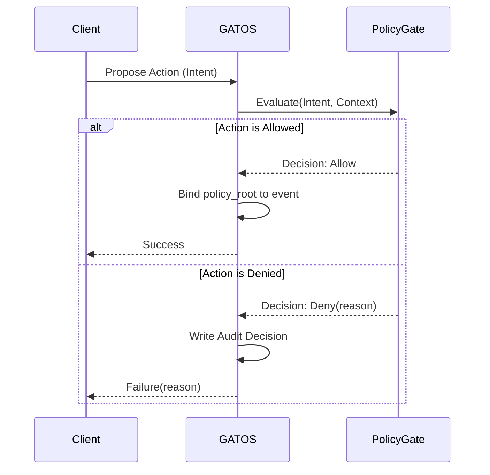
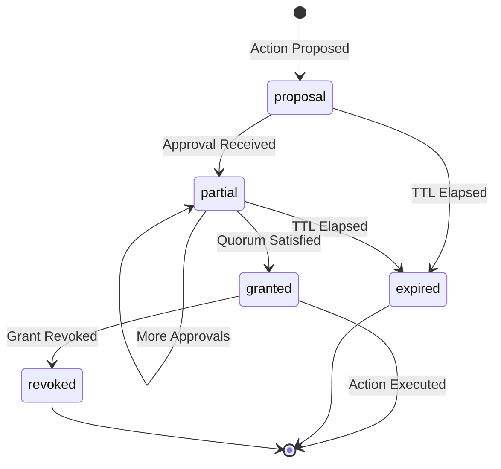

# Chapter 4: The Policy Plane: Governance as Code

<a id="chapter-4-the-policy-plane-governance-as-code"></a>

<a id="chapter-4-the-policy-plane-governance-as-code"></a>

<a id="chapter-4-the-policy-plane-governance-as-code"></a>

<!-- AUTOGENERATED TOC START -->

- [The Gate Contract](#the-gate-contract)
- [Capabilities and Grants](#capabilities-and-grants)
- [Key Management](#key-management)
- [Consensus Governance](#consensus-governance)
  - [Quorum Example (Deploy requires 2/3 of @leads)](#quorum-example-deploy-requires-23-of-leads)
- [Summary](#summary)

<!-- AUTOGENERATED TOC END -->

<a id="chapter-4-the-policy-plane-governance-as-code"></a>

In a distributed, multi-agent system like GATOS, it's not enough for actions to be recorded immutably. They must also be **authorized**. The **Policy Plane** is the governance layer of GATOS, responsible for enforcing rules, managing permissions, and orchestrating consensus. It acts as the set of physical laws governing the **operating surface**, ensuring that it can only be **folded** in valid ways. This plane is primarily managed by the **`gatos-policy`** crate.

## The Gate Contract

<a id="the-gate-contract"></a>

<a id="the-gate-contract"></a>

<a id="the-gate-contract"></a>
At the heart of the Policy Plane is the **Gate Contract**. Before any proposed event is committed to the ledger, it is presented to the Policy Gate for evaluation.

The gate's contract is simple:
`Decision = Gate.evaluate(intent, context) -> {Allow | Deny(reason)}`

- **Intent:** The `EventEnvelope` that the actor wishes to commit.
- **Context:** The current state of the world, including the actor's identity and the state of any relevant policies.

If the gate returns `Allow`, the event is signed with the hash of the policy that approved it (**`policy_root`**) and is then passed to the Ledger Plane to be recorded.

If the gate returns `Deny(reason)`, the event is rejected. Crucially, this denial is itself recorded as an auditable event in a separate `refs/gatos/audit/policy` journal. This means that even attempted policy violations leave a permanent, verifiable trace, embodying a **Zero Trust** security model.



## Capabilities and Grants

<a id="capabilities-and-grants"></a>

<a id="capabilities-and-grants"></a>

<a id="capabilities-and-grants"></a>
The Policy Plane uses a **capability-based security model**. Instead of complex access control lists, permissions are defined as simple, human-readable **capability tokens** (e.g., `jobs.enqueue`, `governance.approve`).

An actor can only perform an action if their `EventEnvelope` contains the required capability tokens.

How do actors get capabilities? Through **Grants**. A Grant is a signed, verifiable object that links an **`issuer`** (an actor with the authority to grant capabilities) to a **`subject`** (the actor receiving the capabilities). Grants have an expiration date and are stored in the Git repository under `gatos/trust/grants/`.

This model makes permissions explicit, portable, and auditable.

## Key Management

<a id="key-management"></a>

<a id="key-management"></a>

<a id="key-management"></a>
GATOS relies on strong, explicit key hygiene.

- **Issuance and Trust Roots:** Actor keys (e.g., `ed25519:<pubkey>`) are introduced via the trust graph (`gatos/trust/graph.json`). Groups (e.g., `@leads`) resolve against this graph.
- **Rotation Cadence:** Keys SHOULD be rotated on a regular cadence (e.g., quarterly). Rotations are committed as updates to the trust graph and distributed like any other state.
- **Revocation:** Revoked or compromised keys MUST be recorded under `refs/gatos/trust/revocations/` and propagated. The Policy Gate denies any action attested by a revoked key.
- **Grant Staleness:** Grants bind to a policy and trust snapshot. When the trust graph or policy changes (e.g., signer revoked), stale grants MUST be rejected by the Gate until re-authorized.

## Consensus Governance

<a id="consensus-governance"></a>

<a id="consensus-governance"></a>

<a id="consensus-governance"></a>
For particularly sensitive actions, a policy might require more than just a single actor's approval. GATOS supports **N-of-M consensus**, where a certain number of approvals from a defined group of actors is required.

This workflow is managed by the Policy Plane:

1. **Proposal:** An actor creates a **`Proposal`** commit, which describes the action they want to perform (e.g., deploy a new version of a service). This proposal is stored under `refs/gatos/proposals/`.
2. **Approval:** Members of the required group (e.g., `@leads`) create **`Approval`** commits, which are cryptographically signed attestations that reference the `Proposal-Id`. These are stored under `refs/gatos/approvals/`.
3. **Quorum Check:** The `gatos-policy` engine watches for new approvals. When the number of valid approvals for a proposal reaches the required threshold (the **quorum**), the policy is satisfied.
4. **Grant:** The engine then automatically creates a **`Grant`** commit. This grant contains a **Proof-of-Consensus**—a canonical hash of the proposal and all the valid approvals used to meet the quorum.
5. **Execution:** The original actor can now re-submit their event, this time presenting the `Grant` as proof that the action has been authorized by the group.



This entire process is orchestrated by the Policy Plane and recorded in Git, providing a fully transparent and verifiable governance workflow.

### Quorum Example (Deploy requires 2/3 of @leads)

<a id="quorum-example-deploy-requires-23-of-leads"></a>

<a id="quorum-example-deploy-requires-23-of-leads"></a>

<a id="quorum-example-deploy-requires-23-of-leads"></a>
Refs touched:

- Proposal → `refs/gatos/proposals/<ulid>`
- Approvals → `refs/gatos/approvals/<proposal-id>/<signer>` (one per signer)
- Grant → `refs/gatos/grants/<proposal-id>`

Proof-of-Consensus (PoC) envelope (canonical JSON):

```json
{
  "proposal": { "id": "blake3:<hex>", "action": "deploy.production", "target": "gatos://service/api" },
  "approvals": [
    { "signer": "ed25519:<pubkey-1>", "approval_id": "blake3:<hex>" },
    { "signer": "ed25519:<pubkey-2>", "approval_id": "blake3:<hex>" }
  ],
  "rule": "governance.deploy.production",
  "quorum": "2-of-3@leads"
}
```

Grant trailers include: `Proposal-Id`, `Grant-Id`, `Proof-Of-Consensus: blake3(envelope_bytes)`.

## Summary

<a id="summary"></a>

<a id="summary"></a>

<a id="summary"></a>
The Policy Plane is the brain of GATOS. It transforms the system from a simple event log into a true governance platform. By evaluating every action against a set of version-controlled rules and managing a capability-based security model, `gatos-policy` ensures that the GATOS operating surface is not just deterministic and auditable, but also secure and compliant with the defined rules of the system.
