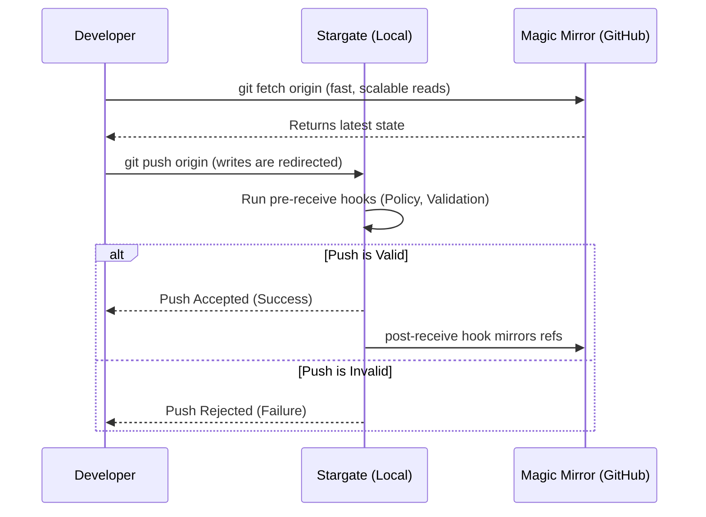

# Chapter 5: Project Stargate: Local Enforcement & Magic Mirrors

<!-- AUTOGENERATED TOC START -->

- [The Stargate Architecture](#the-stargate-architecture)
- [Local-First Enforcement](#local-first-enforcement)
- [The Magic Mirror](#the-magic-mirror)
  - [Mirroring Failure Handling](#mirroring-failure-handling)
  - [Three-Layer Enforcement Model](#three-layer-enforcement-model)
  - [Dual Remote Configuration](#dual-remote-configuration)
- [Summary](#summary)

<!-- AUTOGENERATED TOC END -->

<a id="chapter-5-project-stargate-local-enforcement-magic-mirrors"></a>

A core challenge in any Git-based system is balancing the desire for centralized collaboration (like on GitHub) with the need for strict, low-latency enforcement of rules. If all writes must go to a central server like GitHub.com, you cannot enforce custom server-side logic. If you run your own Git server, you lose the rich UI and ecosystem of public platforms.

GATOS solves this with an architecture codenamed **Project Stargate**, a concept evolved from the `git-kv` project. It provides the best of both worlds: fast, local, and secure writes with the ability to use a public platform like GitHub as a **"Magic Mirror."**

## The Stargate Architecture

<a id="the-stargate-architecture"></a>

The **Stargate** is a transparent, local Git host that sits between a developer and the public remote (e.g., GitHub).

This is achieved with a simple but powerful Git configuration trick: the **`pushurl`**.

```bash
[remote "origin"]
  url     = git@github.com:org/repo.git         # Reads fetch from GitHub
  pushurl = ssh://git@stargate.local/org/repo.git  # Writes push to the local Stargate
```

To the developer, the workflow is unchanged. They still `git fetch origin` and `git push origin`. However, under the hood, the data flows differently for reads and writes.



*   **Reads (`fetch`)** are fast and scalable, coming directly from GitHub's global CDN.
*   **Writes (`push`)** are redirected to the local Stargate server, which acts as the authoritative source of truth.

## Local-First Enforcement

<a id="local-first-enforcement"></a>

By intercepting all writes, the Stargate can run powerful server-side **`pre-receive` hooks** to enforce the GATOS guarantees *before* a commit is accepted.

1.  **Policy Enforcement:** The hook can run the `gatos-policy` engine to ensure the actor has the right capabilities and that the proposed action meets all governance rules.
2.  **Attestation & Validation:** For performance, GATOS clients can attach **attestation trailers** to their commits. These trailers contain pre-computed hashes of the proposed changes. The Stargate's `pre-receive` hook validates these trailers in constant time per push with respect to file count, given attestation trailers and object pinning—verifying integrity without walking every file.
3.  **Linear History:** The hook enforces that all journals are fast-forward only, preventing history rewrites and preserving the immutability of the ledger.

This local-first enforcement provides low-latency, high-security writes that would be impossible on a public SaaS platform.

## The Magic Mirror

<a id="the-magic-mirror"></a>

After the Stargate accepts and processes a push, a **`post-receive` hook** triggers a mirroring process. The Stargate daemon pushes the newly accepted refs up to the public remote (GitHub) with `--prune`.

This turns GitHub into a **Magic Mirror**: a read-only, eventually-consistent replica of the authoritative state held by the local Stargate.

This model provides significant benefits:

*   **Scalable Reads:** The global developer community can fetch data from GitHub's highly-available CDN without ever hitting your local server.
*   **Rich UI & Tooling:** You retain the full benefit of GitHub's ecosystem for code browsing, pull requests, issue tracking, and Actions.
*   **Read-After-Write Consistency:** While the mirror is eventually consistent, GATOS provides mechanisms for clients that need immediate consistency. A client can either read directly from the Stargate (`--read-from=stargate`) or use a `wait` command that polls until a specific commit is visible on the mirror.

### Mirroring Failure Handling

<a id="mirroring-failure-handling"></a>

- Retries with exponential backoff and jitter.
- Health signals (metrics and logs) surface sustained failures.
- Administrators can temporarily disable mirroring while keeping local enforcement active.

### Three-Layer Enforcement Model

<a id="three-layer-enforcement-model"></a>

1. **Local** — Watcher/Hooks (ADR-0006) deliver fast UX and fail-closed guards.
2. **Server** — Stargate runs authoritative pre-receive (policy/trust) checks.
3. **Ledger** — `policy_root` on accepted commits provides the ultimate cryptographic proof.

### Dual Remote Configuration

<a id="dual-remote-configuration"></a>

Use a local write remote and a public read remote for clear separation:

```ini
[remote "origin"]
  url = git@github.com:org/repo.git           # Reads
[remote "stargate"]
  url = ssh://git@stargate.local/org/repo.git # Writes
```

Operators can keep `origin` as the default fetch and explicitly `git push stargate` or configure `push.default` per repository.

## Summary

<a id="summary"></a>

Project Stargate is the key to making GATOS a practical system for real-world teams. It provides a transparent, local-first architecture that combines the security and control of a self-hosted server with the scalability and rich ecosystem of a public platform. It allows developers to work with the familiar `git push origin` command while benefiting from a powerful, policy-driven, and auditable backend that enforces the GATOS guarantees at the source.
