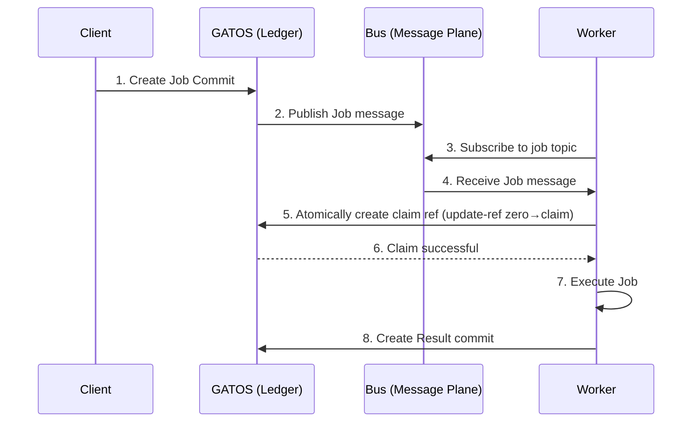

# Chapter 6: The Message & Job Planes: Distributed Workflows
<a id="chapter-6-the-message-job-planes-distributed-workflows"></a>
<!-- AUTOGENERATED TOC START -->
- [The Message Plane: A Commit-Backed Bus](#the-message-plane-a-commit-backed-bus)
  - [How It Works](#how-it-works)
- [The Job Plane: Verifiable Computation](#the-job-plane-verifiable-computation)
  - [The Job Lifecycle](#the-job-lifecycle)
  - [Proof-of-Execution (PoE)](#proof-of-execution-poe)
  - [Bus Retention & Compaction Guidance](#bus-retention-compaction-guidance)
- [Summary](#summary)

<!-- AUTOGENERATED TOC END -->

<a id="chapter-6-the-message-job-planes-distributed-workflows"></a>

While the Ledger, State, and Policy planes provide the core foundation for a verifiable system, the **Message Plane** and **Job Plane** bring it to life. They provide the mechanisms for communication and asynchronous work, enabling GATOS to function as a true distributed **operating surface**.

## The Message Plane: A Commit-Backed Bus
<a id="the-message-plane-a-commit-backed-bus"></a>
The Message Plane, managed by the **`gatos-mind`** crate, provides a reliable, asynchronous publish/subscribe message bus built directly on Git. It serves as the central nervous system for GATOS.

### How It Works
<a id="how-it-works"></a>
1.  **Topics as Refs:** Each message topic is a Git ref under the `refs/gatos/mbus/<topic>/<shard>` namespace.
2.  **Messages as Commits:** When a publisher sends a message to a topic, `gatos-mind` creates a new commit on the topic ref. The message payload is stored in the commit.
3.  **Consumption:** Subscribers `git fetch` the topic refs to discover new messages.
4.  **Acknowledgements:** Delivery is **at-least-once**. Use idempotency keys (the message `ULID`) and dedupe on read. Consumers write an `ack` commit to a corresponding `refs/gatos/mbus-ack/` ref; the system can then observe that a message has been processed by a quorum before considering it “done.”

This Git-native approach provides a message bus that is:

*   **Durable:** Messages are as durable as your Git repository.
*   **Auditable:** The entire history of communication is preserved.
*   **Decentralized:** Publishers and subscribers only need access to the Git remote.

## The Job Plane: Verifiable Computation
<a id="the-job-plane-verifiable-computation"></a>
The Job Plane, managed by the **`gatos-compute`** crate, builds on the other planes to create a system for scheduling, executing, and recording the results of distributed, asynchronous work.

### The Job Lifecycle
<a id="the-job-lifecycle"></a>
The entire lifecycle of a job is represented as a series of events in the GATOS ledger. This diagram shows the flow from a client's request to the final result being recorded.



1.  **Scheduling:** A job is scheduled by writing a `jobs.enqueue` event to the Ledger Plane. This event contains a manifest describing the work to be done (e.g., a command to run, input data).
2.  **Discovery:** A message is published to a topic on the Message Plane (e.g., `gatos.jobs.pending`), announcing the new job.
3.  **Claiming:** A `gatos-compute` worker, subscribed to the topic, discovers the job. It then performs an atomic compare-and-swap on a single lock ref `refs/gatos/jobs/<job-id>/claim` using `git update-ref <old=000..0> <new-claim-oid>`. The winner (who observed the zero OID) writes its `worker_id` into the claim object, preventing other workers from executing it.
4.  **Execution:** The worker executes the job's `command` in a sandboxed environment.
5.  **Result:** Upon completion, the worker creates a `jobs.result` event and commits it to the ledger. This event includes the job's output, exit status, and, crucially, a **Proof-of-Execution (PoE)**.

### Proof-of-Execution (PoE)
<a id="proof-of-execution-poe"></a>
The **PoE** is a signed attestation that provides verifiable proof that a specific worker executed a specific job. It proves provenance/authenticity (who ran what, where, on which inputs), not correctness. A specimen canonical envelope:

```json
{
  "job_id": "blake3:<hex>",
  "worker_id": "ed25519:<pubkey>",
  "worker_env": { "container_digest": "sha256:<hex>" },
  "input_refs": ["blake3:<hex>", "cidv1:..."],
  "output_hash": "blake3:<hex>",
  "sig_alg": "ed25519",
  "sig": "ed25519:<base64>"
}
```

Storage: `refs/gatos/jobs/<job-id>/result` (commit whose tree contains the result manifest and PoE). Commit trailers include `Job-Id`, `Proof-Of-Execution`, and `Worker-Id`.

### Bus Retention & Compaction Guidance
<a id="bus-retention-compaction-guidance"></a>
- Segment topics: `refs/gatos/mbus/<topic>/<yyyy>/<mm>/<dd>/<segment-ulid>` (or numeric `0001`, `0002`, …) to bound ref sizes.
- Rotation thresholds (defaults): rotate at 100k messages or ~192 MB per segment (whichever comes first).
- TTL: retain segments for 30 days, then prune; write a summary commit (counts, Merkle root, last offsets) when pruning to preserve verifiability.
- Offsets: snapshot consumer offsets; prune only segments older than the minimum acknowledged offset across active consumers.
- Git optimization: enable `fetch.writeCommitGraph=true`, `repack.writeBitmaps=true`; consider partial clone/promisor remotes for `refs/gatos/mbus/*` on busy installations.

## Summary
<a id="summary"></a>
The Message and Job planes are what make GATOS a dynamic, living system. `gatos-mind` provides the nervous system, allowing for reliable, auditable communication. `gatos-compute` provides the motor function, enabling the system to perform work in a distributed and verifiable way.

Together, they transform the GATOS repository from a passive record of history into an active, programmable "Operating Surface" that can orchestrate complex, distributed workflows with an unprecedented level of trust and transparency.
