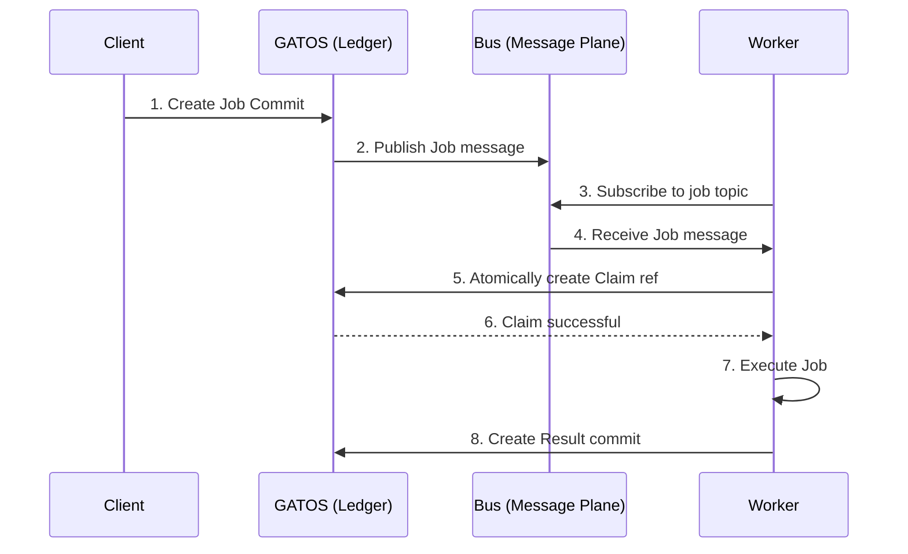

# Chapter 6: The Message & Job Planes: Distributed Workflows

While the Ledger, State, and Policy planes provide the core foundation for a verifiable system, the **Message Plane** and **Job Plane** bring it to life. They provide the mechanisms for communication and asynchronous work, enabling GATOS to function as a true distributed **operating surface**.

## The Message Plane: A Commit-Backed Bus

The Message Plane, managed by the **`gatos-mind`** crate, provides a reliable, asynchronous publish/subscribe message bus built directly on Git. It serves as the central nervous system for GATOS.

### How It Works

1.  **Topics as Refs:** Each message topic is a Git ref under the `refs/gatos/mbus/<topic>/<shard>` namespace.
2.  **Messages as Commits:** When a publisher sends a message to a topic, `gatos-mind` creates a new commit on the topic ref. The message payload is stored in the commit.
3.  **Consumption:** Subscribers `git fetch` the topic refs to discover new messages.
4.  **Acknowledgements:** For **"exactly-once"** delivery, consumers write an `ack` commit to a corresponding `refs/gatos/mbus-ack/` ref. The system can then observe that a message has been processed by a quorum of subscribers before considering it "done."

This Git-native approach provides a message bus that is:
*   **Durable:** Messages are as durable as your Git repository.
*   **Auditable:** The entire history of communication is preserved.
*   **Decentralized:** Publishers and subscribers only need access to the Git remote.

## The Job Plane: Verifiable Computation

The Job Plane, managed by the **`gatos-compute`** crate, builds on the other planes to create a system for scheduling, executing, and recording the results of distributed, asynchronous work.

### The Job Lifecycle

The entire lifecycle of a job is represented as a series of events in the GATOS ledger. This diagram shows the flow from a client's request to the final result being recorded.

1.  **Scheduling:** A job is scheduled by writing a `jobs.enqueue` event to the Ledger Plane. This event contains a manifest describing the work to be done (e.g., a command to run, input data).
2.  **Discovery:** A message is published to a topic on the Message Plane (e.g., `gatos.jobs.pending`), announcing the new job.
3.  **Claiming:** A `gatos-compute` worker, subscribed to the topic, discovers the job. It then performs an atomic compare-and-swap operation on a Git ref (`refs/gatos/jobs/<job-id>/claims/<worker-id>`) to claim the job, preventing other workers from executing it.
4.  **Execution:** The worker executes the job's `command` in a sandboxed environment.
5.  **Result:** Upon completion, the worker creates a `jobs.result` event and commits it to the ledger. This event includes the job's output, exit status, and, crucially, a **Proof-of-Execution (PoE)**.

### Proof-of-Execution (PoE)

The **PoE** is a signed attestation that provides verifiable proof that a specific worker executed a specific job. It contains:
*   The canonical hash of the job manifest.
*   The hash of the output artifacts.
*   The public key of the worker that performed the execution.
*   A signature over the entire attestation.

This PoE is recorded in the ledger, creating an unbreakable link between the job, its execution, and its result.

## Summary

The Message and Job planes are what make GATOS a dynamic, living system. `gatos-mind` provides the nervous system, allowing for reliable, auditable communication. `gatos-compute` provides the motor function, enabling the system to perform work in a distributed and verifiable way.

Together, they transform the GATOS repository from a passive record of history into an active, programmable "Operating Surface" that can orchestrate complex, distributed workflows with an unprecedented level of trust and transparency.