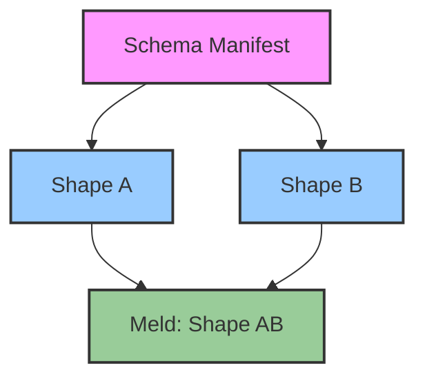

# Chapter 7: Federation & Mind-Melds: Cross-Repo Operations
<a id="chapter-7-federation--mind-melds-cross-repo-operations"></a><a id="chapter-7-federation-mind-melds-cross-repo-operations"></a>
<!-- AUTOGENERATED TOC START -->
- [Federation: A Network of GATOS Nodes](#federation-a-network-of-gatos-nodes)
- [The Challenge: Merging Divergent Realities](#the-challenge-merging-divergent-realities)
- [The Mind-Meld: A Pushout in Practice](#the-mind-meld-a-pushout-in-practice)
  - [Proof-of-Meld](#proof-of-meld)
- [Use Cases](#use-cases)
- [Summary](#summary)
- [Worked Mind-Meld Example](#worked-mind-meld-example)
  - [Conflict Resolution Semantics](#conflict-resolution-semantics)

<!-- AUTOGENERATED TOC END -->

<a id="chapter-7-federation-mind-melds-cross-repo-operations"></a>

GATOS is designed as a distributed system where each Git repository is a self-contained, sovereign node. However, the true power of the architecture is realized when these independent nodes interact. This chapter explores how GATOS enables **federation** and deterministic state merging between repositories, even when they don't share a direct line of history.

## Federation: A Network of GATOS Nodes
<a id="federation-a-network-of-gatos-nodes"></a>
A GATOS **federation** is a network of independent GATOS repositories that have agreed to share some portion of their state or policy. For example, a central "governance" repository could define policies that are consumed by dozens of "project" repositories.

This is achieved through the Message Plane (`gatos-mind`) and the State Plane's ability to read from multiple sources. A project repository can subscribe to the `gatos.policy.updated` topic on the governance repository. When a new policy is published, the project node can fetch it, validate it, and incorporate it into its own local policy engine.

## The Challenge: Merging Divergent Realities
<a id="the-challenge-merging-divergent-realities"></a>
A more complex problem arises when two repositories have independently evolved and need to merge their states. A standard `git merge` is insufficient because it operates on lines of text and has no understanding of the semantic meaning of the GATOS state model. A simple merge could lead to a corrupted or inconsistent state.

GATOS solves this with a concept called a **Mind-Meld**, a deterministic, conflict-free merge of two distinct **shapes** (state snapshots). It allows two separate operating surfaces to be folded together into a new, unified surface.

## The Mind-Meld: A Pushout in Practice
<a id="the-mind-meld-a-pushout-in-practice"></a>
The Mind-Meld is the practical application of a mathematical concept from category theory called a **pushout**. You don't need to understand the deep theory to grasp the outcome.

Imagine two GATOS repositories, A and B, that have diverged. To merge them, you need a third piece of information: a **schema manifest (S)** that describes the correspondences between the two systems. It tells the meld engine how to map an object in repository A to its equivalent in repository B.

The meld operation is a pure function that takes these three inputs (Shape A, Shape B, and Schema S) and produces a single, new, deterministically-created shape, AB.



Because the meld is a deterministic fold, any node that performs the operation with the same three inputs will arrive at the exact same resulting shape and, therefore, the same `state_root` hash.

### Proof-of-Meld
<a id="proof-of-meld"></a>
The output of a successful meld is not just the new shape, but also a **Proof-of-Meld**. This is a lightweight, attestable certificate that contains the hashes of the two input shapes and the schema manifest.

`Proof-of-Meld = BLAKE3(root(Shape A) || root(Shape B) || root(Schema S))`

This proof can be recorded in the Ledger Plane as a verifiable record that the merge occurred, linking the three previously independent histories into a new, unified timeline.

## Use Cases
<a id="use-cases"></a>
This capability unlocks powerful workflows for decentralized collaboration:

- **Cross-Repo Governance:** A central governance repo can define policies, and project repos can "meld" those policies into their own, ensuring consistent rules across an organization without a central server.
- **Supply Chain Attestation:** A software artifact (like a Docker image) can have its own GATOS repository containing its SBOM and test results. A project that consumes this artifact can meld the artifact's state into its own, creating a verifiable, end-to-end chain of provenance.
- **Distributed Knowledge Graphs:** Two researchers using `git-mind` can meld their knowledge graphs, combining their understanding into a new, richer graph that contains the union of their insights.

## Summary
<a id="summary"></a>
Federation and Mind-Melds are what make GATOS a truly distributed operating surface. They provide a mathematically sound and verifiable way to compose and merge state across independent systems, moving beyond the limitations of a single repository. This enables a new class of decentralized applications where trust is established not by a central authority, but by shared, deterministic mathematics.

## Worked Mind-Meld Example
<a id="worked-mind-meld-example"></a><a id="worked-mindmeld-example"></a>
Repo A (users):

```json
{ "user": { "id": 1, "email": "a@example.org" } }
```

Repo B (accounts):

```json
{ "account": { "id": 1, "primaryEmail": "a@example.org" } }
```

Schema Manifest (correspondences):

```json
{
  "map": [
    { "from": "user.id", "to": "account.id" },
    { "from": "user.email", "to": "account.primaryEmail" }
  ]
}
```

### Conflict Resolution Semantics
<a id="conflict-resolution-semantics"></a>
Meld rules are specified by the schema. When two mapped fields disagree, the
schema can pick a strategy; the default is a deterministic precedence order. In
this example, `account.primaryEmail` takes precedence over `user.email` when
both are present and differ. Unmapped fields are preserved in their original
namespaces unless the schema explicitly drops or remaps them.

Conflict example:

Repo A (users):

```json
{ "user": { "id": 1, "email": "old@example.org" } }
```

Repo B (accounts):

```json
{ "account": { "id": 1, "primaryEmail": "new@example.org" } }
```

Schema Manifest (email precedence B over A):

```json
{
  "map": [
    { "from": "user.id", "to": "account.id" },
    { "from": "user.email", "to": "account.primaryEmail", "precedence": "to" }
  ]
}
```

Resulting AB shape (email from B wins):

```json
{ "account": { "id": 1, "primaryEmail": "new@example.org" } }
```

`Proof-of-Meld = blake3(root(Shape A) || root(Shape B) || root(Schema))` — the
proof remains the same regardless of the chosen merge semantics; only the roots
change with the inputs and schema.

Schemas are versioned and signed under `refs/gatos/schemas/<ns>` and distributed like other state. See ADR-0012 (Federation/Mounts) and ADR-0011 (Exporter) for normative storage and export rules.
