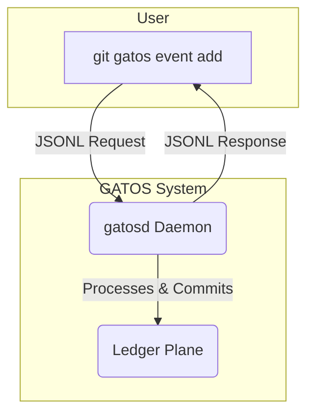

# Chapter 8: Interfaces & Integration
<a id="chapter-8-interfaces-integration"></a>
<!-- AUTOGENERATED TOC START -->
- [The `gatosd` Daemon](#the-gatosd-daemon)
- [The JSONL RPC Protocol](#the-jsonl-rpc-protocol)
  - [Normative APIs and Error Framing](#normative-apis-and-error-framing)
  - [Keepalives](#keepalives)
  - [Example: Appending an Event](#example-appending-an-event)
  - [Streaming Responses](#streaming-responses)
- [The `git gatos` CLI](#the-git-gatos-cli)
- [REST/GraphQL Gateways](#restgraphql-gateways)
  - [End-to-End Example (JSONL)](#end-to-end-example-jsonl)
- [GitHub Integration](#github-integration)
- [Summary](#summary)

<!-- AUTOGENERATED TOC END -->

<a id="chapter-8-interfaces-integration"></a>

A powerful backend is only useful if clients and external systems can interact with it. GATOS is designed with a "ports and adapters" philosophy, providing several well-defined interfaces for integration. The primary entry point is the **`gatosd`** daemon, which exposes the system's capabilities through a simple, robust protocol.

## The `gatosd` Daemon
<a id="the-gatosd-daemon"></a>
**`gatosd`** is the orchestrator of the GATOS system. It's a long-running process that manages the Git repository, listens for commands, and coordinates the five planes. It is the single gateway for all interactions with a GATOS node.

## The JSONL RPC Protocol
<a id="the-jsonl-rpc-protocol"></a>
The primary interface to `gatosd` is a **JSONL RPC protocol**. **JSONL**, or JSON Lines, is a simple text format where each line is a self-contained, valid JSON object.

`Client <-> gatosd` communication happens over a simple stream, such as a Unix socket, a TCP socket, or even `stdin`/`stdout`.

*   **Requests:** The client writes a single JSON object representing a command to the stream.
*   **Responses:** The daemon writes one or more JSON objects back to the client.

This protocol is simple, robust, and easy to debug.

### Normative APIs and Error Framing
<a id="normative-apis-and-error-framing"></a>
- Reads: GraphQL (ADR-0007) for queryable, typed reads.
- Writes: REST-style resources (ADR-0008) mapped to JSONL intents for mutation.
- Streams: WebSocket streams (ADR-0009) for subscription semantics.

Error frames use a consistent envelope:

```json
{ "ok": false, "id": "01C", "code": "ERR_INVALID_NS", "reason": "namespace not found" }
```

### Keepalives
<a id="keepalives"></a>
Long-lived streams send periodic keepalives:

```json
{"kind":"ping"}
{"kind":"pong"}
```

### Example: Appending an Event
<a id="example-appending-an-event"></a>
1.  The client sends a request to the daemon:

    ```json
    {"type":"append_event", "id":"01A", "ns":"finance", "event":{...}}
    ```

2.  The daemon processes the event (validating it through the Policy Plane, etc.) and commits it to the Ledger Plane.
3.  The daemon sends a success response back to the client:

    ```json
    {"ok":true, "id":"01A", "commit_id":"..."}
    ```

### Streaming Responses
<a id="streaming-responses"></a>
For long-running operations or subscriptions, the daemon first acknowledges the request and then streams a series of JSONL objects back to the client.

1.  The client subscribes to a message bus topic:

    ```json
    {"type":"bus.subscribe", "id":"01C", "topic":"gatos.jobs.pending"}
    ```

2.  The daemon immediately acknowledges the subscription:

    ```json
    {"ack":true, "id":"01C"}
    ```

3.  As new messages are published to the topic, the daemon streams them to the client, each as a separate JSON object on a new line:

    ```json
    {"type":"bus.message", "id":"01C", "topic":"gatos.jobs.pending", "payload":{...}}
    {"type":"bus.message", "id":"01C", "topic":"gatos.jobs.pending", "payload":{...}}
    ```

## The `git gatos` CLI
<a id="the-git-gatos-cli"></a>
While the JSONL RPC protocol is the core interface for programmatic access, GATOS also provides a human-friendly command-line interface: **`git gatos`**.

This CLI is a wrapper around the JSONL RPC protocol. It provides commands that correspond to the core GATOS operations.



*   `git gatos init`: Initializes a repository for GATOS.
*   `git gatos event add`: Appends a new event to the ledger.
*   `git gatos fold`: Triggers a state fold for a namespace.
*   `git gatos bus pub/sub`: Interacts with the message bus.
*   `git gatos policy approve`: Approves a governance proposal.
*   `git gatos doctor`: Runs diagnostic checks on the repository.

The CLI is the primary tool for human operators and for scripting simple GATOS interactions.

## REST/GraphQL Gateways
<a id="restgraphql-gateways"></a>
While not part of the core GATOS system, the JSONL RPC protocol makes it straightforward to build gateway services that expose GATOS functionality over more traditional web protocols like **REST** or **GraphQL**.

A simple Node.js or Go service could listen for HTTP requests, translate them into JSONL RPC commands to `gatosd`, and then format the JSONL responses back into HTTP responses. This allows web frontends and other standard web clients to interact with a GATOS node without needing a dedicated GATOS SDK.

### End-to-End Example (JSONL)
<a id="end-to-end-example-jsonl"></a><a id="endtoend-example-jsonl"></a>
1) Enqueue a job:

```json
{"type":"jobs.enqueue","id":"J1","ns":"ci","job":{ "command":["/bin/echo","ok"],"timeout":30 }}
```

2) Observe bus (subscription):

```json
{"type":"bus.subscribe","id":"S1","topic":"gatos.jobs.pending"}
{"ack":true,"id":"S1"}
{"type":"bus.message","id":"S1","topic":"gatos.jobs.pending","payload":{ "job_id":"blake3:…" }}
```

3) See result (PoE recorded under `refs/gatos/jobs/<id>/result`):

```json
{"type":"jobs.result","id":"R1","job_id":"blake3:…","ok":true}
```

## GitHub Integration
<a id="github-integration"></a>
Because GATOS is Git-native, it integrates seamlessly with platforms like **GitHub**.

*   **Pull Requests:** Governance proposals can be represented as Pull Requests. The discussion happens in the PR, and the final "merge" is the creation of the `Approval` commits.
*   **GitHub Actions:** The `gatosd` CLI can be run directly within GitHub Actions to automate workflows. For example, an Action could trigger a `jobs.enqueue` event on every push to the `main` branch.
*   **Required Checks:** A GitHub Action can run `gatos policy verify` or `gatos grant verify` and report its status back to GitHub. This can be used as a required status check to block a PR from being merged until a GATOS governance policy is satisfied. See ADR-0010 (GitHub App) for the integration surface.

## Summary
<a id="summary"></a>
GATOS provides a layered approach to integration. At the lowest level, the JSONL RPC protocol offers a simple, powerful, and language-agnostic way to communicate with the `gatosd` daemon. On top of this, the `git gatos` CLI provides a convenient interface for humans and shell scripts. Finally, the Git-native nature of the system allows for deep and powerful integrations with platforms like GitHub, turning them into user interfaces for the GATOS operating surface.
