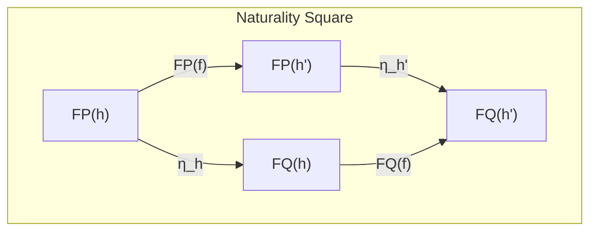
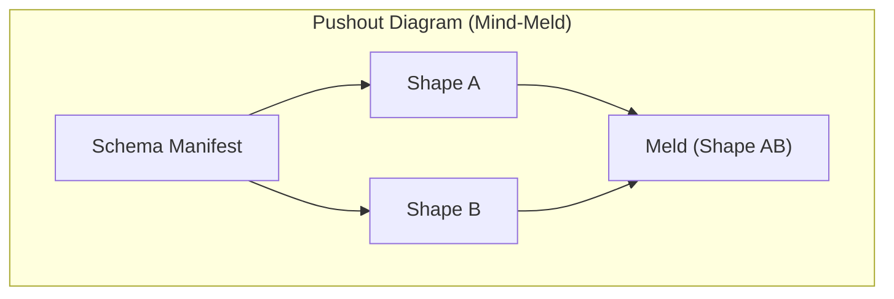

# Chapter 9: The GATOS Morphology Calculus

<!-- AUTOGENERATED TOC START -->

- [Core Objects](#core-objects)
- [Key Theorems and Their Payoffs](#key-theorems-and-their-payoffs)
  - [Theorem 1: Deterministic Shape](#theorem-1-deterministic-shape)
  - [Theorem 2: Localization & Incrementality](#theorem-2-localization--incrementality)
  - [Theorem 3: Safe Policy Migration](#theorem-3-safe-policy-migration)
  - [Theorem 4: Mind-Meld as a Pushout](#theorem-4-mind-meld-as-a-pushout)
  - [Further Theorems](#further-theorems)
- [Concurrency and Conflict Resolution](#concurrency-and-conflict-resolution)
- [Epochs and Invariants](#epochs-and-invariants)
- [Summary: From Math to Provable Practices](#summary-from-math-to-provable-practices)
  - [Calculus Quick-Ref](#calculus-quick-ref)

<!-- AUTOGENERATED TOC END -->

The guarantees of determinism, provability, and composability in GATOS are not just design goals; they are the result of a formal mathematical framework. This framework, the **GATOS Morphology Calculus**, provides the theoretical underpinnings for the entire system. This chapter introduces the core concepts of this calculus, linking the abstract mathematics to the concrete features you use every day.

The motto of the calculus is simple: *Each commit folds the surface into a new, deterministic shape.*

## Core Objects

The calculus is built on a few fundamental objects:

1. **Ledger DAG:** The event history of a GATOS repository is a finite Directed Acyclic Graph (DAG), where **nodes** are events (commits) and **edges** are the parent links between them. This DAG induces a partial order on all events, representing causality.
2. **Policy:** A **policy** is an immutable set of rules (e.g., quorums, capabilities, RLS rules) that acts as a parameter for any computation.
3. **Shape:** A **shape** is the canonical, serialized form of a system's state. It is a hashable representation of the "shape of the world" at a given moment.
4. **Fold Functor:** A **fold** is a mathematical function (specifically, a **functor**) that transforms the event history into a shape. It is parameterized by a policy, written as $F\_P$. This is implemented by the **Echo** engine, which relies on local, confluent rewrite rules (**Echo/DPO** with critical-pair checks).

   `Fold = F(event_history, policy) -> shape`

## Key Theorems and Their Payoffs

The Morphology Calculus is defined by a series of theorems that translate directly into powerful system features.

### Theorem 1: Deterministic Shape

> For a fixed policy, any two equivalent event sequences (i.e., containing the same events in the same causal order) will always fold to the exact same shape. Note the dependency on the effective `policy_version`/`policy_root`.

**Feature Payoff:** This is the foundation of all determinism in GATOS. It guarantees **reproducible state**. If you have the same journal and the same policy, you are guaranteed to compute the same state root hash. This enables verifiable caching, state synchronization, and perfect replay.

### Theorem 2: Localization & Incrementality

> If the event history can be partitioned into independent regions (with no read/write overlap per policy), then the fold of the whole history is equivalent to the composition of the folds of each partition.

**Feature Payoff:** This enables **partial and lazy folds**. The system doesn't need to recompute the entire world state for every small change. It only needs to re-fold the partitions affected by new events, dramatically improving performance. This is what justifies the Index & Cache plane. This theorem relies on the concept of **Footprints** and an **Independence Predicate** to define disjoint regions.

### Theorem 3: Safe Policy Migration

> A policy change can be modeled as a **natural transformation** $\eta: F\_P \Rightarrow F\_Q$ between two fold functors. This transformation provides a safe, verifiable way to migrate from a state computed under an old policy to a state computed under a new one.

**Feature Payoff:** This allows for **governance-safe upgrades**. You can change quorums, validation rules, or capabilities without corrupting existing state, because the migration path is mathematically defined and proven to be consistent.

### Theorem 4: Mind-Meld as a Pushout

> Two independent GATOS repositories (with no shared history) can be deterministically merged via a **pushout**, a concept from category theory. The merge is guided by a schema that describes the correspondences between the two systems.

**Feature Payoff:** This enables the **"Mind-Meld"**—a deterministic, conflict-free merge of state between different repositories. This is the foundation for federation and cross-repo collaboration. The process also produces a `Proof-of-Meld`, a lightweight, attestable certificate of the merge operation. This theorem is a direct consequence of the **Concurrency Theorems** which state that independent DPO squares compose along disjoint sums, leading to isomorphic results regardless of execution order.

### Further Theorems

The calculus extends to other planes, modeling the **Job Plane** as a **symmetric monoidal category** (guaranteeing parallel soundness) and the **Ledger's consensus governance** as a **2-category** (providing algebraic idempotence for approvals and grants). It even provides a model for **hierarchical compaction** ("folds-of-folds") using **operads**, which justifies the safe creation of summary epochs.

## Concurrency and Conflict Resolution

The operational semantics of GATOS's concurrent rewriting are critical for maintaining determinism.

- **Footprints:** Each rewrite rule precisely defines its read/write sets on nodes, edges, and **Ports** (boundary interfaces).
- **Independence Predicate:** Two rewrites are independent if their read/write sets over nodes and ports are disjoint (no overlap) and their `factor_mask`s do not overlap.
- **Concurrency Theorems:** If rewrites are independent, they commute up to isomorphism. This means they can be executed in any order, or in parallel, yielding the same result.
- **Conflict Resolution Policies:** When conflicts are detected (independence violation), GATOS rules define how to resolve them: `ABORT`, `RETRY`, `JOIN` (applying a precomputed join), or `USER_RESOLVE` (invoking a domain callback).

## Epochs and Invariants

GATOS uses **Epochs** to manage the coherence of its state. Epochs are monotonically increasing counters (`epoch_att` for attachments, `epoch_skel` for skeleton) that ensure readers always observe a consistent state.

- **Snapshot Isolation:** Readers are bound to specific epoch counters and never witness a partially updated or "torn" state.
- **Atomicity:** A committed rewrite either appears entirely in the next epoch(s) or not at all.
- **Epoch Flip:** Epochs only advance after all changes are published, ensuring a coherent world-rollover for readers.

These invariants are crucial for maintaining the integrity of the GATOS operating surface.

## Summary: From Math to Provable Practices

The GATOS Morphology Calculus is not merely an academic exercise. It is a practical engineering playbook. By building the system on a foundation of provable mathematics, GATOS moves beyond "best practices" to **provable practices**.

Each theorem corresponds directly to a feature that provides a concrete benefit:

- **Determinism** gives you reproducible state.
- **Localization** gives you fast, incremental updates.
- **Natural Transformations** give you safe policy migrations.
- **Pushouts** give you deterministic cross-repo merges.

This is how GATOS delivers on its promise of a system that is not just powerful, but also trustworthy, auditable, and correct by construction.

### Calculus Quick-Ref

- Fold functor `F_P`: Maps histories to shapes under policy `P`.
- Natural transformation `η: F_P ⇒ F_Q`: Safe migration from policy `P` to `Q`.
- Pushout: Canonical construction to merge two shapes along a schema of correspondences.
