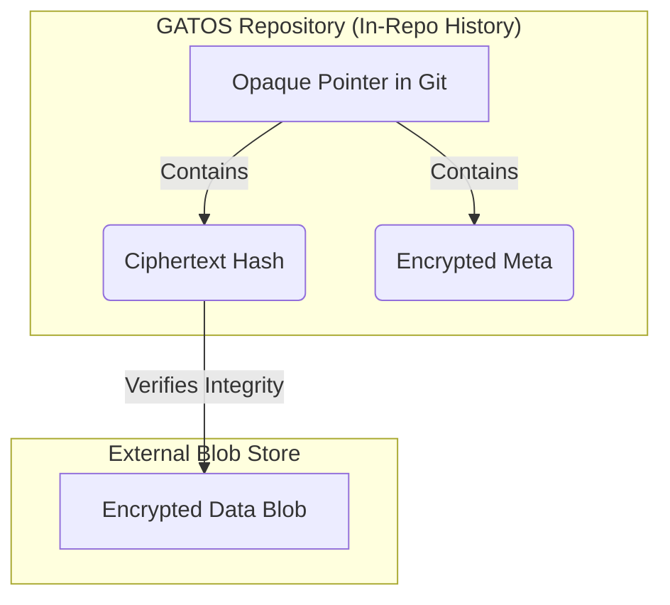

# Chapter 10: Proofs, Attestation, and Privacy

<a id="chapter-10-proofs-attestation-and-privacy"></a>


<a id="chapter-10-proofs-attestation-and-privacy"></a>

<!-- AUTOGENERATED TOC START -->
- [Attestation and Proof-of-Execution](#attestation-and-proof-of-execution)
- [Zero-Knowledge Proofs (Future)](#zero-knowledge-proofs-future)
- [Opaque Pointers and Private Data](#opaque-pointers-and-private-data)
  - [Verifiable Folds on Private Data](#verifiable-folds-on-private-data)
  - [Blob Availability Attestation (BAA)](#blob-availability-attestation-baa)
  - [Rekeying](#rekeying)
- [Summary](#summary)

<!-- AUTOGENERATED TOC END -->

<a id="chapter-10-proofs-attestation-and-privacy"></a>

A core tenet of GATOS is "don't trust, verify." The system is designed not just to perform actions, but to produce **proofs** that those actions were performed correctly and by the authorized actors. This chapter covers the cryptographic mechanisms that enable this high level of trust and how GATOS handles private or sensitive data.

## Attestation and Proof-of-Execution

<a id="attestation-and-proof-of-execution"></a>


<a id="attestation-and-proof-of-execution"></a>
In a distributed system, how do you trust that a worker node actually performed the job it claimed to? GATOS solves this with **Proof-of-Execution (PoE)**.

As described in the Job Plane chapter, when a `gatos-compute` worker finishes a job, it creates a `jobs.result` event. Embedded in this event is a **PoE**, which is a signed **attestation** containing:

- The canonical hash of the job that was executed.
- The hash of the resulting output artifacts.
- The public key of the worker and the execution environment (`worker_env`: container digest, TEE quote, etc.).
- The input references (`input_refs`) the job consumed.
- A signature over all of the above.

PoE proves provenance/authenticity, not correctness. Correctness requires deterministic re-execution, TEEs, or Zero-Knowledge proofs.

This PoE is recorded in the ledger, creating an unbreakable and verifiable link between a job and its outcome. Any other node can validate the signature on the PoE to confirm that a specific, trusted worker vouches for the result. This is fundamental to the GATOS **Zero Trust** model—you don't need to trust the network or the environment, only the cryptographic signatures.

## Zero-Knowledge Proofs (Future)

<a id="zero-knowledge-proofs-future"></a>


<a id="zero-knowledge-proofs-future"></a>
While PoE provides proof of *correct* execution, it doesn't prove anything about the *contents* of the execution without revealing them. The future vision for GATOS includes the integration of **Zero-Knowledge Proofs (ZKPs)**.

A ZKP would allow a worker to prove that it performed a computation correctly *without revealing the inputs or outputs of that computation*. This has profound implications for privacy and security.

For example, a GATOS node could process a financial transaction and generate a ZKP that proves:

- The transaction was valid according to the rules of the system.
- The sender had sufficient funds.
- The final balances are correct.

...all without revealing the sender, receiver, or transaction amount to the public ledger. This capability will allow GATOS to be used for applications that require both strong verifiability and strong privacy.

ZK Proof Envelope (stub):

```json
{
  "program_id": "blake3:<hex>",
  "vk_id": "blake3:<hex>",
  "inputs_commitment": "blake3:<hex>",
  "proof_bytes": "base64:",
  "poe_link": "blake3:<hex>"
}
```

`program_id` and `vk_id` are governed by the Policy Plane and versioned in-repo.

## Opaque Pointers and Private Data

<a id="opaque-pointers-and-private-data"></a>


<a id="opaque-pointers-and-private-data"></a>
Not all data belongs in a public, replicated Git repository. GATOS handles sensitive or large data using a mechanism called **Opaque Pointers**.

Instead of storing the data directly in a Git blob, the system stores a small pointer object. This pointer lives on the **operating surface** inside Git, while the sensitive data it points to lives in an external, policy-gated content-addressed blob store.



- The actual data is encrypted and stored in a separate, **content-addressed blob store** (which could be anything from a local directory to a cloud storage bucket).
- The **`ciphertext_hash`** is the hash of the encrypted data, allowing for integrity checks.
- The **encrypted meta** contains the information an authorized user needs to decrypt the data (e.g., a reference to a key stored in a KMS, the encryption algorithm used, and the plaintext hash/commitment). The public pointer MUST NOT reveal a raw plaintext hash to avoid dictionary attacks. Use a hiding commitment in the public pointer if needed.

### Verifiable Folds on Private Data

<a id="verifiable-folds-on-private-data"></a>


<a id="verifiable-folds-on-private-data"></a>
Authorized workers can fetch the encrypted blob, decrypt it, verify that the recovered plaintext hash (from encrypted meta) matches expectations, perform a computation, and then produce a new encrypted blob and a new Opaque Pointer.

If the computation is deterministic, the new plaintext hash will be the same for any authorized worker who performs the same operation. This allows the `state_root` of the system to be updated deterministically, even though the actual data remains private and outside the repository.

### Blob Availability Attestation (BAA)

<a id="blob-availability-attestation-baa"></a>


<a id="blob-availability-attestation-baa"></a>
To prevent dangling pointers, storage backends SHOULD sign a BAA:

```json
{ "blob": "blake3:<hex>", "store": "s3://bucket/path", "retain_until": "2026-01-01T00:00:00Z", "sig": "ed25519:<base64>" }
```

Policies can require a valid BAA before pointers are accepted into public state.

### Rekeying

<a id="rekeying"></a>


<a id="rekeying"></a>
The Opaque Pointer model also supports **`rekey`** operations. An authorized user can decrypt a blob and re-encrypt it with a new key, creating a new Opaque Pointer. This allows for secure key rotation and sharing of private data with new parties without changing the underlying data itself.

## Summary

<a id="summary"></a>


<a id="summary"></a>
GATOS provides a sophisticated, multi-layered approach to trust, verification, and privacy.

- **Attestation and Proof-of-Execution** provide verifiable evidence of computation.
- **Opaque Pointers** allow the system to manage and compute on private data outside the repo without sacrificing determinism.
- The future integration of **Zero-Knowledge Proofs** will provide even stronger privacy guarantees, enabling a new class of applications that are both fully private and fully verifiable.
