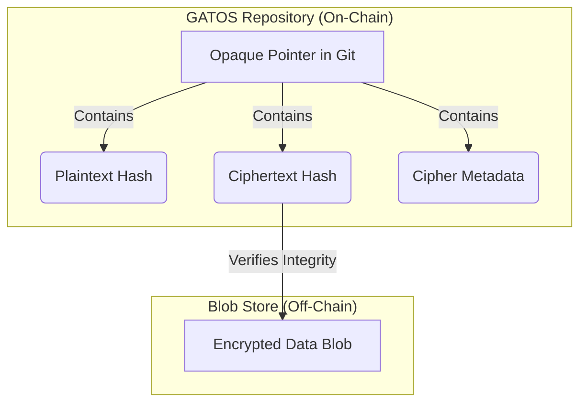

# Chapter 10: Proofs, Attestation, and Privacy

A core tenet of GATOS is "don't trust, verify." The system is designed not just to perform actions, but to produce **proofs** that those actions were performed correctly and by the authorized actors. This chapter covers the cryptographic mechanisms that enable this high level of trust and how GATOS handles private or sensitive data.

## Attestation and Proof-of-Execution

In a distributed system, how do you trust that a worker node actually performed the job it claimed to? GATOS solves this with **Proof-of-Execution (PoE)**.

As described in the Job Plane chapter, when a `gatos-compute` worker finishes a job, it creates a `jobs.result` event. Embedded in this event is a **PoE**, which is a signed **attestation** containing:
*   The hash of the job that was executed.
*   The hash of the resulting output artifacts.
*   The public key of the worker.
*   A signature over all of the above.

This PoE is recorded in the ledger, creating an unbreakable and verifiable link between a job and its outcome. Any other node can validate the signature on the PoE to confirm that a specific, trusted worker vouches for the result. This is fundamental to the GATOS **Zero Trust** model—you don't need to trust the network or the environment, only the cryptographic signatures.

## Zero-Knowledge Proofs (Future)

While PoE provides proof of *correct* execution, it doesn't prove anything about the *contents* of the execution without revealing them. The future vision for GATOS includes the integration of **Zero-Knowledge Proofs (ZKPs)**.

A ZKP would allow a worker to prove that it performed a computation correctly *without revealing the inputs or outputs of that computation*. This has profound implications for privacy and security.

For example, a GATOS node could process a financial transaction and generate a ZKP that proves:
*   The transaction was valid according to the rules of the system.
*   The sender had sufficient funds.
*   The final balances are correct.

...all without revealing the sender, receiver, or transaction amount to the public ledger. This capability will allow GATOS to be used for applications that require both strong verifiability and strong privacy.

## Opaque Pointers and Private Data

Not all data belongs in a public, replicated Git repository. GATOS handles sensitive or large data using a mechanism called **Opaque Pointers**.

Instead of storing the data directly in a Git blob, the system stores a small pointer object. This pointer lives on the **operating surface** inside Git, while the sensitive data it points to lives off-chain in a secure, content-addressed blob store.

*   The actual data is encrypted and stored in a separate, **content-addressed blob store** (which could be anything from a local directory to a cloud storage bucket).
*   The **`ciphertext_hash`** is the hash of the encrypted data, allowing for integrity checks.
*   The **`cipher_meta`** object contains the necessary information for an authorized user to decrypt the data (e.g., a reference to a key stored in a KMS, the encryption algorithm used, etc.).
*   The **`hash`** of the *plaintext* data is also stored in the pointer. This is a crucial feature.

### Verifiable Folds on Private Data

Storing the plaintext hash allows GATOS to perform deterministic folds even on private data. An authorized worker can fetch the encrypted blob, decrypt it, verify that its hash matches the plaintext `hash` in the pointer, perform a computation, and then produce a new encrypted blob and a new Opaque Pointer.

If the computation is deterministic, the new plaintext hash will be the same for any authorized worker who performs the same operation. This allows the `state_root` of the system to be updated deterministically, even though the actual data remains private and off-chain.

### Rekeying

The Opaque Pointer model also supports **`rekey`** operations. An authorized user can decrypt a blob and re-encrypt it with a new key, creating a new Opaque Pointer. This allows for secure key rotation and sharing of private data with new parties without changing the underlying data itself.

## Summary

GATOS provides a sophisticated, multi-layered approach to trust, verification, and privacy.
*   **Attestation and Proof-of-Execution** provide verifiable evidence of computation.
*   **Opaque Pointers** allow the system to manage and compute on private, off-chain data without sacrificing determinism.
*   The future integration of **Zero-Knowledge Proofs** will provide even stronger privacy guarantees, enabling a new class of applications that are both fully private and fully verifiable.

---

**Next**: [Chapter 11–Performance: Partial Folds, Caching, and Exploration](./CHAPTER-011.md)

**Prev**: [Chapter 9–The GATOS Morphology Calculus](./CHAPTER-009.md)

---

**GATOS–_Git As The Operating Surface™_**  
James Ross / [Flying • Robots](https://github.com/flyingrobots) © 2025
