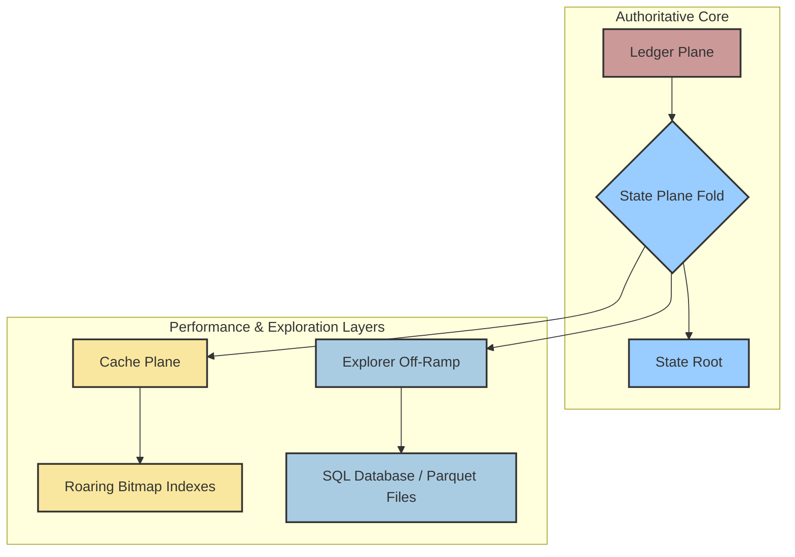

# Chapter 11: Performance: Partial Folds, Caching, and Exploration

A common concern with systems that rely on immutable history and deterministic replay is performance. If every state change requires re-processing the entire history of the system, how can it possibly scale?

GATOS is designed from the ground up to be performant at scale. It achieves this through a combination of clever algorithms, a dedicated cache plane, and by providing tools to explore and analyze the data in more efficient formats.

## Partial and Lazy Folds

The key to GATOS's performance is that it rarely needs to re-fold the entire history of the universe. The **GATOS Morphology Calculus** (as described in [Chapter 9](./CHAPTER-009.md) provides the theoretical foundation for this with **Theorem 2 (Localization & Incrementality)**.

This theorem states that if the system's history can be broken down into independent regions (i.e., sets of events that don't have overlapping read/write sets), then the state of the whole is simply the composition of the states of the parts.

In practice, this means GATOS can perform **partial and lazy folds**:

*   **Partial Folds:** When a new event comes in, the system can analyze its "footprint" (the data it reads from and writes to) and determine which part of the state graph is affected. It only needs to re-fold that small, relevant partition of the event history.
*   **Lazy Folds:** Not all state needs to be computed all the time. GATOS can defer the folding of certain parts of the state until they are actually requested.

This makes the cost of a state update proportional to the size of the change, not the size of the entire history.

## The Cache Plane and Explorer Off-Ramps

To further optimize performance, GATOS includes a dedicated **Cache Plane** and provides "off-ramps" to traditional data exploration tools. These are secondary, non-authoritative views of the data, derived deterministically from the Ledger.

### The Cache Plane

*   **Location:** The cache lives under the `refs/gatos/cache/` refspace in Git.
*   **Content:** The cache can store various artifacts, but its most important content is indexes built from **Roaring Bitmaps**.
*   **Roaring Bitmaps:** These are highly compressed, efficient data structures for storing and performing operations on large sets of integers. The GATOS indexer processes the event journal and creates roaring bitmap indexes for fast querying (e.g., "find all events related to user X").

Because the cache is just a result of a deterministic fold, it can be safely deleted and rebuilt at any time. It is a pure optimization and not part of the authoritative state of the system.

### GATOS-to-SQL/Parquet Explorer

While the Git-native storage of GATOS is perfect for auditability and distribution, it is not always the most efficient format for large-scale analytical queries. For this, GATOS provides an **explorer** or **"off-ramp"** mechanism.

A dedicated process can be configured to follow the GATOS ledger and deterministically transform the event data into a more traditional analytical format, such as:

*   A **SQL database** (e.g., PostgreSQL or DuckDB).
*   A set of **Parquet files** in a data lake.

This allows standard business intelligence (BI) tools, dashboards, and data science notebooks to run complex analytical queries over the GATOS data without having to understand the underlying Git-based storage model.

The key is that this transformation is itself a **deterministic fold**. The analytical database is a secondary, verifiable view of the primary data in the ledger. You can always rebuild it from scratch and get the exact same result.

## Summary

GATOS is designed for both correctness and performance. It achieves high performance not by cutting corners on its guarantees, but by applying its core principles of determinism and mathematical rigor to the problem of optimization.

*   **Partial and Lazy Folds** make state updates efficient by minimizing re-computation.
*   **The Cache Plane** provides rebuildable, high-speed indexes for fast queries.
*   **Explorer Off-ramps** bridge the gap to the traditional world of data analytics, providing a verifiable, read-optimized view of the GATOS ledger.

This combination allows GATOS to serve as both a high-integrity transactional system and a high-performance analytical backend, without compromising on its core principles.

---

**Next**: [Chapter 12–The GATOS Vision](./CHAPTER-012.md)

**Prev**: [Chapter 10–Proofs, Attestation, and Privacy](./CHAPTER-010.md)

---

**GATOS–_Git As The Operating Surface™_**  
James Ross / [Flying • Robots](https://github.com/flyingrobots) © 2025
