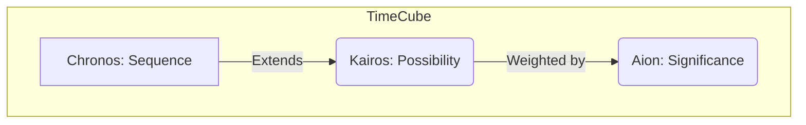

# Chapter 12: The GATOS Vision

> _The Time Cube: History • Possibility • Consequence_

The preceding chapters have detailed the architecture and workflow of GATOS. We've seen how it uses Git to create a deterministic, auditable, and distributed operating surface. But the "how" is only part of the story. The "why" points to a new vision for how we build and interact with software.

## From Version Control to Reality Control

For decades, we have treated Git as a tool for managing source code. It's the canonical history of *what we intended to build*. The actual running system—the production database, the state of a user's session, the logs from a deployment—has always lived somewhere else, in a separate, less-structured reality.

GATOS challenges this division. It proposes that Git is powerful enough to be the single source of truth for *both* the code and the reality it produces.

> You use Git for source control.
> *I use Git for reality control.*
> *We are not the same.*

This is the core of the GATOS philosophy. By making every state transition an explicit, verifiable commit, GATOS elevates the entire operational lifecycle of a system to the same level of rigor and auditability that we currently apply only to source code.

## The TimeCube: Three Axes of Time

The Echo engine's design is built around a concept called the **TimeCube**, which models time not as a single line, but along three distinct axes:

1.  **Chronos (Sequence):** This is time as we normally experience it—a linear, monotonic sequence of ticks or frames. This is the axis of **history**.
2.  **Kairos (Possibility):** At any point in Chronos, there can be multiple possible futures. Kairos is the axis of **branching**. Every "what if" scenario, every alternative strategy, every player's speculative plan exists as a separate branch in the Kairos dimension.
3.  **Aion (Significance):** Not all moments or branches are equally important. Aion is a scalar value that represents the "narrative gravity" or significance of an event or a timeline. This is the axis of **meaning**.

This multi-dimensional view of time enables powerful new workflows:

*   **Time-Travel Debugging:** Encounter a bug? You don't need to reproduce it. You can simply check out the exact graph state before the bug occurred, fork a new timeline (**Kairos**), and experiment with different inputs until you understand the cause.
*   **AI Co-Pilots:** An AI agent can explore thousands of possible future timelines in parallel. It can run experiments, learn strategies, and then propose a change back to the main timeline. The **Aion** axis can be used to score the "significance" of the AI's findings.
*   **Collaborative Simulation:** Multiple users can work on the same system simultaneously, each in their own branch. When they are done, their changes can be merged. Because all operations are deterministic, conflicts can be detected and resolved with mathematical precision.

### Operationalizing TimeCube

**Aion (Significance):**

- Where: `refs/gatos/aion/<branch>/<ulid>`
- Record: `{ score, basis, ts, actor, sig }` — a signed record of narrative gravity.

**Kairos (Possibility):**

- Branch hygiene: `refs/kairos/<agent>/<ulid>` with a default 7‑day TTL.
- Promotion: Requires a governance grant; promotion merges into a durable ref.

**Confluence (Admission & Addressing):**

- Admission requires capability grants and, where applicable, a valid Proof‑of‑Meld for mounted state.
- Global addressing: `confluence://<repo-did>/<ref>@<oid>`.

## Confluence: A Shared Reality

The ultimate vision for GATOS is **Confluence**: a global, distributed, content-addressed DAG (Directed Acyclic Graph) of all GATOS graphs.

In this model:
*   Every GATOS repository is a **local graph**.
*   When you `git push`, you are not just pushing code; you are submitting a set of cryptographically signed diffs to the global Confluence.
*   Other users can then **synchronize** with the Confluence, pulling down the changes they are interested in and merging them into their own local graphs.

This creates a shared, verifiable "reality" where every piece of data, every change, and every decision has a clear, auditable provenance.

## The GATOS Promise

The journey through this book has taken us from high-level philosophy to the mathematical core of the GATOS ecosystem. We have seen how:

*   The **Ledger Plane** provides an immutable history.
*   The **State Plane** creates a deterministic shape from that history.
*   The **Policy Plane** ensures all actions are authorized.
*   The **Message and Job Planes** orchestrate distributed work.
*   The **Morphology Calculus** provides the mathematical proof for it all.

Together, these components fulfill the GATOS promise: to enable the creation of software systems that are not just complex and powerful, but also understandable, trustworthy, and built to last.

The future of software is not just about building bigger and faster systems. It's about building systems that we can understand, that we can trust, and that can learn and evolve with us.

Welcome to the GATOS multiverse.

**FINALLY.** Git As The Operating Surface™.

_Now you Git it._

---

**Prev**: [Chapter 11–Performance: Partial Folds, Caching, and Exploration](./CHAPTER-011.md)

---

**GATOS–_Git As The Operating Surface™_**  
James Ross / [Flying • Robots](https://github.com/flyingrobots) © 2025
