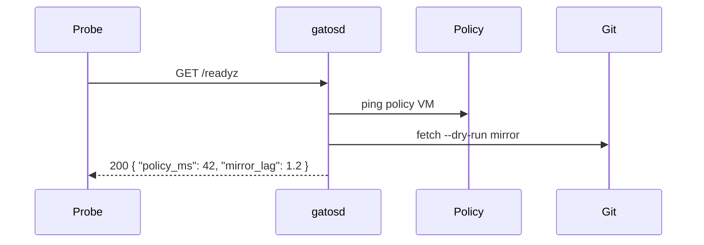

# Chapter 13: Operations & Observability

<a id="chapter-13-operations-observability"></a>

<!-- AUTOGENERATED TOC START -->

- [Operating Profiles & SLO Guardrails](#operating-profiles--slo-guardrails)
- [Health Checks & Probes](#health-checks--probes)
- [Metrics & Dashboards](#metrics--dashboards)
- [Audit Trails & Forensics](#audit-trails--forensics)
- [Troubleshooting Playbooks](#troubleshooting-playbooks)
- [Runbook Starter Checklist](#runbook-starter-checklist)

<!-- AUTOGENERATED TOC END -->

GATOS is more than a set of crates—it is a living operating surface. Once the Ledger, Policy, Message, Job, and State planes are running, operators need clear guidance on how to keep them healthy. This chapter distills best practices from ADR-0006 (Watcher), ADR-0009 (Streams), ADR-0011 (Exporter), ADR-0014 (PoF), ADR-0015 (Sessions), and ADR-0016 (PoX) into concrete SLOs, probes, and playbooks.

## Operating Profiles & SLO Guardrails

<a id="operating-profiles--slo-guardrails"></a>

Profiles (SPEC §12) declare enforcement defaults; operators should extend them with service-level objectives:

| Profile | Default Guardrails | Recommended SLOs |
| :-- | :-- | :-- |
| `local` | Hooks optional, watcher best-effort | Fold latency < 2s p95, watcher drift alerts < 5 min |
| `push-gate` | Stargate required, PoF enforced, locks FF-only | Policy gate latency < 1s p95, mirror lag < 30s |
| `research` | PoF + PoE mandatory, PoX encouraged | PoX backlog < 3 experiments, Pointer drift incidents = 0 |

Configure `gatosd` with per-profile budgets (e.g., `gatos.toml`):

```toml
[profile.research.slo]
policy_gate_ms_p95 = 750
mirror_lag_seconds = 30
pox_backlog_max = 3
```

## Health Checks & Probes

<a id="health-checks--probes"></a>

Expose the following HTTP endpoints on `gatosd` (or the Stargate service):

| Endpoint | Purpose | Data |
| :-- | :-- | :-- |
| `/healthz` | Liveness | basic process + disk checks |
| `/readyz` | Readiness | Git remote reachability, policy cache warm, job runners available |
| `/hooksz` | Hook status | watcher daemon heartbeat, lock cache age |
| `/streamz` | Message/stream backlog | per-topic lag, credit utilization |



Color the response JSON with simple status buckets (`ok`, `degraded`, `failed`). Integrate with Kubernetes, Nomad, or systemd watchdogs as appropriate.

## Metrics & Dashboards

<a id="metrics--dashboards"></a>

Prometheus-style metrics should cover:

- `gatos_policy_gate_duration_seconds{profile}` — histogram per profile (target p95 < 1s).
- `gatos_message_plane_lag_messages{topic}` — difference between newest ULID and consumer checkpoints.
- `gatos_jobs_claim_conflicts_total` — CAS failures; alert when rising.
- `gatos_pox_backlog_total` — open PoX envelopes without verified reproduction.
- `gatos_session_active_total{actor}` — active sessions per actor; watch for runaway forks.

Dashboards typically include panels for:

1. **Policy & Fold Latency** (stacked area showing gates vs folds).
2. **Bus / Stream Lag** (per topic + federation proxy lag when ADR-0009 bridge is deployed).
3. **Proof Coverage** (counts of PoF, PoE, PoX produced per day).
4. **Export / Explorer Health** (export runtimes, explorer-root verification failures).

## Audit Trails & Forensics

<a id="audit-trails--forensics"></a>

Everything critical is already versioned, but operators should know where to look:

- Policy denies → `refs/gatos/audit/policy/deny/<ulid>`.
- Watcher/hook events → `refs/gatos/audit/locks/<ulid>` and local JSONL logs.
- Session publishes/denials → `refs/gatos/audit/sessions/<ulid>/*`.
- PoX artifacts → `refs/gatos/audit/proofs/experiments/<ulid>` and reproduction logs under `refs/gatos/audit/pox/<ulid>/repro/*`.
- Federation sync issues → `refs/gatos/audit/federation/<mount>/<ulid>`.

Augment Git history with structured log shipping (e.g., forward watcher JSONL to Loki) for faster searches, but treat Git as the source of truth.

## Troubleshooting Playbooks

<a id="troubleshooting-playbooks"></a>

1. **Mirror lag > SLO**
   - Check `/readyz` → `mirror_lag`.
   - If degraded, run `git gatos stargate mirror --status` to identify stuck refs.
   - Inspect `refs/gatos/audit/mirror/<ulid>`; rollback if necessary.
2. **Policy gate latency spike**
   - Review `gatos_policy_gate_duration_seconds`.
   - Ensure policy cache is warm; run `gatos policy warmup`.
   - Look for large session publishes; consider splitting sessions per ADR-0015.
3. **Message Plane backlog**
   - Query `/streamz`; if over credit budget, scale consumers or enable federation proxy.
   - Validate consumers advance `refs/gatos/consumers/**`; run `gatos messages checkpoint repair` if stale.
4. **PoX verification failure**
   - `git gatos pox verify --id <ulid>` to see failing component.
   - Re-run `git gatos reproduce` with `--log` to capture divergence diff.
5. **Opaque pointer drift**
   - Compare pointer digest vs fetched plaintext; log incident under `refs/gatos/audit/privacy/<ulid>`.
   - Rotate capability credentials; update policy rules to require BAA signatures.

## Runbook Starter Checklist

<a id="runbook-starter-checklist"></a>

- [ ] Define SLO dashboards per profile (`local`, `push-gate`, `research`).
- [ ] Wire `/healthz` + `/readyz` into orchestration layer.
- [ ] Configure log shipping for watcher, policy gate, and federation events.
- [ ] Schedule `gatos export verify` nightly; alert on explorer-root drift.
- [ ] Enforce PoX required checks for research namespaces.
- [ ] Document emergency procedures (mirror rollback, policy hotfix, pointer quarantine) in your own runbooks referencing the audit refs above.

GATOS makes it easy to prove *what* happened; this chapter shows how to prove it is *still healthy*.
