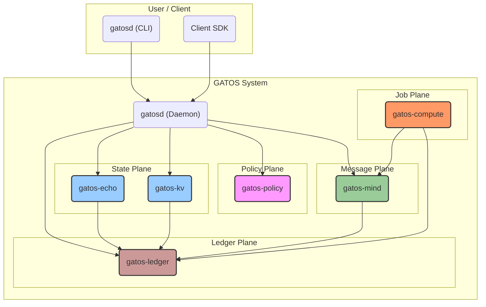

# The GATOS Book

```rust
8""""8 8""""8 ""8"" 8"""88 8""""8 
8    " 8    8   8   8    8 8      
8e     8eeee8   8e  8    8 8eeeee 
88  ee 88   8   88  8    8     88 
88   8 88   8   88  8    8 e   88 
88eee8 88   8   88  8eeee8 8eee88 
 
  Git As The Operating Surface™  
```

## Git As The Operating Surface™

Welcome to the official guide to GATOS. This book will introduce you to a new architectural paradigm where a standard Git repository is leveraged as a complete, programmable, and distributed backend.

GATOS is not a single application, but a unified system built from a suite of interoperable components. It provides a "Git-native operating surface" where state, policy, and computation converge into a single, auditable, and deterministic history.

This book is designed to guide you from the foundational concepts to a deep understanding of the entire system, its architecture, and its potential.

## The Five Planes of GATOS

The GATOS architecture is divided into five conceptual planes, each with a distinct responsibility:

1.  **The Ledger Plane:** The immutable source of truth. An append-only journal of all signed events.
2.  **The State Plane:** The deterministic state of the world. A verifiable "shape" created by folding the event history from the ledger.
3.  **The Policy Plane:** The governance layer. Enforces rules, capabilities, and consensus before actions are permitted.
4.  **The Message Plane:** The communication backbone. A commit-backed, asynchronous pub/sub message bus.
5.  **The Job Plane:** The execution engine. A system for scheduling, running, and recording the results of distributed, asynchronous jobs.



## Map of Contents

### Part 1: The Foundations

*   [Chapter 1: The GATOS System Model](./CHAPTER-001.md)
    *   **Objective:**
        - To introduce the high-level architecture of GATOS and its core philosophy of "Git As The Operating Surface".
    *   **Key Concepts:**
        - Git As The Operating Surface (GATOS)
        - The Five Planes (Ledger, State, Policy, Message, Job)
        - `gatosd` daemon
        - Git-native architecture
    *   **Read this if:**
        - You want a conceptual overview of the entire GATOS system and how its major components are organized.

*   [Chapter 2: The Ledger Plane: An Immutable History](./CHAPTER-002.md)
    *   **Objective:**
        - To explain how GATOS achieves immutable, tamper-evident event logging using only Git.
    *   **Key Concepts:**
        - Append-Only Journal
        - Custom Refs (`refs/gatos/journal/*`)
        - Event Envelope
        - Cryptographic Chain
    *   **Read this if:**
        - You need to understand how GATOS records a verifiable history of every action in the system.

### Part 2: The Core Planes

*   [Chapter 3: The State Plane: Deterministic Folds](./CHAPTER-003.md)
    *   **Objective:**
        - To detail how GATOS computes a verifiable snapshot of the system's state from its history.
    *   **Key Concepts:**
        - Fold & Meld
        - State Root & Shape
        - `gatos-echo` (RMG Engine)
        - `gatos-kv` (Key-Value Store)
        - **Footprints** (Read/Write Sets)
        - **Ports** (Boundary Interfaces)
        - **Epochs** (Coherent World-Rollover)
    *   **Read this if:**
        - You want to learn how GATOS ensures every participant in the network can independently calculate the exact same state.

*   [Chapter 4: The Policy Plane: Governance as Code](./CHAPTER-004.md)
    *   **Objective:**
        - To describe the security and governance layer that authorizes actions based on verifiable rules and consensus.
    *   **Key Concepts:**
        - Gate Contract & Zero Trust
        - Capability-Based Security & Grants
        - N-of-M Consensus (Proposals & Approvals)
    *   **Read this if:**
        - You are interested in the security model, access control, and how GATOS manages complex approval workflows.

*   [Chapter 5: Project Stargate: Local Enforcement & Magic Mirrors](./CHAPTER-005.md)
    *   **Objective:**
        - To explain the local-first architecture for writes, policy enforcement, and eventually-consistent replication.
    *   **Key Concepts:**
        - Stargate (Local Git Host)
        - `pushurl` redirection
        - Pre-receive hooks for `O(1)` validation
        - Magic Mirror (e.g., GitHub as a CDN)
        - Read-After-Write Consistency
    *   **Read this if:**
        - You want to understand how GATOS provides fast, low-latency writes while integrating with public platforms like GitHub.

### Part 3: The Distributed System

*   [Chapter 6: The Message & Job Planes: Distributed Workflows](./CHAPTER-006.md)
    *   **Objective:**
        - To cover the components that enable GATOS to orchestrate communication and asynchronous tasks in a distributed environment.
    *   **Key Concepts:**
        - Commit-Backed Message Bus (`gatos-mind`)
        - Pub/Sub on Git Refs
        - Job Lifecycle (`gatos-compute`)
        - Proof-of-Execution (PoE)
    *   **Read this if:**
        - You want to understand how GATOS functions as a dynamic system that can manage distributed workers and reliable messaging.

*   [Chapter 7: Federation & Mind-Melds: Cross-Repo Operations](./CHAPTER-007.md)
    *   **Objective:**
        - To explain how different GATOS repositories can interact and merge state without a shared history.
    *   **Key Concepts:**
        - Federation
        - Mind-Meld (Pushout)
        - Proof-of-Meld
        - Cross-Repo Governance
    *   **Read this if:**
        - You are interested in building large-scale, decentralized systems composed of multiple, independent GATOS repositories.

*   [Chapter 8: Interfaces & Integration](./CHAPTER-008.md)
    *   **Objective:**
        - To detail the various ways clients and external systems can interact with a GATOS node.
    *   **Key Concepts:**
        - JSONL RPC Protocol
        - CLI (`git gatos`)
        - Real-time Streams & Ref Subscriptions
        - REST/GraphQL Gateways
        - GitHub Integration (Actions, Checks, PRs)
    *   **Read this if:**
        - You are building a client, an AI agent, or an integration on top of GATOS.

### Part 4: Advanced Concepts & The Vision

*   [Chapter 9: The GATOS Morphology Calculus](./CHAPTER-009.md)
    *   **Objective:**
        - To introduce the formal mathematical framework that guarantees GATOS's deterministic and composable properties.
    *   **Key Concepts:**
        - Morphology Calculus
        - Deterministic Shape (Theorem 1)
        - Policies as Natural Transformations (Theorem 3)
        - Symmetric Monoidal Categories (Job Plane)
        - **Footprints & Independence Predicate**
        - **Concurrency Theorems**
        - **Conflict Resolution Policies**
        - **Epochs and Invariants**
    *   **Read this if:**
        - You want to understand the core theorems that provide the provable guarantees for the entire GATOS system.

*   [Chapter 10: Proofs, Attestation, and Privacy](./CHAPTER-010.md)
    *   **Objective:**
        - To cover the advanced cryptographic concepts that enable Zero Trust and management of private data.
    *   **Key Concepts:**
        - Proof-of-Execution (PoE) & Attestation
        - Zero-Knowledge Proofs (Future)
        - Opaque Pointers & Blob Storage
        - Rekeying and Private Data
    *   **Read this if:**
        - You need to work with sensitive data or require the highest level of verifiable computation.

*   [Chapter 11: Performance: Partial Folds, Caching, and Exploration](./CHAPTER-011.md)
    *   **Objective:**
        - To discuss the performance model and optimization strategies within GATOS.
    *   **Key Concepts:**
        - Partial & Lazy Folds
        - The Cache Plane (`refs/gatos/cache/*`)
        - Roaring Bitmaps for Indexing
        - GATOS-to-SQL/Parquet Explorer
    *   **Read this if:**
        - You are concerned with the performance of GATOS at scale and want to understand its optimization mechanisms.

*   [Chapter 12: The GATOS Vision](./CHAPTER-012.md)
    *   **Objective:**
        - To explore the long-term vision and broader implications of the GATOS architecture.
    *   **Key Concepts:**
        - Reality Control
        - Human-AI Collaboration
        - TimeCube (Chronos, Kairos, Aion)
        - Confluence
    *   **Read this if:**
        - You are interested in the future direction of GATOS and its potential to change how we build distributed and AI-integrated systems.
     
---

**Next**: [Chapter 1–The GATOS System Model](./CHAPTER-001.md)

---

**GATOS–_Git As The Operating Surface™_**  
James Ross / [Flying • Robots](https://github.com/flyingrobots) © 2025
