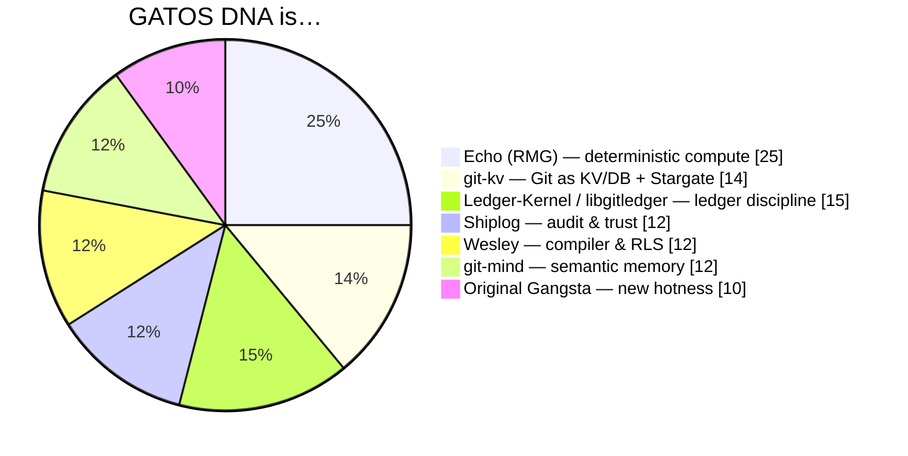

# Best Of

## **1) What each project uses Git for— technique • policy • strategy**

### **git‑kv (Project Stargate)**

#### What is Git Used For?

The _database_ and audit log. 

- Commits = transactions; 
- the repo is the KV store. 
 
Reads come from the public mirror; **writes go through a policy‑enforcing “Stargate”** using Git’s `pushurl`. 

#### Techniques Used

- Linear history, 
- atomic multi‑key commits, 
- fast prefix indexing via `refs/kv-index/*`, 
- **content‑defined chunking** for big values (native Git objects, no Git‑LFS), 
- **epochs** to bound clone size, 
- and client attestation in commit trailers. 

#### Policy & Strategy

- `.kv/policy.yaml` enforced at the Stargate (pre‑receive). 
	- HA Stargate mirrors to GitHub post‑receive; 
	- read‑your‑write via direct read‑through or wait on OID. 

### **git‑mind**

#### What is Git Used For?

A **journaled semantic graph**

- Each “edge” is an append‑only commit under `refs/gitmind/*`;

**cache refs** accelerate queries but are disposable. Serverless, forkable knowledge layer. 

#### Techniques Used

edges are CBOR payloads (base64 in commit messages); optional roaring‑bitmap cache under a separate ref; **AUGMENTS** edges track file evolution. Per‑branch journals; time‑travel by checking out history. 

#### Policy & Strategy

discipline via append‑only refs and attribution trails (human/AI). No central daemon; design assumes local integrity + review. 

### **Ledger‑Kernel (spec)**

#### What is Git Used For?

the substrate for a **formally specified ledger**: a fast‑forward‑only ref where each commit is a single Entry; the state is a deterministic fold of entries. 

#### Techniques Used

pure transition function, deterministic replay, **cryptographic attestations** on entries, and **pluggable policy engine** (WASM in the reference). Proof artifacts accompany important ops. 

#### Policy & Strategy

strict separation between the “trusted kernel zone” (deterministic) and the untrusted world; compliance suite to prove an implementation adheres. 

### **libgitledger (reference implementation)**

#### What is Git Used For?

a namespaced **ledger database**: `refs/gitledger/journal/*`, `policy/*`, `trust/*`, `cache/*`, `notes/*`. C library with hex‑arch ports/adapters. 

#### Techniques Used

fast‑forward appends, policy+trust documents (`policy.json`, `trust.json`), signatures, roaring‑bitmap query cache, **atomic ref updates**. Notes attach large artifacts to entries. 

#### Policy & Strategy

“policy as code” + “trust as data,” enforced in‑process (no SaaS dependency). Deep‑verify to audit an entire history offline. 

### **Shiplog**

#### What is Git Used For?

a **deployment flight recorder**. Journals per environment: `refs/_shiplog/journal/<env>`, plus policy, trust, and notes for stdout/stderr. 

#### Techniques Used

`git shiplog run -- <cmd>` wraps any op, captures outputs, signs and records. Two trust modes (chain vs attestation). Human/JSON outputs for CI. 

#### Policy & Strategy

on SaaS hosts, lean on branch protection + required checks; self‑hosted = pre‑receive enforcement. Interactive config generates safe defaults. 

### **Wesley**

#### What is Git Used For?

the **artifact ledger** around a compiler: GraphQL schema → SQL, migrations, types, RLS policies, **evidence bundles** and `SHIPME.md` with hashes. Intended to plug into Shiplog for attested deploys. 

#### Techniques Used

schema‑first IR → generators for DDL, migrations (expand/backfill/validate/switch/contract), pgTAP tests, RLS; HOLMES evidence & scores (SCS/MRI/TCI). 

#### Policy & Strategy

compile governance up front (RLS, tests, evidence), then **attest & ship**; pairs naturally with a ledger like Shiplog for runtime audit. 

### **Echo (RMG)**

#### What is Git Used For?

not required, but **Git‑shaped**: deterministic **state_root** and **commit_id** hashes for snapshots/merges; branching/merging timelines; content‑addressed graph. Perfect for persisting to Git refs. 

#### Techniques Used

deterministic rewrite scheduler, confluence, canonical serialization, Merkle‑style snapshot hashing; footprints for safe parallelism. 

#### Policy & Strategy

math guarantees first (determinism), storage and policy are adapters—ideal kernel for “provable state” inside Git. 

---

## **2) Comparison matrix — feature by feature**

```
Legend: 
✅ native / ◻︎ possible (not native) / ⚠️ partial or external / — not present
```

|**Feature**|**git‑kv**|**git‑mind**|**Ledger‑Kernel**|**libgitledger**|**Shiplog**|**Wesley**|**Echo**|
|---|---|---|---|---|---|---|---|
|**Git = primary data store**|✅ (KV)|✅ (edge journal)|✅ (spec)|✅ (impl)|✅ (deploy log)|⚠️ (artifacts/evidence)|◻︎ (snapshots map cleanly)|
|**Append‑only refs / FF‑only**|✅|✅ (journal)|✅ (normative)|✅ (journal ref)|✅|⚠️ (source control around outputs)|◻︎ (engine supplies hashes)|
|**Policy as code (enforced)**|✅ .kv/policy.yaml @ Stargate|⚠️ conventions/attribution|✅ pluggable (WASM)|✅ policy.json ref|✅ policy.json; host‑aware|✅ generates RLS & tests|◻︎ policy adapter needed|
|**Trust / signatures**|✅ client attestation & controls|⚠️ attribution lanes|✅ attestations required|✅ sign/verify via trust graph|✅ multi‑sig modes (chain/attest)|⚠️ hashes/evidence; relies on host for signing|◻︎ no signing—engine level|
|**Deterministic state fold**|◻︎ (KV ops deterministic)|⚠️ journal→cache rebuildable|✅ core property|✅ replay verifier|⚠️ entries, not state machines|✅ compiler outputs deterministic artifacts|✅ bit‑for‑bit RMG commits|
|**Large data strategy**|✅ FastCDC chunking, no LFS|⚠️ artifacts via notes optional|◻︎ unspecified (spec)|✅ notes for attachments|✅ notes for stdout/stderr|⚠️ artifacts in evidence bundle|◻︎ external store adapter|
|**Indexing / query accel**|✅ refs/kv-index/*|✅ roaring‑bitmap cache ref|◻︎ up to impl|✅ roaring‑bitmap cache ref|⚠️ list/show; no index layer|✅ IR + evidence indexes|✅ canonical hashes; engine‑side filters|
|**Remote enforcement**|✅ Stargate (pushurl)|—|◻︎ spec allows hooks|◻︎ library (in‑proc)|✅ SaaS branch protection or hooks|—|—|
|**Governance / quorum**|⚠️ via policy rules|◻︎ attribution, review|✅ spec covers attestations & policy changes|✅ trust graph + thresholds|✅ multi‑sig trust changes|✅ RLS + tests as governance inputs|—|
|**Offline‑first**|✅ (Git native)|✅ (serverless)|✅ (design goal)|✅ (portable C)|✅ (local logs then push)|✅ (compile locally; attest later)|✅ (engine deterministic)|
|**Primary use‑case**|KV state & config ledger|Knowledge graph in repo|Universal ledger blueprint|Embeddable ledger library|Deployment & ops audit|Schema compiler + RLS|Deterministic state engine|

> **Sources for matrix**: project docs as cited in each row.

---

## **3) What they share (the “family resemblance”)**

### Git is the substrate, not a remote.

Everyone treats `.git` as the durable database and replication plane, not a byproduct. Journals/ledgers live under dedicated ref namespaces (e.g., `refs/_shiplog/*`, `refs/gitledger/*`, `refs/gitmind/*`).     

### Append‑only, replayable truth.

All adopt fast‑forward branches or equivalent, so state is a deterministic fold of history. This is explicit in Ledger‑Kernel and implemented by `libgitledger`; `git‑kv` and Shiplog enforce it operationally.       

### Policy as code + attestations.

Each system turns rules and trust into artifacts: policy files, trust graphs, signatures, and sometimes thresholds/quorum.       

### Offline‑first by construction.

Because Git, everything works dark and reconciles later.     

### Determinism matters.

Whether it’s RMG’s bit‑exact snapshots, Ledger‑Kernel’s pure transition function, or Wesley’s generated artifacts, determinism is the backbone.     

---

## **4) The striking differences (useful diversity)**

### Enforcement point

- _`git‑kv`_ pushes through a **server gate** (Stargate) that enforces policy; great for ops control and RYW guarantees. 
- _`libgitledger`_ and _Shiplog_ enforce _in‑process_ or via **pre‑receive** where possible; SaaS paths defer to branch protection.   
- _Ledger‑Kernel_ is a spec—enforcement is an implementation concern. 

### Data model

- _`git‑kv`_ maps keys to tree paths with indexes; 
- _`git‑mind`_ maps **edges** (semantics) as commits; 
- _Shiplog_ maps **events/commands**; 
- _`libgitledger`_ generalizes **entries**; 
- _Wesley_ maps **schemas and evidence**; 
- _Echo_ maps **graph snapshots** (not inherently Git but compatible).           

### Performance strategy

- _`git‑kv`_ uses an **index ref** and **CDC chunking**; 
- _`git‑mind`_ and _`libgitledger`_ use **roaring‑bitmap caches** in separate refs; 
- _Shiplog_ relies on notes + CI UX; 
- _Echo_ optimizes the engine/scheduler, not Git.         

### Governance maturity

- _Shiplog_ has practical multi‑sig policy update flows; 
- _libgitledger_ encodes trust graphs; 
- _git‑mind_ focuses on attribution; 
- _Wesley_ turns schema governance into artifact proofs; 
- _Ledger‑Kernel_ specifies the rules but not the ceremony.         

---

## **5) Recommendation — combine the best into GATOS**

### Goal

make GATOS the Git‑native runtime that fuses: 

- KV speed, 
- graph semantics, 
- formal ledger guarantees, 
- attested deployments, 
- and deterministic compute.

### **A. Kernel features to adopt**

#### Stargate‑style push gate (optional)

Add `pushurl` enforcement path for repos that want server‑side policy execution, RYW guarantees, and high‑assurance writes. Keep in‑process enforcement for self‑contained nodes. 

_Source DNA:_ `git‑kv`’s push/read split + pre‑receive checks. 

#### Ref namespaces like `libgitledger`

**Standardize**

- `refs/gatos/journal/*`, 
- `refs/gatos/policy/*`, 
- `refs/gatos/trust/*`, 
- `refs/gatos/state/*`, 
- `refs/gatos/cache/*`, 
- `refs/gatos/notes/*`.

_Source DNA:_ `libgitledger`’s clear layout. 

#### Formal ledger semantics from Ledger‑Kernel

- Make “fast‑forward‑only + deterministic fold + attestations” normative in `SPEC.md`. 
- Provide a minimal WASM (or RUST) policy VM for pure checks. 
 
_Source DNA:_ Ledger‑Kernel. 

#### Deterministic compute from Echo

- Bind Echo’s RMG to the journal: state_root = F(events, policies); 
- store `state_root` in `refs/gatos/state/*` and attach plan/proof notes. 

_Source DNA:_ Echo snapshot hashing + scheduler. 

#### Notes for artifacts + CDC chunking

- Use Git notes for logs/artifacts and add _`git‑kv`_’s FastCDC content chunking for big values/dataframes; 
- avoid Git‑LFS. 

_Source DNA:_ Shiplog + `git‑kv`.   

#### Index & cache refs

Keep caches rebuildable, never authoritative: roaring‑bitmap or B‑tree indices under `refs/gatos/cache/*` for fast lookups. 

_Source DNA:_ git‑mind + libgitledger.   

#### Epochs & bounded history

- Support epoch rollover to bound clone size while preserving verifiable continuity across epochs. 

_Source DNA:_ `git‑kv`. 

### **B. Policy & governance**

#### Policy as artifact + trust graph

- Store compiled policy bundles and trust graphs in refs; 
- every decision records policy_root and trust_chain hashes. 

_Source DNA:_ `libgitledger` + Shiplog + Wesley evidence.     

#### Multi‑sig/threshold updates

- Require N‑of‑M signer quorums for policy/trust refs; 
- support both “commit‑chain” and “attestation file” modes. 

_Source DNA:_ Shiplog trust modes. 

#### Compile‑time governance

- Integrate Wesley as a `--target gatos` to emit schemas, RLS, tests, and evidence bundles GATOS will enforce at runtime. 

_Source DNA:_ Wesley compiler pipeline. 

### **C. Developer & ops ergonomics**

#### gatos ship

A Shiplog‑style wrapper to run critical commands under policy, capture stdout/stderr as notes, and journal the event. 

_Source DNA:_ Shiplog’s run. 

#### gatos kv

- A Redis‑like CLI/subsystem over Git trees with CAS updates, TTL via compactor commits, and pub/sub bridged to the message bus. 

_Source DNA:_ git‑kv design. 

#### gatos mind

- First‑class semantic edges for repos; 
- expose a JSONL tail for LLMs; 
- cache rebuild command. 

_Source DNA:_ `git‑mind`. 

#### Evidence & proofs surfaced

- Record HOLMES‑style evidence hashes and scores beside each deploy or migration in the journal; 
- prove replay determinism with Echo state roots. 

_Source DNA:_ Wesley + Echo.   

### **D. Spec deltas for GATOS v0.3**

#### Normative

- FF‑only refs for journals; 
- `state_root` required on checkpoints; 
- `policy_root` & `trust_chain` required on any ALLOW decision. 

#### Recommended

- `cache/*` refs **MUST** be disposable; 
- `notes/*` is for artifacts/logs; 
- `epoch/*` tags for bounded history.   

#### Optional extension

- push‑gate profile (Stargate‑style) for orgs needing server enforcement; 
- otherwise pure local mode. 

---

## **6) Bottom line**

- The **kernel math** (Echo/ledger determinism) gives GATOS a spine.   
- The **ops discipline** (Shiplog/`libgitledger`) gives it hands.   
- The **store & scale tricks** (`git‑kv`) give it lungs. 
- The **schema intellect** (Wesley) gives it a brain. 
- The **semantic memory** (`git‑mind`) gives it a history. 



Combine them and GATOS stops being “weird Git tricks” and becomes a **real runtime**: deterministic, policy‑governed, audit‑ready, and happy offline. It _will_ rule.
