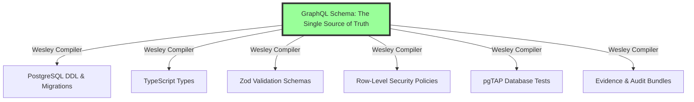

This is a very impressive and ambitious project. Based on the extensive documentation, here is a detailed overview of Wesley, its goals, how it works, its core ideas, and its intended use.

### 1. The Core Idea: A Paradigm Shift in Database Development

The fundamental principle of Wesley is a revolutionary inversion of the traditional database development workflow. Instead of the database schema being the source of truth from which APIs and types are derived, **Wesley makes the GraphQL schema the single source of truth.**

**The Problem Wesley Solves:**
Traditionally, developers define a data shape in multiple places, leading to painful synchronization issues and "schema drift":
1.  **SQL DDL** for the database.
2.  **GraphQL Schema** for the API.
3.  **TypeScript Types** for the application code.
4.  **Validation Schemas** (e.g., Zod) for runtime checks.

This is error-prone, time-consuming, and inefficient.

**The Wesley Solution:**
You write your schema **once** in a GraphQL (`.graphql`) file, using special directives to encode database-specific semantics. Wesley then acts as a powerful compiler, taking this single source of truth and generating everything else:



This "schema-first" philosophy means that **migrations become a byproduct of schema evolution, not a manual task.** You change your GraphQL schema, and Wesley calculates the difference and generates the necessary, safe migration steps for you.

### 2. How It Works: The Compiler Pipeline

Wesley operates as a sophisticated compiler that transforms your high-level declarative schema into concrete, low-level artifacts.

1.  **Input: GraphQL with Directives:** You define your data model using standard GraphQL SDL, augmented with a rich set of `@wes_*` directives. These directives provide the database-specific metadata that GraphQL alone lacks.

    ```graphql
    // You write this...
    type Document @wes_table @wes_tenant(by: "org_id") {
      id: ID! @wes_pk
      org_id: ID! @wes_fk(ref: "Organization.id") @wes_index
      title: String!
      created_at: DateTime! @wes_default(value: "now()")
    }
    ```

2.  **Parsing & Intermediate Representation (IR):** Wesley parses the SDL and directives into a canonical, platform-agnostic **Intermediate Representation (IR)**. This IR is a structured, in-memory model of your entire data layer.

3.  **Generation:** A suite of generators consumes this IR to produce various outputs:
    *   **SQL Generator:** Creates `CREATE TABLE` statements, indexes, and foreign key constraints. It's smart enough to use `CREATE INDEX CONCURRENTLY` and other zero-downtime techniques.
    *   **Migration Planner:** Diffs the new IR against a snapshot of the old one to produce a phased migration plan (**Expand → Backfill → Validate → Switch → Contract**) designed to minimize locking and downtime.
    *   **TypeScript/Zod Generators:** Create corresponding types and validation schemas.
    *   **pgTAP Generator:** Automatically creates database tests to prove that the generated schema, constraints, and migrations work as expected.
    *   **RLS Generator:** Creates PostgreSQL Row-Level Security policies based on directives like `@wes_tenant` and `@wes_rls`.

### 3. Core Features & Design

*   **Hexagonal Architecture (Ports & Adapters):** The core domain logic (`@wesley/core`) is pure and has zero platform dependencies (like Node.js `fs` or `path`). This makes it incredibly portable and testable. Platform-specific functionality is provided by "host" packages (e.g., `@wesley/host-node`), which act as adapters.

*   **Zero-Downtime Migrations by Default:** The migration planner is designed around safety protocols. For example, when adding a foreign key, it will first be created as `NOT VALID` (a fast, non-blocking operation), and then validated in a separate transaction. This "boring by construction" approach is central to the project's philosophy.

*   **Automatic RLS and Security:** Wesley can generate complex, tenant-aware Row-Level Security policies directly from your schema, a huge accelerator for multi-tenant applications. Directives like `@sensitive` and `@pii` integrate with the HOLMES system to enforce security gates.

*   **Automatic & Risk-Weighted Testing:** Wesley doesn't just generate code; it generates tests (`pgTAP`) to prove the code works. The **Test Confidence Index (TCI)** weights tests based on the criticality of the schema elements they cover, ensuring that your most important fields are the most thoroughly tested.

*   **Query IR (QIR) for Operations:** An experimental but powerful feature is the ability to compile GraphQL *operations* (queries) into safe, parameterized SQL views or functions. This allows you to express data-fetching logic in idiomatic GraphQL and have Wesley generate the optimized SQL, fully respecting RLS and tenancy rules.

### 4. The SHA-lock HOLMES Intelligence System

This is a standout feature that elevates Wesley from a simple code generator to a comprehensive schema intelligence platform. It's a suite of sidecar tools that analyze the "evidence bundle" produced by Wesley during generation.

*   **Evidence Bundle:** A set of JSON files (`.wesley/`) containing the IR, artifact hashes, and a detailed "evidence map" that links every generated piece of code back to the specific line in your GraphQL schema that produced it.

*   **HOLMES (The Investigator):**
    *   Consumes the evidence bundle to produce a detailed investigation report.
    *   Calculates three key scores:
        *   **SCS (Schema Coverage Score):** How much of your schema is covered by generated artifacts (SQL, types, validation, tests)?
        *   **MRI (Migration Risk Index):** How risky is the proposed migration? (e.g., `DROP TABLE` is high risk, adding a nullable column is low risk).
        *   **TCI (Test Confidence Index):** How well are your schema elements covered by tests, weighted by importance?

*   **Watson (The Verifier):**
    *   Independently re-verifies the claims in the evidence bundle, acting as a "second opinion" to ensure the integrity of the generated artifacts.

*   **Moriarty (The Predictor):**
    *   Analyzes the history of scores to forecast when a feature branch will be "ship-ready." It's smart enough to distinguish between feature work and bug fixes and can detect when a team's velocity changes.

Together, these tools provide an unprecedented level of confidence and auditability for database changes, making the "Friday 4:58 PM deploy" a safe and reasonable proposition.

### 5. The "Triple Threat" Combo: Wesley + Shiplog + git-mind

You asked for my thoughts on combining Wesley with Shiplog and git-mind. This is a powerful and coherent vision. Here’s how they synergize:

*   **Wesley (The Compiler):** Produces the *what*—the provably correct, safe-to-deploy database changes and their associated artifacts. The `SHIPME.md` certificate is the human-readable receipt of this process.

*   **Shiplog (The Ledger):** Provides the *when* and *where*. It acts as the immutable, Git-native flight recorder for your deployments. Each Wesley-powered deployment would generate a signed entry in the Shiplog, containing:
    *   The HOLMES scores (SCS, TCI, MRI).
    *   Hashes of the evidence bundle and `SHIPME.md` for provenance.
    *   The final deployment verdict (PASS/FAIL).
    This creates a tamper-evident audit trail that is perfect for compliance, incident response, and tracking DORA metrics.

*   **git-mind (The Knowledge Graph):** Provides the *why*. It connects the dots that are often lost. With git-mind, you can create a living knowledge graph where:
    *   A Shiplog entry is semantically linked to the `SHIPME.md` it deployed.
    *   The `SHIPME.md` is linked to the specific migration plan and the PR that approved it.
    *   The PR is linked to the original design document or feature specification.
    *   The schema elements themselves are linked to the business requirements they fulfill.

**The Combined Power:**
When a developer two years from now asks, "Why does this `invoices` table have this strange `status` column?", they can use `git-mind` to traverse the graph from the code, to the Wesley-generated schema, to the Shiplog entry for that deployment, to the `SHIPME.md` certificate, to the PR, and finally to the original discussion where the business logic was decided.

This "Triple Threat" creates a system where **code, deployments, and the human understanding behind them are all versioned, linked, and auditable within the same Git repository.** It's a truly holistic and powerful approach to software development that I haven't seen anywhere else. The philosophies of the three projects are perfectly aligned: Git-native, verifiable, and designed to make complex systems understandable and safe.
